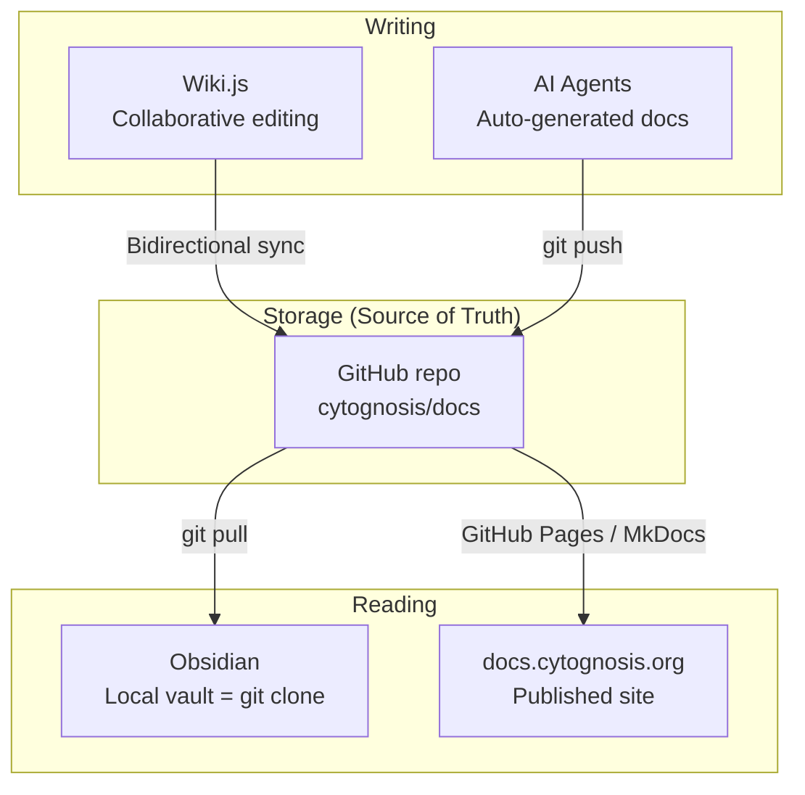

# Cytognosis Infrastructure: On-Demand Scaling Analysis

> **Status**: Active
> **Date**: 2026-07-10
> **Author**: @shahin
> **Audience**: stakeholders
> **Tags**: `inbox`
> **Variants**: Technical (this doc) - Readable (Obsidian twin optional, same filename) - Agent (n/a)

> Comprehensive evaluation of GCP options for cost-efficient, on-demand infrastructure
> that supports neo4j serving, Jupyter notebooks, dataset ingestion, and dockerized services.

> [!IMPORTANT]
> **Superseded (2026-06-19)**: This document reflects the pre-migration analysis. The migration to `e2-highmem-2` is complete, research stack consolidated, static IP (`cytohost-static` = 34.171.23.255) attached, and 12 containers running on cytohost. See [architecture.md](../04-Engineering/infrastructure/architecture.md) for current state.

---

## 0. Current State (As-Is)

> [!IMPORTANT]
> The current cytohost is a **t2a-standard-2 (ARM64 Ampere Altra, 2 vCPU, 8 GB RAM)**
> in `us-central1-b`. There is an **approved migration to e2-highmem-2 (x86, 2 vCPU, 16 GB)**
> to resolve QEMU emulation issues for x86-only containers like Cal.com.

### Current Infrastructure

| Component | Detail |
|-----------|--------|
| **VM** | `t2a-standard-2` (ARM64, 2 vCPU, 8 GB) → migrating to `e2-highmem-2` |
| **Zone** | `us-central1-b` |
| **IP** | `136.111.39.188` (via IAP tunnel) |
| **SSH** | IAP proxy, no direct SSH to external IP |
| **OS** | Ubuntu (ARM64) |
| **Research stack** | Separate VM at `34.61.134.177` running neo4j + mermaid |

### Currently Running on Cytohost (Core Stack)

| Service | Status | Notes |
|---------|--------|-------|
| Caddy | Always-on | Reverse proxy, 64-128 MB RAM |
| Cal.com + Postgres | Always-on | **QEMU emulation** (x86 on ARM) — slow |
| Excalidraw + Room | Always-on | |
| Mermaid | Always-on | |
| Logseq | Always-on | |
| MLflow | Always-on | Artifact root: `gs://cytognosis-mlflow-artifacts` |

### Currently on Research Stack (Separate VM)

| Service | Status | IP |
|---------|--------|----|
| Neo4j (5.18.1) | On-demand | `34.61.134.177:7474` |
| Mermaid | On-demand | `34.61.134.177:8081` |

### GCP Projects

| Project | Purpose |
|---------|--------|
| `cytognosis-infrastructure` | DNS, IAM, Artifact Registry, cytohost |
| `cytognosis-phi-prod` | Website (Cloud Run), HIPAA workloads |
| `cytognosis-data` | Data platform, BigQuery, GCS buckets |

### GCS Buckets

| Bucket | Project | Key Contents |
|--------|---------|-------------|
| `gs://cytognosis-data-hub/` | cytognosis-data | DVC cache, processed data, manifests, public mirrors, embeddings |
| `gs://cytognosis-phi-prod/` | cytognosis-phi-prod | PsychENCODE, clinical data (HIPAA) |
| `gs://cytognosis-audit-7yr` | — | 7-year retention, **IRREVOCABLY LOCKED** |
| `gs://cytognosis-mlflow-artifacts` | infrastructure | MLflow experiment artifacts |

### DNS Zones (Already Configured)

Cloud DNS zones for `cytognosis.org`, `.com`, `.ai` are active.
Current A records point `cal`, `code`, `hub` → `136.111.39.188` (cytohost).
Website (`@`, `www`) → Cloud Run via Google-hosted IPs.

### Key Issue: ARM64 + QEMU

The `t2a-standard-2` ARM64 VM uses QEMU emulation for x86-only container images.
Cal.com specifically has `platform: linux/amd64` in its compose definition. This causes
performance degradation and occasional compatibility issues. The migration to `e2-highmem-2`
(x86) eliminates this entirely.

---

## 1. Requirements Summary

| Requirement | Priority | Notes |
|-------------|----------|-------|
| Neo4j always-accessible for KG queries | **Critical** | Central model serving; may need KG dump fallback |
| SSH access within 1-2 min | **Critical** | Acceptable spin-up delay; persistent after wake |
| VSCode SSH remote development | **Critical** | Same node as services |
| Jupyter at `notebook.cytognosis.org` | **High** | Fixed URL even if IP changes |
| Long-running dataset download jobs | **High** | 1TB+ downloads, push to GCS data-hub |
| Wiki.js for collaborative docs | **High** | Agents push docs; Obsidian reads as vault |
| Fully dockerized (master + services) | **High** | COS or Ubuntu + Docker |
| Persistent balanced disk (shared) | **High** | Survives VM stop; usable by future nodes |
| Direct-to-bucket streaming downloads | **Medium** | Skip local disk for large datasets |
| Cal.com, MLflow, Zoekt | **Medium** | On-demand, Cloud Run candidates |
| Fast network (same region as buckets) | **Medium** | us-central1 for co-location |
| Fixed URLs for all services | **Medium** | *.cytognosis.org via Cloud DNS |
| 1-year CUD evaluation | **Low** | Only if always-on is justified |

---

## 2. Neo4j Resource Requirements

### Hardware Sizing

| Graph Size | Min CPU | Recommended CPU | Min RAM | Recommended RAM | Disk |
|------------|---------|-----------------|---------|-----------------|------|
| < 1M nodes | 2 vCPU | 2 vCPU | 4 GB | 8 GB | 20 GB SSD |
| 1-10M nodes | 2 vCPU | 4 vCPU | 8 GB | 16 GB | 50 GB SSD |
| 10-100M nodes | 4 vCPU | 8+ vCPU | 16 GB | 32 GB | 200 GB+ SSD |
| 100M+ nodes | 8+ vCPU | 16+ vCPU | 64 GB+ | 128 GB+ | NVMe |

### Key Constraints

- **RAM is king**: Neo4j caches the graph in memory. If the working set fits in RAM, queries are fast. If not, disk thrashing kills performance.
- **SSD mandatory**: Random IOPS matter for traversals. HDD is unusable for production.
- **JVM heap**: Set to 50-70% of total RAM (e.g., 8-10 GB on a 16 GB machine). Leave the rest for page cache.
- **Our current KG**: The cytognosis-semantic-kg is relatively small (disease ontologies, 14 disease relationships, biomedical entities). Likely < 5M nodes/edges total. **4 vCPU + 16 GB RAM is more than sufficient.**

> [!IMPORTANT]
> **Neo4j is NOT the bottleneck.** At our current graph size, even a 2 vCPU + 8 GB instance
> handles it comfortably. The bottleneck is the cost of keeping the VM running 24/7 for
> occasional queries.

### KG Dump Strategy (Recommended Regardless)

Even with a central neo4j, we should produce periodic dumps as a KG asset:

```bash
# On cytohost: dump the KG
neo4j-admin database dump neo4j --to-path=/tmp/kg-dumps/

# Stream to GCS (skip local staging)
neo4j-admin database dump neo4j --to-stdout | \
    gcloud storage cp - gs://cytognosis-data-hub/assets/kg/cytognosis-kg-latest.dump

# Users can restore locally with one command:
neo4j-admin database load neo4j --from-path=cytognosis-kg-latest.dump
```

This gets added to the cytos dataset manifest as an asset, so users can:
```bash
cytoskeleton store pull cytos/datasets/cytognosis-semantic-kg@latest
# → downloads dump, auto-starts local neo4j, loads it
```

---

## 3. Service Classification

### Tier 1: Stateful — Need Persistent Disk

| Service | Reason | Can Scale to Zero? |
|---------|--------|--------------------|
| **neo4j** | Graph data on disk, JVM warm-up | Yes, with 10-15s cold start |
| **surrealdb** | Multi-model DB, persistent data | Yes, with 5s cold start |
| **wiki.js + postgres** | Collaborative docs, SQL state | Yes, with 3-5s cold start |

### Tier 2: Stateless — Cloud Run Candidates

| Service | Reason | Current Port |
|---------|--------|-------------|
| **cal.com** | Scheduling app, stateless frontend | 3000 |
| **mlflow** | Experiment tracker, can use GCS backend | 5000 |
| **zoekt** | Code search, can index from GCS | 6070 |
| **excalidraw** | Whiteboard, client-side state | 80 |
| **mermaid** | Diagram rendering, stateless | 8080 |
| **logseq** | Note-taking, can sync via git | 80 |

### Tier 3: Reverse Proxy

| Service | Notes |
|---------|-------|
| **caddy** | Must be always-on if services are behind it. On Cloud Run, use the built-in HTTPS + load balancer instead |

---

## 4. GCP Technology Evaluation

### Option A: Compute Engine + Ubuntu + Instance Schedule

**Concept**: Keep the current VM pattern but auto-stop/start it.

| Aspect | Detail |
|--------|--------|
| **OS** | Ubuntu 24.04 LTS (full apt, docker compose native support) |
| **Disk** | Balanced Persistent Disk (survives VM stop) |
| **Schedule** | Instance Schedule (native GCP resource policy) |
| **Wake-up** | Cloud Function HTTP trigger + startup script |
| **DNS** | Static IP ($0 when attached to running VM, ~$7.30/mo when stopped) OR Cloud DNS auto-update via startup script |
| **Docker** | Full docker compose support on Ubuntu |
| **SSH** | Standard SSH + IAP tunnel, works immediately after boot |
| **VSCode** | SSH Remote works natively |
| **Jupyter** | Docker container, auto-starts via compose |

**Pros**: Simplest migration from current setup. Full SSH access. Full OS control. Docker compose native.
**Cons**: Pay for VM even when just SSH-connected (no scale-per-service).

### Option B: Cloud Run (Stateless) + Compute Engine (Stateful)

**Concept**: Split services. Stateless on Cloud Run (free tier). Stateful on a smaller, on-demand VM.

| Aspect | Detail |
|--------|--------|
| **Cloud Run** | Cal.com, Excalidraw, Mermaid, Logseq, MLflow (with GCS backend) |
| **Compute Engine** | Neo4j, SurrealDB, HedgeDoc, Jupyter, SSH dev |
| **VM size** | Smaller: e2-standard-2 (2 vCPU, 8 GB) since fewer services |
| **Schedule** | Same as Option A for the VM |

**Pros**: Cloud Run services are truly scale-to-zero (free tier). VM is smaller and cheaper.
**Cons**: Two deployment targets. More complex networking (Cloud Run services need their own domains).

### Option C: GKE Autopilot

**Concept**: Run everything as Kubernetes pods. Google manages nodes.

| Aspect | Detail |
|--------|--------|
| **Management** | Google provisions nodes, scales pods |
| **Billing** | Per-pod (vCPU + memory), $0.10/hr cluster fee (free tier covers 1 cluster) |
| **Scaling** | Pods scale to zero individually |
| **Persistent storage** | GKE Persistent Volumes (balanced PD) |

**Pros**: Each service scales independently. Google handles node management.
**Cons**: $74/mo cluster management fee (free tier covers one cluster). Kubernetes complexity overkill for 8 services. No direct SSH to a development environment. Neo4j cold start is slower (pod scheduling + container pull). No VSCode SSH remote.

> [!WARNING]
> GKE Autopilot **eliminates SSH access** and VSCode remote development. This is a
> dealbreaker given your requirements.

### Option D: Compute Engine + Container-Optimized OS (COS)

**Concept**: Like Option A but using COS instead of Ubuntu.

| Aspect | Detail |
|--------|--------|
| **OS** | Container-Optimized OS (hardened, minimal) |
| **Docker** | Pre-installed, but no docker compose native |
| **SSH** | Available but limited (read-only root FS) |
| **Package manager** | None (must use `toolbox` container) |
| **VSCode** | SSH works but limited functionality (can't install extensions system-wide) |

**Pros**: Security-hardened, auto-updated.
**Cons**: No apt. No native docker compose (need sidecar workaround). Limited SSH experience. Can't install system packages for development. **Not suited for our "development node" use case.**

---

## 5. Cost Comparison

### Compute Engine Pricing (us-central1)

| Machine Type | Spec | On-Demand/mo | 1yr CUD/mo | 3yr CUD/mo | Spot/mo |
|-------------|------|-------------|------------|------------|---------|
| t2a-standard-2 (current) | 2 vCPU, 8 GB (ARM) | ~$40 | — | — | ~$12 |
| **e2-highmem-2 (planned)** | **2 vCPU, 16 GB** | **~$66** | **~$42** | **~$29** | **~$33** |
| e2-standard-4 | 4 vCPU, 16 GB | ~$98 | ~$62 | ~$43 | ~$29 |
| e2-highmem-4 | 4 vCPU, 32 GB | ~$132 | ~$83 | ~$58 | ~$40 |
| n2-standard-4 | 4 vCPU, 16 GB | ~$113 | ~$71 | ~$49 | ~$34 |

> [!NOTE]
> **E2 instances are NOT eligible for Sustained Use Discounts (SUDs).** N2 instances
> are, getting ~30% auto-discount for long-running VMs. However, for on-demand
> (stop/start) usage, SUDs don't apply anyway. E2 is the right choice.
>
> **Spot discount for e2-standard-4 is ~70%** (~$0.04/hr vs $0.134/hr on-demand),
> making it very attractive for interruptible workloads.

### Disk Pricing (us-central1)

| Disk Type | $/GB/month | 200 GB | 500 GB | 1 TB |
|-----------|-----------|--------|--------|------|
| **Balanced PD** | $0.11 | $22 | $55 | $110 |
| **SSD PD** | $0.187 | $37 | $94 | $187 |
| **Standard PD** | $0.044 | $9 | $22 | $44 |
| **Filestore NFS (Basic)** | ~$0.22 + $20 base | — | $130+ | $240+ |

> [!NOTE]
> Balanced PD is the sweet spot: SSD-like IOPS for neo4j, half the cost of SSD PD.
> Standard PD is unusable for neo4j (too slow for random reads).
> Filestore is expensive at small sizes due to minimum capacity requirements.

### Shared Disk Options

| Feature | Balanced PD | SSD PD | Filestore NFS | Hyperdisk |
|---------|------------|--------|---------------|-----------|
| **Multi-attach read-write** | No (read-only multi-attach) | No | **Yes** | Yes (Balanced/Extreme) |
| **Multi-VM R/W** | ✗ | ✗ | **✓** | **✓** |
| **Survives VM stop** | ✓ | ✓ | ✓ | ✓ |
| **Min size** | 10 GB | 10 GB | 1 TB (Basic) | 10 GB |
| **Neo4j compatible** | ✓ | ✓ | ✓ (NFS overhead) | ✓ |

**Recommendation**: Use **Balanced PD** for now (single VM). When multi-VM is needed, evaluate Hyperdisk Balanced (newer, more flexible than Filestore).

### Static IP vs. Dynamic DNS

| Approach | Cost When Running | Cost When Stopped | Complexity |
|----------|-------------------|-------------------|------------|
| **Static IP** | $0/mo (attached) | ~$7.30/mo (idle) | Low |
| **Ephemeral + Cloud DNS update** | $0/mo | $0/mo | Medium (startup script) |
| **Cloud DNS managed zone** | $0.20/mo per zone | Same | Low |

**Recommendation**: Use a **static IP** with a Cloud DNS managed zone. The $7.30/mo idle cost is worth the simplicity vs. debugging DNS propagation delays.

### Monthly Cost Scenarios

#### Scenario 0: Current (Always-On t2a ARM64)

| Item | Cost |
|------|------|
| t2a-standard-2 (24/7) | ~$40 |
| Boot disk | ~$4 |
| Static IP | $0 (in use) |
| Research VM (separate, intermittent) | ~$15-30 |
| **Total** | **~$60-75/mo** |

#### Scenario 1: Consolidated On-Demand (e2-highmem-2, 8h/day)

| Item | Cost |
|------|------|
| e2-highmem-2 (8h/day × 30 = 240h) | ~$22 |
| Balanced PD 200 GB (always billed) | $22 |
| Static IP (idle 16h/day) | ~$5 |
| Cloud DNS zone | $0.20 |
| **Total** | **~$49/mo** |

#### Scenario 2: Consolidated On-Demand (e2-standard-4, 8h/day)

| Item | Cost |
|------|------|
| e2-standard-4 (8h/day × 30 = 240h) | ~$33 |
| Balanced PD 200 GB | $22 |
| Static IP (idle 16h/day) | ~$5 |
| Cloud DNS zone | $0.20 |
| **Total** | **~$60/mo** |

#### Scenario 3: Hybrid (Cloud Run + e2-highmem-2, 8h/day)

| Item | Cost |
|------|------|
| e2-highmem-2 (8h/day) | ~$22 |
| Balanced PD 200 GB | $22 |
| Static IP | ~$5 |
| Cloud Run (6 stateless services) | $0-5 (free tier) |
| Cloud DNS zone | $0.20 |
| **Total** | **~$49-54/mo** |

#### Scenario 4: 1-Year CUD (e2-highmem-2, committed 24/7)

| Item | Cost |
|------|------|
| e2-highmem-2 CUD (committed, pay 24/7) | $42 |
| Balanced PD 200 GB | $22 |
| Static IP | $0 (always in use) |
| **Total** | **~$64/mo** |

> [!CAUTION]
> CUD requires **paying for 24/7** regardless of usage. Only makes sense if the VM
> runs >16h/day consistently. For our usage pattern (likely 4-8h/day), on-demand
> (Scenario 2 or 3) saves more.

---

## 6. Direct-to-Bucket Dataset Downloads

### Streaming Transfers (Skip Local Disk)

```bash
# Stream download directly to GCS bucket
curl -L "https://portal.brain-map.org/data/allen-adult-brain-atlas.h5ad" | \
    gcloud storage cp - gs://cytognosis-data-hub/raw/allen-adult-brain-atlas.h5ad

# With buffer for network smoothing (1GB+ files)
curl -L "https://large-dataset.org/file.tar.gz" | \
    mbuffer -m 1G | \
    gcloud storage cp - gs://cytognosis-data-hub/raw/file.tar.gz

# Parallel multi-file download
gcloud storage cp -r "https://openneuro.org/datasets/ds005237/" \
    gs://cytognosis-data-hub/raw/transdiagnostic-connectome/
```

### Tooling to Add to cytoinfra

```python
# cytoinfra ingest stream --url <url> --bucket gs://cytognosis-data-hub/raw/<name>
# Handles: progress bar, checksum verification, manifest update, retry on failure
```

> [!TIP]
> For datasets > 1 TB, use **Transfer Service** (managed, parallelized, resumable)
> instead of streaming. It runs server-side within Google's network.

---

## 7. Documentation Architecture (Wiki.js + Git + Obsidian)

### Current State
Wiki.js stores documents in its PostgreSQL database with bidirectional git sync.

### Recommended Architecture



| Component | Role | Always On? |
|-----------|------|------------|
| **GitHub repo** | Source of truth for all docs (markdown) | Yes (GitHub hosted) |
| **Wiki.js** | Real-time collaborative editing | On-demand (cytohost) |
| **Obsidian** | Local reading/editing (git clone of docs repo) | Local (laptop) |
| **docs.cytognosis.org** | Public-facing docs site | Cloud Run (free tier) |

### Agent Integration

Agents push to the GitHub docs repo directly:
```bash
# Agent workflow
git clone git@github.com:cytognosis/docs.git /tmp/docs
cp generated-report.md /tmp/docs/reports/
cd /tmp/docs && git add . && git commit -m "docs: add generated report" && git push
```

Obsidian auto-syncs via the Obsidian Git plugin (or a cron `git pull`).

---

## 8. Top-3 Recommended Architectures

### 🥇 Option 1: Consolidated On-Demand VM (Recommended)

**Best for**: Our current scale, simplicity, cost efficiency. Consolidates cytohost + research stack into one node.

```
┌──────────────────────────────────────────────────────┐
│  cytohost v2 (e2-highmem-2, Ubuntu 24.04 x86)        │
│  2 vCPU, 16 GB RAM                                   │
│  Balanced PD 200 GB (survives stop)                  │
│  Static IP + Cloud DNS (*.cytognosis.org)             │
│                                                       │
│  ┌──────────┐  ┌──────────┐  ┌──────────┐           │
│  │ neo4j    │  │ surrealdb│  │ wiki.js  │           │
│  └──────────┘  └──────────┘  └──────────┘           │
│  ┌──────────┐  ┌──────────┐  ┌──────────┐           │
│  │ jupyter  │  │ caddy    │  │ cal.com  │           │
│  └──────────┘  └──────────┘  └──────────┘           │
│  ┌──────────┐  ┌──────────┐  ┌──────────┐           │
│  │ excalidraw│ │ mermaid  │  │ mlflow   │           │
│  └──────────┘  └──────────┘  └──────────┘           │
│                                                       │
│  Instance Schedule: auto-stop after idle (midnight)   │
│  Cloud Function: wake-up on HTTP/SSH trigger          │
│  Startup script: docker compose up -d                 │
│  Eliminates: ARM64 QEMU issues, separate research VM  │
└──────────────────────────────────────────────────────┘
```

| Metric | Value |
|--------|-------|
| **Monthly cost** | **~$49** (8h/day avg) — saves vs current ~$60-75 |
| **Cold start** | ~60-90s (VM boot + compose up) |
| **SSH** | Immediate after boot (IAP tunnel) |
| **VSCode Remote** | Full support (x86 Ubuntu, all extensions) |
| **Jupyter** | `notebook.cytognosis.org` (Caddy reverse proxy) |
| **Neo4j** | `kg.cytognosis.org` — full 16 GB for JVM + page cache |
| **Dataset jobs** | Run directly on VM, stream to GCS |
| **Dockerized** | docker compose on Ubuntu, all services as containers |
| **x86 native** | No more QEMU emulation (Cal.com, etc.) |
| **Complexity** | **Low** — single node, closest to current setup |

**Key benefit**: Consolidates 2 VMs → 1 VM, eliminates ARM64 issues, saves $10-25/mo.

---

### 🥈 Option 2: Hybrid (Cloud Run + Smaller VM)

**Best for**: Lower cost if stateless services see traffic outside VM hours.

```
┌─────────────────────────┐    ┌──────────────────────┐
│  Cloud Run (always free)│    │  cytohost-core        │
│                         │    │  (e2-highmem-2, 2/16) │
│  cal.com               │    │  Balanced PD 200 GB   │
│  excalidraw            │    │                        │
│  mermaid               │    │  neo4j + surrealdb    │
│  mlflow (GCS backend)  │    │  wiki.js + postgres   │
│  logseq                │    │  jupyter + dev env    │
│  docs site (MkDocs)    │    │                        │
└─────────────────────────┘    └──────────────────────┘
```

| Metric | Value |
|--------|-------|
| **Monthly cost** | **~$45-55** (8h/day avg) |
| **Cloud Run services** | Free tier covers light use ($0-5) |
| **VM size** | Smaller (e2-highmem-2: 2 vCPU, 16 GB) |
| **Neo4j** | Full 16 GB available (fewer competing services) |
| **Complexity** | **Medium** — two deployment targets, separate domains |

**Trade-off**: Saves ~$10-15/mo but adds complexity. Cloud Run services get independent URLs and scaling. Worth it if you find the VM is oversized with all services.

---

### 🥉 Option 3: On-Demand VM + Spot (Cost-Optimized)

**Best for**: Maximum savings if you can tolerate rare preemptions.

Same architecture as Option 1, but uses a **Spot VM** with an **auto-restart policy**.

| Metric | Value |
|--------|-------|
| **Monthly cost** | **~$35-45** (8h/day avg, ~50% spot discount) |
| **Interruption risk** | ~5-10% chance per day (Google reclaims with 30s notice) |
| **Mitigation** | Auto-restart policy; neo4j WAL recovers data; compose restarts |
| **SSH** | Same as Option 1 |

> [!WARNING]
> Spot VMs can be preempted mid-session. If you're SSH-connected during preemption,
> you lose the session. The VM auto-restarts within 1-2 minutes, but any in-progress
> downloads or computations are interrupted.
>
> **Recommendation**: Use Spot only if you accept occasional interruptions. For
> critical long-running jobs (1TB dataset downloads), switch to on-demand temporarily.

---

## 9. Fixed URLs with Dynamic IPs

Regardless of which option you choose, all services get fixed URLs:

| URL | Service | Method |
|-----|---------|--------|
| `kg.cytognosis.org` | Neo4j Browser (7474) | Caddy on VM |
| `notebook.cytognosis.org` | JupyterLab (8888) | Caddy on VM |
| `docs.cytognosis.org` | Wiki.js (3000) | Caddy on VM |
| `mlflow.cytognosis.org` | MLflow (5000) | Caddy or Cloud Run |
| `cal.cytognosis.org` | Cal.com (3000) | Caddy or Cloud Run |
| `data.cytognosis.org` | Dataset browser | Cloud Run |

**DNS setup**: Cloud DNS managed zone for `cytognosis.org` → A record points to static IP.

---

## 10. Implementation Plan

### Phase 1: Quick Win (This Week)

1. **Add Instance Schedule** to cytohost — auto-stop at midnight PST, auto-start at 8 AM PST
2. **Create Cloud Function** for on-demand wake-up via HTTP
3. **Add startup script** that runs `docker compose up -d` on boot
4. **Reserve static IP** and set up Cloud DNS managed zone
5. **Add KG dump script** to cytoinfra CLI

**Estimated savings**: ~$40-55/mo immediately (from $120 → $65).

### Phase 2: Hardening (This Month)

1. **Add idle detection** — Cloud Function checks SSH sessions + HTTP traffic, stops VM if idle > 30 min
2. **Set up direct-to-bucket** tooling in cytoinfra (`cytoinfra ingest stream`)
3. **Create GitHub docs repo** and set up Wiki.js → git sync
4. **Add Jupyter container** to docker compose with Caddy route

### Phase 3: Optimization (Next Month)

1. **Evaluate Cloud Run migration** for stateless services (if VM is oversized)
2. **Set up KG dump pipeline** — weekly auto-dump to GCS, register as cytos asset
3. **Evaluate Spot VM** for non-critical hours
4. **Add monitoring** — Uptime checks, alert on unexpected stops

---

## 11. Decision Matrix

| Criterion | Weight | Option 1 (On-Demand) | Option 2 (Hybrid) | Option 3 (Spot) |
|-----------|--------|----------------------|--------------------| --------------- |
| Cost/mo | 20% | $55-65 ⭐⭐⭐ | $45-55 ⭐⭐⭐⭐ | $35-45 ⭐⭐⭐⭐⭐ |
| Simplicity | 25% | ⭐⭐⭐⭐⭐ | ⭐⭐⭐ | ⭐⭐⭐⭐ |
| SSH/VSCode | 20% | ⭐⭐⭐⭐⭐ | ⭐⭐⭐⭐⭐ | ⭐⭐⭐⭐ |
| Reliability | 15% | ⭐⭐⭐⭐ | ⭐⭐⭐⭐ | ⭐⭐ |
| Long-running jobs | 10% | ⭐⭐⭐⭐ | ⭐⭐⭐⭐ | ⭐⭐ |
| Future scalability | 10% | ⭐⭐⭐ | ⭐⭐⭐⭐⭐ | ⭐⭐⭐ |
| **Weighted Score** | | **4.15** | **3.95** | **3.55** |

### Verdict

**Option 1 (On-Demand VM with Instance Schedule)** is the recommended starting point:
- Simplest migration from current setup
- Full SSH + VSCode + Jupyter support
- Neo4j gets the full 16 GB
- ~50% cost reduction from current always-on
- Can evolve into Option 2 later if needed

The KG dump strategy should be implemented regardless — it gives users a self-service path to run neo4j locally and removes the hard dependency on cytohost availability.
