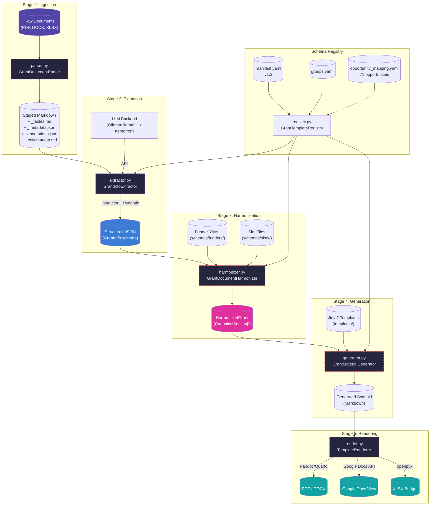
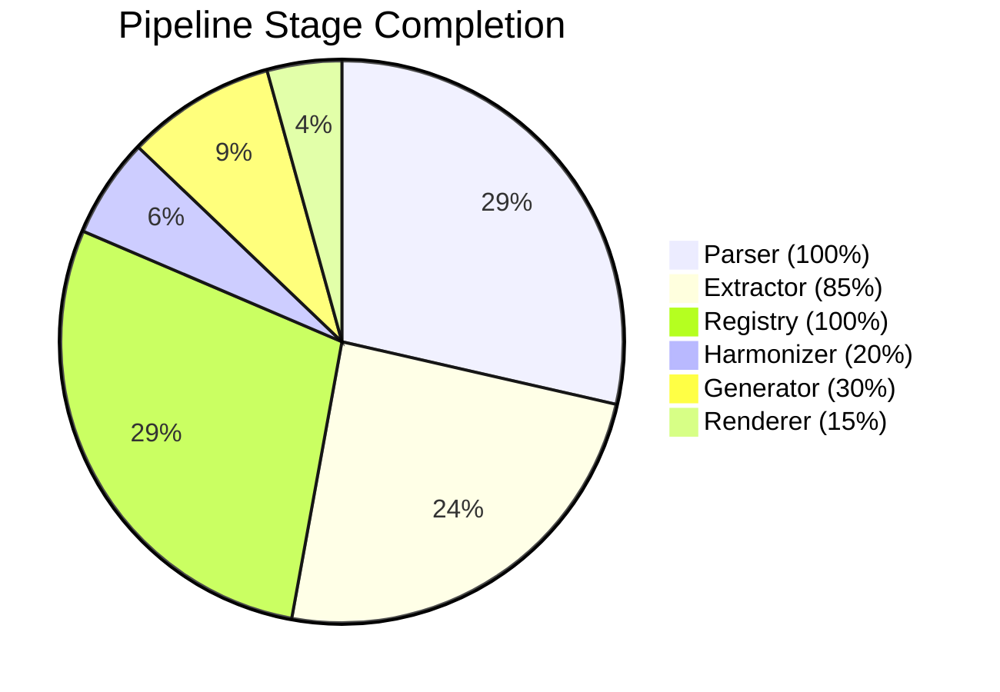
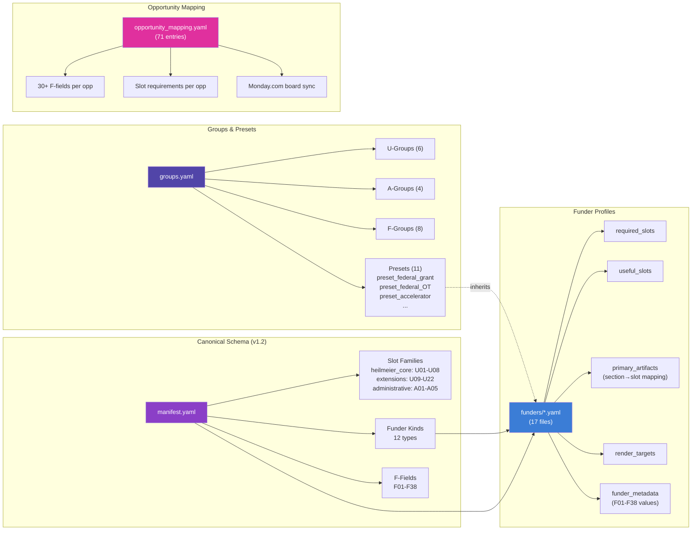

# Grant Pipeline — Architecture & Data Flow

## End-to-End Pipeline



> Dashed red borders indicate scaffolded/incomplete modules.

## Component Health



## Schema Hierarchy



## File Layout

```
src/cytos/scholarly/grants/
├── __init__.py                     # Public API (5 classes)
├── parser.py                       # Stage 1: Document ingestion (601 lines)
├── extractor.py                    # Stage 2: LLM structured extraction (192 lines)
├── harmonizer.py                   # Stage 3: Slot mapping (133 lines, SCAFFOLDED)
├── generator.py                    # Stage 4: Scaffold generation (130 lines, SCAFFOLDED)
├── render.py                       # Stage 5: Template rendering (90 lines, SCAFFOLDED)
├── registry.py                     # Registry & validation (601 lines)
├── schemas/
│   ├── manifest.yaml               # Authoritative registry (v1.2, 634 lines)
│   ├── groups.yaml                 # Preset inheritance system (v1.0)
│   ├── opportunity_mapping.yaml    # 71 opportunities × 30+ F-fields (3404 lines)
│   ├── opportunity_mapping.csv     # Flat tabular export for Monday import
│   ├── funders/                    # 17 funder YAML profiles
│   │   ├── heilmeier.yaml          # Universal baseline
│   │   ├── nsf_xlabs.yaml          # NSF X-Labs (federal_OT)
│   │   ├── arpah_solution_summary.yaml  # ARPA-H Solution Summary
│   │   ├── arpah_mission_office.yaml    # ARPA-H Mission Office ISO
│   │   ├── arpah_program_iso.yaml       # ARPA-H Program ISO
│   │   ├── ... (12 more)
│   │   └── yc_nonprofit.yaml      # YC Nonprofit (accelerator)
│   └── slots/                      # 27 canonical slot files
│       ├── U01_objective.md        # Heilmeier Q1 (AUTHORED)
│       ├── U02_sota_and_limits.md  # (stub)
│       ├── ... (25 more)
│       └── A05_intake_meta.md      # (stub)
└── templates/
    └── nsf_xlabs.md                # Only Jinja2 template that exists

data/staged/grants/
├── parse_report.json               # 39 files processed, 556 pages, 249 annotations
├── arpah/
│   ├── mission_office_isos/        # HSF + PHO amendments (6 files)
│   ├── programs/
│   │   ├── delphi/                 # Delphi ISO + appendix (9 files)
│   │   ├── evident/                # EVIDENT TA1-3 + TA4 (22 files)
│   │   └── prospr/                 # PROSPR ISO + model OT (6 files)
│   └── templates/                  # Official ARPA-H templates (15 files)
├── nsf_xlabs/
│   ├── *.md + *.json               # Solicitations + extractions (14 files)
│   └── templates/                  # NSF X-Labs templates (4 files)
├── nsf_tech_labs/                  # OT Guide + RFI + webinar (10 files)
└── doe_genesis/                    # FOA + overview + templates (10 files)
```
