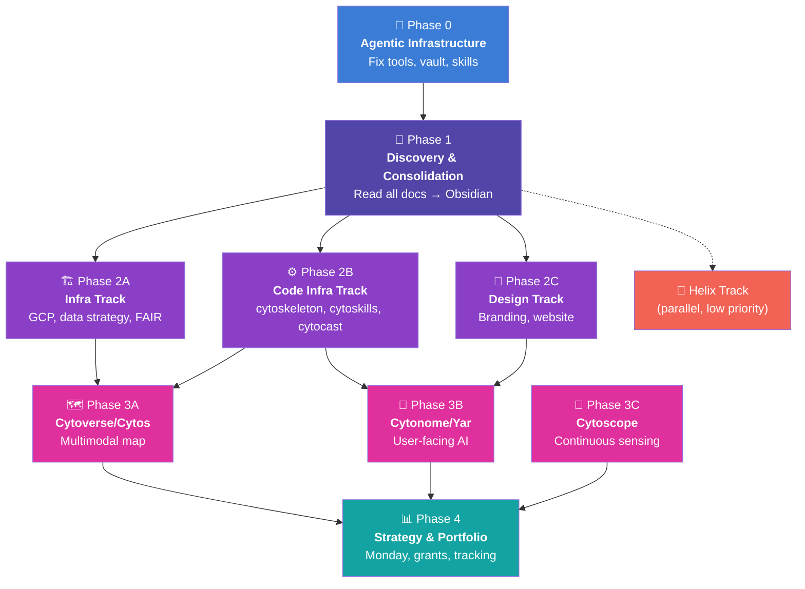
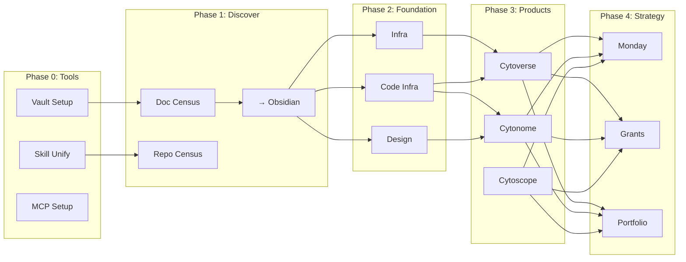
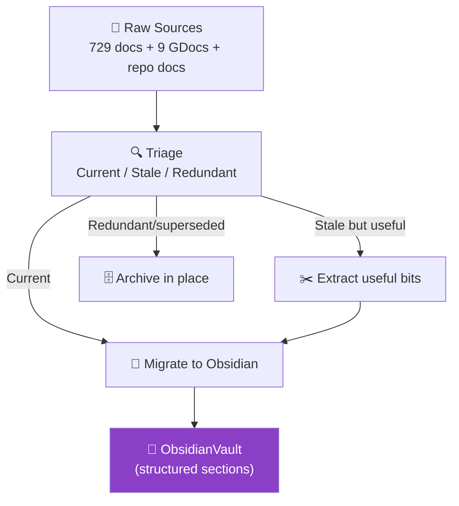

> **Status**: Active
> **Date**: 2026-05-25
> **Author**: @mohammadi
> **Audience**: operators, stakeholders
> **Tags**: `strategy`, `metaplan`


# Cytognosis Master Metaplan

> **Owner**: Shahin Mohammadi · **Created**: 2026-05-23 · **Status**: DRAFT — Awaiting Review
> **Canonical location**: `~/repos/cytognosis/org/plans/master-metaplan.md`
> **Project root**: `/home/mohammadi/repos/cytognosis/` (AG Hub project)

---

## Agent Context (READ FIRST)

> [!CAUTION]
> **This section is mandatory reading for any agent executing this plan.** It provides the full organizational context, operating rules, and standards required to work on Cytognosis repos.

### Organization

**Cytognosis Foundation** is a 501(c)(3) biomedical AI nonprofit. Mission: build open-source tools for precision medicine. Founded by Shahin Mohammadi (20 years computational biology — MIT, Broad Institute, insitro, GenBio AI).

**Platform = "GPS for Health"**:

- **Cytoverse** (The Map) — AI health coordinate system
- **Cytoscope** (The Sensor) — programmable continuous biosensing
- **Cytonome** (The Navigator) — on-device causal AI (<5mW)

### Multi-Agent Architecture

This metaplan coordinates work across **two AI agent systems running on the same machine**:

| Agent            | Tool                                  | Role in This Project                               |
| ---------------- | ------------------------------------- | -------------------------------------------------- |
| **AG Hub** | Google Antigravity 2.0 Chat Hub       | Cross-repo planning, discovery,`/goal` execution |
| **AG IDE** | Antigravity IDE (VS Code fork)        | Per-repo code editing, debugging, inline edits     |
| **AG SDK** | `google-antigravity` Python package | Automated agents (director, sync, drift)           |
| **Claude** | Claude Code / Cowork                  | Strategy docs, design, branding, Obsidian content  |

**Coordination rules**:

1. **All plans** live in `~/repos/cytognosis/org/plans/` (git-tracked, shared)
2. **All artifacts** go to git repos, NOT to `~/.gemini/` or `~/.claude/` (those are ephemeral)
3. **Never have AG and Claude edit the same file simultaneously**
4. **AG handles**: code refactoring, infrastructure, repo cleanup, technical docs
5. **Claude handles**: strategy, branding, design, grant writing, Obsidian organization
6. **Cross-repo plans** always saved to `~/repos/cytognosis/org/plans/[name].md`
7. **Per-repo docs** saved to `~/repos/cytognosis/[repo]/docs/`
8. **Final artifacts** promoted to ObsidianVault at `~/Documents/ObsidianVault/`

### Code Standards

| Standard                          | Value                                                                                     |
| --------------------------------- | ----------------------------------------------------------------------------------------- |
| **Python formatter/linter** | Ruff (`ruff check --fix`, `ruff format`)                                              |
| **Type checking**           | mypy `--strict` for libraries, `basic` for scripts                                    |
| **Testing**                 | pytest `-v --tb=short`, >80% coverage on core                                           |
| **Packaging**               | `pyproject.toml` + `uv` for dependency management                                     |
| **Style**                   | PEP 8, max 88 chars, Google docstrings                                                    |
| **Git commits**             | Conventional commits (`feat:`, `fix:`, `docs:`, `refactor:`)                      |
| **Git SSH**                 | Always use `GIT_SSH_COMMAND="ssh -o BatchMode=yes -o StrictHostKeyChecking=accept-new"` |

### Presentation Preferences (All Outputs)

- **ADHD-friendly**: scan-first, details-second
- **Mermaid diagrams** for all architecture/flow (reproducible, not ASCII)
- **GitHub alerts** (`NOTE`, `TIP`, `IMPORTANT`, `WARNING`, `CAUTION`) for emphasis
- **Tables** over paragraphs, **bullets** over prose
- **Bold/italic/code** to emphasize key parts
- **Section Map** at the top of every long document
- **Carousels** for code examples
- Cytognosis color palette: Violet `#8B3FC7`, Azure `#3B7DD6`, Magenta `#E0309E`, Indigo `#5145A8`, Teal `#14A3A3`

### Key File Locations

| What                                       | Path                                                            |
| ------------------------------------------ | --------------------------------------------------------------- |
| **AG config** (permissions, routing) | `~/.gemini/config/config.json`                                |
| **AG plugins** (70+ skills)          | `~/.gemini/config/plugins/`                                   |
| **Shared agent skills**              | `~/.agents/skills/`                                           |
| **cytoskills repo** (60+ skills)     | `~/repos/cytognosis/cytoskills/skills/`                       |
| **Claude config**                    | `~/.claude/CLAUDE.md`                                         |
| **MCP servers**                      | `~/.gemini/config/mcp_config.json`                            |
| **ObsidianVault**                    | `~/Documents/ObsidianVault/`                                  |
| **Legacy docs** (to consolidate)     | `~/Documents/Cytognosis/` (729 .md files)                     |
| **Google Doc exports**               | `~/Documents/Cytognosis/GoogleDocs_May23/` (9 files)          |
| **Cross-repo plans**                 | `~/repos/cytognosis/org/plans/`                               |
| **Director agent script**            | `~/repos/cytognosis/org/agents/director.py`                   |
| **AG companion docs**                | `~/repos/cytognosis/org/plans/ag2-ecosystem-reference.md`     |
| **Multi-agent guide**                | `~/repos/cytognosis/org/plans/cross-repo-multiagent-guide.md` |

### AG2 Permissions (Already Configured)

```json
{
  "cascadeAutoExecutionPolicy": "CASCADE_COMMANDS_AUTO_EXECUTION_EAGER",
  "cascadeAllowedCommands": ["*"],
  "globalPermissionGrants": {
    "allow": ["command(*)", "mcp(*)", "read_file(*)", "write_file(*)", "read_url(*)", "execute_url(*)"]
  },

}
```

### Cytognosis Voice Rules (For Any Written Content)

- Active voice, present tense, 3-4 sentence paragraphs max
- Use "intercept" (not prevent), "people/individuals" (not patients)
- Use "detect and intercept" (not diagnose and treat)
- NEVER use: passive voice, em dashes, "revolutionary", "cure", "game-changing", "breakthrough"

---

## 30-Second Overview

| What                               | Scale                                                 | Status                                    |
| ---------------------------------- | ----------------------------------------------------- | ----------------------------------------- |
| **Documents to consolidate** | 729 .md (Documents/Cytognosis) + 9 Google Doc exports | Scattered, many redundant/stale           |
| **Repos to refactor**        | 12 repos under ~/repos/cytognosis/                    | Active, Phases 0-1 complete, Phase 2 in progress |
| **ObsidianVault**            | 15 template files, 39 plugins installed               | Fresh, nearly empty                       |
| **Strategic tracks**         | 3 (Cytoverse/ARPA-H, Cytoscope/NSF, Cytonome/Yar)     | Plans consolidated, Phase 3 planned       |
| **Agent infrastructure**     | AG2 + Claude Cowork + cytoskills                      | cytoskills v1.0.0 published, skills audited |

---

## Execution Progress (as of 2026-05-24)

> [!NOTE]
> This section tracks actual execution against the plan. Updated by AG Hub during `/goal` sessions.

### Phase 0: Agentic Infrastructure — ✅ COMPLETE
- [x] Audited all AG2 plugins (70+ skills across 5 plugins)
- [x] Published cytoskills v1.0.0 to GCP Artifact Registry
- [x] Verified MCP servers (sequential-thinking, Obsidian)

### Phase 1: Discovery & Consolidation — ✅ COMPLETE
- [x] Deep-read all 12 repos: infrastructure(65 docs), cytos(472), cytoskeleton(177), cytoskills(931), cytocast(1293), Yar(architecture+CAP+product+sensor)
- [x] Research reports: data infra, doc standards, experiment/RO-Crate, skill-tagging ontology

### Phase 2A: Infrastructure — ✅ MOSTLY COMPLETE
- [x] VFS architecture verified (5 backends: Local, GCS, S3, GitHub, LocalGit)
- [x] Research completed: FAIR repos, specialized registries (LaminDB, SEEK, HF, Zenodo)
- [x] Additional VFS drivers: HuggingFace Hub + Zenodo added to cytoskeleton
- [x] `cytognosis://` URI parser and CURIE resolver module
- [x] Registry interface: AssetCatalog + BackendRouter (10 entity types)
- [x] 18 research documents written (~650KB, 14K+ lines)
- [x] 12 Architecture Decision Records (ADR-001 through ADR-012)
- [ ] FAIRDOM-SEEK deployment (pending infra setup)
- [ ] code.cytognosis.org deployment (Zoekt)
- [ ] GCP bucket reorganization

### Phase 2B: Code Infrastructure — ✅ MOSTLY COMPLETE

#### cytoskeleton (869 passed, 1 skipped)
- [x] `envs/` → `configs/` rename completed and verified
- [x] `experiments/` → `workflows/` rename completed
- [x] Extras standardized: `compute`, `containers`, `catalog`, `observe`, `workflows`
- [x] `cytoskeleton.schemas` module (load_schema_view, validate_linkml, list_bundled)
- [x] `cytoskeleton.uri` module: CURIE parser/resolver, CURIERegistry, cytognosis:// URI scheme
- [x] `cytoskeleton.identity.archive`: SWH Archive API client
- [x] `cytoskeleton.vfs.hf_hub`: HuggingFace Hub VFS driver
- [x] `cytoskeleton.vfs.zenodo`: Zenodo VFS driver (read-only)
- [x] `cytoskeleton.registry`: AssetCatalog, AssetEntry, BackendRouter
- [x] LinkML moved to core dependency
- [x] `pyproject.toml` fixed, `uv.lock` regenerated
- [x] 40 URI tests, 869 total tests pass

#### cytos
- [x] Feature tracker created: **~110 implemented, ~22 partial, ~6 planned, ~5 missing**
- [x] `scholarly.grants` → `scholarly.funding` rename with backward-compat alias
- [x] Extras reorganized: `scholarly`, `neuro`, `rocrate` added; `nlp` merged
- [x] Multi-vocabulary tagging module (1,789 lines, 14 vocabularies)
- [x] SWEBOK/APQC validation enums

#### cytoskills (141/141 tests pass)
- [x] EDAM/biotoolsSchema metadata enrichment in manifest schema
- [x] AgentCompatSchema for runtime compatibility declarations
- [x] Auto-update CI workflow (weekly upstream sync + auto-tag)
- [x] registry_uri and swhid fields for central registry integration

#### Yar/Cytonome (242 passed, 1 failed pre-existing, 15 errors pre-existing)
- [x] Fixed stale venv (was pointing to old `refactor/Yar` path)
- [x] Created missing model files: `guard.py`, `voice_affect.py`, `tts.py`
- [x] Created missing `VoiceAffectStore`, `VoicePreferencesStore`
- [x] Fixed import errors in `interactive_assistant.py`, `voice_service.py`, `routes_voice.py`
- [x] Feature tracker created: **154 implemented, 1 partial, 3 planned, 4 missing**

### Phase 2C: Design — ⏳ NOT STARTED (Claude track)

### Phase 3A: Cytoverse/Cytos — ✅ COMPLETE
- [x] Causal modeling architecture documented (GxE, SCM, normalizing flows, residual spaces)
- [x] Model registry LEGO system designed
- [x] Multi-resolution connectors and alignment methods documented (CKA, GW-OT, Hilbert metric)
- [x] Domain vertical naming analysis completed (1,319 lines)
- [x] Central asset registry architecture (ADR-001)
- [x] Phase 3A product architecture plan (1,225 lines, 14 sections, 14 mermaid diagrams)

### Phase 3B: Cytonome/Yar — ✅ COMPLETE
- [x] Tana Outliner research completed
- [x] Capacities.io research completed
- [x] Solid pods research completed (W3C standard, FHIR RDF, ACL-gated health data)
- [x] Persona, memory, sensor architecture mapped from existing docs
- [x] CytoExplorer interface research (Sigma.js, Meilisearch)
- [x] Phase 3B product architecture plan (1,027 lines, 10 sections, 8 mermaid diagrams)


> [!CAUTION]
> **This plan is too large for a single agent session.** It is designed as a **coordination document** that spawns focused sub-tasks across multiple conversations and agents. Each phase has explicit inputs, outputs, and a prompt template for the agent that will execute it.

---

## Section Map

| # | Section                                                                   | Purpose                                 |
| - | ------------------------------------------------------------------------- | --------------------------------------- |
| 0 | [Phase 0: Agentic Infrastructure](#phase-0-agentic-infrastructure)           | Fix the tools before using them         |
| 1 | [Phase 1: Discovery &amp; Consolidation](#phase-1-discovery--consolidation)  | Read everything, organize into Obsidian |
| 2 | [Phase 2: Foundational Repos](#phase-2-foundational-repos)                   | Infra, code infra, branding             |
| 3 | [Phase 3: Product Architecture](#phase-3-product-architecture)               | Cytos/Cytoverse and Yar/Cytonome        |
| 4 | [Phase 4: Strategy &amp; Portfolio](#phase-4-strategy--portfolio-management) | Monday.com, grants, tracking            |
| A | [Appendix: Inventory](#appendix-a-document-inventory)                        | What exists where                       |
| B | [Appendix: Obsidian Structure](#appendix-b-obsidian-vault-structure)         | Proposed vault organization             |
| C | [Appendix: Execution Prompts](#appendix-c-agent-execution-prompts)           | Copy-paste prompts for spawning agents  |

---

## Dependency Graph



---

## Horizontal × Vertical Planning Matrix

> [!IMPORTANT]
> **Horizontal tracks** = repo groups. **Vertical tracks** = milestone phases. Each cell is an independently executable work package.



|                   | **Infrastructure**              | **Code Infra**                           | **Design**               | **Cytoverse**               | **Cytonome/Yar**                 | **Cytoscope**           |
| ----------------- | ------------------------------------- | ---------------------------------------------- | ------------------------------ | --------------------------------- | -------------------------------------- | ----------------------------- |
| **Repos**   | `infrastructure`                    | `cytoskeleton`, `cytoskills`, `cytocast` | `branding`, `website`      | `cytos`, `cytoverse` (future) | `yar` (future)                       | `cytoscope` (future)        |
| **Phase 1** | Read docs, verify GCP state           | Read all skill/package docs                    | Read branding/design docs      | Read cytos docs + methods         | Read Yar plans + CAP                   | Read sensor schemas           |
| **Phase 2** | GCP health check, data strategy, FAIR | Update packages, unify skills                  | Sync Claude Design, components | —                                | —                                     | —                            |
| **Phase 3** | —                                    | —                                             | —                             | Rebuild cytos, experiment support | Feature spec, persona protocol, memory | Sensor USD, NSF X-labs prep   |
| **Phase 4** | —                                    | —                                             | —                             | ARPA-H HSF application            | App design → portfolio                | NSF X-labs application        |
| **Grant**   | —                                    | —                                             | —                             | **ARPA-H HSF**              | —                                     | **NSF X-labs (Jul 13)** |

---

## Phase 0: Agentic Infrastructure

> **Goal**: Fix the tools before using them. Cannot do multi-agent work if agents are misconfigured.
> **Estimated scope**: 1 agent session, ~2 hours

### 0.1 Fix ObsidianVault as Single Source

| Task                     | Detail                                                                  |
| ------------------------ | ----------------------------------------------------------------------- |
| Fix symlinks             | Point to `~/Documents/ObsidianVault` (not `~/Documents/Cytognosis`) |
| Create vault structure   | See[Appendix B](#appendix-b-obsidian-vault-structure)                      |
| Configure obsidian-git   | Point to `~/repos/cytognosis/org` for version control                 |
| Configure Local REST API | Enable for AG/Claude MCP access                                         |
| Configure realclaudian   | Connect Claude to vault                                                 |

### 0.2 Unify Skills Across AG + Claude

| Task                                                           | Detail                                                |
| -------------------------------------------------------------- | ----------------------------------------------------- |
| Audit `cytoskills/skills/`                                   | 12 categories, ~60 skills — identify stale vs active |
| Audit AG skills at `~/.agents/skills/`                       | Cross-reference with cytoskills                       |
| Audit `~/.gemini/config/plugins/`                            | 5 plugins, 70+ skills — overlap with cytoskills?     |
| Prioritize `cytognosis-dev` and `cytognosis-doc`           | These are P0 for all repo work                        |
| Ensure Claude's `~/.claude/CLAUDE.md` references same skills | Bidirectional sync                                    |
| Push cytoskills to GCP Artifact Registry                       | Make installable across environments                  |

### 0.3 MCP Servers

| Task                           | Detail                                   |
| ------------------------------ | ---------------------------------------- |
| Obsidian Local REST API MCP    | Connect both AG and Claude to the vault  |
| Verify `sequential-thinking` | Already configured in AG                 |
| Evaluate `system3-relay`     | For collaborative editing between agents |

### 0.4 Agent-Accessible Prompt Templates

Create standardized prompts for:

- Within-repo documentation (`cytognosis-doc` skill)
- Within-repo development (`cytognosis-dev` skill)
- Cross-repo planning (Director pattern)
- Deep research before implementing
- Doc consolidation and migration to Obsidian

---

## Phase 1: Discovery & Consolidation

> **Goal**: Read everything, understand the full landscape, organize into Obsidian.
> **Estimated scope**: 3-5 agent sessions, ~8-12 hours
> **Agent**: Claude (Cowork) for strategy docs, AG Hub (/goal) for repo scanning

### 1.1 Document Census

Read and catalog every document across all sources. For each, record:

- **Location** (source path)
- **Category** (strategy, design, research, ops, code)
- **Staleness** (current, stale, superseded, redundant)
- **Destination** (Obsidian section or archive)
- **Dependencies** (references to other docs)

#### Sources to Process (in order)

| Priority | Source                                                                   | Count | Notes                                  |
| -------- | ------------------------------------------------------------------------ | ----- | -------------------------------------- |
| P0       | `~/Documents/Cytognosis/Operations/Strategic Planning/`                | ~10   | Most current strategy docs             |
| P0       | `~/Documents/Cytognosis/GoogleDocs_May23/` (9 exports)                 | 9     | Canonical task lists, schemas          |
| P1       | `~/Documents/Cytognosis/Plans/design/` (11 subdirs)                    | ~50   | Most current design docs per component |
| P1       | `~/Documents/Cytognosis/archive/strategy/master_plan/`                 | ~15   | Strategic planning series              |
| P2       | `~/Documents/Cytognosis/Infra and design/` (15 subdirs)                | ~80   | Older but some unique content          |
| P2       | `~/Documents/Cytognosis/archive/` (remaining)                          | ~200  | Heavy dedup needed                     |
| P3       | `~/Documents/Cytognosis/curations/`                                    | ~50   | Datasets, methods, schemas             |
| P3       | `~/Documents/Cytognosis/Science/`                                      | ~30   | Research notes                         |
| P4       | Repo `docs/` folders (cytos=472, infrastructure=65, cytocast=63, etc.) | ~625  | Agent-generated, most is current       |

### 1.2 Consolidation Strategy



### 1.3 Chat History Mining

| Source              | Location                               | What to Extract                           |
| ------------------- | -------------------------------------- | ----------------------------------------- |
| AG conversations    | `~/.gemini/antigravity-ide/brain/*/` | Implementation plans, decisions           |
| Claude sessions     | `~/.claudian/sessions/`              | Strategy docs, design decisions           |
| Repo-docs/artifacts | `~/repos/cytognosis/*/docs/`         | Multiple subfolders with docs and designs |

---

## Phase 2: Foundational Repos

> **Goal**: Ensure infrastructure is solid before product work.
> **Estimated scope**: 3-4 agent sessions per track

### Track 2A: Infrastructure

| Step | Task                                                                       | Repo               | Status |
| ---- | -------------------------------------------------------------------------- | ------------------ | ------ |
| 2A.1 | GCP health check: verify all resources, buckets, billing, self-hosted node | `infrastructure` | ✅ |
| 2A.2 | Add automated GCP health tests (Terraform/OpenTofu or Pulumi)              | `infrastructure` | ⏳ |
| 2A.3 | Data strategy v1.0: bucket organization, provenance tracking               | `infrastructure` | ✅ (ADR-001) |
| 2A.4 | FAIR strategy implementation (reproducibility standards)                   | `infrastructure` | ✅ (ADR-002, ADR-003) |
| 2A.5 | DMP (Data Management Plan) finalization                                    | `infrastructure` | ⏳ |
| 2A.6 | Resource dashboard (GCP costs, bucket usage)                               | `infrastructure` | ⏳ |

### Track 2B: Code Infrastructure

| Step | Task                                                                         | Repo             | Status |
| ---- | ---------------------------------------------------------------------------- | ---------------- | ------ |
| 2B.1 | cytoskills audit and cleanup (P0: cytognosis-dev, cytognosis-doc)            | `cytoskills`   | ✅ (EDAM metadata, auto-update CI) |
| 2B.2 | Push cytoskills to GCP Artifact Registry                                     | `cytoskills`   | ✅ (v1.0.0) |
| 2B.3 | cytoskeleton: entity types, schemas, ontologies, versioning                  | `cytoskeleton` | ✅ (URI, SWHID, schemas, VFS, registry) |
| 2B.4 | cytocast: break cytoskills/cytoskeleton dependencies, add experiment support | `cytocast`     | [/] (RO-Crate template in progress) |
| 2B.5 | Cross-repo CI: integration tests across cytoskeleton→cytos chain            | `org`          | [/] (workflow in progress) |

### Track 2C: Design

| Step | Task                                                            | Repo         |
| ---- | --------------------------------------------------------------- | ------------ |
| 2C.1 | Branding: sync design system bidirectionally with Claude Design | `branding` |
| 2C.2 | UI component library (Cytognosis design tokens)                 | `branding` |
| 2C.3 | Website: update front page, establish design template usage     | `website`  |
| 2C.4 | Logos/icons refresh and downstream package integration          | `branding` |

---

## Phase 3: Product Architecture

> **Goal**: Integrate all plans for the two main product lines.
> **Execution**: Plan only (no implementation except state cleanup)

### Track 3A: Cytoverse (→ ARPA-H HSF)

**What**: Multimodal, multiscale health map using clinical data (genomics, fMRI, etc.)

| Area                        | Key Decisions to Document                                |
| --------------------------- | -------------------------------------------------------- |
| Causal modeling             | SCM, normalizing flows, CFM, GxE interactions            |
| Residual spaces             | Delta pathways (cellular), delta phenotype (organismal)  |
| Multi-resolution connectors | Molecular → cellular → tissue → organism              |
| Model registry              | LEGO idea, mix-and-match objectives, detached benchmarks |
| Network-based               | Cellular interactome, brain connectomics                 |
| Ontologies for OOD          | Disease, cell type, tissue, brain region                 |

### Track 3B: Cytonome/Yar

**What**: User-facing AI companion for health autonomy

| Area                   | Key Decisions to Document                                 |
| ---------------------- | --------------------------------------------------------- |
| Feature prioritization | Tana Outliner + Capacities + Leantime features            |
| Brain mapper/scribe    | Real-time NER, thought patterns, vocabulary               |
| Voice interface        | Low-latency, interruptible, persona-able                  |
| Persona protocol       | Voice, personality, relationship, visualization           |
| Memory                 | HippoRAG vs ReMem vs SurrealDB                            |
| Safety/privacy         | CAP protocol, edge AI, Solid Protocol storage             |
| Sensors                | Universal Sensor Descriptor (SOSA/SSN + IEEE 1752 + FHIR) |

### Track 3C: Cytoscope (→ NSF X-labs, Jul 13 2026)

**What**: Continuous biosensing with programmable zoom

| Area                       | Key Decisions to Document                            |
| -------------------------- | ---------------------------------------------------- |
| Mood/mental health tracker | Voice-based (verbal + nonverbal), HuBERT + OpenSMILE |
| Period tracker             | CGM, Fitbit, instruments, hormonal kits              |
| Social circle tracker      | Connections, personas, communication analysis        |
| NSF X-labs application     | Template parsing, key info extraction                |

---

## Phase 4: Strategy & Portfolio Management

> **Goal**: Update Monday.com, prepare grant applications, set up portfolio tracking.
> **Dependency**: Requires Phase 3 outputs (all product plans finalized).

### 4.1 Strategic Planning Update

- Consolidate 3/5/10-year plans from `archive/strategy/master_plan/`
- Update with current product architecture decisions
- Export to Monday.com Strategic Planning workspace

### 4.2 Fundraising

| Priority     | Application                                | Deadline               | Track     |
| ------------ | ------------------------------------------ | ---------------------- | --------- |
| **P0** | ARPA-H HSF (Health Sensing Futures)        | TBD                    | Cytoverse |
| **P0** | NSF X-labs / Tech Labs                     | **Jul 13, 2026** | Cytoscope |
| P1           | Other (evaluate based on updated strategy) | Ongoing                | All       |

### 4.3 Portfolio Management (Monday.com)

- Create project tracking boards per product track
- Link milestones across repos
- Dashboard for cross-track dependencies
- This becomes the central coordination point for all ongoing work

### 4.4 Helix Track (Parallel, Low Priority)

- Comparative paper + blog series on the Helix organizational framework
- Independent of all other tracks
- Docs at `archive/strategy/helix/`

---

## Appendix A: Document Inventory

### Repo Sizes

| Repo               | docs/*.md | Total .md | Primary Content                   |
| ------------------ | --------- | --------- | --------------------------------- |
| `cytos`          | 472       | 781       | Core platform, schemas, tutorials |
| `infrastructure` | 65        | 1,123     | GCP, DNS, CI/CD, data strategy    |
| `cytocast`       | 63        | 1,293     | Templating, communications        |
| `cytoskeleton`   | 16        | 177       | Framework, entity types           |
| `cytoskills`     | 4         | 931       | Agent skills (60+ skills)         |
| `website`        | 6         | 86        | Public site                       |
| `strix-halo`     | 3         | 504       | Hardware (this laptop)            |
| `branding`       | 0         | 64        | Design system                     |
| `org`            | 0         | 4         | Cross-repo plans (new)            |
| `archive`        | 0         | 7,998     | Historical code archive           |
| `refactor`       | 0         | 1,094     | Refactoring WIP                   |

### Documents/Cytognosis Key Folders

| Folder                                  | Content                                   | Priority |
| --------------------------------------- | ----------------------------------------- | -------- |
| `Operations/Strategic Planning/`      | Master strategic plans + diagrams         | P0       |
| `GoogleDocs_May23/`                   | 9 exported Google Docs                    | P0       |
| `Plans/design/`                       | 11 component design folders               | P1       |
| `archive/strategy/master_plan/`       | Strategic planning series                 | P1       |
| `Infra and design/05_skills_revised/` | 6 skill packages                          | P1       |
| `archive/strategy/monday/`            | Monday.com revision plans                 | P2       |
| `archive/curations/`                  | Datasets, methods, schemas                | P2       |
| `Infra and design/CAP/`               | Communication Access Protocol             | P2       |
| `Science/`                            | Research notes (psych, biotypes, methods) | P3       |

---

## Appendix B: Obsidian Vault Structure

> [!WARNING]
> **Proposed structure — needs your approval before implementation.** This replaces the current nearly-empty vault.

```
~/Documents/ObsidianVault/
├── 00-Inbox/                           # Unsorted new docs land here
├── 01-Strategy/                        # Strategic planning, vision
│   ├── master-plan/                    # 3/5/10-year plans
│   ├── fundraising/                    # Grant strategies, applications
│   │   ├── arpa-h/
│   │   └── nsf-xlabs/
│   ├── monday/                         # Monday.com board specs
│   └── helix/                          # Helix org model (independent)
├── 02-Products/                        # Product architectures
│   ├── cytoverse/                      # The Map (multimodal health map)
│   ├── cytoscope/                      # The Sensor (continuous biosensing)
│   ├── cytonome-yar/                   # The Navigator (user-facing AI)
│   └── sensors/                        # Universal Sensor Descriptor
├── 03-Engineering/                     # Technical design docs
│   ├── infrastructure/                 # → symlink to infrastructure/docs
│   ├── cytoskeleton/                   # → symlink to cytoskeleton/docs
│   ├── cytoskills/                     # → symlink to cytoskills/docs
│   ├── cytocast/                       # → symlink to cytocast/docs
│   ├── cytos/                          # → symlink to cytos/docs
│   └── cross-repo/                     # → symlink to org/plans
├── 04-Research/                        # Methods, models, literature
│   ├── methods/                        # Causal modeling, CFM, etc.
│   ├── datasets/                       # Curated datasets registry
│   ├── neuro-ontology/                 # Neuro-behavioral axes
│   ├── schemas/                        # Data schemas, ontologies
│   └── literature/                     # Paper notes, reviews
├── 05-Operations/                      # Org operations
│   ├── data-strategy/                  # DMP, FAIR, provenance
│   ├── compliance/                     # HIPAA, EU Horizon, NIST
│   └── branding/                       # → symlink to branding/
├── 06-Design/                          # UI/UX, Claude Design sync
│   ├── design-system/                  # Tokens, components
│   ├── website/                        # → symlink to website/docs
│   └── templates/                      # Claude Design prompts
├── 07-Agent-Work/                      # Agent artifacts (ephemeral → promoted)
│   ├── antigravity/                    # → symlink to ~/.gemini/antigravity-ide/brain/
│   └── claude/                         # → symlink to ~/.claudian/sessions/
├── _archive/                           # Triaged stale docs
├── _templates/                         # Obsidian note templates
├── .obsidian/                          # Plugin configs
├── .claude/                            # Claude agents/skills for vault
└── .claudian/                          # Claude sessions
```

---

## Appendix C: Agent Execution Prompts

### Prompt: Phase 0 Agent (Agentic Infrastructure Setup)

```markdown
# Task: Set up Cytognosis Agentic Infrastructure

Read the metaplan at:
/home/mohammadi/repos/cytognosis/org/plans/master-metaplan.md

Execute Phase 0 only:

1. Fix ObsidianVault symlinks (target: ~/Documents/ObsidianVault)
2. Create vault directory structure per Appendix B
3. Audit cytoskills/skills/ — create inventory of all skills
4. Cross-reference with AG plugins at ~/.gemini/config/plugins/
5. Identify cytognosis-dev and cytognosis-doc skills, verify they work
6. Configure Obsidian Local REST API MCP for both AG and Claude
7. Save outputs to ~/repos/cytognosis/org/plans/phase0-report.md
```

### Prompt: Phase 1 Agent (Discovery & Consolidation)

```markdown
# Task: Cytognosis Document Discovery and Consolidation

Read the metaplan at:
/home/mohammadi/repos/cytognosis/org/plans/master-metaplan.md

Execute Phase 1:

1. Read ALL documents in ~/Documents/Cytognosis/ (729 .md files)
2. Read the 9 Google Doc exports at ~/Documents/Cytognosis/GoogleDocs_May23/
3. For each document, catalog: location, category, staleness, destination, dependencies
4. Create a comprehensive census at ~/repos/cytognosis/org/plans/doc-census.md
5. Identify the 50 most important documents that need immediate migration
6. Begin migrating P0 docs to ~/Documents/ObsidianVault/ per the vault structure
7. Save progress to ~/repos/cytognosis/org/status/phase1-progress.md
```

### Prompt: Cross-Repo Director (Phase 2+)

```markdown
# Task: Cytognosis Multi-Repo Foundational Update

Read the metaplan at:
/home/mohammadi/repos/cytognosis/org/plans/master-metaplan.md

You are the Director Agent. Execute Phase 2, Track [A/B/C]:

For each repo in this track:
1. Read its docs/ folder completely
2. Verify its current state matches the metaplan's understanding
3. Create a per-repo execution plan at ~/repos/cytognosis/org/plans/phase2-[track]-[repo].md
4. Execute the plan (code infra only, no product changes)
5. Create verification report at ~/repos/cytognosis/org/status/phase2-[track]-verify.md

Save all artifacts to git repos, NOT to ~/.gemini/ or ~/.claude/.
```


---

## Current State (as of 2026-06-14)

> [!NOTE]
> The agent prompt scaffolding above reflects the original migration directive (Phase 1-2, early 2026). The taxonomy and repo structure have since been updated to v8. See active docs below.

## See Also

| Doc | Relationship |
|-----|-------------|
| [`03-Products/Cytonome/cytonome-track.md`](../03-Products/Cytonome/cytonome-track.md) | Cytonome track (Cytoplex + Yar + USAP + PBC); the current product strategy doc |
| [`04-Engineering/cytos/architecture-overview-v2.md`](../04-Engineering/cytos/architecture-overview-v2.md) | Current Cytos engineering architecture; the technical counterpart to this strategy plan |
| [`02-Funding/gdrive-funding-index.md`](../02-Funding/gdrive-funding-index.md) | Active grant working documents in Google Drive |
