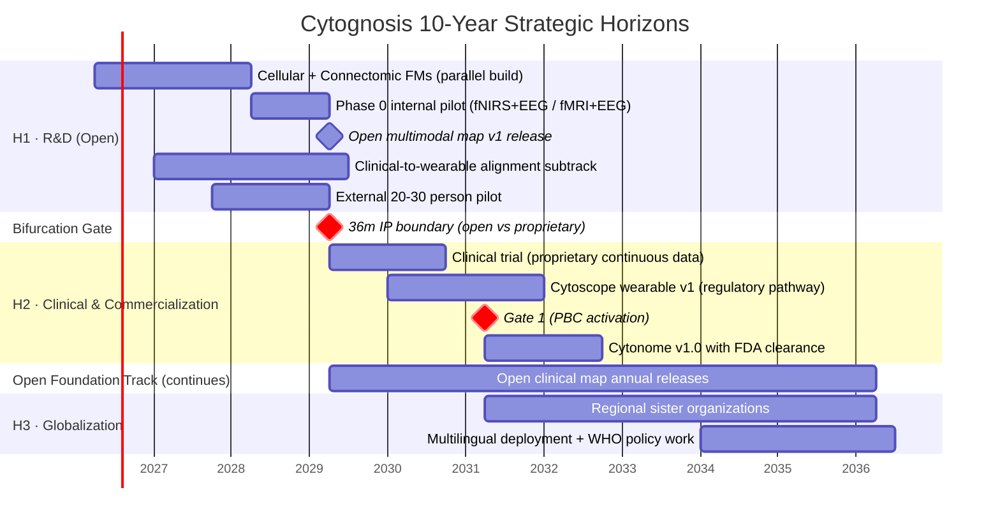
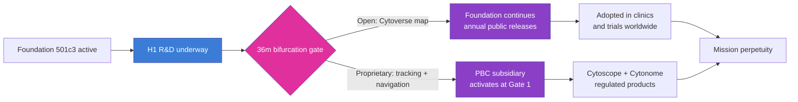

# Executive Summary

> **Status**: Active
> **Date**: 2026-07-10
> **Author**: @shahin
> **Audience**: leadership
> **Tags**: `strategy`
> **Variants**: Technical (this doc) - Readable (Obsidian twin optional, same filename) - Agent (n/a)

**Cytognosis Foundation · Master Strategic Plan v2.0 · May 2026**

## The problem we exist to solve

Modern medicine treats symptoms after damage occurs. Three structural blindspots prevent the shift to proactive health:

- **Mechanistic blindness.** Treating clusters, not biology. Depression has 4+ molecular subtypes; first-line antidepressants fail 30 to 60% of patients. Autoimmune diagnosis takes 4.5 to 7 years across 4+ specialists.
- **Temporal blindness.** Alzheimer's pathology begins decades before memory loss; cancer mutations circulate years before tumors form; type 2 diabetes is 50 to 80% reversible at prediabetes but under 10% after clinical onset.
- **Complexity blindness.** Continuous glucose monitoring revealed that identical meals produce dramatically different metabolic responses across people. We have not generalized that revolution beyond a single molecule.

These are not three problems. They are one structural failure: medicine has no platform that maps disease at its molecular roots, tracks trajectory in real time, and guides intervention before pathology becomes irreversible.

## What we are building

A **cellular intelligence platform** that we call **GPS for Human Health**. It has three components, in plain language:

| Component | Role | What it produces |
|---|---|---|
| **Cytoverse** · the **map** | Continuous, multimodal coordinates for human biology across micro (molecules + cells), meso (connectomes + circuits), and macro (behavior + phenotype) scales | A universal health-state coordinate system that replaces categorical diagnoses with quantitative, trackable position |
| **Cytoscope** · the **sensor** | Programmable biosensors plus wearables that triangulate each person's coordinates on the Cytoverse map in real time, across molecular, connectomic, and phenotypic modalities | Continuous, multivariate biological data for any individual |
| **Cytonome** · the **navigator** | Privacy-first edge AI that converts real-time coordinates into causally grounded recommendations: defensive (what to avoid), corrective (how to reverse), supportive (how to cope) | A personal, on-device coach that protects healthspan across decades |

Our pilot indication is **mental health**, where the absence of biotyping creates the largest gap between current standard of care (one-size-fits-all symptom-cluster diagnosis) and what cellular intelligence enables (precise stratification by mood, thought, anxiety, attention axes grounded in molecular and connectomic signatures).

## Three horizons in one diagram

## What is new in this version

Five updates that change how we operate in the next 24 months.

**Bifurcation marker at 36 months.** All work, models, and data produced in the first 36 months remain open under Apache 2.0 and CC BY 4.0, owned by the Foundation, released annually with public versioning, and adoptable in clinical care without licensing barriers. From the start of our clinical study (Year 4), the proprietary continuous-tracking layer (paired clinical + wearable longitudinal data on the same individuals; the personalized navigation engine) accumulates inside the PBC subsidiary, licensed back to the Foundation under terms that keep the open map perpetually maintained. This gives us both: an open map as a public good, and a defensible sensor + navigator product line that can attract VC at Gate 1.

**Parallel cellular + connectomics foundation models.** Per the 2026-05-07 architecture meeting with the Purdue team: same building blocks (WaveGC for multi-resolution graph diffusion, AlphaGenome-style cross-resolution attention for inter-block information sharing) applied at two scales. Genes-as-units cellular FM and voxels-as-units connectomic FM share infrastructure and benchmarks but operate independently, with cross-scale alignment via paired data (ENIGMA, PsychENCODE 388 paired). Shourya leads both tracks with Mohammadi support; Mango remains contributor as bandwidth allows.

**Multi-scale nested foundation models.** Our cellular FM treats each gene as a unit and uses a molecular foundation model (e.g., ESM, AlphaGenome) as the embedding source, but unlike scPrint2 and TranscriptFormer (which freeze the molecular FM as a static dictionary), we train the molecular and cellular FMs end-to-end through cross-resolution transformer blocks. Disease modeling concentrates on the residual space (delta from healthy baseline) using conditional flow matching, so that the entire stack converges to the language of residuals (which is also the language of individual genomic variation).

**Patient Advocacy Council promoted to governance.** PAC, an innovation we introduced in the Google Impact proposal, becomes a first-class governance structure with charter, seats across both entities, and decision rights on grant prioritization, study designs, release timing, and the open / proprietary boundary. It is not advisory. Its veto on participant-impacting decisions is binding by Foundation bylaws.

**Clinical-to-wearable alignment subtrack added.** Without paired clinical (fMRI, EEG) and wearable (fNIRS, consumer EEG, physiology) data on the same individuals, the Y4-Y5 wearable transition fails. We start in Y1 with the Inclusion Study and FRESH initiative public datasets, plus an internal core-team pilot wearing both research headsets and undergoing clinical fMRI/EEG. This is the dress rehearsal for the Y4 clinical trial.

## What we ask of readers

| Reader | Action |
|---|---|
| Funders (Astera, Google.org, ARPA-H) | Treat the open Cytoverse track (H1) as the deliverable of your award; the proprietary track is funded separately at Gate 1 |
| Foundation Board | Ratify the 36-month bifurcation policy and the PAC governance charter |
| Scientific Advisory Board | Review the parallel FM architecture and the cross-modal alignment plan |
| Patient Advocacy Council (forming) | Provide binding input on study design, release pace, and the open / proprietary boundary |
| Engineering team | Adopt the four-repo structure (neurogenomics, neuroconnectomics, neurotranscriptomics, neurobehavior) with shared infrastructure package |
| Clinical partners (McLean, Mount Sinai, Manchester) | Confirm protocol alignment with the Y2 external pilot and the Y4 clinical trial |

## Status at a glance

The plan that follows turns this picture into operating decisions, milestones, and quantitative measures across the next decade.
