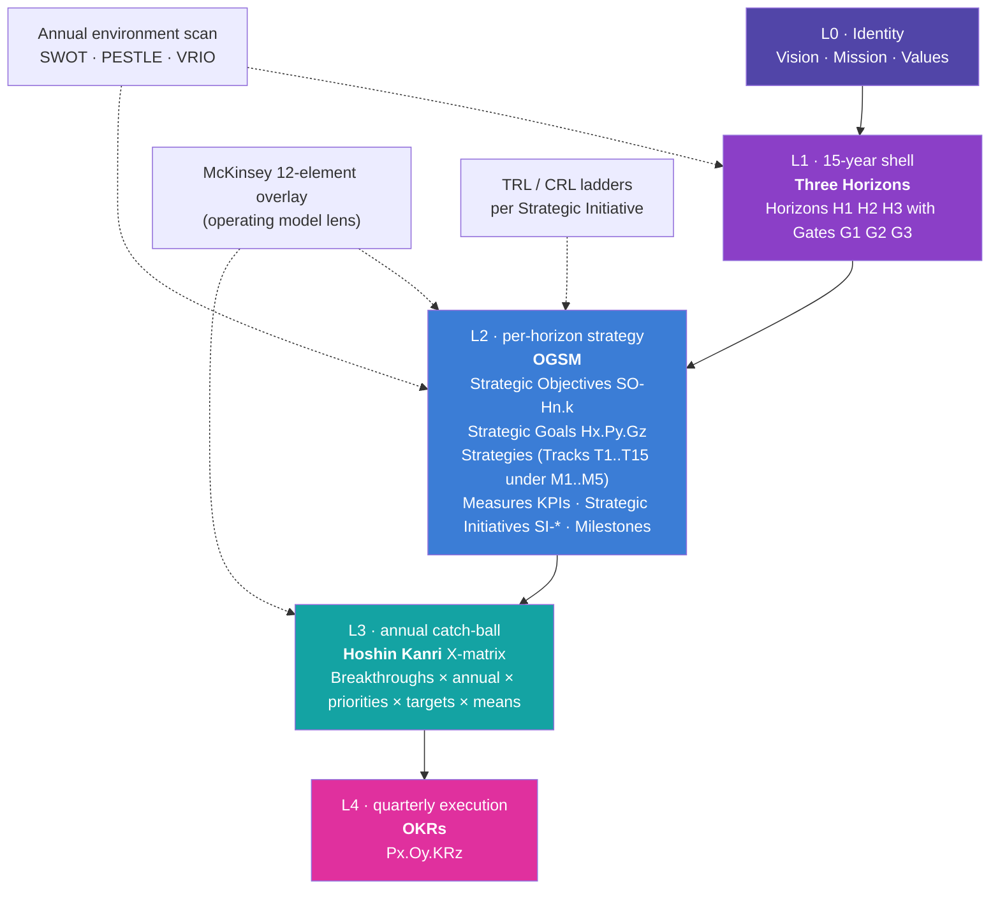

# Identity and Framework

> **Status**: Active
> **Date**: 2026-07-10
> **Author**: @shahin
> **Audience**: leadership
> **Tags**: `strategy`
> **Variants**: Technical (this doc) - Readable (Obsidian twin optional, same filename) - Agent (n/a)

**Companion to:** `00_executive_summary.md`, `02_horizons_and_bifurcation.md`

## Identity (L0)

| Field | Value |
|---|---|
| Legal name | Cytognosis Foundation, Inc. |
| Type | 501(c)(3) Nonprofit Healthcare Innovation Foundation |
| EIN | 39-4383634 |
| UEI | HS4PRLL7AKY5 |
| HQ | South San Francisco, California |
| Web | https://www.cytognosis.org/ |
| Etymology | Greek: *cyto* (cell) + *gnosis* (knowledge). "Cellular knowledge that precedes diagnosis." |

### Vision

To transform healthcare from reactive treatment of disease to proactive preservation of healthspan.

### Mission

To pioneer a cellular intelligence platform that maps personalized health states, detecting and intercepting disease years before symptoms emerge.

### Mission, GPS variant

Building the GPS for Health: mapping, sensing, and navigating individual health trajectories before disease takes hold.

### Promise

To make precision health a human right, not a privilege.

### Values

| Value | What it means in operating decisions |
|---|---|
| **Openness** | Code, data, models, and protocols are open by default. The 36-month bifurcation is the only structured exception, with documented mission-protective rationale. |
| **Rigor** | Every public release passes the release checklist: license, model card, data card, eval card, differential-privacy probe, re-identification probe. No exceptions. |
| **Equity** | Health equity is design input, not afterthought. Every cohort, dataset, sensor calibration, and language coverage decision is audited for whose data it represents and whom the resulting tool can serve. |
| **Courage** | We take the bets that academia is structurally too small to take and that industry is structurally too short-term to take. We document failure as a deliverable. |
| **Care** | The Patient Advocacy Council holds binding decision rights. We move at the speed of trust where participants are involved, even where speed of science would prefer otherwise. |

These are the canonical wording. Earlier drafts that used "Continuity" or "Convergence" are superseded.

## Framework (L1 to L4)

We use a four-layer hybrid because no single framework covers a 15-year health-research nonprofit with an R&D to clinical to globalization arc and a two-entity Helix structure. The four layers are stacked so each lower layer cleanly serves the layer above.

### Why this hybrid

- **Three Horizons** mirrors the Bylaws Article I §1.2 three-phase structure and is the native idiom at ARPA-H, NSF, and most government science funders. Reviewers do not need translation.
- **OGSM** forces every qualitative ambition (Objective) to name a measurable Goal, concrete Strategy, and quantitative Measures. Grant reviewers look for exactly that discipline.
- **Hoshin Kanri** supplies catch-ball alignment between the Foundation, the future PBC subsidiary, the UK office, and (later) regional sister organizations at annual cadence.
- **OKRs** are the existing operational rhythm in the Portfolio Management folder of the Monday workspace and align with how engineering teams already plan.
- **McKinsey 12** replaces the older 7-S framework and keeps the operating model audit-ready under one consistent lens.

Pure OKRs underserve a 15-year horizon. Wardley Maps are hard to audit in grant review. Balanced Scorecard does not accommodate R&D-to-deployment transitions. The hybrid is the deliberate compromise.

## Vocabulary

The whole plan uses the same set of identifiers throughout. Train new readers and new tools on this once and stop translating.

| Token | Meaning | Example |
|---|---|---|
| `Hx` | Horizon (H1, H2, H3) | `H1` = Years 1 to 5, R&D phase |
| `Gn` | Gate (G1, G2, G3) | `G1` = H1 to H2 transition, target Year 5 |
| `GC-Gn.k` | Gate criterion | `GC-G1.S2` = scientific criterion 2 of Gate 1 |
| `Py` | Pillar | `P1` = Cytoverse, `P2` = Cytoscope, `P3` = Cytonome, `P4` = Open-Science Substrate, `P5` = Clinical Translation, `P6` = Organization and Helix |
| `Mn` | Meta-track (1 of 5) | `M1` = Discovery and Platform |
| `Tn` | Subtrack (1 of 15) | `T1` = Science and Discovery |
| `SO-Hn.k` | Strategic Objective | `SO-H1.1` = "The Map" objective for Horizon 1 |
| `Hx.Py.Gz` | Strategic Goal | `H1.P1.G1` = first goal of Cytoverse pillar in Horizon 1 |
| `SI-*` | Strategic Initiative | `SI-Neuroverse-Micro` |
| `Mz` | Milestone | `MS-GI-1` = Google Impact phase 1 milestone |
| `Kz` | KPI / measure | `K1`, `K2`... per Goal |
| `Px.Oy` / `Px.Oy.KRz` | Phase OKR | `P1.O1.KR2` = pillar 1, objective 1, key result 2 |

## Meta-track structure (5 × 15)

Per the user-confirmed track-taxonomy preference (3 to 5 top-level meta-tracks with finer subtracks for multi-resolution organization), the operating layer carries five meta-tracks, each containing finer subtracks. Every Strategic Initiative is tagged to at least one subtrack.

| Meta-track | Scope narrative | Subtracks |
|---|---|---|
| **M1 · Discovery and Platform** | The science we produce and the platform we build to instrument, deploy, and learn from it. *"What we build."* | T1 Science and Discovery · T2 Technology and Platform |
| **M2 · Translation** | The pathway from platform to population impact: trials, partners, participants, policy. *"How it reaches people."* | T3 Clinical and Regulatory · T5 Partnerships and Ecosystem · T6 Community and Engagement · T7 Policy and Advocacy |
| **M3 · Openness** | The open substrate, standards, and outward communication that ensure reproducibility, adoption, and credibility. *"What we open up."* | T4 Open Science and Standards · T12 Communications and Brand |
| **M4 · Organization** | The Helix structure, people, finances, and operational infrastructure that make the mission durable. *"How we function."* | T8 Governance and Legal · T9 People and Culture · T10 Finance and Sustainability · T11 Operations and Infrastructure · T14 Patient Advocacy Council *(new in v2.0)* |
| **M5 · Learning** | The cross-cutting measurement, evaluation, and retrospection system that feeds every other track and every gate. *"How we know we're working."* | T13 Measurement, Evaluation and Learning · T15 Cross-modal Alignment Subtrack *(new in v2.0)* |

The two new subtracks (T14 PAC, T15 Cross-modal Alignment) are explicit responses to the v1.1 to v2.0 changes documented in `README.md`. T15 holds the clinical-to-wearable alignment work that bridges H1 open data to H2 proprietary data; T14 holds the participant-governance work that runs in parallel.

## McKinsey 12-element overlay

Maintained as a standing rolling lens on the operating model in `20_organization_helix.md`. The twelve elements are: Purpose, Value Agenda, Structure, Ecosystem, Leadership, Governance, Processes, Technology, Behaviors, Rewards, Footprint, Talent. Where the operating section is silent on an element, that silence is itself a planning decision and is flagged in the next annual review.

## How this layer relates to the others

- **Identity (L0)** does not change between annual reviews. A Bylaws amendment is the only path to revising vision, mission, or values.
- **L1 Three Horizons** is reaffirmed annually. Horizon redefinition (e.g., dropping a horizon, expanding a phase) requires Board action.
- **L2 OGSM** lives in the Strategic Roadmap (this plan) and is updated at each annual planning cycle (October).
- **L3 Hoshin** lives in the X-matrix board (currently archived) and is rebuilt annually at the catch-ball workshop.
- **L4 OKRs** live in the Portfolio Management folder of the Monday workspace and turn over quarterly.

## Cross-references

- `02_horizons_and_bifurcation.md` defines the L1 Horizons in concrete operational terms with the 36-month bifurcation overlay.
- `03_short_term_1to2y.md`, `04_mid_term_5to6y.md`, `05_long_term_10y.md` detail L2 OGSM by horizon.
- `20_organization_helix.md` carries the McKinsey 12 overlay.
- `21_patient_advocacy_council.md` defines the PAC charter that sits behind subtrack T14.
