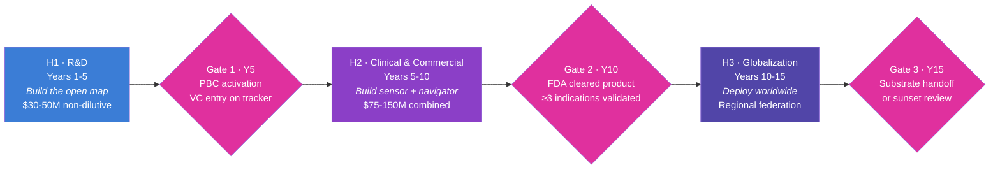
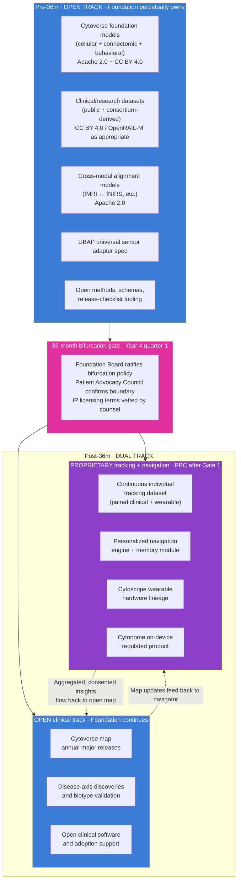

# Three Horizons and the 36-Month Bifurcation

**Companion to:** `01_identity_and_framework.md`, `03_short_term_1to2y.md`, `04_mid_term_5to6y.md`, `05_long_term_10y.md`, `23_open_science_and_ip.md`

## Three Horizons at a glance

Cytognosis runs a 15-year strategic shell with three horizons and three gates. Each horizon has its own strategic posture, its own funding pattern, and its own deliverable. The transition between horizons is a formal Board-level decision, not a calendar tick.

| Horizon | Years | Phase | Strategic posture |
|---|---|---|---|
| **H1** | 1 to 5 | R&D · "build the map" | Capital-restricted to time-restricted. Primarily non-dilutive funding (grants, philanthropy). All artifacts open by default. |
| **H2** | 5 to 10 | Clinical and commercialization · "build the sensor and navigator" | Hybrid funding: Foundation continues open mission with non-dilutive sources; PBC subsidiary raises VC for the proprietary tracking and navigation product. |
| **H3** | 10 to 15 | Globalization and equity · "deploy worldwide" | Federated structure: regional sister organizations carry local trust and local approvals. Foundation coordinates, licenses, and redistributes. |

## The 36-month bifurcation

The single most consequential structural decision in this plan: at month 36 of Horizon 1, the deliverable splits into two tracks that develop in parallel for the rest of the lifespan of the platform.

### Why the bifurcation exists

Foundations and product companies have opposite optimal incentives. A foundation's job is to keep critical infrastructure open and trustworthy in perpetuity. A product company's job is to convert defensible assets into revenue that funds further R&D. Most attempts to fold both into one organization fail because the incentives collide on every release decision.

The 36-month boundary is where the collision becomes unavoidable, because it is the moment when our work transitions from "open clinical-grade tooling that anyone can adopt" to "continuous, individualized tracking data that requires direct relationship with each participant." Continuous tracking data cannot be open in the same way that a cell atlas can. Privacy law, participant consent, and the physical economics of operating a sensor and navigation product all push it into a different organizational form.

We solve this by building two entities (Foundation 501(c)(3) plus future PBC subsidiary, the Helix structure) and by drawing a clean, dated line: anything before the line stays in the Foundation forever; anything after the line is owned by the entity that invests in continuous data collection.

### What the bifurcation says, exactly

### What stays open after the bifurcation

The Foundation continues to:

- maintain Cytoverse (the Map) and ship a major release at least annually, with the same release checklist and the same open licenses;
- publish disease-axis discoveries, biotype validations, and cross-modal alignment models;
- maintain the open clinical-grade software stack so the map is adoptable in clinical care and patient stratification in trials without licensing barriers;
- continue to fund this work with grants, philanthropic capital, and a perpetual royalty stream from the PBC.

The Foundation does not give up ownership. It does not stop releasing. It does not become a pre-publication shop for the PBC. The map is a public good in perpetuity, and the Foundation's job after Gate 1 is to keep that promise.

### What becomes proprietary after the bifurcation

The PBC subsidiary, once activated at Gate 1, owns:

- continuous longitudinal data on consented individuals (paired clinical-grade sensing during onboarding, then continuous wearable-grade sensing thereafter);
- the personalized navigation engine that runs causal recommendation on each individual's history;
- the Cytoscope hardware lineage and the Cytonome on-device regulated product;
- improvements to the navigator that depend on the proprietary continuous dataset.

The PBC is structurally bound to the Foundation through the Helix Framework: the Foundation holds enough governance to prevent mission drift, holds a perpetual license to the open layers of the platform, and receives a documented royalty stream that funds the open mission.

### Why the bifurcation is *operationally* a clean line

Three reasons the line is clean rather than a fuzzy boundary that legal will fight about for a decade:

- The bifurcation marker is a single, dated act of the Foundation Board. Before it, no clinical-trial proprietary data exists; after it, every consent form on the new study cohort is structured for the dual ownership.
- Open releases through Year 3 use only public, consortium, or appropriately licensed third-party data (PsychENCODE, NeuroBioBank, ENIGMA, UKBB, ABCD, HCP). Nothing from the future trial leaks back into pre-36m artifacts.
- Open releases after Year 3 use only the same kinds of data plus newly published consortium data. Insights that depend on proprietary continuous tracking are kept behind the PBC line.

## Gates

Each transition is a formal Board-level go/no-go decision. Gate criteria are inherited from `01_Cytognosis_Strategic_Roadmap_15-Year.md` v1.1, refined and repeated here.

### Gate 1 (H1 to H2, target Year 5)

This is the hardest gate. R&D success is necessary but not sufficient for clinical validation, and the organization is rarely structured to carry research directly into clinical and commercial execution. The Helix Framework exists precisely because of this gate.

| Category | Criterion | Evidence required |
|---|---|---|
| **Scientific** | `GC-G1.S1` Cytoverse v2 (meso) and v3 (macro) released as open artifacts | External validation against ≥2 frameworks (HiTOP, Grotzinger 5-factor, RDoC) |
| | `GC-G1.S2` Cross-scale imputation works for at least one indication | AUROC ≥ 0.75, held-out cohort |
| | `GC-G1.S3` Dimensional coordinates predict treatment response | Effect size ≥ 15% over DSM baseline, retrospective dataset |
| | `GC-G1.S4` Phase 0 self-instrumentation and external 20-30 person pilot complete | Documented learnings published |
| **Clinical** | `GC-G1.C1` Clinical-scale follow-on grant secured | $10M+ over 3 years (ARPA-H, NIH R01, Wellcome Leap) |
| | `GC-G1.C2` IRB infrastructure and clinical partners ready for 500+ participant study | Signed agreements |
| | `GC-G1.C3` FDA pre-submission completed; regulatory pathway identified | DHCE meeting record |
| **Organizational** | `GC-G1.O1` Helix structure operational | PBC charter; promise-of-future-equity allocations; people-as-seed-funders mechanism legally vetted |
| | `GC-G1.O2` UK office operational | ≥5 FTE, independent grant pipeline |
| | `GC-G1.O3` ≥24 months operating runway at H1 burn | Audited financials |
| | `GC-G1.O4` No material governance, IP, or compliance findings | External audit |
| **Adoption** | `GC-G1.A1` Open artifacts adopted | ≥1,000 downloads, ≥50 citing publications |
| | `GC-G1.A2` UBAP adopted by external groups | ≥2 external biosensor or clinical partners |
| **PAC** *(new in v2.0)* | `GC-G1.P1` Patient Advocacy Council operational | Charter ratified, seats filled, two annual review cycles complete |
| | `GC-G1.P2` PAC has exercised binding decision rights at least once | Documented case where PAC input changed a study, release, or grant scope |

**Halt or re-scope if** two or more Scientific criteria fail and at least one path to closure is not obvious within 12 months, OR Clinical criterion `GC-G1.C1` fails and no bridge funding covers 12 months.

### Gate 2 (H2 to H3, target Year 10)

Dominated by clinical success. Commercial sustainability is necessary but not sufficient; equity of access and regulatory maturity are the binding constraints.

| Category | Criterion |
|---|---|
| Clinical | ≥1 FDA De Novo or 510(k) clearance for a Cytonome-powered product |
| | Clinical-scale evidence in ≥3 indications, each with effect size ≥20% over standard of care |
| | Post-market surveillance infrastructure live |
| Financial | PBC at or near break-even, or on a funded path to break-even within 24 months |
| | Foundation operations independent of further philanthropic catalytic capital |
| | Net Promoter Score ≥50 with no demographic subgroup below 30 |
| Equity | Demonstrated emerging-market deployment model |
| | All data pipelines post-quantum safe and decentralized |
| | PAC expanded to multi-continental composition |

**Halt or re-scope if** clinical clearance is not achieved AND no regulatory pathway is credible within 18 months, OR equity criteria are systematically failing without a plan.

### Gate 3 (Year 15)

Less a gate than a governance milestone. Board reviews whether the Foundation's role should continue, consolidate, or hand off to successor consortia. Dissolution provisions of Bylaws Article XIII apply only if successor organizations are ready to receive the charitable assets.

## Why this bifurcation is what funders want

| Funder type | Why they like the line |
|---|---|
| Astera, Convergent Research, Speculative Technologies | They fund R&D that becomes a public good. The 36-month commitment to keep the map open in perpetuity is exactly their thesis. |
| Google.org, philanthropic AI-for-science | Same as above. Open releases against time-bound milestones map cleanly to their funding instrument. |
| ARPA-H, DOE, NIH | Federal funders want clear deliverables that benefit the public. The open track answers that. The proprietary track does not have to be funded by them. |
| Wellcome Leap, EU Horizon, regional foundations | They want the deliverable to be operational in their geography. The open map travels well. |
| Future PBC investors | They want a defensible asset. The proprietary tracking layer plus continuous individual data is defensible; the open map alone is not. The bifurcation gives them the asset class they need to write a check at Gate 1. |

## Bifurcation operational rules

The bifurcation is not an aspiration; it is a set of rules engineering and grants follow on every release.

- Every Strategic Initiative carries a **Bifurcation Phase** tag in Monday: `pre-36m-open`, `post-36m-open`, `post-36m-proprietary`.
- Every dataset has a documented provenance chain that establishes whether it falls before or after the line.
- Every model release is tagged with the latest bifurcation-clean training data cutoff.
- Pre-36m artifacts cannot consume any data tagged `post-36m-proprietary`. CI gates this.
- Post-36m open artifacts may consume aggregated, consented insights from the proprietary side, with explicit differential-privacy budget accounting and PAC sign-off, but cannot consume raw individual-level proprietary data.

## Cross-references

- `23_open_science_and_ip.md` carries the licensing detail and the PBC IP-licensing terms.
- `20_organization_helix.md` carries the legal structure that enforces the bifurcation.
- `21_patient_advocacy_council.md` carries the PAC governance role at the bifurcation gate.
- `30_funding_strategy.md` shows how the funding pipeline maps to the two tracks.
