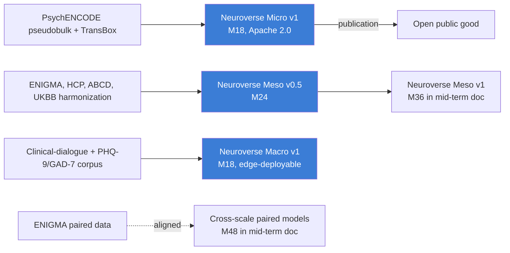

# Short-Term Plan (Years 1 to 2)

> **Status**: Active
> **Date**: 2026-07-10
> **Author**: @shahin
> **Audience**: leadership
> **Tags**: `strategy`
> **Variants**: Technical (this doc) - Readable (Obsidian twin optional, same filename) - Agent (n/a)

**Target window:** April 2026 to March 2028
**Companion to:** `02_horizons_and_bifurcation.md`, `11_technical_track_FMs.md`, `12_clinical_to_wearable.md`, `30_funding_strategy.md`
**Authoritative OKR cascade:** `02_Cytognosis_Phase1_Operational_Plan.md`. This document gives the strategic narrative; the OKR cascade gives the quarterly KRs. They must agree.

## What we ship in 24 months

By end of Year 2, Cytognosis Foundation has delivered:

- a parallel cellular and connectomic foundation-model stack with end-to-end multi-scale training capability, and at least one open release of each (Neuroverse Micro v1, Neuroverse Meso v0.5);
- the open-science substrate that wraps every release (Copier template, release-checklist CI, model + data + eval cards);
- a fielded wearable integration layer for Oura Ring 4, Muse S Athena, g.Nautilus, Emotiv Insight, with a working Phase 0 internal pilot on the core team;
- the three-layer privacy architecture for Cytonome v0.1 with a hard-coded crisis-detection module and zero raw-data egress;
- the macro LLM (≤3B params) that quantifies mental health states from conversation, deployed on-device;
- an established UK office (legal entity formed, first FTE hired) anchored on the Manchester autoimmune collaboration;
- the PBC subsidiary charter drafted and reviewed by counsel, plus the promise-of-future-equity plan documented;
- the Patient Advocacy Council charter ratified, seats filled, first two quarterly review cycles completed;
- $5 to 13M cumulative non-dilutive funding secured across Astera, Google.org Impact (if awarded), additional philanthropic, and early ARPA-H planning grants.

## Strategic posture

H1 strategic posture is **capital-restricted to time-restricted transition**. We are funding-constrained at the start; by end of Year 2, time becomes the binding constraint. Every Strategic Initiative carries a clear "what would happen if we slipped two quarters" answer, because that is the question the next funding round will ask.

All Year 1-2 outputs are pre-36m and **open by default** (Apache 2.0 for code and weights, CC BY 4.0 for documentation, CC0 for derived data where source licenses permit). No participant-level data leaves the Foundation. The Phase 0 internal pilot uses only consented core-team data and is released as an open public good with appropriate differential-privacy gating.

## What we focus on

The five strategic objectives carrying H1 (set in v1.1, refined in this plan):

| Objective | What it produces in Y1-Y2 |
|---|---|
| **SO-H1.1 · The Map** | Neuroverse Micro v1, Neuroverse Meso v0.5, Neuroverse Macro v1; cross-modal alignment subtrack initiated; Immunoverse v0 scoping (UK) |
| **SO-H1.2 · The Tracker** | Wearable integration layer; Phase 0 pilot complete; UBAP draft v0.1 circulating; Delphi LOI in flight |
| **SO-H1.3 · The Navigator** | Cytonome v0.1 on-device runtime; crisis-detection module hard-coded; long-term memory and voice interface in scope |
| **SO-H1.4 · Open Substrate** | Copier template v1.0, release-pipeline CI live, Helix Framework paper drafted |
| **SO-H1.5 · First Clinical Footprint** | IRB live; clinical partnerships signed (McLean, Mount Sinai, Manchester); LEAC and PAC operational; retrospective dimensional-vs-DSM evidence drafted |
| **SO-H1.6 · Helix Activation Readiness** | SAB stood up; UK office stood up; PBC charter drafted; first $5-13M secured |

## Detailed Y1-Y2 deliverables

### Cytoverse pillar (P1 · the Map)

**Neuroverse Micro v1 (`SI-Neuroverse-Micro` · M18 · Apache 2.0).** Per the technical-track design, the cellular foundation model is built end-to-end with a molecular foundation model rather than a frozen-dictionary embedding source. Concrete deliverable:

- pseudobulked PsychENCODE single-nucleus RNA-seq plus ATAC-seq, conditioned on TransBox semantic embeddings of cell type, tissue, and brain region;
- AlphaGenome (1bp, 1Mb) fine-tuned on the pseudobulked data, with cross-resolution attention blocks (per `11_technical_track_FMs.md`) that share information across scales;
- conditional flow matching layer that models the **residual** space (delta from healthy baseline) rather than absolute expression, so the model speaks the language of disease shifts from the start;
- public release on Hugging Face plus Zenodo, with full model card, data card, eval card, and release-checklist CI pass.

Performance gate: fine-tuned model outperforms off-the-shelf AlphaGenome on held-out cell types by ≥15% on cell-type-specific expression prediction; learned axes recover the Grotzinger 5-factor structure (Fréchet mean) and a jointly trained DSM classifier preserves ≥90% of label-supervised diagnostic information.

**Neuroverse Meso v0.5 (`SI-Neuroverse-Meso` · M24).** Connectomics foundation model on harmonized BIDS/FAIR data using the same building blocks (WaveGC for multi-resolution graph diffusion, AlphaGenome-style cross-resolution attention). Pre-training task is stratified subgraph masking. Yale dataset and Open Era's Y dataset (over 300 samples, harmonized) are the prototyping data; UK Biobank imaging subset is the scale-up. Architecture sharing with the cellular pillar is enforced through a shared infrastructure package (the "Lego pieces" decision from the 2026-05-07 architecture meeting). Final v1 release in mid-term document.

**Neuroverse Macro v1 (`SI-Neuroverse-Macro-LLM` · M18).** Fine-tuned ≤3B parameter LLM that maps clinical-dialogue and EHR-derived language into validated mental-health scales (PHQ-9, GAD-7, HiTOP factors, RDoC dimensions). Quantized to run on consumer phones for Cytonome v0.1. Sparse autoencoder interpretability track runs in parallel; SAEs publish features and their clinical-construct mapping by M15.

**Cross-modal alignment subtrack (T15, new in v2.0).** Initiated Y1; matures across Y2-Y3. Anchored on the Inclusion Study (Nature Human Behaviour 2025) and FRESH initiative (Nature Communications Biology 2025) public datasets, plus the internal core-team pilot (see `12_clinical_to_wearable.md`). The alignment subtrack is the prerequisite that lets H1 open data inform the H2 clinical study.

### Cytoscope pillar (P2 · the Tracker)

**Wearable integration layer (`SI-Cytoscope-Wearable-Integration` · M9-M12).** SDK integrations for Oura Ring 4, Muse S Athena, g.Nautilus (research-grade EEG), Emotiv Insight. Continuous, lossless, timestamped ingest. Coverage is intentionally broad-then-deep: cover four sensor modalities first, validate one against research-grade ground truth.

**Phase 0 internal pilot (`SI-Cytoscope-Wearable-Integration` continued · M12).** Core team of three to five wears all sensors daily for three months, with biweekly self-administered clinical scales. Data completeness ≥90%. Output: open public-good dataset under CC BY 4.0 with consent and DP gating, plus internal multimodal fusion model v0 trained on the Phase 0 data. This is the dress rehearsal for the external pilot in Year 2-3.

**UBAP draft v0.1 (`SI-UBAP-v1` · M18).** Universal Biosensor Adapter Protocol draft circulated to ARPA-H Delphi, the Caltech molecular-monitoring FRO, OpenBCI, and academic biosensor groups for feedback. Final v1.0 publication in mid-term document.

**Delphi LOI (`SI-Delphi-Collaboration` · M24).** Formal Letter of Intent or cooperative agreement with ARPA-H Delphi for personalized programmable biosensor panel design.

### Cytonome pillar (P3 · the Navigator)

**Three-layer privacy spec (`SI-Privacy-Architecture` · M12 · open protocol).** Documented architecture covering perception (on-device LLM), local compute (personal node), distributed storage (community blockchain-inspired layer), and external interaction (heavily encrypted, post-quantum embeddings to the Cytognosis training layer). External review by ≥2 qualified security researchers. Reference implementation Apache 2.0. See `16_patient_safety_architecture.md` for the full specification.

**Cytonome v0.1 on-device runtime (`SI-Cytonome-v0.1` · M18).** Quantized macro LLM running on iOS and Android reference devices at sub-second response latency. Hard-coded crisis-detection module surfaces 988 Suicide and Crisis Lifeline plus Crisis Text Line on detection; opt-in clinician alerting. Validated before any participant exposure. Zero raw-data egress verified by automated integration tests on every release.

**Long-term memory module (`SI-Memory-Module` · M24).** On-device episodic memory store with vector index, consolidated to semantic memory on schedule. Recall ≥80% at six-month lag in Phase 0 pilot. User-auditable: every stored item is viewable, editable, deletable in-app.

### Open-Science Substrate pillar (P4)

**Copier template v1.0 (`SI-OpenScience-Template` · M6).** Wraps every Cytognosis project in LinkML/BioLink schemas, RO-Crate profiles, SPDX license declarations, and W3C Web Annotation hooks. ≥3 Foundation projects use the template by M6.

**Release pipeline (`SI-Release-Pipeline` · M12).** CI job on every release repo runs the checklist: license, model card, data card, eval card, differential-privacy probe, re-identification probe. No release without checklist pass.

**Helix Framework paper draft (`SI-Helix-Paper` · M18).** Open commentary paper drafted, circulated to Astera, Convergent Research, and Speculative Technologies for co-signing invitation. Publishes Y2 Q4 to Y3 Q2.

### Clinical Translation pillar (P5)

**IRB and clinical infrastructure (`SI-Clinical-Infrastructure` · M3-M18).** Salus IRB contract live by M3; Phase 0 internal IRB by M9; Northstar IRB option also evaluated for retrospective analyses (per Patty meeting). Clinical partnership agreements signed with McLean Hospital (Brad Ruzicka subaward), Mount Sinai, and University of Manchester (Madhvi Menon, autoimmune) by M9.

**Lived Experience Advisory Council operational** by M18 (8 to 12 members across MDD, GAD, PTSD, SZ, BD), meeting quarterly.

**PAC charter ratified and seats filled** by M12 (see `21_patient_advocacy_council.md` for charter detail). Two quarterly review cycles completed by M24. Note: PAC and LEAC are distinct bodies with overlapping membership but different charters; PAC has binding rights at the bifurcation gate, LEAC advises on study design and accessibility.

### Organization and Helix pillar (P6)

**Scientific Advisory Board (`SI-SAB-Board-Expansion` · M6).** 5 to 7 members across HiTOP, ENIGMA, PsychENCODE, ARPA-H Delphi, Convergent FRO communities.

**UK office (`SI-UK-Office` · M12-M18).** UK legal entity formed by M12 (form per UK counsel: charity, CIO, or subsidiary). Manchester-area lease M15. First FTE M18.

**PBC subsidiary charter draft (`SI-PBC-Charter` · M24-M30).** Draft completed and reviewed by independent nonprofit and corporate counsel. Bylaws-aligned IP licensing terms documented. Promise-of-future-equity plan reviewed against IRS intermediate-sanctions rules.

**Phase 1 funding (`SI-Phase1-Funding` · continuous).** Y1 target $3-5M; Y2 target $5-8M; cumulative Y1-Y2 floor $8M. Source mix: Astera Residency, Google.org Impact (in review at compilation time, $2.2M ask), early ARPA-H planning grants, EA Fund, philanthropic partners. No quarter with under 12 months runway.

## Key risks for Y1-Y2

| Risk | Likelihood | Impact | Primary mitigation |
|---|---|---|---|
| Astera + Google.org both reject | Medium | High | Diversified Y1-Y2 pipeline (EA Fund, Convergent Research, philanthropic) keeps minimum runway. Continued reduction of burn until next decision point. |
| Cellular FM parallel build slips because Mango is bandwidth-limited | Medium | Medium | Confirmed at 2026-05-07 meeting: Shourya leads both tracks; Mango contributes as bandwidth allows. Shared infrastructure package keeps the work parallel rather than serial. |
| Phase 0 internal pilot shows no signal | Low | Medium | The pilot's primary value is engineering (data plumbing, sensor integration, on-device pipeline); scientific signal is exploratory. Failure narrows but does not collapse Y2 scope. |
| UK legal entity formation delayed | Medium | Medium | Start with US-only operation if delayed; UK office is value-add not block. Immunoverse v1 timing slips by one quarter per UK delay. |
| PBC charter blocked by counsel review | Low | Medium | Charter is drafted and vetted but not activated until Gate 1; review cycle has 18 months of slack. |
| Bifurcation policy is not Board-ratified by M24 | Low | High | Without it, PAC cannot operate at the gate; without PAC at the gate, Gate 1 fails. Ratify at M12 or earlier. |

## Notes from recent meetings

The Patty Purcell strategic-development meeting (2026-05-08) reaffirmed the high-level GPS-for-Health framing in plain language for funder audiences, and confirmed:

- the working title for the Astera proposal: "open multiscale dimensional map of human psychiatry" (alternate: "multimodal multiscale map of mental health states");
- a consulting role for Patty against the Astera proposal at approximately $300/hr, eight hours per week, included in the proposal budget for early payment;
- pet and infant cohorts as opportunistic early-market data sources, with cleaner consent pathways than adult-clinical data, and many psychiatric manifestations in dogs that map closely to human ones;
- the immediate Astera focus on the micro scale (genotype + single cell) for the first 18 months, the Google.org focus on meso (connectomics), and the cross-scale work commencing after M18.

The Cell-State / Perturbation Modeling meeting (2026-05-07) finalized:

- the parallel cellular + connectomic FM architecture with shared building blocks (WaveGC + AlphaGenome cross-resolution attention);
- the four-repository structure: `neurogenomics`, `neuroconnectomics`, `neurotranscriptomics`, `neurobehavior`;
- a shared, reusable infrastructure package within `neuroconnectomics` for the "Lego pieces" wavelet+transformer convolution layer;
- the prototyping data (Open Era's Y dataset, then Yale, then UK Biobank);
- the publication target: Nature Methods or Nature Machine Intelligence for the multi-scale infrastructure paper;
- Shourya leading both connectomics and cellular tracks given Mango's Meta start;
- a planned Mohammadi visit to Purdue at end of May or early June to white-board the three-to-six-month milestone plan.

## What graduates to mid-term (Years 3+)

- Neuroverse Meso v1 release (M36) and Cross-Scale Paired Models (M48) move to `04_mid_term_5to6y.md`.
- External 20-30 person pilot (M30) and ARPA-H PHO proposal (M54) move to mid-term.
- Causal recommendation engine, ontology-grounded passive sensing, post-quantum decentralized storage move to mid-term.
- The bifurcation marker itself (Year 4 quarter 1, M37) is the headline event of mid-term.
