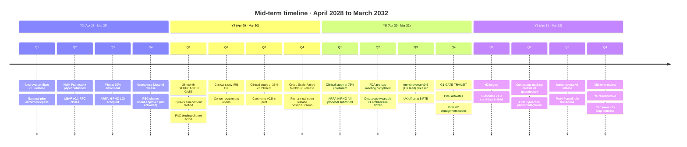

# Mid-Term Plan (Years 3 to 6)

**Target window:** April 2028 to March 2032
**Companion to:** `03_short_term_1to2y.md`, `05_long_term_10y.md`, `02_horizons_and_bifurcation.md`, `12_clinical_to_wearable.md`, `30_funding_strategy.md`

This is the period the strategic plan turns most visibly. The first half (Years 3 to early Year 4) finishes the open Cytoverse map and prepares the bifurcation. The second half (mid Year 4 onward) executes the bifurcation, runs the proprietary clinical study, drafts FDA pathways, and transits Gate 1 into Horizon 2.

## What we ship in this window

By end of Year 6, Cytognosis Foundation has delivered:

- **Cytoverse v1 across all three scales** in fully open form: Neuroverse Meso v1 (M36), Cross-Scale Paired Models (M48), Immunoverse v1 (M60), all with annual update cycles thereafter;
- **the 36-month bifurcation** ratified, applied, and operational in the workspace, with the open clinical map continuing to ship from the Foundation and the proprietary tracking layer accumulating in the PBC subsidiary;
- **the proprietary clinical study** running: 12 months of multimodal data collection on a consented cohort, paired clinical-grade and wearable-grade sensors on the same individuals, designed to learn the clinical-to-wearable alignment that powers the Year 7+ continuous tracking product;
- **the external 20 to 30 person pilot** completed (M30) and the ARPA-H PHO follow-on proposal submitted (M54);
- **FDA Digital Health Center of Excellence pre-submission** complete, regulatory pathway identified, biomarker qualification track engaged;
- **Cytonome v1.0 candidate** with bidirectional voice interface, ontology-grounded passive sensing, and the personalized causal recommendation engine (defensive, corrective, supportive);
- **Universal Biosensor Adapter Protocol v1.0** published and adopted by ≥2 external biosensor groups;
- **PBC subsidiary activated at Gate 1** with promise-of-future-equity vested, people-as-seed-funders mechanism live, first VC raise opening or closed;
- **UK office at scale** (≥5 FTE, independent grant pipeline, lead on Immunoverse), and the Patient Advocacy Council operating across both entities at full charter capacity.

## The headline of mid-term: the bifurcation event

The bifurcation is a single, dated act of the Foundation Board, supported by the Patient Advocacy Council. It happens at the start of the proprietary clinical study, target M37. Before it, no participant-level continuous tracking data exists; after it, every consent form is structured for the dual-ownership Helix.

## Strategic Objectives covering mid-term

Mid-term is the meeting point of the H1 closing objectives and the H2 opening objectives. Both sets are active simultaneously through the bifurcation event.

### H1 closing (carries into Year 5)

- **SO-H1.1 · The Map** (closes with Cross-Scale Paired Models v1 and Immunoverse v1)
- **SO-H1.2 · The Tracker** (closes with UBAP v1.0 publication and Delphi cooperative agreement)
- **SO-H1.5 · First Clinical Footprint** (closes with ARPA-H PHO submission and FDA pre-sub completion)
- **SO-H1.6 · Helix Activation Readiness** (closes with G1 gate pack assembled)

### H2 opening (begins in Year 5)

- **SO-H2.1 · First regulated product.** FDA De Novo or 510(k) pathway selected; Cytoscope or Cytonome clinical module on regulatory critical path.
- **SO-H2.2 · Scale deployment.** First field-deployed continuous-tracking cohort beyond clinical study; federated learning at scale architecture validated.
- **SO-H2.3 · Ecosystem ignition.** UBAP v2 in flight; multiple third-party sensor implementations live; academic re-use of substrate accelerating.
- **SO-H2.4 · PBC operational.** PBC raising VC on royalties-back-to-Foundation model; promise-of-future-equity vested.

## The proprietary clinical study (Year 4 to Year 5)

The clinical study is the centerpiece of the bifurcation. Its design directly determines whether the H2 product is feasible.

### Study purpose

- Collect 12 months of paired clinical and wearable multimodal data on the same individuals.
- Train clinical-to-wearable alignment models that translate the expensive, episodic ground truth (fMRI, clinical-grade EEG, full clinical assessments) into the inexpensive, continuous wearable stream (fNIRS, consumer EEG, wearable physiology, conversation).
- Produce the first proprietary asset that justifies the PBC and the VC raise at Gate 1.

### Study modality pairing

| Clinical-grade modality (episodic) | Wearable modality (continuous) | Alignment model produced |
|---|---|---|
| fMRI (BOLD, resting-state and task) | fNIRS (consumer headset, e.g., Kernel, OpenBCI Galea) | Hemodynamic translation model |
| Research-grade EEG (e.g., g.Nautilus 64-channel) | Consumer EEG (Muse S Athena, Emotiv Insight) | Channel reduction model |
| Clinical interview + structured scales (PHQ-9, GAD-7, etc.) | LLM-derived passive conversational tracking | Macro-axis projection model |
| Clinical wet-lab molecular markers (cytokines, autoantibodies, neuroinflammation panel) | Wearable proxies (HRV, sleep, activity, glucose where appropriate) | Inflammation-state proxy model |
| Clinical examination (gait, motor, neuro) | Wearable physiology (Oura, Apple Watch, ambient) | Motor and physiological signature |
| Genome (WGS at baseline) | n/a, baseline only | Personalization prior |

### Cohort design

- **Size.** Target 200 participants across MDD, GAD, PTSD, SZ, BD, OCD, neurotypical controls, with an oversample of the 500+ neurodiverse cohort already identified (per Patty meeting) for adjacent recruitment.
- **Duration.** 12 months continuous wearable plus monthly clinical assessment plus quarterly fMRI and clinical-grade EEG.
- **Equity.** Stratified for skin tone, hair characteristics, age, gender, and socioeconomic status because fNIRS signal quality varies systematically with hair and skin (Inclusion Study, Nature Human Behaviour 2025); the alignment model is only valid if its training distribution covers the deployment distribution.
- **Consent structure.** Bifurcation-aware: participants consent to both Foundation use of derived insights (aggregated, DP-bounded) and PBC use of individual-level continuous data, with separate granular controls for each.
- **PAC sign-off.** Patient Advocacy Council reviews and approves the protocol before IRB submission.

### Pre-study Y1-Y3 prep (in `12_clinical_to_wearable.md`)

The clinical study at Year 4 is not the first time we are doing alignment work. We have done two preparatory passes:

- **Public-data pass (Y1-Y2).** Inclusion Study (OpenNeuro ds006377) and FRESH initiative (OSF b4wck) datasets for fNIRS reproducibility and signal-quality modeling.
- **Internal core-team pilot (Y2-Y3).** Consented core team wears research headsets (fNIRS + EEG) and undergoes initial clinical fMRI + EEG. Calibration and modeling phase 1.

By Year 4, the alignment models exist as priors; the clinical study refines them with cohort-scale data.

## Cross-references for mid-term decisions

- The bifurcation rule and IP boundary: `02_horizons_and_bifurcation.md`, `23_open_science_and_ip.md`.
- The full clinical-to-wearable alignment plan: `12_clinical_to_wearable.md`.
- The PAC charter and its role at the bifurcation: `21_patient_advocacy_council.md`.
- The FM technical architecture that powers the open releases through Year 6: `11_technical_track_FMs.md`.
- The funding pipeline through Year 6: `30_funding_strategy.md`.
- Risk register update for mid-term: `41_risks_and_mitigations.md`.

## Key mid-term decisions and their dates

| Decision | Target date | Owner | Backup plan if delayed |
|---|---|---|---|
| Bifurcation policy ratified by Board | M30 (Y3 Q3) | Board, advised by counsel | Hold ratification but begin operating under provisional policy from M30 with explicit Board-directed risk acceptance |
| PAC charter binding | M24 (Y2 Q4) | CEO + counsel | Operate PAC as advisory until charter binding; document advisory→binding transition |
| Clinical study IRB live | M40 (Y4 Q2) | CSO + Salus or Northstar IRB | Single-site (McLean) start while multi-site agreements complete |
| ARPA-H PHO submission | M54 (Y5 Q1) | CEO + Grants | NIH R01 + Wellcome Leap as portfolio insurance |
| FDA pre-sub meeting | M48 (Y4 Q4) | Regulatory lead (hire by Y3 Q4) | Push to Y5 Q1; the gate criterion is identification of pathway, not pre-sub timing alone |
| Cytoscope wearable v1 architecture freeze | M55 (Y5 Q2) | CTO (hire by Y3 Q2) | Continue partner-first sensor strategy through Y6 if architecture not frozen |
| PBC activation | M60 (Y5 Q4) | Board + counsel | Hold at activation-ready until first VC commitment in writing |
| Cytonome v1.0 candidate | M65 (Y6 Q1) | CTO + Engineering lead | Cytonome v0.9 with reduced scope; defer voice or memory module |

## Funding mid-term

| Year | Target | Primary sources |
|---|---|---|
| Y3 | $8 to 12M | ARPA-H planning grant; first UK grant (UKRI, Wellcome); EA Fund; corporate philanthropy |
| Y4 | $8 to 15M | ARPA-H PHO if awarded; NIH R01 if awarded; UK MRC; first VC engagement (PBC, not Foundation, post-Gate-1) |
| Y5 | $5 to 10M (Foundation) + first VC tranche (PBC) | Bridge to PBC activation; PBC first round target $25-50M |
| Y6 | $5 to 10M (Foundation) | PBC scaling round; Foundation continues non-dilutive operations |

## What graduates to long-term (Years 7+)

- Cytonome v1.0 production and FDA clearance (de Novo or 510(k));
- Cytoscope wearable v1 fielded at scale (≥10K devices);
- Federated learning at production scale with formal differential-privacy budget accounting;
- Regional sister organization scoping (LATAM, EU outside UK, Africa, Southeast Asia);
- Substrate handoff planning for Year 15.

These move to `05_long_term_10y.md`.
