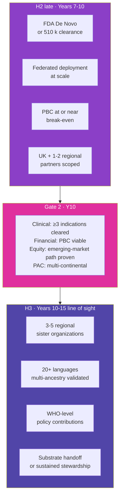

# Long-Term Plan (Years 7 to 10, with line-of-sight to Year 15)

> **Status**: Active
> **Date**: 2026-07-10
> **Author**: @shahin
> **Audience**: leadership
> **Tags**: `strategy`
> **Variants**: Technical (this doc) - Readable (Obsidian twin optional, same filename) - Agent (n/a)

**Target window:** April 2032 to March 2036, with strategic line of sight to 2041
**Companion to:** `04_mid_term_5to6y.md`, `02_horizons_and_bifurcation.md`, `20_organization_helix.md`

The long-term plan covers the second half of Horizon 2 (clinical and commercialization) and the opening of Horizon 3 (globalization). The plan stays high-level for years beyond the next decade, since the relevant uncertainty about regulatory, geopolitical, and scientific developments grows large past Year 10. The intent is to set direction and decision criteria, not commitments.

## What we expect to be true by end of Year 10

- **Cytonome regulated product on the market** with an FDA De Novo or 510(k) clearance for at least one disease-detection claim, plus a general-wellness registration covering lifestyle biomarkers as the broader funnel.
- **Cytoscope wearable v1** in market with ≥10,000 active devices, post-market surveillance running.
- **Cytoverse map at clinical-grade across ≥5 indications** in the open Foundation track, with annual major releases continuing per the bifurcation policy.
- **PBC subsidiary at or near operational break-even**, financing core engineering and continuous data operations from product revenue plus VC.
- **Foundation operations sustained** by perpetual royalty stream from the PBC plus continuing non-dilutive sources (philanthropic, federal, regional foundations), independent of further philanthropic catalytic capital.
- **Patient Advocacy Council expanded multi-continentally** with seats from each region we operate in, binding rights at every annual release decision.
- **Federated learning at scale** with ≥50,000 participating devices, formal differential-privacy budget accounting, and zero re-identification incidents on the public probe set.
- **Net Promoter Score ≥50** across active users, disaggregated by age, income, race, and region with no demographic subgroup below 30.

## Headline diagram

## Long-term strategic objectives

Inherited from H2 and H3 in the strategic roadmap, refined here.

### H2 closing (Years 7 to 10)

- **SO-H2.1 · First regulated product.** FDA clearance for the first Cytonome-powered or Cytoscope-powered product. Single most consequential commercial milestone of the decade.
- **SO-H2.2 · Scale deployment.** ≥10,000 federated devices in the field with post-market surveillance live; UBAP v2+ adopted by ≥5 third-party biosensor partners.
- **SO-H2.3 · Ecosystem ignition.** Open substrate adopted in academic curricula, replicate-and-extend studies, and at least one independent open derivative platform.
- **SO-H2.4 · PBC operational.** PBC raising follow-on rounds at terms that preserve the Helix structure; royalty stream to Foundation funding core mission operations.

### H3 opening (Years 10 to 15, line of sight)

- **SO-H3.1 · Regional sister organizations.** 3 to 5 regional entities (LATAM, EU, Africa, SE Asia) federated to the Foundation, each independently governed and locally trusted.
- **SO-H3.2 · Multilingual, multi-regional.** 20+ languages supported in Cytonome; regulatory clearance in ≥5 jurisdictions; multi-ancestry validation completed for the open map.
- **SO-H3.3 · Policy and standards leadership.** WHO-level policy contributions; de-facto interoperability standards adopted; UBAP recognized as the open standard for individualized biosensor integration.
- **SO-H3.4 · Substrate handoff.** Open substrate and core IP transitioned to a multi-stakeholder steward; Foundation continues as one of several stewards or sunsets per Bylaws Article XIII review.

## Long-term programs

### Cytoverse at clinical-grade scale

By Year 10, the open map covers ≥5 indications: neuropsychiatric (the original pilot, plus expansion to mood, anxiety, psychotic, attention, autism axes), neurodegenerative (MCI to AD; Parkinson's), autoimmune transdiagnostic (UK-led: SLE, RA, Crohn's, MS, psoriasis), metabolic (extending the CGM revolution beyond glucose), cardiovascular (with at least one partnership covering CV biomarker integration). Annual release cadence carries through this expansion.

### Cytoscope multi-modal sensor ecosystem

By Year 10, Cytoscope has graduated from off-the-shelf integration to a programmable multi-analyte platform, co-developed through the ARPA-H Delphi collaboration or its successor and through the Caltech molecular-monitoring FRO. Targets: 10 to 20 analytes simultaneously, programmable post-manufacturing, consumer pricing band ≤$200/device annual subscription model akin to OpenAI/Claude consumer plans but tied to health monitoring. Subscription replaces unit purchase as the dominant revenue model.

### Cytonome consumer product

By Year 10, Cytonome v2.x is the consumer-grade product. Bidirectional voice interface with sub-500ms latency. Long-term memory with user-auditable storage. Personalized causal recommendation in the three-mode framework: defensive (avoid), corrective (reverse), supportive (cope). Crisis-detection module continuously updated as standard of care evolves. Edge-first; raw data never leaves device; aggregated insights flow back through the four-tier compute architecture (perception, local, distributed, Cytognosis layer) only with explicit user consent and DP budget accounting.

### Federated learning at scale

By Year 10, federated learning runs across ≥50,000 devices with formal differential-privacy budget accounting at the device level. The substrate is post-quantum-safe end-to-end (NIST PQC compliant). Aggregation runs over encrypted embeddings only; training data stays on device. The federated architecture is what lets the open Cytoverse map continue improving from real-world distribution shift without violating the bifurcation rule (proprietary individual data stays proprietary; aggregated, consented, DP-bounded insights flow to the open map).

### Regional federation (H3 opening)

Years 10 to 15 line-of-sight: regional sister organizations (LATAM, EU outside UK, Africa, SE Asia, possibly East Asia) each:

- governed by a local board with local stakeholders;
- operating in local languages with locally validated cohorts and locally appropriate sensors;
- licensing the Cytoverse map and the UBAP standard from the Foundation;
- supported by regional philanthropic funding (Gates, Wellcome, regional foundations);
- focused on emerging-market access, where subsidy or low-cost sensor variants are the binding requirement.

The federation model resists the colonial-research pattern of large-Western-institution-extracts-from-low-resource-region. Regional entities are not branches; they are sovereign peers in a federation with shared infrastructure.

### WHO and standards work

Years 8+: explicit policy track. UBAP submitted to relevant standards bodies as a recommended practice. Cytognosis contributes to WHO digital health and AI-in-health policy work. The open map is positioned as international scientific infrastructure, accessible across regulatory regimes.

## Long-term financial picture

| Year | Foundation target | PBC target | Combined notes |
|---|---|---|---|
| Y7 | $5-10M non-dilutive | First major scaling round (Series B equivalent) | PBC funds engineering and continuous data ops |
| Y8 | $5-10M | Same | Foundation expands UK office; regional scoping starts |
| Y9 | $5-10M plus growing royalty | Series C target | Royalty stream becomes material |
| Y10 | $5-15M plus royalty | Approaching break-even | Gate 2 pack assembled |
| Y11-Y15 | Stable mission funding | Self-sustaining | Regional federation funded by mix of regional philanthropy and Foundation pass-through |

The Foundation does not raise from VCs at any point. The PBC raises VC under terms that preserve Helix governance. Royalty mechanics are documented in `23_open_science_and_ip.md`.

## Long-term hiring and footprint

| Phase | US HQ (SSF) | UK office (Manchester) | Regional partners | Total |
|---|---|---|---|---|
| End Y7 | 25 to 35 | 8 to 12 | 0 to 1 scoping engagements | 35 to 50 |
| End Y10 | 50 to 100 (incl. PBC engineering) | 20 to 40 | 1 to 2 active partnerships | 70 to 140 |
| End Y15 | Coordinator role | Peer regional org | 3 to 5 sister orgs | Federation |

The H2 to H3 transition shrinks the central headcount as regional capacity grows. By Year 15 the Foundation is primarily a coordinator and standards body, not a research operator at the same scale. This is intentional: the mission is met when the work is happening everywhere, not when it is happening centrally.

## Risks that bind the long-term plan

| Risk | Likelihood | Impact | Mitigation |
|---|---|---|---|
| FDA pathway changes mid-program (e.g., new AI/ML guidance) | Medium | Catastrophic | Continuous engagement with FDA DHCE from Y2; regulatory team in-house by Y4; pivot agility built into product architecture |
| PBC mission drift after VC entry | Medium | Catastrophic | Bylaws Articles VI and XI; board composition requirements; people-as-seed-funders alignment; PAC binding rights |
| Privacy incident at scale | Low | Catastrophic | Edge-first architecture; DP probes on every release; zero raw-data egress SLO; post-quantum substrate; bug bounty program by Y6 |
| Regional partnerships fail to develop | Medium | High | Federation is gradual; if regional partners do not emerge, Foundation continues central operation longer with explicit equity-of-access mitigation (subsidy program, open-source clones) |
| Ecosystem alternative emerges | Medium | High | UBAP and the open map make us the open standard; commercial differentiation is at the navigator and continuous tracking layer, not at the open map layer |
| Talent attrition as PBC matures | Medium | High | Promise-of-future-equity vests over Y5-Y10; Foundation career path remains viable through perpetual mission |
| Climate or geopolitical disruption affecting US or UK base | Medium | High | Regional federation creates structural resilience; no single jurisdiction holds all the operating capacity |

## Cross-references

- The Foundation-PBC governance and IP-licensing terms that fund this entire arc: `20_organization_helix.md` and `23_open_science_and_ip.md`.
- The PAC role that grows multi-continental in this period: `21_patient_advocacy_council.md`.
- The full milestone map across all horizons: `40_milestones_and_kpis.md`.
- The risk register in detail: `41_risks_and_mitigations.md`.
