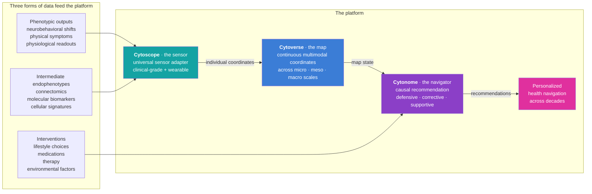
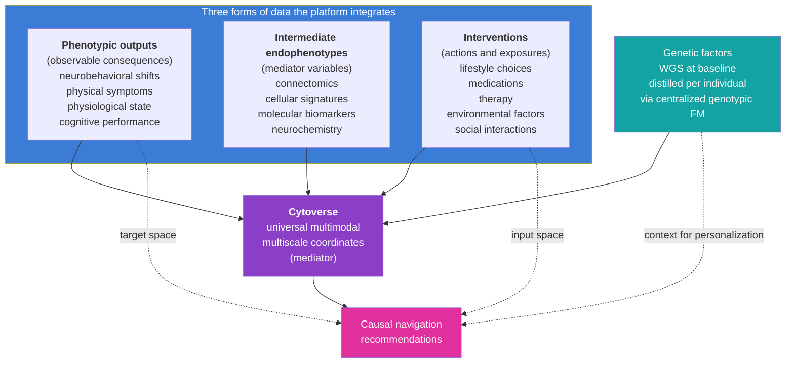

# Platform Architecture: GPS for Health

**Companion to:** `11_technical_track_FMs.md`, `13_sensor_ecosystem.md`, `14_navigation_recommendations.md`, `15_app_design.md`, `16_patient_safety_architecture.md`

The Cytognosis Platform is what we build. It has three components, in plain language: a **map** (Cytoverse), a **sensor** (Cytoscope), and a **navigator** (Cytonome). Together they are GPS for Human Health. Everything else in the plan, scientific bets, organizational design, funding structure, exists to make this platform real and to make it serve the mission.

## The integrated picture

The diagram looks like a simple pipeline. The reality is bidirectional and continuous: sensors stream into the map, the map updates each individual's coordinates in real time, the navigator reads coordinates and produces recommendations, the recommendations become interventions, the interventions are themselves logged data that feeds the next cycle.

## Cytoverse: the map

| | |
|---|---|
| **Role** | AI health mapping system |
| **Output** | Continuous, multimodal coordinates across micro, meso, and macro biological scales for any individual |
| **Foundation pillars used** | P1 (Cytoverse) primary; P4 (Open-Science Substrate) as the substrate it ships on |
| **Bifurcation status** | Pre-36m and post-36m **OPEN**. Foundation perpetually owns. Annual major releases. |
| **Pilot indication** | Mental health (neuropsychiatric transdiagnostic) |

Cytoverse replaces categorical disease labels (depressed / not depressed) with continuous health coordinates analogous to latitude and longitude in GPS. At every scale, it learns axes that explain variation across individuals, and it does so jointly across scales rather than sequentially.

The three biological scales:

| Scale | Near-term modality (research-grade) | Long-term modality (wearable / continuous) |
|---|---|---|
| **Micro** | Genomic (WGS) plus single-cell transcriptomics and epigenomics | Circulating cell-free molecular signatures via Cytoscope biosensors |
| **Meso** | Neuroimaging (fMRI, structural MRI, dMRI, PET) | Wearable neuro-monitoring (consumer EEG, fNIRS) |
| **Macro** | LLM-derived phenotypic assessment plus EHR | Wearable physiology plus passive ambient sensing |

Concrete H1 deliverables across the three scales are detailed in `03_short_term_1to2y.md` and `04_mid_term_5to6y.md`. The technical architecture, including the parallel cellular and connectomic foundation models with shared building blocks, is in `11_technical_track_FMs.md`.

The central scientific bet: cross-scale paired modeling lets inexpensive, always-on signals (wearable) stand in for expensive, episodic ground truth (clinical). This is the "cross-modal imputation" premise that powers the H2 product, and it is what the Year 4 to Year 5 clinical study is designed to validate against the proprietary continuous dataset.

## Cytoscope: the sensor

| | |
|---|---|
| **Role** | Programmable, universal sensor layer that triangulates individual coordinates on the Cytoverse map |
| **Output** | Continuous, multivariate biological data across molecular, connectomic, and phenotypic modalities |
| **Foundation pillars used** | P2 (Cytoscope) primary; P5 (Clinical Translation) for hardware regulatory; P4 for the open UBAP standard |
| **Bifurcation status** | **Mixed**. The UBAP open spec is permanent open property. Cytoscope hardware lineage from Y4 onward is proprietary, owned by the PBC. Hardware design that is published or co-developed with open partners (Delphi, Caltech FRO) follows partner-specific licensing. |
| **Architecture** | Plug-in ecosystem. Any sensor that implements UBAP can feed into the navigator. |

Cytoscope is not one device. It is a universal interface plus a specific lineage of hardware that we develop directly or co-develop with partners.

The full spec of the universal sensor adapter, what counts as a sensor, how plug-ins are certified, and how the open standard relates to the proprietary hardware, is in `13_sensor_ecosystem.md`. The headline:

- **Sensors are categorized by biology** (molecular, connectomic, phenotypic), not by physical form.
- Each category has both **clinical/episodic** and **wearable/continuous** members.
- The interface is open; the standard is owned by the Foundation; specific hardware implementations may be open or proprietary depending on the partner.

This design lets companies, labs, hospitals, and academic groups build plug-ins that bring their signals into our 360-degree health picture without giving us their raw data, while still allowing the navigator to use those signals as intermediate state for causal prediction of health outcomes.

## Cytonome: the navigator

| | |
|---|---|
| **Role** | Privacy-first edge AI that converts real-time coordinates into causally grounded recommendations |
| **Output** | Personalized recommendations in three modes: defensive, corrective, supportive |
| **Foundation pillars used** | P3 (Cytonome) primary; P6 (Helix) for the privacy and safety substrate |
| **Bifurcation status** | **Mixed**. Pre-36m components (privacy spec, three-layer architecture, on-device runtime, crisis detection, voice interface, memory module, ontology-grounded passive sensing) are open. Post-36m proprietary components (continuous personal causal model trained on the proprietary continuous dataset; navigation policy informed by continuous tracking) are PBC. |
| **Compute** | Four-tier: perception layer (phone), local layer (personal node), distributed layer (community substrate), Cytognosis layer (central training and discovery). |

Cytonome is the consumer-facing component. Most users will experience the platform through it: as a guardian-coach app on their phone that knows their history, tracks their state, and helps them navigate their health day to day.

The recommendation framework, defensive (avoid), corrective (reverse), supportive (cope), is the canonical taxonomy across the entire plan. Detail in `14_navigation_recommendations.md`. The app design, including sections for sensors, interventions, patient care, clinical trials, and patient communities, is in `15_app_design.md`. The four-tier compute and patient-safety architecture is in `16_patient_safety_architecture.md`.

## The supporting pillars

Cytoverse, Cytoscope, and Cytonome are the three core pillars (P1, P2, P3). Three supporting pillars make them durable, deployable, and trustworthy.

| Pillar | Function | Relationship to platform |
|---|---|---|
| **P4 · Open-Science Substrate** | Schemas, licenses, templates, dataset packaging, model cards, governance protocols | Enforces openness across all three core pillars; CI release pipeline gates every public artifact |
| **P5 · Clinical Translation** | IRB infrastructure, regulatory strategy, clinical partnerships, trial design, evidence | Carries the platform across the regulatory boundary at Gate 1 and Gate 2 |
| **P6 · Organization and Helix** | Foundation + PBC structure, talent, finance, US + UK + regional federation, governance, PAC | Carries the mission, makes the bifurcation work, ensures equity of access |

All six pillars work simultaneously across all three horizons. Their relative emphasis shifts: H1 weights P1 and P4 most heavily; H2 weights P2, P3, P5; H3 weights P6 (regional federation) and P4 (substrate handoff).

## Three forms of data, one foundation model

The model integrates three forms of data, each with its own role:

The Cytoverse map acts as the **mediator variable** in the causal chain from interventions and genetic factors to clinically and personally relevant outcomes. This mediator role is what makes the navigation recommendations causal rather than associational, and it is what makes counterfactual estimation possible: with the map fixed as a state representation, we can ask "what would happen to this person if they took this intervention given this genotype and this current state?"

## Why the architecture is what it is

Several architectural decisions are answers to specific failures of existing systems:

- **Continuous coordinates instead of categorical labels.** Categorical diagnoses collapse heterogeneity. Continuous coordinates preserve it and let us see the early shifts that categorical labels cannot.
- **Multi-scale coupling.** Single-scale models miss cross-scale invariants. By pairing micro, meso, and macro through end-to-end training, we capture what each scale alone cannot.
- **Edge-first compute.** Every cloud-based health platform faces the trust ceiling at scale. Edge-first puts the most sensitive inference where the data already lives, the user's device.
- **Open map plus proprietary navigator.** A single closed platform cannot win the trust of a global mission. A single fully-open platform cannot fund the engineering and continuous data work needed to keep the navigator current. The bifurcation is the deliberate compromise that gets both.
- **Universal sensor interface.** Locking in to one sensor vendor or one biology is the failure mode of nearly every health-tech company that came before us. UBAP says: the platform is the standard, not the device.
- **Patient Advocacy Council with binding rights.** Every previous attempt at participant-centered health tech put participants on advisory committees with no veto. The PAC has veto on participant-impacting decisions because care is one of our values, not a slogan.

## Cross-references

The deep technical implementation is in `11_technical_track_FMs.md`. The clinical-to-wearable alignment is in `12_clinical_to_wearable.md`. The sensor ecosystem detail is in `13_sensor_ecosystem.md`. The navigation framework is in `14_navigation_recommendations.md`. The app, four-tier compute, and patient safety are in `15_app_design.md` and `16_patient_safety_architecture.md`. The organizational structure that funds and governs all of this is in `20_organization_helix.md` and `21_patient_advocacy_council.md`.
