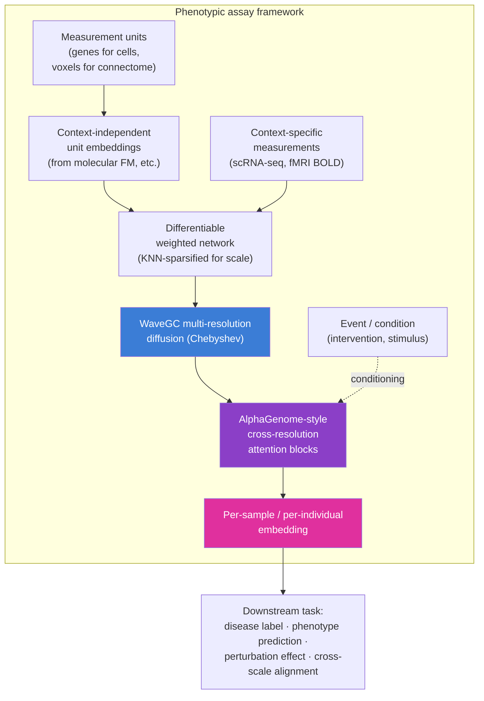
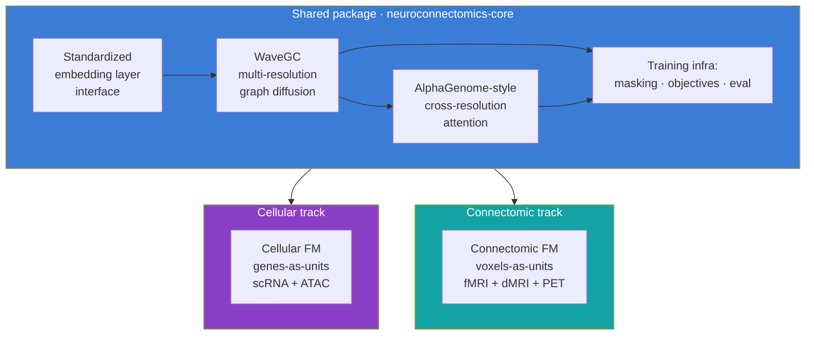
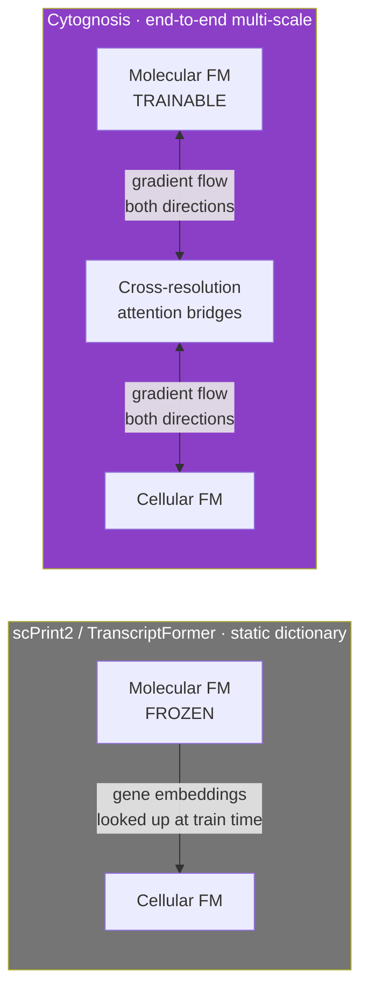

# Technical Track: Parallel Cellular and Connectomic Foundation Models

**Companion to:** `10_platform_architecture.md`, `12_clinical_to_wearable.md`, `appendix/A_cell_state_meeting_synthesis.md`
**Source meeting:** Cell-State / Perturbation Modeling, 2026-05-07 (Shourya Verma, Mango Wang, Nadia Atallah Lanman, Ananth Grama, Shahin Mohammadi)

This document captures the architectural decisions for the Cytoverse foundation-model stack. It is the most technically detailed document in the master plan. Engineering reviewers, methods reviewers, and grant reviewers asking about scientific approach should start here.

## Headline architectural decision

Build cellular and connectomic foundation models **in parallel**, sharing the same architectural building blocks but operating at two different biological scales. The Purdue team and Mohammadi confirmed this on 2026-05-07. Shourya Verma leads both tracks given Mango's transition to Meta. Mango contributes as bandwidth allows.

The shared building blocks:

- **Multi-resolution graph diffusion** using components from WaveGC (Wave Graph Convolution).
- **Cross-resolution information sharing** using interconnected transformer blocks introduced in AlphaGenome.
- **Multi-scale nested foundation models** with the molecular FM trained end-to-end with the cellular FM, not used as a frozen dictionary.
- **Conditional flow matching for residuals**, modeling disease as a delta from healthy baseline rather than absolute state.

## The general framework

The same framework applies at two scales:

| Element | Cellular FM | Connectomic FM |
|---|---|---|
| **Measurement units** | Genes | Voxels (anatomical bins, similar to epigenome bins) |
| **Unit embedding source** | Molecular FM (e.g., AlphaGenome, ESM, EVO2) | Spatial / anatomical embedding |
| **Context-specific signal** | Single-cell or pseudobulk RNA-seq, ATAC-seq | fMRI BOLD, dMRI tractography, PET |
| **Event / conditioning** | Cell type, tissue, treatment, disease | Stimulus, task, resting-state, condition |
| **Network construction** | All-pairs (genes are countable) or KNN | KNN sparsified (voxels are not) |
| **Pre-training task** | Masked unit prediction; perturbation prediction | Stratified subgraph masking (e.g., predict amygdala or hippocampus activity from rest of brain) |
| **Prototyping data** | PsychENCODE pseudobulk | Open Era Y dataset (~300 samples), then Yale, then UK Biobank |
| **Lead** | Shourya (lead), Mango (contributor), Mohammadi (advisor) | Shourya (lead), Mohammadi (advisor) |
| **Repository** | `neurogenomics`, `neurotranscriptomics` | `neuroconnectomics` |

## Why WaveGC and why AlphaGenome blocks

### WaveGC for multi-resolution

WaveGC defines wavelet atoms and bases for signal projection on graphs using efficient Chebyshev approximations to avoid matrix factorization. It produces a multi-resolution decomposition: for each scale, a vector representation of the signal at that scale. This matches our scientific need: biology operates at multiple scales (gene to pathway to cell type; voxel to region to network), and forcing a single-resolution representation discards information.

The known weakness of WaveGC: each scale operates independently. The MLP block that processes resolutions does not share information across scales. This is exactly the limitation we replace.

### AlphaGenome cross-resolution attention

AlphaGenome's interconnected transformer blocks structure information sharing **across** scales. Each block represents a scale, and attention across blocks lets the model decide, for each unit and each context, which scales matter and how they combine. We adopt this pattern as the replacement for WaveGC's MLP block.

The result is a multi-resolution network with explicit cross-resolution information transfer. Cell biology and brain biology both have this property: pathway-level patterns inform gene-level prediction, region-level patterns inform voxel-level prediction. The model captures both.

## The "Lego pieces" infrastructure layer

A core decision from the 2026-05-07 meeting: the multi-resolution wavelet plus cross-scale attention layer is implemented as a **standalone reusable package** inside the `neuroconnectomics` repo, but used by both connectomic and cellular tracks. Mohammadi referred to this as "Lego pieces": wrapped, standardized interfaces declaring inputs and outputs so models can be mixed and matched without manual rewiring.

This is what makes parallel development tractable. Both tracks consume the same package; both tracks contribute back to the same package; benchmarks at the package level apply to both. When one track finds a bug or improvement, both tracks benefit.

## Multi-scale nested foundation models

The most consequential design choice in the cellular FM, and the one that distinguishes our work from scPrint2 and TranscriptFormer.

### How scPrint2 and TranscriptFormer use molecular FMs

Both treat a molecular foundation model (e.g., ESM for protein sequences, AlphaGenome for genomic sequences) as a **frozen dictionary**: gene embeddings are looked up at training time, but the molecular FM is never updated. This is computationally cheap and decouples the molecular and cellular layers, but it has structural costs:

- the molecular embeddings cannot adapt to cellular context;
- the cellular FM cannot push gradient signal back into the molecular layer to learn what aspects of molecular identity matter for which cellular phenomena;
- end-to-end training across molecular and cellular scales is impossible;
- multi-scale phenomena (a missense variant changes protein folding which changes cellular network behavior) cannot be modeled jointly.

### How we do it differently

The molecular FM is a **trainable component** of the cellular FM, connected through the cross-resolution attention blocks. The metric space induced by molecular embeddings, together with appropriate kernels, defines the molecular graph that acts on the context-specific cellular signal. Gradient flows end-to-end through both scales. The molecular FM at the start of training resembles the published model (e.g., AlphaGenome); after fine-tuning, the molecular layer has learned cellular-context-aware representations.

This is more expensive computationally. It is also fundamentally what gives us the cross-scale modeling capability that the static-dictionary approach forecloses. The Astera proposal funds this approach explicitly because it is a research bet that scPrint2 and TranscriptFormer cannot make.

## Conditional flow matching of the residual space

The third architectural decision: model the **residual space** rather than the baseline.

### Why residuals

In every layer of biology, the disease shift is a sparse perturbation on a much larger healthy baseline. If we model the absolute state, the model spends most of its capacity learning healthy biology and very little on disease shifts. If we model the residual (the delta from healthy baseline), the entire model capacity goes to the signal that matters for disease detection and intercept.

Individual genomic variation is **already** a residual concept: each genome differs from the reference at specific positions. Differential expression is the residual concept at the cellular layer. Disease-axis shifts in connectomic data are the residual concept at the connectomic layer. By converging the entire stack to the language of residuals, we make all layers and scales speak the same language.

### Conditional flow matching

We use conditional flow matching (CFM), a class of generative models that learn to create the residual embeddings from noise, conditioned on health-state context. The model produces counterfactual cells (or counterfactual brains, or counterfactual phenotypes) that are as close as possible to the original observation when run through the corresponding decoder, measured against population distance metrics like Maximum Mean Discrepancy (MMD).

This gives us:

- a generative tool for synthesizing health-state counterfactuals (what would this cell look like under intervention X?);
- a principled way to evaluate the quality of disease-axis discovery (do generated counterfactuals match observed perturbations?);
- a unified language for cross-scale residual modeling.

## The four repositories

Decision from the 2026-05-07 meeting:

| Repository | Scope | Lead |
|---|---|---|
| `neurogenomics` | Genome-level work: WGS, GWAS-style, polygenic scoring, baseline molecular FM fine-tuning | Mohammadi (initial), AI/ML hire |
| `neuroconnectomics` | Connectomic FM, voxel-level work, multimodal imaging integration. **Hosts the shared `neuroconnectomics-core` Lego-pieces package.** | Shourya Verma |
| `neurotranscriptomics` | Cellular FM, single-cell + pseudobulk, multi-scale molecular-to-cellular work | Shourya Verma + Mango (when bandwidth allows) + Mohammadi |
| `neurobehavior` | Macro phenotyping, LLM-derived neurobehavioral axis quantification, NBO ontology integration | Mohammadi (initial), ML hire |

A `neurogenomics` Cookiecutter template will be created (Mohammadi action item from the meeting) so each repo bootstraps with the Cytognosis dev-standards (Python, ruff, mypy, nox, pre-commit, src-layout, CI).

## Pre-training tasks and benchmarks

### Connectomic track

- **Pre-training task.** Stratified subgraph masking. Mask voxels in specific anatomical regions (e.g., amygdala, hippocampus) and predict their activity from the rest of the brain. Hard task chosen for representation learning. Allows region-specific evaluation.
- **Initial prototyping data.** Open Era Y dataset (~300 samples, harmonized). Mohammadi to send paper and code link.
- **Scale-up data.** Yale dataset (Shourya to secure access). Then UK Biobank (≥40,000 fMRI). Then ABCD, HCP.
- **Downstream tasks.** Disease label prediction; subtype prediction; HiTOP factor recovery; cross-cohort validation.

### Cellular track

- **Pre-training task.** Masked gene prediction conditioned on cellular context. Perturbation prediction (predict expression under treatment given baseline). Multi-task with the connectomic stratified-masking objective for shared infrastructure.
- **Prototyping data.** PsychENCODE pseudobulk first (open). NeuroBioBank WGS (10K+ donors) for genotype-phenotype joint training. Allen Brain Atlas microarray data for connectomic deconvolution alignment.
- **Downstream tasks.** Cell-type-specific expression prediction; perturbation outcome prediction; PGC 14-condition recovery; Grotzinger 5-factor recovery.

### Cross-track integration

The decisive long-term technical bet: bridges between the cellular and connectomic FMs trained on **paired data** (the same individual or cohort with both connectomic and cellular measurements). The ENIGMA consortium dataset is the central paired resource: disease-centric, multimodal, with both fMRI and genotype data. PsychENCODE has 388 paired WGS plus single-cell plus connectomics where available.

The integration strategy uses cross-attention or contrastive loss objectives, with the alignment task simplified by the fact that each individual model is already oriented toward predicting phenotype.

## What is intentionally out of scope for the first multi-scale paper

Per the meeting: the **first publication** focuses on the multi-scale infrastructure connecting molecular and cellular data. The connectome is **excluded** from this first paper to keep the scope clean. The connectomics work continues in parallel (Shourya leads it) but the methods paper for the connectomic side is a separate output. Mohammadi noted that the methodology paper is a strong fit for Nature Methods or Nature Machine Intelligence; Nature Machine Intelligence is rapidly growing in impact factor and emphasizes methodology over result-centric framing.

## Architectural questions still open

These are the explicit unknowns the team is investigating:

- **Projection back to original space.** Does each spectral graph convolution layer need to project back to the original space, or only the outermost layer? Affects the standard interface design for the Lego-pieces package. Resolution target: end of May 2026 visit to Purdue.
- **Standard embedding layer interface.** What does the unit-and-embedding combination interface look like as a clean API that both tracks can consume?
- **Conditioning structure for conditional flow matching.** What forms of conditioning (categorical disease label, continuous health-state coordinate, individualized prior from genome) work best? Likely answer: all three, ablated.
- **Computational scaling.** End-to-end multi-scale training with trainable molecular FM is expensive. What is the scaling regime? What are the decision points where we trade end-to-end training for partial freezing?

## Three-to-six-month milestone planning

Mohammadi tentatively planning a Purdue visit at end of May or early June 2026 to white-board these questions and produce a concrete three-to-six-month milestone schedule with quantitative success metrics and specific submission venues. Professor Grama offered to cover travel reimbursement.

Output of the visit will be added to Monday Strategic Initiatives `SI-Neuroverse-Micro`, `SI-Neuroverse-Meso`, and `SI-Neuroverse-Macro-LLM` as updated KRs and milestones, and to the Phase 1 Operational Plan as updated OKR detail.

## Cross-references

- The platform-level role of these models: `10_platform_architecture.md`.
- The clinical-to-wearable alignment that uses these models as the "clinical" anchor: `12_clinical_to_wearable.md`.
- The full meeting record this section synthesizes: `appendix/A_cell_state_meeting_synthesis.md`.
- The funding strategy that supports this work, primarily Astera (micro) and Google.org Impact (meso): `30_funding_strategy.md`.
- Repository creation and bootstrapping: dev-standards skill (cookiecutter template).
