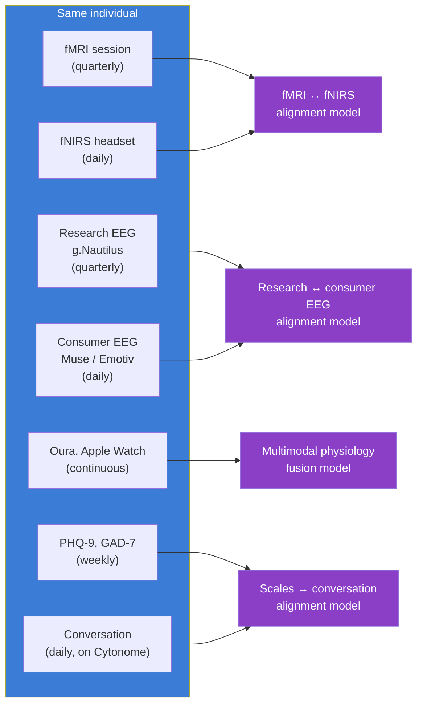

# Clinical-to-Wearable Alignment

> **Status**: Active
> **Date**: 2026-07-10
> **Author**: @shahin
> **Audience**: leadership
> **Tags**: `strategy`
> **Variants**: Technical (this doc) - Readable (Obsidian twin optional, same filename) - Agent (n/a)

**Subtrack:** T15 (new in v2.0) under M5 Learning
**Companion to:** `04_mid_term_5to6y.md`, `11_technical_track_FMs.md`, `13_sensor_ecosystem.md`

The clinical-to-wearable alignment subtrack is the bridge that lets H1 open work inform the H2 proprietary clinical study and the H2+ continuous tracking product. Without it, the Year 4 clinical study has no priors and the Year 7+ tracking product has no validated translation between the rich clinical signals it cannot capture continuously and the inexpensive signals it can.

This subtrack runs from Year 1 through Year 5 with three phases of increasing scope.

## Why this subtrack exists

After 36 months we transition from learning the open Cytoverse map (using public, consortium, and consented core-team data) to learning the proprietary continuous-tracking layer (using the clinical-trial cohort with paired clinical and wearable measurements over 12 months).

The transition has a hard scientific dependency: we need to know how to translate from clinical-grade modalities to wearable modalities, on the same individual. This is not the same as classifying disease from a wearable signal. It is the harder problem of reproducing the rich representation a clinical-grade modality produces, using only the cheap continuous signal.

Three concrete examples:

- **fMRI to fNIRS.** fMRI captures whole-brain hemodynamic signal at high spatial resolution but requires a magnet. fNIRS captures cortical hemodynamic signal at the wearable-headset level. We need a translation model that produces fMRI-quality representation from fNIRS data, calibrated per individual.
- **Clinical-grade EEG to consumer EEG.** Research-grade EEG (g.Nautilus 64 channels) captures dense electrical activity. Consumer EEG (Muse S Athena, Emotiv Insight) captures sparse activity at much lower channel count. Translation requires learning what each consumer channel proxies in the dense space.
- **Structured clinical assessment to passive conversational tracking.** Clinicians administer PHQ-9, GAD-7, and full structured interviews. The Cytonome macro LLM infers the same axes from passive conversation. Translation is a regression task with carefully labeled paired data.

## Three-phase plan

### Phase A: Public-data prep (Years 1 to 2)

Before any internal data collection or clinical study, build alignment models against publicly available paired datasets. Two anchors:

**Inclusion Study (OpenNeuro ds006377).** "Quantifying the impact of hair and skin characteristics on fNIRS signal quality for enhanced inclusivity," published in Nature Human Behaviour 2025. Public dataset with paired fNIRS measurements stratified by hair and skin characteristics. The dataset is exactly what we need to make sure our alignment models do not silently fail on under-represented populations. Equity is built into the alignment subtrack from the start.

**FRESH initiative (OSF b4wck).** "fNIRS reproducibility varies with data quality, analysis pipelines, and researcher experience," published in Nature Communications Biology 2025. Public dataset and analysis pipeline benchmarks. Lets us train alignment models with full pipeline awareness and lets us reproduce community benchmarks before we publish.

**Outputs by end of Year 2:**

- alignment-model v0 from fNIRS to fMRI representation, trained on public data;
- equity audit framework: how does alignment quality vary across hair, skin, age, gender? What sensor configurations and what training data corrections does the equity gap require?
- consumer-EEG to research-EEG channel mapping baseline using public datasets;
- conversation-to-PHQ-9 and conversation-to-GAD-7 baseline models (these reuse work from the macro LLM track).

### Phase B: Internal core-team pilot (Years 2 to 3)

Consented internal core team (3 to 5 people) wears research headsets (fNIRS plus EEG) plus undergoes initial clinical fMRI plus EEG. This is the dress rehearsal: the same individual wears every modality so we can validate alignment models end-to-end on the same person.

The pilot is small (intentionally) because the goal is validation of the alignment pipeline, not statistical power for cohort-level claims. The dataset is released as an open public good under CC BY 4.0 with consent and DP gating.

### Phase C: Cohort-scale (Years 4 to 5, proprietary track)

The Year 4 to Year 5 clinical study is detailed in `04_mid_term_5to6y.md`. From the alignment subtrack's perspective, it is the data source that turns Phase A and Phase B priors into production-grade alignment models. Cohort size 200, duration 12 months, paired clinical and wearable on every individual, equity stratification baked in from the Inclusion Study experience.

After the clinical study, alignment models become **proprietary** under the bifurcation rule. The Foundation continues to maintain the **open** alignment models trained on public and core-team-pilot data; the PBC owns the cohort-trained models that power the H2+ continuous tracking product.

## Key technical decisions

### Per-individual calibration

Alignment quality is improved substantially by per-individual calibration. Skin pigmentation, hair density, head shape, individual neural anatomy all vary. The Cytonome runtime supports a calibration phase per user where short clinical-grade measurements (one-time fMRI plus EEG plus structured assessment) define an individualized prior that the wearable signal is then read against. This is one reason the H2 product is fundamentally onboarded through a clinical entry point.

### Equity gates

Every alignment model carries a documented equity gate at release time. The release checklist (`SI-Release-Pipeline`) extends to require:

- alignment quality reported across protected attribute strata;
- minimum quality thresholds met for every represented group;
- documented coverage gaps (groups not represented in training data);
- public commitment to expanding cohort coverage in subsequent releases.

This is not a secondary concern. The Inclusion Study exists because fNIRS literature systematically under-represents non-white-skin and non-straight-hair populations. We refuse to ship alignment models that fail on the same populations.

### Hardware partner choices

We are partner-first on hardware through Year 3. Decisions on hardware partners depend on equity quality, openness of SDK, and continuity of supply.

| Modality | Y1-Y2 partner candidates | Notes |
|---|---|---|
| fNIRS wearable | Kernel, OpenBCI Galea, Artinis | Kernel for clinical-grade portability; Galea for the open hardware ethos; Artinis for academic continuity |
| Consumer EEG | Muse S Athena, Emotiv Insight | Muse for affordability and developer ecosystem; Emotiv for higher channel count |
| Research-grade EEG | g.Nautilus 64-channel | Reference standard |
| Wearable physiology | Oura Ring 4, Apple Watch, Whoop | Oura for sleep and HRV; Apple Watch for ECG and reach; Whoop for continuous strain |
| Wet-lab molecular (clinical) | Standard clinical labs (Quest, LabCorp); UK partner labs | For the trial cohort baseline |
| Future biomolecular (continuous) | ARPA-H Delphi (cooperative agreement) | Programmable, multi-analyte; Y4+ |

Hardware decisions are reviewed annually as the field changes rapidly.

## Risks specific to this subtrack

| Risk | Likelihood | Impact | Mitigation |
|---|---|---|---|
| fNIRS-to-fMRI alignment is too lossy | Medium | High | Multimodal fusion (fNIRS plus EEG plus physiology together) recovers more than fNIRS alone; the goal is "good enough on enough axes" not "fMRI-equivalent" |
| Equity gap in alignment quality is structural and unfixable | Low | Catastrophic | If unfixable, the affected modality is not deployed for the affected population; we ship inclusive subset |
| Public data is insufficient to train robust priors | Medium | Medium | Internal core-team pilot fills the gap; Phase B is exactly designed for this |
| Calibration burden too high for end users | Medium | High | Calibration phase is part of the clinical onboarding (already a touchpoint); duration target ≤2 hours |
| Hardware partner discontinues or pivots | Medium | Medium | Multi-vendor strategy; UBAP open standard ensures replacement-ability |

## Cross-references

- The cohort design and protocol that drives Phase C: `04_mid_term_5to6y.md`.
- The technical FM stack the alignment models build on: `11_technical_track_FMs.md`.
- The sensor ecosystem and UBAP standard: `13_sensor_ecosystem.md`.
- Equity and openness rules that gate alignment-model releases: `23_open_science_and_ip.md`.
- The privacy architecture that moves alignment-model inference to the edge: `16_patient_safety_architecture.md`.
