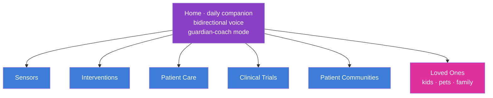
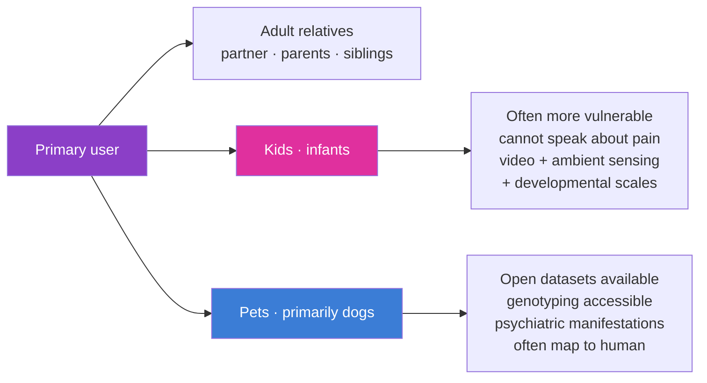

# App Design: Cytonome User Experience

**Companion to:** `10_platform_architecture.md`, `13_sensor_ecosystem.md`, `14_navigation_recommendations.md`, `16_patient_safety_architecture.md`

The Cytonome app is the user-facing component of the platform for most users. This document captures the design principles, primary sections, and the loved-ones extension. Implementation specifics evolve; the structure here is the durable framing.

## Design principles

Five principles drive every product decision:

- **Edge-first.** Inference runs on-device. Raw data never leaves the device unless the user explicitly opts in to a specific kind of sharing. Detail in `16_patient_safety_architecture.md`.
- **Bidirectional.** The app is not a dashboard. It is a coach. It can speak with the user, listen, remember, and guide.
- **Time-aware.** A user's history is the substrate for personalization. Memory is structured, time-tagged, user-auditable.
- **User-controlled.** The user can see, edit, or delete any stored item. Sharing is opt-in and revocable.
- **Crisis-aware.** Crisis-detection is hard-coded and ships before any participant exposure. There is no version of the app that does not have it.

## Primary sections

### Home: bidirectional guardian-coach

The default experience. Bidirectional voice-enabled communication with sub-500ms latency using a speech-to-speech model class (per `H1.P3.G4`). The coach:

- talks with the user every day, gathering mood and context (what they did, who they were with, how they slept, what they ate, what stressed or delighted them);
- helps plan the day given the user's goals, current state, and past patterns;
- offers motivation, reframing, and emotional support when appropriate;
- routes any crisis indication immediately to the crisis-detection module.

Long-term memory is structured. Every interaction creates time-tagged events stored on-device with user-visible content. Recall is searchable; users can edit or delete any event.

### Sensors

Where users add, configure, and audit their data sources. Three categories of sensors are configurable through the app:

**Instruments and tests.** Validated psychological and medical assessments delivered as in-app tools. PHQ-9, GAD-7, and the broader catalog of clinical scales for depression, anxiety, PTSD, attachment, personality, neurobehavioral function. These tools serve two roles: initial calibration and ongoing tracking. Each scale is mapped to the universal phenotypic axes (the 1500 to 2000 minimal-feature-set neurobehavioral axes Cytognosis is curating, per the Patty meeting), so the app can unify and complement different scales rather than treating each as a separate readout.

**Commercial devices.** Configuration for Apple Watch, Oura Ring, Whoop, Muse S Athena, Emotiv Insight, fNIRS partner headsets, and other UBAP-conformant devices. Each device is a plug-in (per `13_sensor_ecosystem.md`); add-and-go.

**Lab and clinic linking.** Connector to commercial labs (Quest, LabCorp), hospital labs, and the user's clinicians. Routine clinical labs flow into the app as structured data. Imaging centers can transmit DICOM directly. The user controls what flows where.

The sensor section is also where the **plug-in store** lives, with two tiers: an open community-maintained store and a Cytognosis-curated licensed store.

### Interventions

Repository of personalized interventions, prioritized and nominated to the unique biology and current health state of the user. Interventions are not necessarily FDA-approved; they are evidence-supported and matched to biotype.

Two broad categories:

**Non-invasive lifestyle.** Personalized diet plans, exercise plans, sleep schedules, social-routine recommendations. Each plan is tied to the user's biotype, observed responses, genotype, and goal.

**CBT, DBT, ACT and skills tools.** Interactive evidence-based skills, including pattern from CSAIL like "The Guardian" for depression, plus emerging tools as the field develops. Skills are biotype-matched: an autistic user practicing facial-emotion recognition gets different content from a person managing recurrent depression.

### Patient Care

Where the user connects with clinicians. Two flows:

- **Find a doctor.** Match users to clinicians based on the user's biology, biotype, and current state, given the clinician's specialties and approach.
- **Add an existing doctor.** Bring an existing clinician into the loop. Recommended personalized therapies (medications, treatments) can be shared with the clinician as a structured "treatment plan recommendation" that the clinician reviews, modifies, or rejects in their own workflow.

The app never bypasses clinicians. Recommended medications never auto-administer; they always go through a prescribing clinician.

### Clinical Trials

Where the user is matched to ongoing trials based on their biotype. Matching criteria are explicit (the user can see why a trial is recommended). Trials matched on biotype rather than only on diagnostic label improve trial efficacy and the user's chance of benefiting; this is the same logic that underpins precision oncology, applied to psychiatry and other domains.

### Patient Communities

Opt-in communities of users with similar biology. Not communities organized around diagnostic label (which collapses heterogeneity), but communities organized around biotype: people with shared mood-axis position, shared connectomic signature, shared autoimmune trajectory, etc.

This is a social network built on biology rather than self-declared identity. The match is opt-in and revocable; no biology data is shared in the community by default. The community is a place users go because they feel connected; the biotype match is the substrate that produces that connection.

## Loved-Ones extension

Each user can optionally add their loved ones, including children and pets, to be tracked alongside themselves in the same app. Each loved-one type is a distinct market with its own product surface but shares the underlying platform.

### Kids

Children, especially infants, are simultaneously the most vulnerable population (because they cannot articulate pain or distress) and one of the highest-value early markets (because parents are highly motivated to track their children's health). Current monitoring is dominated by video devices integrated into health tracking; Cytonome's kid-mode integrates these plus developmental scales mapped to the phenotypic axes used for adults, plus parental observations entered through the conversational interface.

PAC has explicit input on kid-mode design. Privacy and consent for minors are governed by parental consent with developmental-age awareness; older children can be brought into the consent process directly as they mature.

### Pets

Pets, particularly dogs, have unusual data hygiene relative to human clinical data: clean genotyping is widely available; behavioral phenotyping is well-developed; many psychiatric manifestations map closely to human ones; consent is uncomplicated. The pet market is an opportunistic data source for early-platform validation and a sustainable product market in its own right.

Cytonome pet-mode connects to existing pet communities and datasets (which are largely open), provides comprehensive genotyping connectors, and uses behavioral phenotyping aligned with human axes where appropriate (cross-species mood and anxiety axes are an active research area).

### Cross-mode consistency

The same multimodal multiscale platform operates across all modes. The cellular and connectomic foundation models are species-aware (cross-species training where data permits; species-specific fine-tuning where required). Recommendations are mode-appropriate (a recommendation surface that fits a parent looking at their child is different from one that fits the child themselves).

## What the app does *not* do

A short list of explicit non-goals, because each was tempting and each would corrupt the platform:

- **It does not replace clinicians.** Recommendations route through clinicians where prescriptions are involved.
- **It does not gamify health into addiction.** The app's success is measured in user wellbeing, not engagement minutes. Engagement metrics are inputs to internal review, not optimization targets.
- **It does not sell data.** The Foundation does not sell user data. The PBC does not sell user data. The Helix Framework legally constrains both. The 23&me precedent (genotype data sold to therapeutics company under unclear consent) is the exact failure mode we engineer against.
- **It does not promise what it cannot deliver.** Every recommendation carries explicit uncertainty; counterfactuals are estimates, not predictions of what will definitely happen.
- **It does not handle untrained-LLM therapy substitution.** Crisis-detection module is hard-coded; the macro LLM does not pretend to be a therapist; it is a coach with a clearly defined scope and a clear escalation path.

## App-development bifurcation

Per the bifurcation rule, the app's components split:

- **Open (Foundation):** the on-device runtime, the macro LLM, the privacy architecture, the crisis-detection module, the structured memory module, the basic personalized-recommendation engine. All Apache 2.0 / open hardware specs / open protocols. Annual updates.
- **Proprietary (PBC, post-bifurcation):** the personalized causal model trained on the proprietary continuous-tracking dataset; the navigation policy informed by continuous tracking; the integrated regulated-product features needed for FDA clearance; the subscription business model.

Users get the open app for free with the open features. Users opt into PBC continuous tracking under a separate consent, with a separate price model (subscription, akin to OpenAI/Claude consumer plans but tied to health). The two layers are distinct in the user experience and in the legal architecture.

## Cross-references

- The four-tier compute that makes edge-first possible: `16_patient_safety_architecture.md`.
- The recommendation framework the app delivers: `14_navigation_recommendations.md`.
- The sensor ecosystem the Sensors section consumes: `13_sensor_ecosystem.md`.
- The PAC charter that reviews app design: `21_patient_advocacy_council.md`.
- The bifurcation rules that govern app components: `02_horizons_and_bifurcation.md`, `23_open_science_and_ip.md`.
