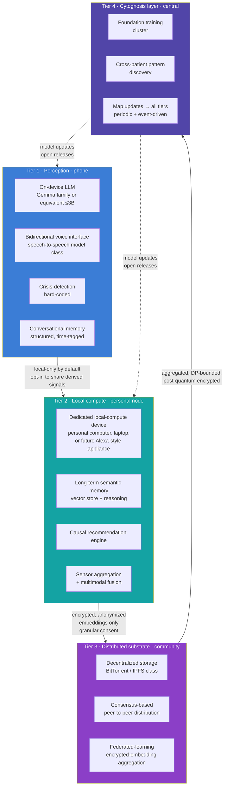
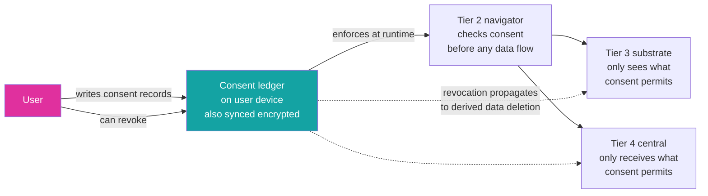

# Patient Safety Architecture: Four-Tier Compute and Privacy

> **Status**: Active
> **Date**: 2026-07-10
> **Author**: @shahin
> **Audience**: leadership
> **Tags**: `strategy`
> **Variants**: Technical (this doc) - Readable (Obsidian twin optional, same filename) - Agent (n/a)

**Companion to:** `10_platform_architecture.md`, `15_app_design.md`, `23_open_science_and_ip.md`
**Strategic Initiative:** `SI-Privacy-Architecture` (M12 deliverable; open protocol)

This document specifies the layered compute and privacy architecture that protects participants and users across the Cytognosis platform. The architecture is published as an open protocol with an Apache 2.0 reference implementation (per `H1.P3.G1`). External review by at least two qualified security researchers is a release gate.

## Why this exists in v2.0

Three concrete failure modes in adjacent products inform the architecture:

- **23andMe precedent.** Genotype data sold to therapeutics partners under consent forms that did not clearly communicate the use case to participants. Consent must be granular, machine-readable, revocable, and continuously visible to the user.
- **Therapy LLM precedent.** Sensitive therapeutic conversations sent to LLM backends without HIPAA-compliant infrastructure, plus reports of suicidal ideation in users of untrained LLMs as substitute therapy. Crisis-detection must be hard-coded; LLM scope must be bounded; therapy substitution is not a product mode we ship.
- **Harvest Now, Decrypt Later threat.** Quantum-computing emergence plus vulnerable storage practices produce a threat model where data captured today can be decrypted in a future where current cryptography fails. Storage must be post-quantum-safe end-to-end (NIST PQC compliant) by Y4 (`H1.P3.G7` `K5`).

## The four-tier compute architecture

### Tier 1: Perception (phone)

The user's daily-driver device. Carries:

- the on-device LLM (Gemma-family or equivalent ≤3B parameters, quantized) for the macro phenotypic-axis quantification (`SI-Neuroverse-Macro-LLM`);
- the bidirectional voice interface using a speech-to-speech model class (Step-Audio-R1.1, Fish Audio S2 Pro, or successor; not three-stage STT→LLM→TTS pipelines, which lose paralinguistic cues);
- the hard-coded crisis-detection module that surfaces 988 Suicide and Crisis Lifeline plus Crisis Text Line on detection, with optional clinician alerting;
- the structured, time-tagged conversational memory store, user-auditable.

All inference here runs locally. Voice processing is local unless the user explicitly opts in to encrypted external processing for a specific request. The device is the smallest unit of trust, and it never sends raw audio or raw conversation to anything else by default.

### Tier 2: Local compute (personal node)

A dedicated local-compute appliance, running either on the user's existing hardware (laptop, desktop) or as a separately marketed Cytognosis device (analogous in form to Alexa-class home appliances but operating primarily offline with restricted, encrypted, anonymized communication outward).

This tier carries:

- the long-term semantic memory store, distinct from the on-device episodic memory, with the consolidation pipeline that promotes episodic events to semantic understanding;
- the causal recommendation engine that runs the heavier inference (`SI-Causal-Recommendation`);
- the sensor-aggregation layer that pulls UBAP-formatted streams from all of the user's sensors and fuses them into a unified state representation;
- the bridge to Tier 3, with explicit consent gating for what flows where.

The personal node is what makes the platform genuinely on-the-edge for users with non-trivial workloads. A user can run the full platform without the personal node (everything happens on the phone, with reduced model sizes); the personal node simply unlocks higher-fidelity recommendations.

### Tier 3: Distributed substrate (community)

A decentralized storage and federated-learning layer that does not give any single node access to a significant fraction of any user's data. The substrate adopts technologies from BitTorrent and blockchain-class consensus systems to provide redundancy and verifiability without centralization.

This tier:

- holds shards of users' encrypted data across many nodes, no single one of which can reconstruct meaningful state;
- runs federated learning over encrypted embeddings, with aggregation handled by a consensus protocol;
- enforces per-user differential-privacy budgets explicitly, with budget accounting visible to the user.

Tier 3 is the architectural answer to the question "how can a population of Cytognosis users improve the platform together without surrendering individual privacy?" The substrate is open-source, post-quantum-safe (NIST PQC compliant by Y4), and externally audited.

### Tier 4: Cytognosis layer (central)

The Foundation's central training and pattern-discovery infrastructure. Receives only:

- aggregated, consented embeddings (not raw data);
- DP-bounded summary statistics with explicit ε accounting;
- post-quantum-encrypted gradient updates from the federated-learning protocol.

Tier 4 produces:

- updated foundation models (Cytoverse, Cytoscope-relevant alignment models, Cytonome navigation models) that are released as open updates back to all tiers;
- cross-patient pattern discovery that informs new clinical hypotheses for the open Cytoverse map;
- post-bifurcation, the Foundation Tier 4 also coordinates with the PBC Tier 4 (a separate proprietary training cluster) for the proprietary navigation engine, with the bifurcation rule enforced at the data layer.

## Consent architecture

Every data flow from Tier 1 outward is gated by an explicit, granular, machine-readable consent record:

- **Granular.** Consent is per data type, per purpose, per recipient. "Share my sleep data with the federated learning aggregation for the next 6 months" is a different consent than "share my sleep data with my clinician once."
- **Machine-readable.** UBAP-conformant consent metadata enforces consent automatically; no human in the runtime path.
- **Revocable.** The user can revoke at any time. Revocation propagates to derived-data deletion through the substrate (with technical limits: encrypted shards already in the substrate cannot always be re-collected, but their decryption keys can be destroyed, rendering them inaccessible).
- **Visible.** The user sees what they have consented to, in plain language, every time they open the app.
- **Defaulted to most-restrictive.** New data types and new purposes do not opt the user in by default. Affirmative re-consent is required.

PAC reviews the consent architecture at every annual release.

## Crisis-detection module

The crisis-detection module is the only mode in which the navigator is allowed to override user-controlled flows. It is hard-coded, ships before any participant exposure, and is reviewed by clinical advisors on every release.

Behavior on crisis detection:

- Surface 988 Suicide and Crisis Lifeline and Crisis Text Line in-app, in plain language, with one-tap call or message.
- If the user has opted in to clinician alerting, send a structured alert to the clinician with the minimum information needed for response.
- Log the detection event in the user's memory with a clear, non-stigmatizing description.
- Continue conversation in a supportive, non-clinical mode that does not pretend to be a therapist.

The detection threshold is intentionally biased toward over-detection: a false alarm is acceptable; a missed crisis is not. Clinical advisors set and review the threshold.

## Post-quantum substrate

By M48, every cryptographic primitive in persistent storage uses NIST PQC draft-compliant algorithms:

- **Key encapsulation:** CRYSTALS-Kyber (or successor as standardization evolves).
- **Signatures:** CRYSTALS-Dilithium (or successor).
- **Hash:** SHA-3 family.

The substrate has documented migration plans for each primitive (NIST is finalizing standards into Y2026; subsequent versions may change selections). External cryptographic audit passes before first external pilot uses the substrate.

This addresses the Harvest Now, Decrypt Later threat: data captured by adversaries today, even if undecryptable now, would become readable when quantum computing matures. Post-quantum storage means that an adversary intercepting Tier 3 traffic today still cannot decrypt it 20 years hence.

## Privacy probes

The release-checklist pipeline (`SI-Release-Pipeline`) gates every public release on:

- a **differential-privacy probe** that confirms claimed ε budgets hold against observed model behavior;
- a **re-identification probe** that confirms an adversary with population-scale auxiliary data cannot re-identify training participants from the released artifact.

Zero re-identification incidents on the public probe set is a Gate 1 criterion (`GC-G1.O4` adoption-and-impact).

## Cross-references

- The four-tier compute is the substrate the entire navigator depends on: `10_platform_architecture.md`.
- The app's user-facing privacy controls live in the consent architecture: `15_app_design.md`.
- The PAC's role in privacy review: `21_patient_advocacy_council.md`.
- The Helix legal architecture that enforces non-sale of data: `20_organization_helix.md`.
- The bifurcation rule that governs how proprietary continuous data is segregated: `02_horizons_and_bifurcation.md`.
- The full open-science substrate that ships these specs publicly: `23_open_science_and_ip.md`.
