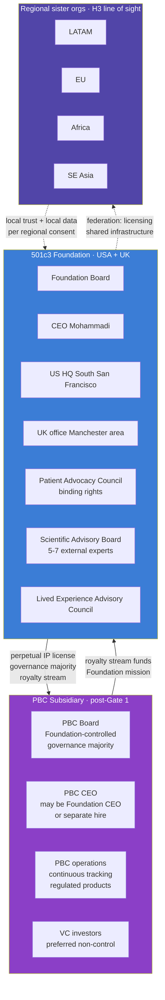

# Organization and Helix Structure

> **Status**: Active
> **Date**: 2026-07-10
> **Author**: @shahin
> **Audience**: leadership
> **Tags**: `strategy`
> **Variants**: Technical (this doc) - Readable (Obsidian twin optional, same filename) - Agent (n/a)

**Companion to:** `21_patient_advocacy_council.md`, `22_people_and_consultants.md`, `23_open_science_and_ip.md`, `02_horizons_and_bifurcation.md`

This document captures the operating-model layer using the McKinsey 12-element overlay. Where the strategic plan elsewhere asks "what are we doing," this document answers "how are we organized to do it."

## The Helix structure

The Helix is a federated structure with one parent (the Foundation) and two classes of children (the PBC subsidiary and, eventually, regional sister organizations). Each child is independently governed within constraints set by the Foundation through bylaws and license terms. The Foundation does not run product, but it cannot lose control of the open mission.

## McKinsey 12-element operating model

Maintained as a rolling lens. The twelve elements answer twelve operating questions; where the answer is "not yet documented," the absence is itself a planning decision flagged for the next annual review.

### Purpose

To pioneer a cellular intelligence platform that maps personalized health states, detecting and intercepting disease years before symptoms emerge. Codified in the Vision and Mission. Not subject to change without Bylaws amendment.

### Value agenda

The bridge between mission and business model. For Cytognosis:

- **Foundation value:** maintaining open precision-health infrastructure as a public good in perpetuity, funded by grants, philanthropy, and PBC royalties.
- **PBC value:** continuous personalized health monitoring and navigation as a regulated product, funded by subscription revenue and VC, with royalty back to the Foundation.

The Helix is precisely how the value agenda survives the tension between these two halves.

### Structure

Documented above. Foundation parent, PBC subsidiary post-Gate 1, regional sister orgs in H3 line of sight.

### Ecosystem

Strategic relationships beyond the entity:

| Type | Partners |
|---|---|
| Funders (active) | Astera Institute, Google.org, Foresight Institute (rejected), EA Fund |
| Funders (target) | ARPA-H (PHO and HSF), NSF (Tech Labs), Convergent Research, Wellcome Leap, CZI, NIH |
| Clinical | McLean Hospital (Brad Ruzicka), Mount Sinai, University of Manchester (Madhvi Menon, autoimmune) |
| Scientific | PsychENCODE, NeuroBioBank, ENIGMA consortium, HiTOP community, Grotzinger group, ROSMAP |
| Technology | ARPA-H Delphi (programmable biosensors), Caltech molecular monitoring FRO, Hugging Face (open releases), Voltage Park / GCP / cloud compute |
| Standards | LinkML/BioLink, RO-Crate, SPDX, W3C Web Annotation, NIST PQC working group, future submissions to IEEE / ISO / HL7 |
| Counsel and audit | Duane Valz (legal), Salus IRB and/or Northstar IRB, external security researchers (cryptographic audit) |

### Leadership

| Role | Y1-Y2 | Y3-Y5 | Y5+ |
|---|---|---|---|
| CEO | Mohammadi | Mohammadi | Mohammadi or split with PBC CEO at Gate 1 |
| CSO | Mohammadi (acting) | First CSO hire | Dedicated CSO |
| CTO | Mohammadi (acting) + Engineering lead hire | Dedicated CTO | Dedicated CTO |
| Head of Clinical / Regulatory | None | Hire by Y3 Q2 | Dedicated head |
| UK lead | Menon-style affiliate or first UK hire by Y2 | Dedicated UK CEO or Country Director | Per UK structure |
| PBC CEO | n/a | n/a | Hire at Gate 1 if not Mohammadi |

### Governance

Foundation Board: at least three external directors by M24 (`H1.P6.G1` `K1`). Bylaws Article VI covers IP, Article XI covers PBC governance, Article XIII covers dissolution provisions. PBC Board, post-activation, has Foundation-controlled governance majority.

Patient Advocacy Council is a governance entity, not advisory, with binding rights at the bifurcation gate and on study design, release timing, and grant prioritization. Charter detail in `21_patient_advocacy_council.md`.

Scientific Advisory Board (5 to 7 members, in place by M6) advises on platform technical direction; not binding.

Lived Experience Advisory Council (8 to 12 members, in place by M18) advises on study design and accessibility; not binding.

### Processes

The processes catalog (drafted across `01_..` to `41_..` documents in this plan) covers:

- annual planning catch-ball (October);
- quarterly OKR review;
- monthly cross-pillar sync;
- weekly initiative standups;
- bidirectional connection between Strategic Initiatives and the Monday workspace;
- release pipeline (`SI-Release-Pipeline`) with the gated checklist;
- bifurcation enforcement (`SI-OpenScience-Template` plus the bifurcation tagging in Monday);
- PAC review on every grant submission and major release;
- annual environment scan (SWOT, PESTLE, VRIO).

### Technology

The platform itself: Cytoverse, Cytoscope, Cytonome, plus the open-science substrate. Detail in `10_platform_architecture.md`. The choice of computing infrastructure (compute, storage, federated learning) is documented in `16_patient_safety_architecture.md`.

### Behaviors

- Active voice, direct communication.
- Open-by-default unless the bifurcation rule says otherwise.
- Failure documented as deliverable; no silent retreats.
- Every public artifact passes the release checklist.
- Every participant-facing decision routes through PAC.
- No em dashes, no forbidden words, no passive voice, no hardcoded section numbers (formatting and brand bans codified across the skills system).
- Every grant proposal references prior corrections and validated approaches; no reinvention of guidance the team has already settled.

### Rewards

Compensation has three components, by phase:

| Phase | Foundation comp | PBC comp |
|---|---|---|
| Pre-Gate 1 | Salary at Foundation level (intern, junior, senior bands per `budget_role_levels.md`); promise-of-future-equity for founding team and early hires (legally vetted, IRS-aware) | n/a |
| Gate 1 onward | Salary at Foundation level continues for Foundation roles | PBC equity (real, vested) for PBC roles; Foundation roles can also vest into PBC equity per Helix terms |
| H3 | Foundation salaries continue; regional sister orgs operate on regional comp norms with Foundation-funded subsidies where appropriate | n/a |

The promise-of-future-equity mechanism is the structural alignment between mission-driven Foundation work today and economic value capture at Gate 1. Without it, talent drifts toward straight startups. With it, mission-driven talent that takes Foundation-level salary in H1 has a documented path to economic upside through PBC equity in H2.

### Footprint

| Phase | US HQ | UK office | Other |
|---|---|---|---|
| Y1 | South San Francisco (small office or co-working) | None | Remote-first |
| Y2 | SSF (lease step-up) | Manchester (lease) | Remote-first |
| Y3-Y5 | SSF (full HQ) | Manchester (full office) | Remote-first plus partner-hosted seats |
| H2 | SSF expanded (PBC engineering) | Manchester expanded | Regional scoping engagements |
| H3 | Coordinator role at SSF | Peer regional org | 3 to 5 sister orgs |

Footprint is intentionally modest at the central level. The federation in H3 distributes capacity rather than concentrating it.

### Talent

Hiring trajectory in `01_Cytognosis_Strategic_Roadmap_15-Year.md` Section 8 and refreshed here:

| Phase | US HQ FTE | UK FTE | Total |
|---|---|---|---|
| End Y1 | 5 to 8 | 0 to 1 | 5 to 9 |
| End Y3 | 10 to 14 | 3 to 5 | 13 to 19 |
| End Y5 | 15 to 25 | 5 to 10 | 20 to 35 |
| End Y10 | 50 to 100 (incl. PBC) | 20 to 40 | 70 to 140 |
| End Y15 | Coordinator role | Peer regional org | Federation |

Cross-scale expertise (people who can work across micro / meso / macro biological scales) is rare. The affiliate-first model lets us collaborate with the right people without insisting on relocation; the UK office expands the talent pool. The Science / Engineering pairing on every major initiative spreads the load across people who do not need to be unicorns.

## Where this connects

- The PAC charter that sits inside this operating model: `21_patient_advocacy_council.md`.
- Named consultants and rates: `22_people_and_consultants.md`.
- IP and openness rules that constrain the Helix: `23_open_science_and_ip.md`.
- The bifurcation rule that the Helix exists to make tractable: `02_horizons_and_bifurcation.md`.
- Funding strategy across the Helix: `30_funding_strategy.md`.
