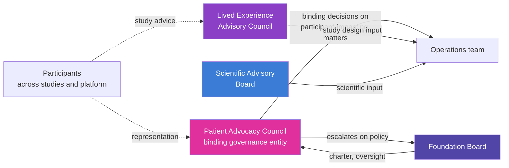

# Patient Advocacy Council (PAC)

**Companion to:** `20_organization_helix.md`, `02_horizons_and_bifurcation.md`, `15_app_design.md`
**Subtrack:** T14 (new in v2.0) under M4 Organization

The Patient Advocacy Council is the governance innovation Cytognosis introduced in the Google.org Impact proposal and now formalizes as a first-class organizational design. PAC is **not advisory**. It holds binding decision rights on participant-impacting decisions and exists to make the Foundation's commitment to the *Care* value operational rather than rhetorical.

## Why PAC exists

Every prior attempt at participant-centered health technology has put participants on advisory committees with no veto. The result is predictable: when scientific or commercial pressure conflicts with participant interest, scientific or commercial pressure wins, and the participants on the committee are heard but not heeded.

PAC closes that loop. It is structurally analogous to the role an ethics board plays in pharmaceutical research, but extended to the full lifecycle of a continuous health platform: study design, release timing, the bifurcation boundary, IP decisions that affect participants, app surface decisions, and grant prioritization where participant interest is at stake.

## Charter scope (binding rights)

PAC has binding rights on:

- **Study design.** Any participant-facing study (Phase 0, external pilot, the Year 4-Year 5 clinical trial, post-bifurcation cohort studies) requires PAC review and approval before IRB submission.
- **Release timing.** PAC reviews proposed release pace for participant-impacting artifacts. Releasing too fast (before adequate validation) or too slow (withholding benefit) is contestable.
- **The bifurcation boundary.** PAC reviews and approves the specific data, models, and analyses that move from open to proprietary at the 36-month bifurcation. PAC has binding sign-off on the bifurcation policy as ratified by the Foundation Board.
- **Consent architecture.** PAC reviews proposed consent forms, the structure of granular consent, and the runtime enforcement architecture. Changes to default settings require PAC approval.
- **App surface decisions.** Material changes to app design that affect participant experience (e.g., crisis-detection module updates, new sensor categories surfaced, recommendation modes changed) require PAC review.
- **Grant prioritization.** PAC reviews the grant pipeline annually and can flag grant opportunities that conflict with participant interest. The Foundation Board considers PAC flags but retains final grant-acceptance authority.

PAC does not have binding rights on technical architecture, scientific methodology, or business model decisions that do not affect participants directly. Those remain with the relevant scientific, technical, or operational leadership.

## Charter scope (advisory rights)

In addition to binding rights, PAC has advisory voice on:

- platform direction;
- prioritization of indications and biotypes;
- partnership decisions where participant interest is implicated but not central;
- communications and messaging that involve participant stories.

## Composition

| Phase | Size | Geographic mix | Indication mix |
|---|---|---|---|
| Founding (M12) | 6 to 9 members | US-anchored, with 1 to 2 UK seats | Mental health primary (MDD, GAD, PTSD, BD, SZ); 1 to 2 cross-domain (autoimmune, neurodegen) |
| Y3-Y5 | 9 to 12 members | US plus UK plus 1 international | Expanded indication mix as platform expands |
| H2 | 12 to 15 members | Multi-continental | All currently active indications |
| H3 | 15+ in federation structure | One PAC seat per region per active indication; central council coordinates regional councils | Full federation |

Selection criteria:

- lived experience with the indication;
- demonstrated capacity for collaborative decision-making in adversarial moments;
- diversity across age, gender, race, geography, socioeconomic status;
- no conflict of interest with Cytognosis funders or the PBC;
- compensated time at fair-market rates (not token gestures).

## Operating model

PAC meets quarterly at minimum, with ad-hoc reviews triggered by specific decision needs (e.g., before a study IRB submission, before a major release, before a bifurcation policy change).

PAC has direct access to the Foundation Board for escalation. Disagreement between PAC and operational leadership is resolved by the Foundation Board, with the PAC position presented in writing.

## Distinction from LEAC

The Lived Experience Advisory Council (LEAC, established in v1.1 of the strategic roadmap) is **advisory**: it provides input on study design and accessibility but does not have binding rights. LEAC is broader (8 to 12 members, more diverse mix), meets quarterly, and influences specific releases.

PAC is narrower, more selectively composed for governance-grade work, has binding rights, and meets more often when needed. Membership may overlap (a person can sit on both), but the bodies are distinct in role.

LEAC continues to exist after PAC stands up. The two complement each other: LEAC for breadth of input, PAC for depth of governance.

## Compensation

PAC members are compensated at rates appropriate to the time and skill demanded:

- quarterly meetings paid as professional consulting time (rate per market);
- ad-hoc reviews paid hourly;
- travel and accessibility costs covered by the Foundation;
- term limits with renewable terms (default: 3-year terms, renewable once).

PAC compensation is included in the operating budget from Y1 and tracked in the Phase 1 funding plan (`SI-Phase1-Funding`).

## PAC at the bifurcation gate

The bifurcation event at M37 is PAC's most consequential moment in H1. PAC must:

- review the proposed bifurcation boundary in detail (which data, models, and analyses move into the PBC; which stay in the Foundation);
- confirm or amend the boundary;
- approve the participant consent forms for the proprietary clinical study;
- ratify the open release commitments that the Foundation makes for the post-bifurcation period.

PAC has binding sign-off here. If PAC does not approve, the Foundation Board cannot ratify the bifurcation. This is the strongest governance moment in the Helix and is what makes the bifurcation legitimate to participants and to funders.

## Charter ratification timeline

| Milestone | Target | Status |
|---|---|---|
| Charter drafted | M6 (Y1 Q3) | Pending |
| Counsel review | M9 | Pending |
| Foundation Board review and approval | M10 | Pending |
| First seat recruitment opens | M11 | Pending |
| First seats filled, charter binding | M12 | Pending |
| First quarterly meeting | M13 | Pending |
| Two complete review cycles (G1 prerequisite) | M24 | Pending |
| First binding-rights exercise on a real decision (G1 criterion `GC-G1.P2`) | by M30 | Target |

## Risks specific to PAC

| Risk | Likelihood | Impact | Mitigation |
|---|---|---|---|
| PAC and operational leadership reach genuine deadlock | Medium | High | Escalation to Foundation Board with both positions; pre-committed timeboxing on resolution |
| PAC drifts toward operational micromanagement | Medium | Medium | Clear charter scope; quarterly review of charter scope; PAC self-discipline |
| PAC becomes captured by single sub-population | Medium | Medium | Composition criteria with explicit diversity targets; rotating chair role; term limits |
| PAC compensation creates conflict-of-interest | Low | High | Standard COI disclosure framework; market-rate not above-market compensation |
| PAC delays critical decisions | Medium | Medium | Pre-set decision SLAs (e.g., 14 days for routine review); ad-hoc emergency convening capacity |
| Conflict-of-interest with funders | Medium | High | Members do not have material funding ties to Cytognosis funders; conflict disclosure framework |

## Cross-references

- The Helix structure that PAC sits inside: `20_organization_helix.md`.
- The bifurcation gate where PAC has binding sign-off: `02_horizons_and_bifurcation.md`.
- The privacy and consent architecture PAC reviews: `16_patient_safety_architecture.md`.
- The app design PAC reviews materially: `15_app_design.md`.
- The grant pipeline PAC reviews annually: `30_funding_strategy.md`.
