# Open Science and IP Strategy

> **Status**: Active
> **Date**: 2026-07-10
> **Author**: @shahin
> **Audience**: leadership
> **Tags**: `strategy`
> **Variants**: Technical (this doc) - Readable (Obsidian twin optional, same filename) - Agent (n/a)

**Companion to:** `02_horizons_and_bifurcation.md`, `20_organization_helix.md`, `21_patient_advocacy_council.md`

The Cytognosis open-science and IP strategy is straightforward in principle and disciplined in operation. The principle: open by default; the bifurcation is the only structured exception. The discipline: every artifact carries explicit license terms, every license is enforced through the release pipeline, and every closed component traces to a documented mission-protective rationale.

## License defaults

| Artifact type | Default license | Rationale |
|---|---|---|
| Code | Apache 2.0 | Permits commercial reuse with attribution; compatible with PBC subsidiary use; trademark protection |
| Trained model weights | Apache 2.0 (when source data permits); OpenRAIL-M when responsible-AI considerations apply | Maximum reuse with responsibility gates where appropriate |
| Documentation, papers, blog content | CC BY 4.0 | Citation-required; commercial reuse permitted |
| Derived datasets | CC0 where source licenses permit; CC BY 4.0 otherwise; controlled access for sensitive participant data | Maximize utility; protect participants where required |
| Schemas, ontologies, standards | CC0 | Standards must travel without barriers |
| UBAP specification | Apache 2.0 reference implementation; CC BY 4.0 spec text | Encourages adoption; no friction on conformance |
| Hardware designs (where Cytognosis-funded) | CERN OHL-S v2 or per partnership terms | Open hardware where we have the IP; partner terms otherwise |
| Conformance test suites | Apache 2.0 | Vendors must be able to self-certify without legal friction |

The list of source licenses we have to consider is in `funder_metadata.md` and the canonical-template-system reference docs.

## FAIR principles

Every public release passes FAIR (Findable, Accessible, Interoperable, Reusable) compliance:

- **Findable.** Stable identifiers (DOI via Zenodo or DataCite), rich metadata, indexed in registries (Hugging Face for models, Zenodo for archive, GitHub for code).
- **Accessible.** Standard protocols (HTTPS, S3 with signed URLs, IPFS for the substrate), open or controlled-access with documented access procedures.
- **Interoperable.** Linked Data principles, ontology-grounded metadata (UBERON, CHEBI, NBO, MONDO, SNOMED CT, ICD-11 as appropriate), schema-validated.
- **Reusable.** Provenance documented through RO-Crate, model cards, data cards, eval cards. Licenses unambiguous in machine-readable SPDX form.

The release pipeline (`SI-Release-Pipeline`, M12 deliverable) gates every public release on FAIR compliance plus differential-privacy and re-identification probes.

## The 36-month bifurcation rule, in licensing terms

Per `02_horizons_and_bifurcation.md`, the bifurcation is the single structured exception to open-by-default. In licensing terms:

```mermaid
flowchart LR
    subgraph PRE["Pre-36m artifacts"]
        P1[All code · Apache 2.0]
        P2[All weights · Apache 2.0 / OpenRAIL-M]
        P3[All datasets · CC0 / CC BY 4.0 / controlled access for sensitive subjects]
        P4[Documentation · CC BY 4.0]
        P5[UBAP spec · perpetual open]
    end
    subgraph BIF["36m boundary"]
        BR[Foundation Board ratifies<br/>PAC sign-off<br/>Bylaws Article VI applies]
    end
    subgraph POST["Post-36m artifacts"]
        direction TB
        subgraph OPEN["Foundation track · OPEN"]
            O1[Cytoverse map releases · annual<br/>Apache 2.0 / CC BY 4.0]
            O2[Disease-axis discoveries · open<br/>publication]
            O3[Open clinical software · Apache 2.0]
            O4[Cross-modal alignment models<br/>public-data plus core-team-pilot trained]
        end
        subgraph PROP["PBC track · PROPRIETARY"]
            P6[Continuous individual<br/>tracking dataset]
            P7[Personalized navigation engine<br/>cohort-trained]
            P8[Cytoscope wearable v1+ hardware]
            P9[Cytonome regulated product]
        end
    end
    PRE --> BIF
    BIF --> OPEN
    BIF --> PROP
    PROP -.->|royalty stream| FOUND[Foundation operations]
    PROP -.->|aggregated insights<br/>DP-bounded · PAC-approved| OPEN
    style PRE fill:#3B7DD6,color:#fff
    style OPEN fill:#3B7DD6,color:#fff
    style PROP fill:#8B3FC7,color:#fff
    style BIF fill:#E0309E,color:#fff
```

The PBC subsidiary, post-activation, holds defined IP in the proprietary categories and pays the Foundation:

- a perpetual open license for the open-track components;
- a royalty stream documented in the PBC charter and IP-licensing terms (`SI-PBC-Charter`, M30 deliverable);
- a non-revocable commitment that ensures the Foundation's open mission is not rescinded by PBC business decisions.

These terms protect against the failure mode where a successor organization takes the proprietary track in a direction that closes the open mission. The Foundation always holds enough governance and license rights to keep the map perpetually open.

## What "open" means concretely

A common failure mode in open-science policy is to declare "open" without operationalizing it. We operationalize:

- **Versioned releases.** Every release has a stable identifier and is preserved in archive (Zenodo) so that future researchers can reproduce results against the exact artifact used.
- **No "open soon."** If an artifact is not yet open, it is private; we do not promise future openness as a commitment we cannot enforce.
- **No backsliding.** Once an artifact is released open, it stays open. Even if a future Cytognosis decides differently, the existing artifact's existing license travels with the artifact in perpetuity.
- **Annual public review.** Every artifact's continued openness is reviewed annually as part of the Hoshin catch-ball; PAC participates.
- **Reproducibility.** Model card, data card, eval card on every release, plus a reproduction kit (Copier-template-bootstrapped) that anyone can run.
- **Equity.** Equity gates on every alignment-model release (per `12_clinical_to_wearable.md`).
- **Documentation as deliverable.** The Helix Framework paper, the UBAP specification, and the open-science substrate documentation are themselves public deliverables (`SI-Helix-Paper`, `SI-UBAP-v1`, `SI-OpenScience-Template`).

## The Astera Open Science Policy and similar instruments

Astera Institute (a primary funder for the open work in Y1-Y2) has an explicit Open Science Policy. We comply by default. Other funders with similar policies (Convergent Research, Speculative Technologies, EA Fund, Wellcome, Gates) align with our defaults. Federal funders (ARPA-H, NSF, NIH) have their own data-management-plan (DMP) requirements; we satisfy them while preserving our higher openness defaults wherever possible.

The grant-template canonical system (`canonical_template_system` memory) handles funder-specific licensing nuance per proposal; the master defaults above are the starting position.

## Trademark

"Cytognosis" and "Cytoverse," "Cytoscope," "Cytonome" are trademarks of Cytognosis Foundation. Trademark registration is in process (ongoing with counsel). Apache 2.0 license on code does not transfer the trademark; use of the marks requires separate approval. This is the standard approach for protecting brand without restricting code reuse.

## IP licensing to the PBC

Per Bylaws Article VI and the `SI-PBC-Charter` work product (M30):

- Foundation holds and retains all IP arising from Foundation-funded work pre-Gate 1.
- PBC at activation receives a royalty-bearing perpetual non-exclusive license to use Foundation IP in commercial products, with explicit field-of-use definitions.
- IP arising from PBC-funded work post-Gate 1 belongs to the PBC.
- The Foundation has perpetual non-revocable rights to use any Foundation-funded IP in the open mission, regardless of PBC commercial choices.
- Audit and dispute resolution mechanisms specified in PBC charter.

Counsel review (Duane Valz) is required before any IP-licensing terms are approved by the Board. Counsel review is also required before the PBC is activated. PAC has binding sign-off on the bifurcation that establishes which assets fall under which side of the line.

## Patents

Cytognosis does not seek defensive patents on Foundation-developed methods or models. Open releases plus prior-art creation provide stronger protection against later patenting by adversaries than defensive patents do for an open-mission organization. The PBC may pursue patents on hardware designs and product-specific innovations where doing so protects a market position; the Foundation's open releases serve as prior art preventing those patents from blocking foundational research.

## How this connects to grant strategy

The open-science posture is a competitive advantage with primary funders:

- Astera, Convergent Research, Speculative Technologies, EA Fund: open-by-default is their thesis. We are aligned by default.
- Google.org, philanthropic AI-for-science: open releases against time-bound milestones map cleanly to their funding instrument.
- ARPA-H, DOE, NSF, NIH: federal funders want public benefit; open releases satisfy that explicitly.
- Wellcome Leap, EU Horizon, regional foundations: open across geographies is exactly what they require.

The bifurcation itself is also a positive feature for funders: it gives them a credible answer to "how does this scale beyond your grant?" The PBC at Gate 1 is the answer, and they did not have to fund it.

## Cross-references

- The bifurcation rule itself: `02_horizons_and_bifurcation.md`.
- Helix legal architecture and PBC charter timeline: `20_organization_helix.md`.
- PAC governance role at the bifurcation: `21_patient_advocacy_council.md`.
- Funding strategy that aligns with this open posture: `30_funding_strategy.md`.
- The release-pipeline tooling that enforces FAIR and license compliance: `11_technical_track_FMs.md` (release-checklist CI).
