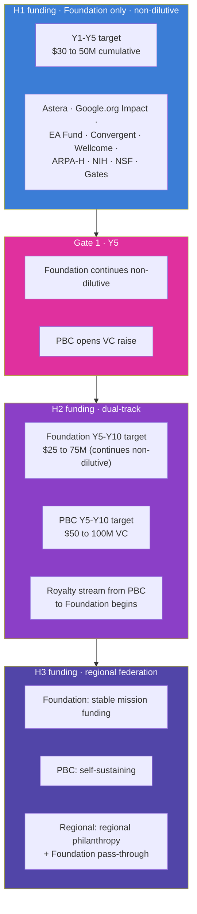

# Funding Strategy

> **Status**: Active
> **Date**: 2026-07-10
> **Author**: @shahin
> **Audience**: leadership
> **Tags**: `strategy`
> **Variants**: Technical (this doc) - Readable (Obsidian twin optional, same filename) - Agent (n/a)

**Companion to:** `20_organization_helix.md`, `02_horizons_and_bifurcation.md`, `40_milestones_and_kpis.md`

The Cytognosis Foundation funding strategy is a portfolio across three categories: active grants, planned grants, and the post-Gate-1 PBC capital. The portfolio is structured so no single source determines whether the mission survives, and so the dual nature of the open Cytoverse map and the proprietary tracking layer maps cleanly to funder types.

## The portfolio at a glance

## Active grants (as of compilation)

| Grant | Amount | Status | Notes |
|---|---|---|---|
| Astera Residency (Fall 2026) | $200K to $1.25M | In review (Round 2 v13 draft) | Patty consulting at $300/hr included in budget; due Sunday 2026-05-10 |
| Google.org AI for Science Impact Challenge | $2.2M | Submitted 2026-04-17 | Awaiting decision; estimated 2,000+ submissions |

## Recent decisions

| Grant | Outcome | Notes |
|---|---|---|
| Foresight AI for Safety | Rejected | Decision documented; Foresight milestones marked NOT EXECUTED in Monday |
| Y Combinator Winter 2025 | Rejected | Early-stage application |
| Y Combinator Spring 2026 | Rejected | Repeat application; non-priority going forward |

## In preparation (planned grants for Y1 to Y5)

Per the funding pipeline maintained in Monday's `Funding Opportunities` board (71 tracked opportunities) and `Grants Pipeline` board (19 active applications):

| Opportunity | Target | Stage | Strategic role |
|---|---|---|---|
| **ARPA-H PHO** | $50M+ | Planning; LOI target Y3 Q1 | Clinical-scale follow-on; powers Y4-Y5 trial |
| **NSF Tech Labs** | $15M | Pending RFP | Cytoverse map at clinical-grade scale |
| **Convergent Research FRO** | $50M | In preparation | Multi-year research-organization scale |
| **Wellcome Leap** | $8M | Planned | UK autoimmune track via Manchester partnership |
| **CZI** | $5M | Planned | Open-science alignment |
| **EA Fund** | $250K to $500K | Planned | Bridge / runway; mission-aligned |
| **Brains Accelerator** | Cohort position | Applied | Helix design refinement |
| **NIH R01 (Mohammadi as PI)** | $2-3M over 5 years | Planned | Standard mechanism for psychiatric biotyping work |
| **Gates Foundation** | TBD | Long-term planned | LMIC pilot; H2-H3 line of sight |
| **Wellcome Trust** | TBD | Long-term planned | UK ecosystem deepening |

## Funding pattern by horizon

### H1 (Years 1 to 5)

Target raise: **$30 to 50M non-dilutive over H1.**

| Year | Target (low-high) | Primary sources |
|---|---|---|
| Y1 | $3 to 5M | Astera Residency (if awarded) + Google.org Impact (if awarded) + EA Fund + early ARPA-H planning grants + first philanthropic partners + personal runway |
| Y2 | $5 to 8M | Google.org Impact milestones + EA Fund + early ARPA-H planning grants + first philanthropic partners |
| Y3 | $8 to 12M | ARPA-H PHO planning grant + NSF Tech Labs (if awarded) + NIH R01 resubmission + continuing philanthropic + first UK grant |
| Y4 | $8 to 15M | Clinical-scale ARPA-H + NIH R01 + Wellcome Leap (if applicable) + UK MRC + first Wellcome Trust |
| Y5 | $5 to 10M | Bridge to PBC activation + continuing philanthropic |

### Gate 1 (Year 5)

Foundation continues non-dilutive. **PBC raises VC** under terms that:

- preserve Foundation governance majority on PBC Board;
- include royalty terms documented in PBC charter;
- target Series A equivalent of $25 to 50M to fund the proprietary clinical study scale-up and the regulated-product engineering;
- preserve Helix structural alignment via Bylaws Article XI provisions.

### H2 (Years 5 to 10)

Target: **$75 to 150M combined** across Foundation and PBC.

- **Foundation continues** non-dilutive at $5 to 15M annually.
- **PBC** raises VC progressively (Series A, B, C); targets break-even or near-break-even by Year 10.
- **Royalty stream** from PBC to Foundation becomes material by Y8.

### H3 (Years 10 to 15)

Primarily revenue from the PBC plus regional philanthropic partners (Gates, Wellcome, regional foundations) funding emerging-market access. Foundation remains non-profit and mission-locked.

## Funder strategic roles

The portfolio is composed so different funders match different strategic needs:

| Strategic role | Best-fit funders |
|---|---|
| Open R&D, mission-aligned, multi-year | Astera, Convergent Research, Speculative Technologies, EA Fund |
| AI-for-science, time-bound milestones | Google.org Impact, foundation AI programs |
| Clinical-scale validation | ARPA-H PHO, NIH R01, NSF Tech Labs |
| UK and EU expansion | Wellcome Leap, Wellcome Trust, UKRI, MRC, Horizon Europe |
| Equity and emerging markets | Gates Foundation, regional philanthropies, Wellcome |
| PBC commercialization | Mission-aligned VC (e.g., Lux, DSV, Foresite, ARCH if alignment fits) |
| Bridge / runway | EA Fund, philanthropic donors, family offices |

## Funder-specific positioning per the bifurcation

Per `23_open_science_and_ip.md`, the bifurcation is itself a positive feature for funders:

- **Pre-bifurcation funders** (Astera, Google.org, ARPA-H, NSF, NIH, Wellcome): treat the open Cytoverse map (H1) as the deliverable of their award. The proprietary track is funded separately at Gate 1 by a different class of capital.
- **Post-bifurcation funders for the open track** (continuing philanthropic, federal, regional): underwrite continued open-map maintenance, equity-of-access work, regional sister organizations, and the open clinical adoption.
- **PBC investors at Gate 1 onward**: underwrite the proprietary tracking and navigation product. Foundation governance majority and Helix structure are explicit terms of the deal.

This composition means we never have to ask one funder for both halves of the work, and we never put the open mission at the mercy of a single commercial decision.

## Funding pipeline operations

The pipeline is operationalized in the Monday workspace:

- **Funding Opportunities** board: catalog of all 71+ tracked opportunities with research profiles, requirement extraction, strategic-fit scoring.
- **Grants Pipeline** board: active applications with stage, status, dependencies on Strategic Initiatives and Strategic Goals.
- **Grant Resource Plan**: personnel and compute lines per grant-stage with tiered pricing.
- **Personnel and Compute Rate Cards**: reference pricing tables.

Operating cadence:

- **Weekly:** grants pipeline review with active stage-gate movements.
- **Monthly:** funding-opportunities scan for new RFPs and emerging programs.
- **Quarterly:** strategic-fit re-scoring and pipeline pruning.
- **Annually:** funder portfolio audit at the Hoshin catch-ball.

## Risk: funding concentration

The single largest financial risk in H1 is over-concentration on a small number of funders. The mitigation is the portfolio approach: at any time, no single funder source can be more than 50% of total annual operating budget. UK office creation in Y2 explicitly diversifies the geography of the funding base. The EA Fund and small philanthropic partners create a long tail that buffers against major-grant denial.

## Cross-references

- The bifurcation that gives the funding strategy its structure: `02_horizons_and_bifurcation.md`.
- The Helix governance that keeps the PBC capital aligned to mission: `20_organization_helix.md`.
- The IP and open-science posture funders are buying into: `23_open_science_and_ip.md`.
- The milestone-and-KPI map that funders track against: `40_milestones_and_kpis.md`.
- The risk register entry on funding concentration: `41_risks_and_mitigations.md`.
