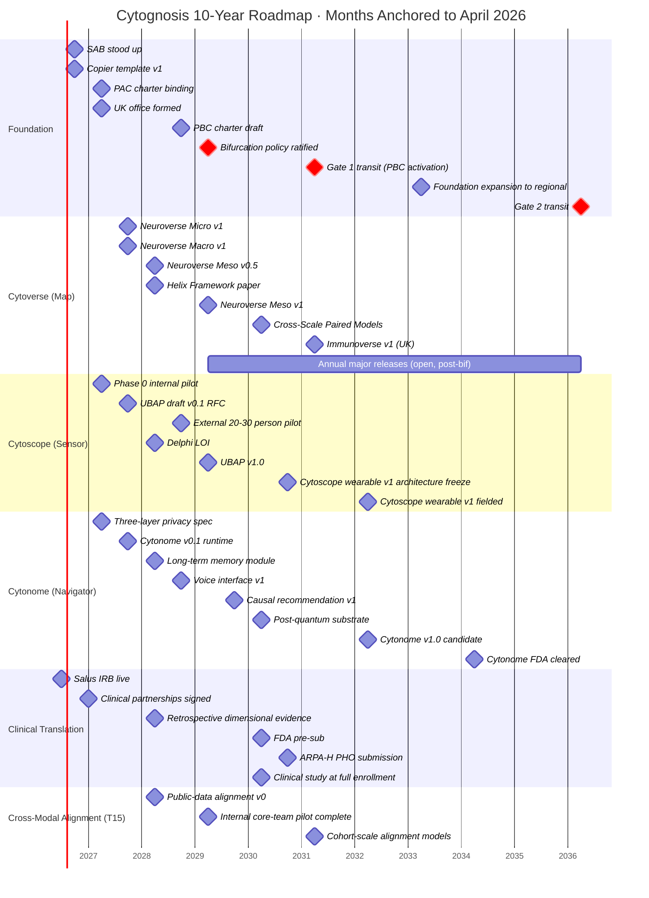

# Consolidated Milestones and KPIs

> **Status**: Active
> **Date**: 2026-07-10
> **Author**: @shahin
> **Audience**: leadership
> **Tags**: `strategy`
> **Variants**: Technical (this doc) - Readable (Obsidian twin optional, same filename) - Agent (n/a)

**Companion to:** all horizon documents (`03_*`, `04_*`, `05_*`), the platform documents (`10_*`, `11_*`, `12_*`), and the funding strategy (`30_*`)

This document gives the consolidated view of the milestone roadmap and the KPIs that govern progress. It is the dashboard reference for Board reviews, advisor briefings, and grant reviewer questions about timeline.

## The 10-year milestone Gantt

## KPIs by horizon

### H1 (Years 1 to 5)

| KPI ID | Description | Target | Owner |
|---|---|---|---|
| `KPI-01` | Cumulative non-dilutive funding secured | $30 to 50M | CEO |
| `KPI-02` | Cytoverse axes recover Grotzinger 5-factor structure | r ≥ 0.5 on ≥3 of 5 dimensions | CSO |
| `KPI-03` | Cross-scale imputation AUROC | ≥ 0.75 for ≥1 indication | CSO |
| `KPI-04` | Open releases pass release checklist | 100% | Platform Engineering |
| `KPI-05` | Hugging Face downloads of Cytoverse models | ≥1,000 unique users (Y3) | Communications |
| `KPI-06` | Citing publications | ≥50 within 18 months of release (Y4) | CSO |
| `KPI-07` | UBAP adopted externally | ≥2 partners (Y5) | CTO |
| `KPI-08` | Clinical IRB and partner agreements | ≥3 partner sites (Y2) | Clinical lead |
| `KPI-09` | UK office FTE | ≥5 by Y3 | UK lead |
| `KPI-10` | Zero raw-data egress incidents | 0 incidents (continuous) | Privacy lead |
| `KPI-11` | PAC binding decisions exercised | ≥1 documented case by Y3 | Board secretary |
| `KPI-12` | Clinical-to-wearable alignment quality across protected attributes | No subgroup ≥10% below median (Y3) | Equity lead |
| `KPI-13` *(new)* | Bifurcation Phase tagging on Strategic Initiatives | 100% by Y3 Q1 | Operations |

### H2 (Years 5 to 10)

| KPI ID | Description | Target |
|---|---|---|
| `KPI-21` | FDA cleared products | ≥1 by Y10 |
| `KPI-22` | Field-deployed continuous tracking devices | ≥10,000 by Y10 |
| `KPI-23` | UBAP adopted externally | ≥5 partners by Y10 |
| `KPI-24` | NPS across active users | ≥50 with no demographic subgroup below 30 |
| `KPI-25` | PBC operational status | Break-even or funded path within 24 months |
| `KPI-26` | PAC multi-continental composition | At least one seat per active region |
| `KPI-27` | Foundation operations | Self-sustained without further philanthropic catalytic capital |
| `KPI-28` | Annual open releases of Cytoverse map | ≥1 per year |

### H3 (Years 10 to 15)

| KPI ID | Description | Target |
|---|---|---|
| `KPI-41` | Regional sister organizations | 3 to 5 active by Y15 |
| `KPI-42` | Languages supported in Cytonome | ≥20 by Y12 |
| `KPI-43` | Regulatory clearances | ≥5 jurisdictions by Y15 |
| `KPI-44` | WHO-level policy contributions | ≥1 substantive contribution by Y14 |
| `KPI-45` | UBAP recognition | International standards body adoption (IEEE, ISO, or HL7) |
| `KPI-46` | Substrate handoff readiness | Multi-stakeholder steward ready by Y15 |

## KPI cadence

- **Quarterly review.** All H1 KPIs reviewed quarterly at the OKR review.
- **Annual update.** All KPIs reviewed annually at the Hoshin catch-ball; targets adjusted with explicit justification.
- **Board cadence.** Foundation Board sees KPI-01 (funding), KPI-04 (release-checklist compliance), KPI-10 (privacy), KPI-11 (PAC) every meeting; full set quarterly.
- **Funder cadence.** Funder reports use KPIs aligned to the specific grant; the master KPI list is the superset.

## Bifurcation tagging KPI

A new KPI for v2.0: every Strategic Initiative carries a Bifurcation Phase tag (`pre-36m-open`, `post-36m-open`, `post-36m-proprietary`). Coverage is the KPI: 100% by Y3 Q1. Without complete tagging, the bifurcation cannot be operationalized cleanly at M37.

## Cross-references

- Detailed milestones by horizon: `03_short_term_1to2y.md`, `04_mid_term_5to6y.md`, `05_long_term_10y.md`.
- Gate criteria that the KPIs feed: `02_horizons_and_bifurcation.md`.
- Funding KPIs in detail: `30_funding_strategy.md`.
- Risk register: `41_risks_and_mitigations.md`.
- Monday boards that hold the operational KPI state: `appendix/C_monday_restructure_spec.md`.
