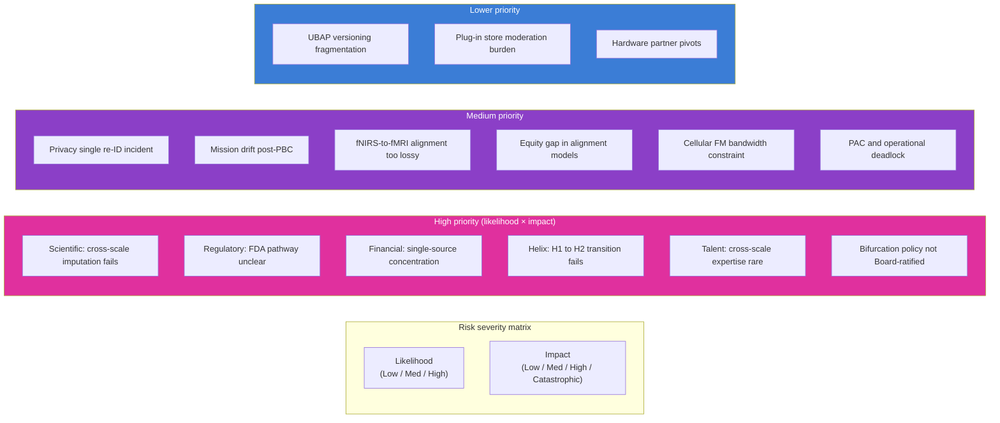

# Risks and Mitigations

> **Status**: Active
> **Date**: 2026-07-10
> **Author**: @shahin
> **Audience**: leadership
> **Tags**: `strategy`
> **Variants**: Technical (this doc) - Readable (Obsidian twin optional, same filename) - Agent (n/a)

**Companion to:** all horizon documents and `40_milestones_and_kpis.md`

The Cytognosis risk register is maintained on the Risks Register Monday board. This document presents the strategic-level risk picture and the new risks introduced by the v2.0 changes (bifurcation, parallel FM track, PAC, clinical-to-wearable subtrack).

## Risk matrix

## Strategic-level risk register

| ID | Risk | Likelihood | Impact | Mitigation | Track | Source |
|---|---|---|---|---|---|---|
| R-01 | Cross-scale imputation fails at clinically useful effect sizes | Medium | High | Three independent indications (neuropsychiatric, autoimmune, neurodegen) so domain-specific failure does not collapse platform; early retrospective evidence by M24 | T1, T3 | v1.0 |
| R-02 | FDA pathway unclear for continuous monitoring products | Medium | High | Engage FDA DHCE and Biomarker Qualification Program from Y1; general-wellness first, disease-claim second | T3, T7 | v1.0 |
| R-03 | Single-source grant funding concentration | Medium | High | Portfolio approach; UK office creates second grant ecosystem; Helix structure gives optionality into VC for PBC | T10 | v1.0 |
| R-04 | H1 to H2 Helix transition fails | Medium | Catastrophic | Helix Framework is itself a deliverable; legal counsel from Y1; PBC charter drafted before Y3 | T8, T9, T10 | v1.0 |
| R-05 | Talent: cross-scale expertise is rare | High | High | Affiliate-first hiring model; Science+Engineering track pairing; UK expansion diversifies talent pool | T9 | v1.0 |
| R-06 | Privacy: single re-ID incident destroys trust | Low | Catastrophic | Edge-first architecture; DP and re-ID probes on every release; zero raw-data egress SLO | T2, T4, T8 | v1.0 |
| R-07 | Mission drift post-PBC activation | Medium | Catastrophic | Bylaws Articles VI and XI; board composition requirements; people-as-seed-funders alignment; PAC binding rights | T8, T9 | v1.0 |
| R-08 *(new in v2.0)* | Bifurcation policy not Board-ratified before M30 | Low | High | Without it, PAC cannot operate at the gate; without PAC at the gate, Gate 1 fails. Ratify at M12 or earlier; provisional operating policy before formal ratification if needed | T8, T14 | v2.0 |
| R-09 *(new in v2.0)* | fNIRS-to-fMRI alignment too lossy for clinical-to-wearable transition | Medium | High | Multimodal fusion (fNIRS + EEG + physiology together) recovers more than fNIRS alone; equity-stratified alignment quality reporting; defer wearable-only deployment for affected populations | T15, T2 | v2.0 |
| R-10 *(new in v2.0)* | Equity gap in alignment-model quality is structural and unfixable for some subgroups | Low | Catastrophic | If unfixable, the affected modality is not deployed for the affected population; ship inclusive subset rather than ship-and-fail | T15, T6, T13 | v2.0 |
| R-11 *(new in v2.0)* | Cellular FM track bandwidth constrained because Mango unavailable | Medium | Medium | Confirmed at 2026-05-07: Shourya leads both tracks; Mango contributes as bandwidth allows; shared infrastructure package keeps work parallel rather than serial | T1, T2 | v2.0 |
| R-12 *(new in v2.0)* | PAC and operational leadership deadlock on a participant-impacting decision | Medium | High | Pre-committed escalation to Foundation Board with both positions; SLAs on routine decisions; pre-committed timeboxing on resolution | T14 | v2.0 |
| R-13 *(new in v2.0)* | UBAP fails to gain external adoption | Medium | Medium | Lightweight v1; reference implementation in Apache 2.0; co-development with strategic partners (Delphi, Caltech FRO); standards-body engagement at Y6+ | T4, T2, T5 | v2.0 |
| R-14 *(new in v2.0)* | Patient consent revocation creates technical inability to delete from federated substrate | Medium | Medium | Cryptographic revocation (destroy decryption keys, render shards inaccessible) where physical deletion is not possible; user-facing transparency about technical limits | T8, T11, T14 | v2.0 |
| R-15 *(new in v2.0)* | Hardware partner discontinues or pivots before alignment models are robust | Medium | Medium | Multi-vendor strategy from Y1; UBAP standard ensures replaceability; review hardware partners annually | T2, T5 | v2.0 |
| R-16 *(new in v2.0)* | Patty Purcell unavailable mid-Astera draft | Low | Medium | Astera proposal architecture is owned by Mohammadi with Patty as collaborator; backup grants-and-comms capacity in-house by Y2; explicit succession plan for the consultant role | T10, T9 | v2.0 |
| R-17 *(new in v2.0)* | Astera consulting payment workflow delays Patty's ability to fully engage | Low | Low | Consulting fee included in proposal budget for early payment; bridge agreement if needed; alternative funding source identified if proposal not awarded | T10 | v2.0 |

## Risk owners

The Risks Register Monday board (id `18409731742`) tracks each entry with an owner. Per the Monday survey, the board exists but operational metadata (owners, current status updates) was empty at compilation. Restructure spec (`appendix/C_monday_restructure_spec.md`) includes populating risk owners.

| Risk category | Owner |
|---|---|
| Scientific (R-01, R-09, R-11) | CSO (Mohammadi acting through Y1; dedicated CSO Y2+) |
| Regulatory (R-02) | Clinical / Regulatory lead (hire by Y2 Q3) |
| Financial (R-03, R-17) | CEO and grants/operations |
| Organizational (R-04, R-05, R-08, R-12, R-16) | CEO and Board secretary |
| Privacy (R-06, R-14) | Privacy lead and PAC |
| Mission (R-07) | Foundation Board |
| Equity (R-10) | Equity lead and PAC |
| Ecosystem (R-13, R-15) | CTO |

## Risk review cadence

- **Quarterly review** at the OKR review meeting; status updates on any high-priority risk.
- **Annual deep review** at the Hoshin catch-ball; matrix recomputed; new risks added as the operating environment shifts.
- **Trigger-based emergency review** if any high-priority risk escalates between scheduled reviews.

## What this v2.0 adds

The v1.0 risk register had 7 strategic risks (R-01 through R-07). v2.0 adds 10 (R-08 through R-17) reflecting the new structural decisions:

- bifurcation requires governance ratification (R-08);
- clinical-to-wearable alignment introduces specific scientific and equity risks (R-09, R-10);
- parallel cellular and connectomic tracks introduce a bandwidth risk specific to the Purdue partnership (R-11);
- PAC governance introduces deadlock risk (R-12);
- UBAP open standard introduces adoption risk (R-13);
- post-quantum and federated substrate introduce technical-deletion risk under consent revocation (R-14);
- hardware partner dependency introduces continuity risk (R-15);
- Astera consultant engagement introduces specific grant-cycle risks (R-16, R-17).

Each new risk has a documented mitigation and a track tag for ongoing ownership.

## Cross-references

- The bifurcation that drives several v2.0 risks: `02_horizons_and_bifurcation.md`.
- The clinical-to-wearable subtrack that drives R-09 and R-10: `12_clinical_to_wearable.md`.
- The PAC charter that addresses R-12: `21_patient_advocacy_council.md`.
- The patient-safety architecture that addresses R-06 and R-14: `16_patient_safety_architecture.md`.
- The funding strategy that addresses R-03: `30_funding_strategy.md`.
- The Helix structure that addresses R-04 and R-07: `20_organization_helix.md`.
