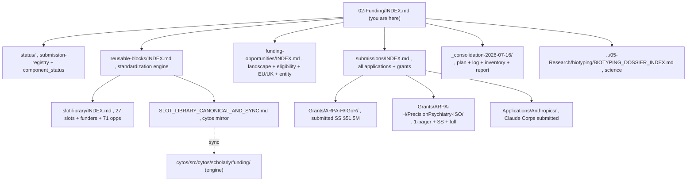

# 02-Funding, Master Index (single point of entry)

> **Status:** Active · **Date:** 2026-07-17 · **Author:** Shahin Mohammadi · **Tags:** `funding`, `index`
> This is the canonical entry point for all grants, applications, and funding-opportunity work. Every hub below has its own index; follow the tree.

**If you only read one thing:** [`status/submission-registry.md`](status/submission-registry.md) (what is submitted, pending, and due) and [`_consolidation-2026-07-16/CONSOLIDATION_LOG.md`](_consolidation-2026-07-16/CONSOLIDATION_LOG.md) (the program log).

## The artifact graph

## Hubs

| Hub | Index | What lives there |
|---|---|---|
| **Status** | [`status/submission-registry.md`](status/submission-registry.md), [`status/component_status.md`](status/component_status.md) | Live status of every submission; the URGENT week and watchlist |
| **Submissions** | [`submissions/INDEX.md`](submissions/INDEX.md) | Every application and grant, each with its own `INDEX.md` |
| **Funding opportunities** | [`funding-opportunities/INDEX.md`](funding-opportunities/INDEX.md) | Landscape, eligibility axes, EU/UK, entity memo |
| **Standardization engine** | [`reusable-blocks/INDEX.md`](reusable-blocks/INDEX.md) | Slots, funders, manifest, sizes, values, sync, code tasks |
| **Consolidation program** | [`_consolidation-2026-07-16/CONSOLIDATION_LOG.md`](_consolidation-2026-07-16/CONSOLIDATION_LOG.md) | Plan, asset inventory, prior-work synthesis, progress report |
| **Science (biotyping)** | [`../05-Research/biotyping/BIOTYPING_DOSSIER_INDEX.md`](../05-Research/biotyping/BIOTYPING_DOSSIER_INDEX.md) | Dossier, two variants, dimensional-map figure |

## Engines and data (outside this repo)

- **Render engine + schema mirror:** `https://github.com/cytognosis/cytos/tree/main/src/cytos/scholarly/funding` (parser, extractor, harmonizer, generator, render). Sync rule: [`reusable-blocks/SLOT_LIBRARY_CANONICAL_AND_SYNC.md`](reusable-blocks/SLOT_LIBRARY_CANONICAL_AND_SYNC.md).
- **Raw parsed solicitations:** `https://github.com/cytognosis/cytos/tree/main/data/staged/grants`.
- **Primary data + ontologies:** `https://github.com/cytognosis/datasets/tree/main/cytognosis`.
