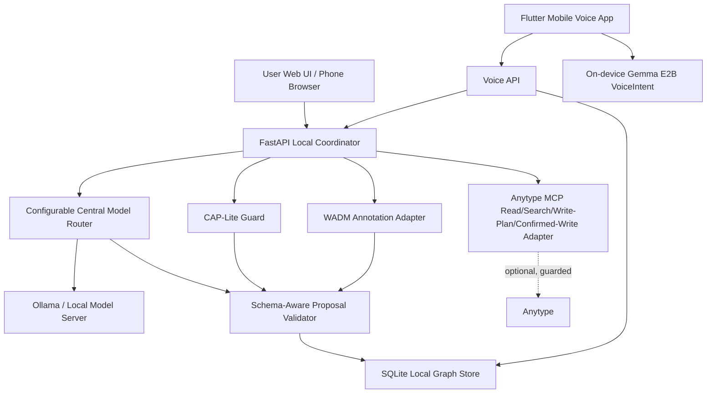

# Architecture

## Layers

**UI**
Mobile-first web shell at `GET /` for capture, annotation, search, local editing, and Anytype write planning. Flutter mobile app under `mobile/` for Status, Voice, Objects, Anytype Plan, and Settings.

**Capture API**
`POST /capture` accepts raw text, voice transcript, webpage, message, or screenshot-style captures and sends them through the coordinator.

**Model Router**
Configurable interface for object extraction. The default provider is a deterministic offline stub. HTTP JSON and Ollama-compatible providers can be configured without changing the coordinator contract. Product Milestone 1 uses `YAR_CENTRAL_MODEL_PROVIDER=ollama`; this desktop exposes the central model as `gemma4:e4b`.

**CAP-Lite**
Blocks disallowed or unconfirmed operations before graph mutation. It refuses diagnosis, treatment recommendation, health-risk scoring, raw data sharing without consent, unsupported social certainty, and unconfirmed external writes.

**Schema Registry**
Registers LinkML-like YAML schemas locally and stores normalized class, slot, relationship, and Anytype mapping metadata.

**Proposal Validator**
Checks model/object proposals against the built-in object model and registered schema metadata. It can run permissive or strict validation.

**SQLite Graph Store**
Local fallback graph store for objects, links, captures, execution reports, schemas, Anytype write plans, and voice conversation turns. This is the demo source of truth.

**Anytype MCP Adapter**
Supports configuration/status checks, read/search integration, dry-run schema mapping, guarded write planning, and confirmed write execution. Real writes require explicit user confirmation and a configured Anytype MCP environment.

**Voice API**
`/voice/turn` accepts mobile transcripts and optional edge `VoiceIntent`, applies CAP-Lite, routes centrally, stores objects locally, and returns assistant text plus suggested actions. `/voice/plan-anytype-write` and `/voice/confirm-anytype-write` preserve the plan-before-confirm boundary.

**WADM Annotation Adapter**
Transforms webpage highlight payloads into W3C Web Annotation Data Model-compatible Annotation and Webpage objects, then stores them through the same coordinator path.
