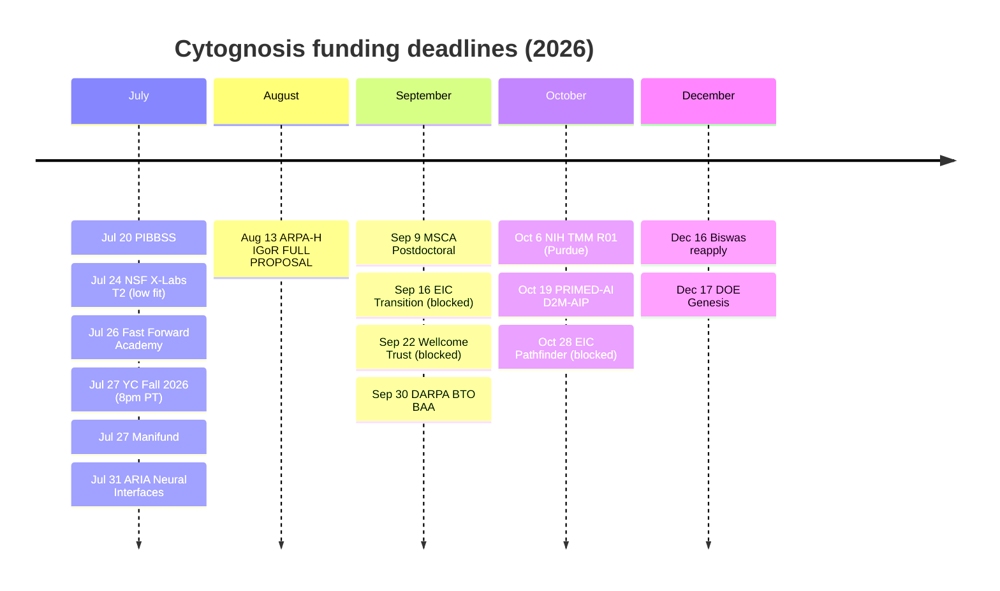
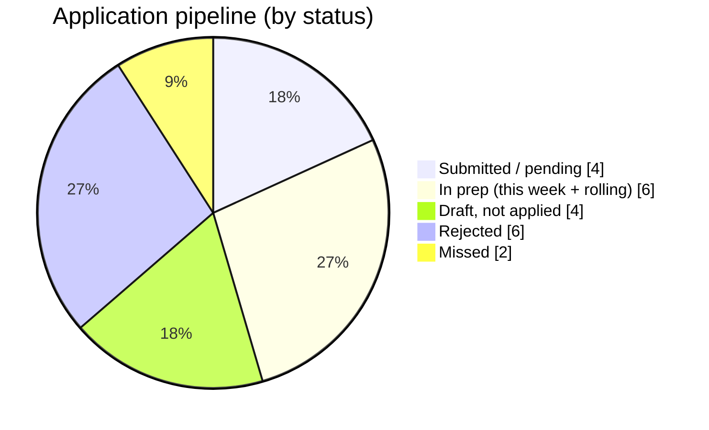

# Grants & Applications Consolidation, Progress Report

> **Status:** Active · **Date:** 2026-07-17 · **Owner:** Shahin Mohammadi (with Claude) · **Tags:** `funding`, `progress-report`
> **Mission of this work:** consolidate all grants, applications, and funding opportunities into one interconnected, version-controlled system, and drive the live pipeline.

> [!NOTE]
> **If you only read one thing:** everything now hangs off a single entry point, [`docs/02-Funding/INDEX.md`](https://github.com/) (in repo `~/repos/cytognosis/docs`). Claude Corps was **submitted Jul 17**. The next actions are **Fast Forward Academy (~Jul 26)** and **YC Fall 2026 (Jul 27)**.

**Reading time:** ~4 minutes. Everything below is committed to git as Shahin Mohammadi, behind two backup tags.

---

## 0. Deadline calendar (DO NOT MISS)

> [!WARNING]
> Every dated opportunity is here. Rolling items are listed separately. Entity-blocked items need a UK/EU lead; skip unless routed via Madhvi/Manchester.

| Date (2026) | Opportunity | Action | Flag |
|---|---|---|---|
| **Jul 26** | Fast Forward Academy | Confirm date, record demo video, submit | 501(c)(3) fit |
| **Jul 27, 8pm PT** | YC Fall 2026 | Submit (recommended) | PBC / Yar |
| **Jul 31** | ARIA Scalable Neural Interfaces | Assess + apply | US lead OK |
| **Aug 13** | ARPA-H IGoR full proposal | Active build, largest ($51.5M) | prime Purdue |
| **Sep 9** | MSCA Postdoctoral Fellowship | Assess | EU host needed |
| **Oct 6** | NIH RFA-DA-27-004 TMM R01 | via Purdue / Grama | academic lead |
| **Oct 19** | PRIMED-AI D2M-AIP (RFA-RM-27-012) | Cytognosis can be PI | strong new fit |
| **Dec 16** | Biswas Fast Grant (reapply) | Was rejected Jul 1; reapply | 501(c)(3) |
| **Dec 17** | DOE Genesis Mission FOA | Assess | — |
| **Rolling** | ARPA-H PHO ISO **SN-26-156** (precision psych), ARPA-H EVIDENT TA4, Wellcome Leap, Google.org Impact, EA LTFF, Coefficient Capacity, Manifund | Send one-pagers / submit anytime | — |
| **Entity-blocked** | Sep 16 EIC Transition; Sep 22 Wellcome Trust Discovery; Sep 30 DARPA BTO; Oct 28 EIC Pathfinder | Skip unless routed via Manchester | needs UK/EU lead |

---

## 1. Scoreboard

| Metric | Value |
|---|---|
| Git commits this program | **~36** (29 documentation + 7 engine), all as Shahin Mohammadi |
| Backup tags | `pre-grants-consolidation-2026-07-16`, `pre-slotlib-codetasks-2026-07-16` |
| Applications tracked | **22** |
| Submitted / pending | **4** (IGoR SS, Google.org Impact, Foresight R2, Claude Corps) |
| In prep now | Precision-Psych ISO, Convergent, YC, Fast Forward, EA LTFF |
| Rejected / missed (recorded) | 6 rejected, 2 missed |
| Standardization | 27 slots, **14 funder configs** (was 10), 71+ opportunities |
| New this session | full proposal, opportunity landscape, biotyping dossier, 4 funder configs |

---

## 2. Live pipeline (what is where)

| Program | Status | Next |
|---|---|---|
| **Claude Corps** | ✅ Submitted Jul 17 | Decision late Aug |
| **ARPA-H IGoR (PsychIGoR)** | Pending, SS in ($51.5M) | Full proposal **Aug 13** |
| **Fast Forward Academy** | Prep | **~Jul 26** (confirm date; demo video) |
| **YC Fall 2026** | Prep | **Jul 27, 8pm PT** |
| **Precision-Psych ARPA-H ISO (SN-26-156)** | 1-pager + 6pg SS + full draft | Send Smoller/Coppersmith; finalize SS |
| Google.org Impact / Foresight R2 | Pending | rolling |
| EA LTFF / Coefficient Capacity / Manifund / ElevenLabs | Draft, not applied | rolling |
| PRIMED-AI D2M-AIP | New target, Cytognosis can be PI | **Oct 19** |
| NIH TMM R01 (Purdue/Grama) | Planned | **Oct 6** |

> [!IMPORTANT]
> **Act this week:** Fast Forward Academy (~Jul 26, email academy@ffwd.org to confirm the Jul 17-vs-26 date, record a 3-min demo video) and YC Fall 2026 (Jul 27, 8pm PT). Both are prepped and ready to paste.

---

## 3. What was built (by workstream)

**Standardization engine** ([`reusable-blocks/INDEX.md`](.)) : verified the mature slot-library; added `section_size_budgets.md` (ARPA-H SS = **6 pages** official, corrected from 5), `funder_values_view.md`, `SLOT_LIBRARY_CANONICAL_AND_SYNC.md`, and 4 new funder configs (arpah_program_iso, nsf_xlabs, primed_ai, nsf_sch). Renamed `yc_nonprofit → yc_s26_pbc`.

**Submissions** ([`submissions/INDEX.md`](.)) : rebuilt the status registry to verified truth; wrote **17 per-application INDEX records**; folded 3 orphan duplicates (archived, never deleted); stored final submitted-markdown snapshots for **Claude Corps** and the **IGoR SS**.

**Funding opportunities** ([`funding-opportunities/INDEX.md`](.)) : full US + UK/EU landscape, eligibility axes, EU/UK funders, entity memo (recommendation: **no UK/EU entity**, route via Madhvi/Manchester), and NIH/NSF additions (NSF SCH, Bridge2AI, PRIMED-AI).

**Precision psychiatry** ([`submissions/Grants/ARPA-H/PrecisionPsychiatry-ISO/`](.)) : a 1-pager, a 6-page ISO Solution Summary, and a **full unabridged proposal** (biotypes, gaps, personalized + rapid-acting treatment, EVIDENT, web-verified references).

**Biotyping science** ([`05-Research/biotyping/BIOTYPING_DOSSIER_INDEX.md`](.)) : dossier index, two variants (ND-friendly + grant/review), and a dimensional-map figure v1.

**Engine code** (independent Claude Code worker on `cytos` + docs) : built configs, synced the schema mirror, validated via `cytos funding registry list` (18 funders resolve).

---

## 4. Master points of entry (bookmark these)

| # | Entry point | Path |
|---|---|---|
| 1 | **Master index** | `docs/02-Funding/INDEX.md` |
| 2 | **Live status** | `docs/02-Funding/status/submission-registry.md` |
| 3 | **Program log + ledger** | `docs/02-Funding/_consolidation-2026-07-16/CONSOLIDATION_LOG.md` |
| 4 | **This report** | `docs/02-Funding/_consolidation-2026-07-16/PROGRESS_REPORT.md` |
| 5 | **Opportunity landscape** | `docs/02-Funding/funding-opportunities/OPPORTUNITY_LANDSCAPE_2026-07-16.md` |
| 6 | **Standardization engine** | `docs/02-Funding/reusable-blocks/INDEX.md` |
| 7 | **Biotyping dossier** | `docs/05-Research/biotyping/BIOTYPING_DOSSIER_INDEX.md` |

---

## 5. Health audit (interconnection, orphans, duplicates)

> [!TIP]
> Ran a repo-wide link/orphan/index audit. The artifact graph is now rooted at `02-Funding/INDEX.md` with hub indexes one level down.

| Finding | Detail | Status |
|---|---|---|
| **Missing master entry point** | No `02-Funding/INDEX.md` existed | ✅ Fixed (created; + reusable-blocks, funding-opportunities hub indexes; submissions/INDEX refreshed) |
| **Duplicate basenames** | `INDEX.md`, `README.md` (expected per folder); slot files U01/U03/U10 appear twice; one-pagers duplicated by intentional `simple/` ADHD twins | ℹ️ Mostly expected; slot double-listing queued to verify |
| **Orphan / unreferenced (md-link)** | ~180 files flagged, but most are leaf slots + 71 funder profiles referenced by `manifest.yaml`/`opportunity_mapping` (YAML, not markdown links), plus intentional `_archive/` and `_RELOCATED` pointers | ⚠️ Largely false positives; genuine ones now linked via the new indexes |
| **Folders with md but no INDEX** | ~40 (mostly IGoR sub-trees + archives) | ⏳ Remediation queued (see follow-up) |

> [!WARNING]
> Full per-subfolder `INDEX.md` coverage (esp. the IGoR sub-trees) is **not yet complete**. The top-level graph is connected; the deep IGoR leaves are the remaining interconnection work, tracked below.

---

## 6. Guardrails honored

> [!NOTE]
> Backups before every change; **archive over delete** (3 orphans relocated, zero deletions); explicit-path commits; **IGoR Google Docs never edited programmatically** (only read for the snapshot); no PI salary; impact framed as lives; voice rules kept; code changes run as independent Claude Code instances.

---

## 7. Open follow-ups

1. **Fast Forward Academy** (~Jul 26): confirm date, record demo video, submit.
2. **YC Fall 2026** (Jul 27, 8pm PT): submit (recommended).
3. **Finalize Precision-Psych ISO SS**: references, figure to SVG, budget with Purdue SPS; send Smoller + Coppersmith one-pagers.
4. **Monday board sync** (connector needs re-auth).
5. **Interconnection remediation**: add `INDEX.md` to the ~40 remaining subfolders (IGoR sub-trees first).
6. **cytos noxfile bug**: `parse_grants` calls the old `cytos grants` CLI; rename to `cytos funding`.
7. **Ali (PhD student)**: confirm citizenship; default to a grant-funded GRA slot or a direct industry-sponsored PhD.
8. **Entity**: decide UK/EU vehicle with Duane + CPA.

---

## 8. Standing guideline (now permanent)

> [!IMPORTANT]
> **After every working turn on a multi-artifact task, always:** (1) update or create a `PROGRESS_REPORT.md` in the Claude project folder and present it; (2) maintain a master `INDEX.md` entry point plus hierarchical sub-indexes so every file is reachable in one citation graph; (3) run an orphan / duplicate / missing-index audit and remediate or queue; (4) keep it ADHD-friendly (BLUF, tables, mermaid, GitHub alert blocks, direct links). The general form is saved in `GUIDELINE_progress_and_indexing.md` and in persistent memory.
