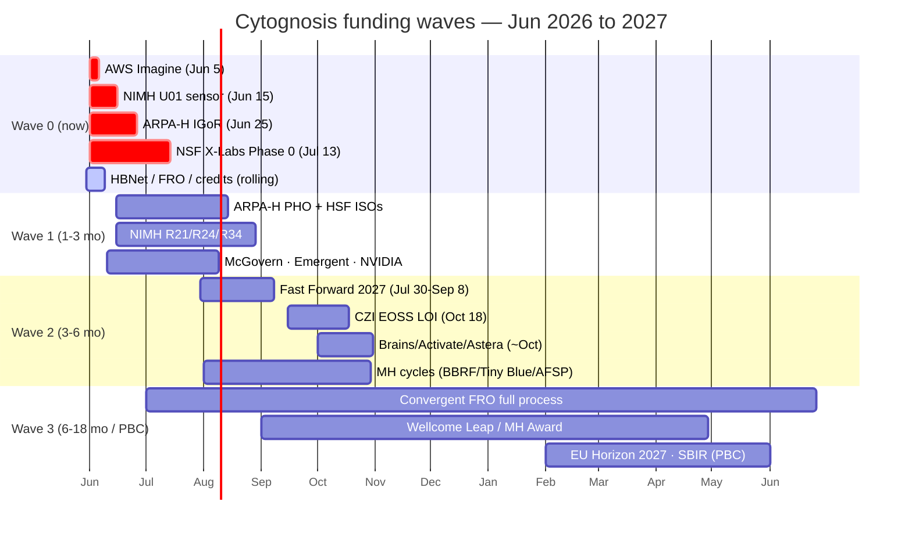
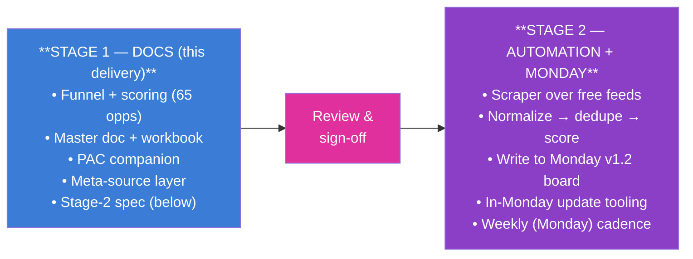
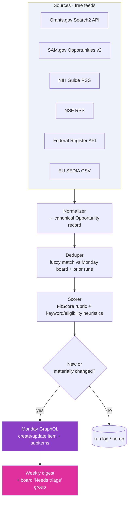

# Cytognosis Foundation — Funding & Opportunity Strategy (Master)

> **Status**: Active
> **Date**: 2026-07-10
> **Author**: @shahin
> **Audience**: leadership, grant team
> **Tags**: `funding`
> **Variants**: Technical (this doc) - Readable (Obsidian twin optional, same filename) - Agent (n/a)

**Compiled:** 2026-05-30 · **Last status update:** 2026-06-01 · **Method:** hierarchical funnel with iterative pruning · **Status:** Stage 1 (docs) — **iteration 4**

> **Iteration 2 (2026-05-30) added:** real application history (YC, Foresight, QB3, Brains, Astera — all rejected; Nucleate — alumnus); the **Eli Lilly** ecosystem via the **Ananth Grama / Purdue $250M alliance** (warmest high-fit path); **Mayo** Platform; the **Nucleate×Lilly** Grand Challenge; the **autism cluster** (BRAIN Foundation, Autism Society, SPARK) reached via **Sarika Agrawal**; **MRI** (Mental Research Institute); the **MGH Center for Digital Mental Health**; the **APA** App-Evaluation + **Future-DSM** influence path; **Mt Sinai (Roussos)** & **MGH (Smoller)** academic partners; and a new **Network & Warm-Intro Map** (workbook tab + §5A here). The workbook now carries **Prior Status** and **Access / Warm-Intro Path** columns. See §1B.

> **Iteration 4 (2026-06-01) — status sync:** **Foresight resubmission SUBMITTED 2026-05-31** (pending review). **AWS Imagine category confirmed as Go Further, Faster** ($150K + $100K credits; form filled, ready). **Career Transition ($165K) and EA LTFF (~$125K) drafted and ready to submit** (runway floor). **Coefficient Capacity Building ($175K) drafted.** All compute/credits (Anthropic, NAIRR, Cohere) and ElevenLabs ready. Mental-health self-serve adds (Tiny Blue Dot ~Sep LOI, AFSP ~Aug LOI, CIAPM) confirmed self-serve. OneMind, BBRF/NARSAD, Wellcome MH need host PI/verification (parked Tier 3).

> **Iteration 3 (2026-05-30) — status corrections + international strategy:** **SAM.gov is done.** **NVIDIA Inception auto-rejected** (nonprofit/form-parameter mismatch — re-approach via the SF-Tech-Week program lead, or use the nonprofit-eligible NVIDIA Academic Grant `F016`). **ARPA-H = pick ONE Mission-Office ISO → HSF `F010`** (PHO `F009` is the mutually-exclusive alternative; IGoR `F001` is a separate program solicitation — confirm co-eligibility). **Wellcome Leap HBNet was emailed Dec 15 + Jan 26 with no response** → escalate via a member institution or a Program Director, not another cold email. New **§5B International Strategy**: a US nonprofit is self-funded-only in Horizon, but the **UK is Horizon-associated since 2024**, so anchor through **Manchester / Madhvi Menon (UKRI Future Leaders Fellow)** — added UKRI/MRC `F090` and EU EP PerMed `F091`.

> [!TIP]
> **Just want to know what to do next?** Read the ADHD-friendly [**Funding Action Tracker**](Cytognosis_Funding_ACTION_TRACKER_2026-05-31.md). It marks what is drafted, links every draft, and orders actions so the **no-outreach ones come first**. This master doc is the detailed reference behind it.

**Companion files (same folder):**

- `Cytognosis_Funding_Funnel_2026-05-30.xlsx` — full scored dataset (Master, Funnel Summary, Meta-Sources, PAC & Advocacy, Backup, Wave Action Plan). Row IDs (F001…) used throughout this doc map to that workbook.
- `Cytognosis_PAC_Advocacy_Companion_2026-05-30.md` — the separate Patient Advocacy Council / partnership companion list.
- Builds on `fundings/compass_artifact…md` (v1) + `fundings/funding_strategy_v2_update.md` (v2) and the Monday **Funding Opportunities** board (71 entries, `cytognosis_funding` v1.2 schema).

> **Scope of this pass (per your direction):** cast the widest net, then prune through a funnel with explicit quantitative gates at each level; gather *comparable* metrics for every candidate at each level; park anything promising-but-unverifiable in a clearly-marked **backup list** rather than dropping it. Mental health is treated as a full funding wave (a known gap in prior research). All **docs are delivered first and completely**; the automation + Monday write-back + in-Monday update tooling is fully *specified* here as **Stage 2** and built next.

---

## 1 · TL;DR — what to do now

We screened ~150 candidates down to **65 scored opportunities** (47 actionable / 18 parked) plus **30 discovery sources** and **20 advocacy/PAC orgs**. Distribution: **8 Wave-0 (now)**, 10 Wave-1, 28 Wave-2, 11 Wave-3, 8 backup. 26 score "strong fit" (≥8/10), 37 "good fit" (6–7.9).

**The single most important finding:** three *new*, high-fit, **nonprofit-eligible**, currently-open federal/corporate calls land in the next four weeks — none were in the prior registry.

**Wave 0 — act in the next ≤4 weeks (do these now):**

| When | Opportunity | Fit | $ | Status (as of 2026-06-01) | ID |
|---|---|---|---|---|---|
| **Jun 5** | AWS Imagine Grant — Go Further, Faster (GenAI) | 7.3 | $150K cash + $100K credits | **Filled, ready to submit** (org info + AWS account ID + phone complete; Round 1 short form) | F003 |
| **Jun 15** | NIMH BRAIN: Next-Gen Human **Sensor** Tech (RFA-MH-26-140, U01) | 8.6 | ~$1–2M | Draft/aims exists; go/no-go this week | F002 |
| **Jun 25** | **ARPA-H IGoR** (AI mechanistic disease modeling) | 8.9 | Mega program | **Ready — Solution Summary drafted, self-serve** | F001 |
| **Jul 13** | NSF X-Labs Topic 1 — Sensing & Imaging (Phase 0) | 7.9 | ≤$1.5M → ≤$50M/yr | In motion (Hervé Marie-Nelly co-submission) | F004 |
| Escalate | Wellcome Leap **HBNet** membership | (enabler) | free | **Emailed Dec 15 + Jan 26, no response** — escalate via member institution (Manchester?/McLean/Mt Sinai), not another cold email | F005 |
| Rolling/now | **Convergent Research** FRO abstract | 9.0 | $10–50M | Open Cytoverse atlas is a textbook FRO; rolling, no deadline pressure | F006 |
| Rolling/now | Anthropic AI for Science · NAIRR · Cohere · ElevenLabs | 8.9 / – / – | credits + GPU | **Ready to submit** (all drafted; rolling deadlines) | F007/F008/F017 |
| ✅ submitted | **Foresight** — AI for Science & Safety Nodes resubmission | — | not stated | **SUBMITTED 2026-05-31, pending review** | F086 |
| ✅ ready / runway | Career Transition Award | — | $165K | **Drafted, ready to submit** (runway floor) | — |
| ✅ ready / runway | EA LTFF | — | ~$125K | **Drafted, ready to submit** (runway floor) | — |
| ✅ ready | Coefficient Capacity Building | — | $175K | **Drafted** | — |
| ✓ done | SAM.gov / Grants.gov UEI registration | (prereq) | — | **Complete — account + identifiers in hand** | — |

**The three structural shifts vs. the v1/v2 reports:**

1. **Mental health is now a real lane.** OneMind (tri-use: grant + accelerator + advocacy council), BBRF/NARSAD, NIMH BRAIN sensor/data RFAs, Tiny Blue Dot Perception Box, AFSP, Wellcome MH Stratification Award, and the California CIAPM program (we're CA-based — an asset) fill the gap.
2. **The FRO/ARPA ecosystem is the spine.** ARPA-H IGoR + PHO + HSF, NSF X-Labs, Convergent Research, Wellcome Leap, Astera, Spec.tech Brains, Renaissance Philanthropy — all explicitly built for early, pre-capital, team-forming, open-science orgs (our exact stage).
3. **A discovery/monitoring layer exists with free machine-readable feeds** (Grants.gov Search2 needs no auth; SAM.gov, NIH Guide RSS, NSF RSS, Federal Register, EU SEDIA) — so the Stage-2 scraper is genuinely cheap to build.

---

## 1B · Iteration 2 — application history, warm paths, and new targets

### Prior applications (reality & lessons)

Funding access is not just about fit — it's about what we've already tried and who we already know. The workbook now records this in two columns (**Prior Status**, **Access / Warm-Intro Path**).

| Opportunity | Outcome | Lesson / next move | ID |
|---|---|---|---|
| Y Combinator (Winter 2025, Spring 2026) | **Rejected ×2** | Nonprofit track is narrow; a Summer-2026 draft exists (overdue) repositioning **Yar as a for-profit PBC** wedge. Reapply only with traction. | F085 |
| Foresight — AI for Science & Safety Nodes | **Resubmission SUBMITTED 2026-05-31 (pending review)** | Previously rejected (framed as digital-health). Resubmission reframes as cognitive-liberty / BCI / AI-safety / decentralized-edge (Solid pods, on-device duty-to-warn, post-quantum). | F086 |
| QB3 / Bakar Labs | **Rejected** | Wet-lab incubator — weak fit for an AI/data nonprofit. Park (PBC-only). | F087 |
| Speculative Technologies — Brains | **Rejected** | Reapply 2027 with a coordinated-research-program reframe. | F030 |
| Astera Residency | **Rejected** | Reapply Spring 2027; lead with Neuro-AI + open science. | F031 |
| **Nucleate (Activator)** | **Alumnus (2019) — WARM** | Their **Bay Area branch has reached out repeatedly** and we haven't followed up. This is the single most underused warm asset — it also hosts the Nucleate×Lilly Grand Challenge. **Reconnect now.** | F071 |

### The warm-intro thesis: Ananth Grama → Eli Lilly is the highest-leverage new path

Board co-chair **Ananth Grama** directs Purdue's Institute for Physical AI, which runs a **$250M Lilly–Purdue alliance** (LPRC) whose 2026 pillars are "agentic drug discovery" and "AI for medicine" — i.e., exactly Cytoverse. That converts two cold programs into warm ones:

- **Lilly Research Award Program (LRAP)** `F066` (Fit 7.7) — requires a Lilly-scientist co-sponsor; neurodegeneration + neuroscience tracks. Ananth can broker the internal sponsor. **Highest-fit warm path.**
- **LPRC subaward** `F067` (Fit 7.8) — research collaboration through Purdue/IPAI; the most *structurally available* path (no cold application).
- Downstream: Lilly **Catalyze360** (Gateway Labs / TuneLab federated-AI / Ventures) `F068` and **Lilly Ventures** for the PBC phase; **Lilly Grant Office** `F069` for an education/QI grant (nonprofit-eligible now).
- **Nucleate × Eli Lilly $100K Grand Challenge** `F070` (Fit 8.6) — "Cognitive & Sensory Health" track = Cytoscope/Cytonome. **2026 round closed May 15**, but as a Nucleate alumnus we should *ask about late entry* and target 2027 (≈April). Non-dilutive.

### Mayo Clinic (PBC-phase + data partner)

**Mayo Clinic Platform Accelerate** `F072` (AI-first, takes equity → PBC path) gives clinical-validation credibility and access to 40M+ de-identified records; prior cohorts included mental-health startups. **Orchestrate** `F073` is the data-partnership route. Ananth has Mayo ties (verify); Lilly–Mayo collaboration is an indirect bridge.

### Mental-health expansion: the autism cluster + digital-MH (reached via Sarika Agrawal)

- **BRAIN Foundation** `F074` (Fit 7.3, SF Bay/Pleasanton) — autism biomarker/therapeutics grants ($90K/yr ×2, no overhead; invitation-only now, open RFP ~2027) **and** a Community Advisory Board that is a ready-made PAC template. **Sarika Agrawal is co-founder + board** (its president, Pramila Srinivasan, holds a Purdue PhD — the verified Purdue tie).
- **Autism Society / SFASA** `F077` — advocacy + Yar-recruitment + PAC seats; **Sarika is on the SFASA board** (warm).
- **SPARK for Autism (SFARI)** `F075` — no cash, but 157K+ autistic participants for Yar recruitment and a Community Advisory Council that models the PAC. **SPARK NS** `F076` is a *different* org (therapeutics accelerator, academic-PI-only, open to **Jun 5** but low fit — parked).
- **MGH Center for Digital Mental Health** `F079` — AI passive-sensing/wearables/EMA with responsible-AI, lived-experience co-design (Dir. Sabine Wilhelm); a scientific **validator** and PAC-model partner, adjacent to Smoller's center.
- **Mental Research Institute (MRI.org)** `F078` — Menlo Park family/systems-therapy institute; tiny (≤$25K) but **directly 501(c)(3)-eligible** and rolling — a low-effort Bay-Area bridge/relationship.

### APA & the DSM long game

- **APA App Evaluation Model / App Advisor** `F080` (Fit 5.6) — a concrete clinical-adoption legitimacy path for Yar/Cytonome (used by NYC DOH, Kaiser, VA); the **American Psychological Association's APA Labs badge** `F084` is a parallel route.
- **APA Future DSM Strategic Committee** `F082` (Fit 7.7, strategic) — the realistic path to *complement/modernize the DSM*: its **Biomarkers** and **Dimensions** subcommittees (Dost Öngür, McLean) explicitly accept external evidence. We contribute by publishing computational-nosology / digital-phenotyping results in *AJP* and presenting at the APA Annual Meeting — positioning Cytoverse as a contributor to transdiagnostic dimensional science (RDoC/HiTOP convergence), not a DSM critic.

### Academic partners that strengthen every application

- **MGH — Smoller Center for Precision Psychiatry** `F089` (Fit 8.1) — Jordan Smoller is senior author of our cornerstone references (the 14-disorder cross-disorder genetics paper; LLM-inferred depression severity). Reachable via Manolis Kellis (joint grants) + the co-advised postdoc shadowing our bipolar meetings. Unlocks PGC cross-disorder data + co-authorship. (Navigate the Manolis dynamic deliberately.)
- **Mount Sinai — Roussos lab / PsychENCODE** `F088` — Panos Roussos (Dir., Center for Disease Neurogenomics; PsychENCODE/CommonMind PI) from our prior multi-cohort SCZ/BD work; open Synapse cell-type brain omics for Cytoverse's micro–meso layers.

---

## 2 · The funnel (how candidates were screened)

```mermaid
flowchart TB
    L0["**Level 0 — Universe (widest net)**<br/>existing 71 Monday + 6 research clusters + discovered adjacents (~150)"]
    L1["**Level 1 — Eligibility gate** (hard binary)<br/>E1 entity fit · E2 stage fit · E3 geography<br/>→ PASS / BACKUP / EXCLUDE"]
    L2["**Level 2 — Alignment & values** (0–5 × 4 axes)<br/>AI · Health/MH · Values · Stage-fit → FitScore 0–10<br/>advance if ≥ 6.0"]
    L3["**Level 3 — Opportunity economics**<br/>scale bucket · amounts · status · timeline · review"]
    L4["**Level 4 — Wave assignment**<br/>fit × economics × deadline urgency × effort"]
    BK["**Backup / Parked**<br/>gate-blocked or metric-unverifiable — kept, clearly marked"]
    L0 --> L1 --> L2 --> L3 --> L4
    L1 -. fail/uncertain .-> BK
    L2 -. < 4.0 .-> BK
    L3 -. unverifiable .-> BK
    style L0 fill:#3B7DD6,color:#fff
    style L1 fill:#5145A8,color:#fff
    style L2 fill:#8B3FC7,color:#fff
    style L3 fill:#5145A8,color:#fff
    style L4 fill:#E0309E,color:#fff
    style BK fill:#9aadbd,color:#fff
```

**Level 1 — eligibility gate (must pass all three):**

- **E1 · Entity fit** — funds nonprofits / 501(c)(3), OR has a clean path for our future for-profit **PBC** arm, OR is a research/advocacy **partner**. (Pure for-profit-equity with no PBC path → Backup.)
- **E2 · Stage fit** — comfortable with early/pre-seed/Day-1, pre-revenue, team-forming orgs. (Requires revenue/traction, tenured-PI only, or strictly invitation-only with no path → Backup.)
- **E3 · Geography** — US-eligible OR has a US-participation path. (UK/EU-only with no US route → Backup as a consortium play.)

**Level 2 — alignment & values scoring** (each axis 0–5; full rubric in the workbook's *README & Legend*):

| Axis | What it measures | Weight in FitScore |
|---|---|---|
| **Health/MH** | mental-health/precision-psychiatry core (5) → health-adjacent (3) → none (0) | ×3.0 |
| **Stage-fit** | built for early/Day-1/FRO-style (5) → tenured/invite-only (1) | ×2.5 |
| **Values** | count of {moonshot/Pasteur, open-science, mission-driven, collaborative} | ×2.5 |
| **AI** | AI/ML is the core lens (5) → none (0) | ×2.0 |

`FitScore = Health/5·3 + Values/5·2.5 + AI/5·2 + Stage/5·2.5` (max 10) — a live formula in the workbook. **Advance ≥ 6.0**; 4.0–5.9 = monitor; < 4.0 = deprioritize.

**Funding-scale buckets** (from typical award): **Small** ≤ $250K · **Medium** $250K–1.5M · **Large** $1.5–10M · **Mega** > $10M.

**Backup rule (your instruction):** any candidate that fails a gate *or* whose key metric we could not verify is parked in Backup **with the reason** — never silently dropped. 18 of 65 rows are parked; 16 rows still carry an unverified amount (flagged "(n/a)" + Data Confidence).

### Funnel snapshot (live counts from the workbook)

| Dimension | Breakdown |
|---|---|
| **Wave** | Wave 0 = 8 · Wave 1 = 10 · Wave 2 = 28 · Wave 3 = 11 · Backup = 8 |
| **FitScore** | Strong (≥8) = 26 · Good (6–7.9) = 37 · Monitor (4–5.9) = 2 |
| **Scale** | Small 13 · Medium 21 · Large 12 · Mega 3 · unverified 16 |
| **Gate** | PASS 47 · BACKUP 18 · EXCLUDE 0 |
| **Source** | Govt 19 · Philanthropic 21 · FRO/Moonshot 6 · Corporate 9 · MH-Foundation 5 · EA 1 · VC 1 · Intergov 1 |

---

## 3 · The wave plan (timing strategy)



### Wave 0 — Now (≤ 4 weeks)
Imminent open deadlines with FitScore ≥ 6, plus zero-cost prerequisites. See §1 table. **These eight are the month's entire focus.**

### Wave 1 — 1–3 months (high-fit, near-term / high-value rolling)

| Opportunity | Fit | $ | Status | Next action | ID |
|---|---|---|---|---|---|
| ARPA-H PHO ISO | 7.9 | Large | Rolling → 2029 | Submit Solution Summary | F009 |
| ARPA-H HSF ISO | 7.6 | Large | Rolling → 2029 | Parallel Solution Summary (AI×biology framing) | F010 |
| NIMH Parent R21 (computational psychiatry pilot) | 8.0 | Medium | Feb/Jun/Oct | Draft for next standard date | F011 |
| NIMH BRAIN Data Archives (R24) | 7.6 | (n/a) | Open → Jun 25 | Frame Cytoverse as open FAIR archive | F012 |
| NIMH BRAIN Health-Equity Tech (R34 planning) | 7.4 | Medium | Open → Jun 18 | Brain-tech + underserved framing | F013 |
| Emergent Ventures | 7.0 | Small | Rolling | 1-page pitch to Tyler Cowen | F014 |
| McGovern Data Practice Accelerator | 6.6 | Small | ~Jul 1 | Submit EOI | F015 |
| NVIDIA Academic Grant · Microsoft AI for Health · Cohere Catalyst | 6.4–7.5 | credits | Rolling | Submit applications | F016/F017/F018 |

### Wave 2 — 3–6 months (fall cycles; relationship-build-now / apply-later)
28 rows. Anchors: **Google.org AI for Science** (next cycle ~Q1 2027; 8.5 fit), **OpenAI Foundation Life Sciences** ($1B, mechanism H2 2026), **OpenAI AI & Mental Health grants**, **CZI EOSS Cycle 6** (LOI Oct 18) + **CZI AI/GPU compute RFA**, **McKnight Technology Award** (~Aug; 7.2, exact Cytoscope fit), **Tiny Blue Dot Perception Box** (~Sep LOI; 501c3-eligible), **SFARI New Ideas**, **CIAPM** (CA), **Fast Forward 2027** (Jul 30–Sep 8; the only accelerator built for AI/tech nonprofits), **Spec.tech Brains 2027 / Activate / Astera Spring-2027**, **OneMind Rising Star** (build OMLEC relationship now; needs an academic-host PI), **BBRF NARSAD**, **AFSP**, **UK ARIA** neurotech calls, **Coefficient Capacity Building** ($175K; 1–2-pager drafted, ready to submit).

### Wave 3 — 6–18 months / strategic-large / PBC-contingent
Convergent FRO full syndication, Wellcome Leap programs + Wellcome MH Stratification Award, EU Horizon Cluster 1 (2027, as consortium partner), and the **post-bifurcation PBC plays**: ARPA-H/NIMH **SBIR/STTR**, **OneMind Accelerator**, **Techstars AI Health**, mission-aligned VC (Lux/Foresite/Deep Science).

---

## 4 · Top-target detail cards

> Highest-leverage targets. Each: fit, economics, process, the best link to apply, the best link to monitor for the *next* call, and the single next action. Full metrics for all 65 in the workbook.

### 🟥 ARPA-H IGoR — AI mechanistic disease modeling `F001` · Fit 8.9 · Wave 0
The closest thing to "fund the Cytoverse" in the federal system: an AI-powered ecosystem for **mechanistic, multi-scale disease models**. Nonprofit-eligible (OT). **Solution Summary due 2026-06-25**, full proposal 2026-08-06; 5-year, 3-phase, AI-assisted review.
- Apply / program: https://arpa-h.gov/explore-funding/programs/igor
- Monitor (all ARPA-H): https://arpa-h.gov/explore-funding/open-funding-opportunities (also posts to Grants.gov/SAM APIs)
- **Next action:** draft + submit the Solution Summary; pair with the PHO/HSF narrative.

### 🟥 NIMH BRAIN — Next-Gen Human Sensor Tech (RFA-MH-26-140, U01) `F002` · Fit 8.6 · Wave 0
Verbatim Cytoscope: noninvasive **optical/NIRS** wearables, miniaturized, wireless, **brain-behavior synchronization**. **501(c)(3) explicitly eligible.** ~$1–2M/award. **Due 2026-06-15** (recurs to 2027). Cooperative agreement → built for consortium collaboration.
- Apply: https://grants.nih.gov/grants/guide/rfa-files/RFA-MH-26-140.html
- Monitor: https://braininitiative.nih.gov/funding/funding-opportunities (NIH Guide RSS)
- **Next action:** go/no-go this week; line up a clinical co-PI (McLean / UCSF / Stanford); the June 15 date is tight — if not feasible, target the 2027 recurrence and bank the narrative.

### 🟥 AWS Imagine Grant — Go Further, Faster `F003` · Fit 7.3 · Wave 0
Only near-term **cash** ($150K + $100K credits) for which we're cleanly eligible as a nonprofit. Selected category: **Go Further, Faster** (GenAI). **Form filled** (org info, AWS account ID, phone); Round 1 closes **2026-06-05**.
- Apply: https://apply.younoodle.com/showcase/competition/2026_aws_imagine_grant
- **Next action:** submit Round 1 — form is complete, just needs to go in.

### 🟥 NSF X-Labs — Sensing & Imaging Phase 0 `F004` · Fit 7.9 · Wave 0
Already in motion (joint submission with Hervé Marie-Nelly). Phase 0 ≤ $1.5M → Phase 1 ≤ $50M/yr. **Offers due 2026-07-13.** Lean into the OT/milestone, operationally-autonomous framing.
- Apply (SAM.gov): https://sam.gov/workspace/contract/opp/0da4e39df20f481ca9299b0edefe23d2/view
- Monitor: https://www.nsf.gov/funding/initiatives/nsf-x-labs

### 🟧 Convergent Research — FRO `F006` · Fit 9.0 (highest) · Wave 0 submit / Wave 3 realize
Not a grant — a 6–18-month dialogue that can stand up Cytoverse as an independent, fully-funded FRO ($10–50M) syndicated across Schmidt/Astera and others. Rolling abstract; no deadline pressure, so do it *well*.
- Submit: https://noteforms.com/forms/fro-abstract-submissions-uyswk3
- Monitor / ecosystem: https://www.convergentresearch.org/get-involved · `essentialtechnology.blog`
- **Next action:** 2–3-page Cytoverse FRO abstract (frame as non-publishable open infrastructure / team science).

### 🟧 Wellcome Leap — HBNet + MCPsych/follow-on `F005`/`F047` · Wave 0 / Wave 3
**HBNet membership is free and is the prerequisite** to join any Leap program. MCPsych (anhedonic depression, multimodal + AI) = Cytoverse meso-layer + MH pilot; performers chosen but watch for follow-on.
- Join HBNet: email **HBNet@wellcomeleap.org** · https://wellcomeleap.org/wellcome-leap-hbnet/
- **Next action:** email HBNet this week (zero downside).

### 🟦 OneMind — tri-use: Rising Star grant + Accelerator + OMLEC `F019`/`F051` + PAC `P01`
Uniquely spans **funding + accelerator + advocacy council**, all precision-psychiatry-native (portfolio already includes brain-wearable + MH foundation-model startups). Rising Star = $300K/3yr (needs an academic-equivalent host PI; OMLEC co-reviews). Accelerator = PBC-phase. OMLEC = the model to emulate for our Patient Advocacy Council.
- Grants: https://onemind.org/what-we-do/one-mind-rising-star-academy/one-mind-rising-star-awards/
- Accelerator: https://onemind.org/what-we-do/one-mind-accelerator/
- **Next action:** open a relationship with CSO **Tahilia Rebello** + OMLEC now; slot an academic-host PI for the 2027 Rising Star cycle. (See the PAC companion for the advocacy angle.)

### 🟦 Google.org — AI for Science Impact Challenge `F020` · Fit 8.5 · Wave 2
"GPS for biology" + open-source mandate ≈ our exact pitch; $500K–$3M + accelerator. Cycle just closed (May 1); next ~Q1 2027 — build the relationship and have the narrative ready.
- Monitor: https://www.google.org/impact-challenges/ai-science/ · https://blog.google/outreach-initiatives/google-org/

### 🟦 CZI — EOSS Cycle 6 + AI/GPU compute RFA `F024`/`F023` · Fit 8.4 / 8.9 · Wave 2
Cytoverse open tools (Apache 2.0) are a near-perfect EOSS fit (LOI **Oct 18**); the AI/GPU compute RFA (in-kind H100s for foundation-model biology) is a top *watch* item.
- EOSS: https://chanzuckerberg.com/rfa/essential-open-source-software-for-science/
- Compute: https://chanzuckerberg.com/rfa/ (subscribe sciencegrants@chanzuckerberg.com)

### 🟦 McKnight Technology Award + Tiny Blue Dot Perception Box `F025`/`F026` · Wave 2
Two **nonprofit/501c3-eligible** philanthropic fits the prior research missed: McKnight funds "new & unusual approaches to brain function" (Cytoscope; opens ~Aug), Tiny Blue Dot funds AI/neuromod/wearables on how the brain constructs reality (≤$900K/3yr; ~Sep LOI).
- https://www.mcknight.org/programs/the-mcknight-endowment-fund-for-neuroscience/technology-awards/ · https://www.tinybluedotfoundation.org/research/rfp

### 🟩 Compute backbone — Anthropic · NAIRR · NVIDIA · Cohere · Lambda `F007/F008/F016/F017` · Wave 0–1
Stack these now: Anthropic AI for Science (monthly, ≤$20–50K Claude credits), NAIRR (free GPU allocations — the cleanest nonprofit path for Cytoverse training), NVIDIA Academic (H100-class hardware), Cohere Catalyst (healthcare-focused credits). Low effort, fast, non-dilutive.

---

## 5 · Discovery & monitoring layer (the meta-sources)

The layer that *finds* opportunities — and the backbone of the Stage-2 scraper. Full table (30 sources) in the workbook's **Meta-Sources** tab. The ones with free machine-readable feeds:

| Source | Feed | Auth | Use |
|---|---|---|---|
| **Grants.gov Search2** | REST (JSON, POST) | **none** | All federal grants — primary scraper feed |
| **SAM.gov Opportunities v2** | REST (JSON) | free key (1,000/day) | Federal contracts/OT incl. ARPA-H, NSF X-Labs |
| **NIH Guide** | RSS + XML | none | All NIH FOAs — filter IC=NIMH + keywords |
| **NSF funding** | RSS | none | NSF incl. TIP / X-Labs |
| **Federal Register** | REST (JSON/CSV) | none | RFIs / program notices (early signal) |
| **NIH RePORTER / USASpending / NSF Award Search** | REST | none | Competitive intel (who funds what) |
| **EU Funding & Tenders (SEDIA)** | REST + bulk CSV | none (search) | Horizon Europe topics |

**Relationship / newsletter sources (human review, not scraped):** ARPA-H Vitals, Inside Philanthropy, Candid API (paid; most comprehensive private-funder DB), Instrumentl (paid; strong curated MH lists), Convergent Research, Astera/Arcadia Substacks, Renaissance Philanthropy, FAS Day One, Spec.tech library + **Research Leaders Playbook** (a how-to, not a funder list — its named exemplars: E11 Bio, Cultivarium, Carbon-to-Sea), SFF, Fast Forward newsletters.

---

## 5A · Network & warm-intro map

Access often beats fit. Full table in the workbook's **Network & Warm-Intro Map** tab; the highest-leverage nodes:

| Person | What they unlock | Warmth | Next move |
|---|---|---|---|
| **Ananth Grama** (Board co-chair; Purdue IPAI) | Lilly LRAP/LPRC/Catalyze360/Ventures; Mayo; Purdue subaward | **Warm** | Broker a Lilly scientist co-sponsor (LRAP) + a Mayo intro |
| **Angela Oliveira Pisco** (Dir. Data Science, CZI; ex-insitro manager) | CZI AI/GPU + EOSS; CELLxGENE cell-atlas co-development | **Warm** | Reconnect re: CZI compute/EOSS + cell-atlas layer |
| **Sarika Agrawal** (BRAIN Foundation co-founder; SFASA board) | BRAIN Foundation grant; autism advocacy; PAC seats | **Warm** | Send the drafted email |
| **Nucleate** (PI is an alumnus; Bay Area branch reached out) | Activator network; Nucleate×Lilly Grand Challenge | **Warm** | Reconnect; ask re: late Grand-Challenge entry |
| **Hervé Marie-Nelly** (ex-insitro) | NSF X-Labs Phase 0 co-submission | **Warm** | Finalize joint proposal (Jul 13) |
| **Hani Goodarzi** (Arc Core Investigator; same high school) | Arc Virtual Cell + Arc Alzheimer's Initiative (seeking external collaborators) | Medium | Propose Cytoverse × Arc collaboration |
| **Jordan Smoller** (MGH Precision Psychiatry) via **Manolis Kellis** + co-advised postdoc | PGC cross-disorder data; co-authorship; DSM Biomarkers; Center for Digital MH adjacency | Medium | Warm intro via Manolis/postdoc (handle the dynamic) |
| **Panos Roussos** (Mt Sinai; PsychENCODE PI) | PsychENCODE/CMC open data; Mt Sinai engagement | Medium-Warm | Reconnect re: joint multiscale analysis |
| **Milad Alucozai** (Wyss mentor; Pamir Ventures; ARPA-H EiR) | ARPA-H navigation; Wyss network; advisory | Medium | Follow up the prior email |
| **Madhvi Menon** (Cytognosis UK lead; UKRI Future Leaders Fellow, Manchester) | UKRI/MRC (UK PI route); Horizon + EP PerMed (UK Horizon-associated → funded anchor); UK office | **Warm** | Map UKRI calls to her FLF; make Manchester the EU/UK consortium anchor |

---

## 5B · International strategy (Horizon / UKRI / ARIA) + the entity decision

**The core constraint:** a US 501(c)(3) can *join* Horizon Europe consortia but is **not EU-funded by default** — it participates as a self-funded **Associated Partner** (EU funding only where a call expressly allows third-country funding or a bilateral S&T agreement applies) and generally **cannot be the coordinator** (a standard consortium needs ≥3 independent entities from 3 different Member/Associated States). **But the UK has been associated to Horizon Europe since Jan 2024** — UK entities are funded as beneficiaries and can coordinate. That single fact reshapes the play: **anchor through Manchester/Madhvi; don't incorporate abroad yet.**

**Madhvi Menon is the key node** — our UK autoimmune lead at the **University of Manchester** and a **UKRI Future Leaders Fellow**. Manchester can be the funded UK beneficiary/coordinator on Horizon and the UK PI on UKRI/MRC, with Cytognosis as an international collaborator/project partner.

**Calls & timing:** the big Cluster 1 call (HORIZON-HLTH-2026-01) **closed Apr 16 2026**; the next windows are **single-stage ~Sep 15 2026** and **2027 calls (~Apr 13 2027)**. The **European Partnership for Personalised Medicine (EP PerMed)** `F091` is the most on-mission vehicle (open-science + patient-involvement mandates; €6–8M/project). Consortia take **3–6 months to assemble**, so even on a US-first timeline, **consortium-building should start now** to be ready for Sep-2026/2027.

### Entity decision matrix

| Funder | Own UK/EU entity needed? | Lightest-touch path | Notes |
|---|---|---|---|
| **Horizon Cluster 1 / EP PerMed** | No to participate; Yes only to be EU-*funded* directly | Join a consortium with **Manchester as the funded UK anchor**; Cytognosis = self-funded Associated Partner (or its work-package subawarded via Manchester) | US unfunded by default; UK partners ARE funded (associated since 2024) |
| **UKRI / MRC / BBSRC** | Yes to *hold* a grant; No to collaborate | **Madhvi (Manchester) as UK PI**; Cytognosis = international project partner/collaborator | FLF core partners must be UK-based |
| **UK ARIA** | No | Engage directly as a US org or via Manchester (ARIA funds internationally; R&D-creator model) | Refresh per-programme eligibility |
| **Direct UK eligibility (all above)** | — | **Incorporate a UK entity** (company / CIC / charity) — already contemplated as the **Y2 UK office** | Unlocks direct UKRI/ARIA/Horizon funding; adds admin/time — do when the UK office stands up |

**Recommendation:** near-term, **leverage Manchester/Madhvi** (collaborate, don't incorporate); fold a **UK entity** into the planned **Y2 UK office** to become directly fundable. Begin EU consortium-building now via Manchester — treat Horizon/UKRI as Wave-3 *applications* but **Wave-1 relationship-building**.

---

## 6 · Backup / parked list (kept visible, with the reason)

18 rows are parked — high potential, blocked path or unverified metric. The unlock conditions:

- **Invitation / nomination only** → relationship first: Schmidt AI2050, Allen Distinguished Investigator (email the Frontiers Group to confirm the next cycle), Templeton World Charity, Humanity AI (and its low health-fit), Stanley Center.
- **Faculty / partner-institution only** → pursue via an academic collaborator: CZ Biohub Investigator (Stanford/UCSF/UCB), Arc Institute (pursue as a *research partner*, not a funder), Simons SCGB, BBRF/NARSAD (needs a faculty-equivalent host), Wellcome Discovery.
- **For-profit / equity** → activate after the PBC forms: ARPA-H & NIMH SBIR/STTR, OneMind Accelerator, Techstars, Lux/Foresite/Deep Science Ventures.
- **Evidence-gated** → revisit after pilot data: Wellcome Prize for Mental Health Science (needs demonstrated clinical outcomes).
- **Verify-before-acting (Data Confidence = Med/Low):** Wellcome MH Stratification Award (page didn't load — high fit, **check first**), Allen ADI open-cycle status, CZI compute Cycle 2 timing, several amounts marked "(n/a)".

---

## 7 · The two-stage plan



Stage 1 is complete and delivered. Stage 2 is specified below and is build-ready — it begins after your review of these docs.

---

## 8 · Stage 2 — automation & Monday integration spec (build-ready)

### 8.1 Goal
A scheduled job that, **every Monday**, pulls new/updated opportunities from the free machine-readable feeds, normalizes and de-duplicates them against the existing board, scores them with the same funnel rubric, and **writes/updates rows on the Monday "Funding Opportunities" board** (v1.2 `cytognosis_funding` schema, board `18409744388`), surfacing only genuinely new or changed items for human review.

### 8.2 Architecture



### 8.3 Components

1. **Connectors** (one module per source; all free):
   - `grants_gov.py` → `POST https://api.grants.gov/v1/api/search2` with `{"keyword": <term>, "oppStatuses":"forecasted|posted", "startRecordNum":0, "rows":100}`. No auth.
   - `sam_gov.py` → `GET https://api.sam.gov/prod/opportunities/v2/search?api_key=…&ptype=g&postedFrom=…&postedTo=…&q=…` (register a system account → 1,000 req/day).
   - `nih_guide.py` → parse RSS `https://grants.nih.gov/grants/guide/newsfeed/fundingopps.xml` (filter activity codes R01/R21/U01/R34, IC=NIMH/NINDS/OD).
   - `nsf.py` → parse RSS `https://www.nsf.gov/rss/rss_www_funding_search.xml`.
   - `federal_register.py` → `GET https://www.federalregister.gov/api/v1/documents.json?conditions[term]=…&conditions[type][]=NOTICE`.
   - `eu_sedia.py` → monthly bulk CSV from the Topics list.
   - Keyword set (config): `["precision psychiatry","mental health","computational psychiatry","biosensor","wearable","neuroimaging","fNIRS","foundation model","AI biomarker","digital mental health","proactive health","open science"]`.
2. **Normalizer** → a canonical `Opportunity` record (see §8.5) so every source maps to the same shape.
3. **Deduper** → fuzzy match (title + funder + URL host) against (a) the live Monday board pulled via API and (b) a local SQLite/Parquet cache of prior runs. Emits `NEW | CHANGED | SEEN`.
4. **Scorer** → applies the funnel: keyword/eligibility heuristics for the L1 gate and the AI/Health/Values/Stage axes, computes FitScore, assigns a provisional wave from deadline proximity. Low-confidence scores are flagged for human confirmation rather than written as final.
5. **Monday writer** (GraphQL, `api.monday.com/v2`):
   - `create_item` / `change_multiple_column_values` against board `18409744388`, group `group_mm2b8j7x`.
   - Column mapping in §8.5. New items land in a **"Needs triage"** group (add via `create_group`) so the human reviews before they merge into "All Opportunities".
   - Application phases → **subitems** (the board already has Phase Status / Sequence / Required Slots / Render Target / Word & Page limits).
6. **Digest** → a short weekly summary (email or Monday `create_update`) listing NEW + CHANGED with FitScore and deadline, linking each board item.

### 8.4 "Linking update tools in Monday" (your ask)
Make the job triggerable and visible *inside* Monday, three ways (pick per preference at build time):

- **Scheduled trigger** — host the job (GitHub Actions cron `0 13 * * 1` = Mondays 13:00 UTC, or Cloud Run + Cloud Scheduler) and have it write back automatically. Lowest friction.
- **In-board button** — a Monday **button column** ("↻ Refresh opportunities") wired via a Monday **integration/webhook** (or this Cowork session's scheduled-task tool) that calls the job on demand and drops results into "Needs triage".
- **Two-way status** — the job only ever *adds* or updates a small set of machine-owned fields (Status, Deadline, Amounts, Source URL, "last-seen" timestamp) and never overwrites human-edited Priority / Mission-Alignment / Notes, preventing clobber.

### 8.5 Canonical record → Monday v1.2 column map

| Canonical field | Monday column (id) | Notes |
|---|---|---|
| name | `name` | "Funder — Program" |
| funder_org | `text_mm2bv44e` | |
| funding_category | `color_mm2baevc` (status) | Grants / Small Grants / Accelerators / Credits / Investment |
| funding_source | `color_mm2b9xc9` (status) | Government / Philanthropic / FRO / Corporate / … |
| instrument (F12) | `color_mm2ta344` | grant / investment / credits / in-kind / fellowship / hybrid |
| focus_areas (F07) | `dropdown_mm2by651` | multi |
| amount min/max/typical | `numeric_mm2bddjd / _mm2bw7ds / _mm2bgyp2` | |
| deadline | `date_mm2bqn02` | + Deadline Type `color_mm2byfy9` |
| eligibility | `dropdown_mm2bz8md` | + Location `dropdown_mm2bx05t` |
| mission_alignment (F10) | `rating_mm2bbgnv` | map FitScore/2 → 0–5; **human-confirmed** |
| score_rationale (F38) | `long_text_mm2tb0rr` | |
| submission_stages (F13) | `dropdown_mm2tsmme` | LOI / concept / full / … |
| review_mechanism (F36) | `color_mm2t6rrk` | |
| apply_url | `link_mm2brrba` | |
| monitor_url / sub-programs (F34) | `long_text_mm2t5a5c` | |
| thematic_tags (F33) | `dropdown_mm2twwsz` | #Moonshot / #Cytoscope / #Neuro / … |
| strategic_pairings (F32) | `board_relation_mm2t4k3n` | |
| status | `color_mm2b37zy` | default "Not Started" for machine-added |

### 8.6 Tech & repo
Python 3.12, `httpx` + `feedparser` + `pydantic` (records) + `rapidfuzz` (dedupe) + `requests`/`gql` (Monday). Per Cytognosis `dev-standards`: src-layout, `pyproject.toml`, `ruff` + `mypy` + `nox`, secrets via env (`MONDAY_TOKEN`, `SAM_API_KEY`). Suggested package `cytognosis-fundbot`. License Apache-2.0 (consistent with the openness policy). State cache: SQLite committed-out (gitignored) or a small Parquet in the repo's data dir. Estimated build: ~2–3 focused days for the 6 connectors + Monday writer + cron.

---

## 9 · Data schema / column dictionary
The workbook's **Master** tab is the system of record (32 columns); its **README & Legend** tab documents every column, the scoring rubric, the buckets, the waves, and the data-confidence and registry flags. The Monday mapping above keeps the spreadsheet, this doc, and the board in sync under one schema.

## 10 · Caveats
- **Deadlines move.** Every date here was checked on/around 2026-05-30 but must be re-verified on the primary source before you submit — especially Med/Low confidence rows and the four Wave-0 dates.
- **NIH note:** some NIMH pages flagged restructuring delays; rely on the NIH Guide RSS + Grants.gov for the authoritative current state.
- **Eligibility nuance:** BBRF/NARSAD, OneMind Rising Star, and most academic-center awards need a faculty-equivalent host PI — line up an academic collaborator early. UK/EU calls need a US-participation or consortium path.
- This is decision-support, not a guarantee of fit; the human triage step in Stage 2 is deliberate.

---

*End of master. See the workbook for the full scored dataset and the PAC companion for the advocacy/partnership network.*
