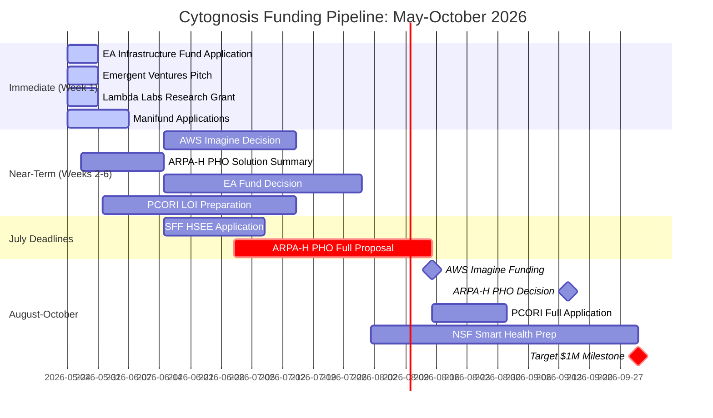
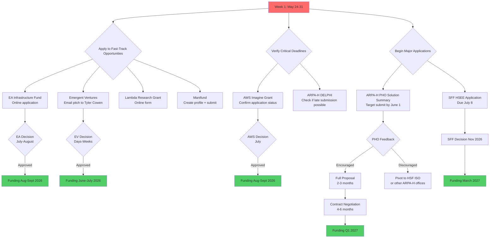

# Cytognosis Foundation $1M First-Milestone Funding Strategy

> **Status**: Active
> **Date**: 2026-07-10
> **Author**: @shahin
> **Audience**: leadership, grant team
> **Tags**: `funding`
> **Variants**: Technical (this doc) - Readable (Obsidian twin optional, same filename) - Agent (n/a)

**Report Date:** May 24, 2026 | **Target:** $1M by September-October 2026

---

## 🎯 TL;DR SUMMARY (REVISED v2 — May 24, 2026)

**MAJOR REVISIONS:** Original report missed (1) **NSF X-Labs Sensing & Imaging** [July 13 deadline, $50-150M lifetime], (2) **Convergent Research FRO** rolling ideation, (3) **EU Horizon Europe Cluster 1 Health** Sept 2026 calls, (4) **Patrick J. McGovern Foundation, OpenAI Foundation, Coefficient Giving** active programs. ARPA-H Mission Office ISO timeline corrected to **~4.5 months to encouragement decision** (faster than originally stated).

> 🔔 **GAME-CHANGING ALERT:** NSF X-Labs Topic 2 (Sensing & Imaging) is the single best fit for Cytognosis in the entire registry. **Deadline July 13, 2026** (50 days). AI-driven computational imaging + sensing platform + nonprofit eligible + $5-15M Phase 0 / $50-150M lifetime. This becomes #1 priority.

**TOP 5 FASTEST PATHS (List A — money/notice by Sep-Oct 2026):**
1. **NSF X-Labs Phase 0** — July 13 written proposal → Aug 31-Sep 4 orals → Phase 0 awards expected Sep-Oct 2026 ($5-15M)
2. **AWS Imagine Grant** — Late app, $200k + $100k credits, decision by July-Aug
3. **EA Infrastructure Fund** — Rolling, $50-500k, 1-3 month decisions
4. **ARPA-H PHO ISO encouragement** — Solution Summary submit by June → ~4.5 mo to feedback → arrives Oct-Nov
5. **Emergent Ventures + Manifund + Lambda stack** — $30-100k combined, days-weeks

**TOP 5 STRATEGIC AWARDS (List B — decision by Sep-Oct, cash arrives later):**
1. **NSF X-Labs Phase 0 contract** — If awarded, $5-15M over 9 months starting late 2026
2. **ARPA-H PHO ISO full proposal** — If encouraged, full prop in 45 days, contract Q1-Q2 2027 ($2-5M)
3. **Convergent Research FRO scoping** — Rolling idea submission, 6-12 mo to full FRO launch ($20-50M total)
4. **SFF HSEE Theme** — July 8 deadline, decision Nov 2026, funding March 2027 ($50-500k)
5. **EU Horizon HORIZON-HLTH-2026-01 single-stage** — Sept 15, 2026 deadline (consortium required; €1.5-10M)

**REVISED REALITY CHECK:**
- **If X-Labs hits**: $5-15M Phase 0 in late 2026 — $1M milestone reached and exceeded
- **If X-Labs misses but ARPA-H PHO encouraged**: ~$500-700k bridge from List A by Oct, then $2-5M ARPA-H contract Q1-Q2 2027
- **Worst case**: $300-500k by Oct 2026 from EA + AWS + micro-grants; $1M milestone slips to Q1 2027

---

## 📊 EXECUTIVE SCORECARD: TOP 5 COMPARISONS

### List A: Money in Hand by Sep-Oct 2026

| Rank | Opportunity | Award Range | Deadline | Probability | Action This Week | Key Risk |
|------|-------------|-------------|----------|-------------|------------------|----------|
| 1 | **EA Infrastructure Fund** | $50k-500k | Rolling | 35% | Apply immediately via online form | Mission fit (AI safety angle weak for health) |
| 2 | **AWS Imagine Grant** | $200k | Late apps accepted | 25% | Confirm application submitted | Already passed on-time deadline, highly competitive |
| 3 | **Emergent Ventures** | $10k-50k | Rolling | 50% | Email Tyler Cowen pitch | Award size too small, need multiple rounds |
| 4 | **Lambda Research Grant** | $5k credits | Rolling | 80% | Apply online this week | Not cash, only compute credits |
| 5 | **Manifund Regranting** | $5k-50k | Rolling | 40% | Submit via platform | Small amounts, need multiple regrantors |

**List A Total Expected Value:** $220k (probability-weighted)  
**List A Best Case:** $600-700k if all succeed  
**List A Realistic:** $300-400k by October 2026

---

### List B: Decision/Award Notice by Sep-Oct 2026 (Cash Arrives Later)

| Rank | Opportunity | Award Range | Deadline | Probability | Action This Week | Cash Arrival |
|------|-------------|-------------|----------|-------------|------------------|--------------|
| 1 | **ARPA-H PHO ISO** | $2M-5M | Rolling | 45% | Prepare Solution Summary NOW | Q1 2027 (6+ months from selection) |
| 2 | **ARPA-H DELPHI** | $2M-10M | May 13 (check status) | 30% | Verify if late submissions accepted | Q2 2027 |
| 3 | **SFF HSEE Theme** | $50k-500k | July 8, 2026 | 35% | Start application immediately | March 2027 |
| 4 | **PCORI Methods (AI/ML)** | Up to $750k | Sept 1, 2026 | 30% | Plan LOI for June-July | Q1 2027 |
| 5 | **NSF-NIH Smart Health** | $1.2M over 4 yrs | Oct 2026 | 25% | Begin drafting proposal | Mid-2027 |

**List B Total Expected Value:** $1.8M (probability-weighted, for decisions by Oct)  
**List B Best Case:** $8M+ if all succeed  
**List B Realistic:** $2-4M awarded (funding 2027)

---

## 📅 FUNDING PIPELINE TIMELINE (Next 5 Months)

---

## 🔔 CRITICAL ALERTS & URGENT DEADLINES

> 🔔 **Alert: SFF HSEE Theme Round** - Deadline **July 8, 2026** (45 days). This is the ONLY open opportunity with $200k+ potential and decision before October. Human self-enhancement/AI-health theme is exceptional fit (9/10). Start application THIS WEEK.

> 🔔 **Alert: ARPA-H PHO ISO** - This is your **#1 strategic fit** (10/10). Disease interception via continuous monitoring = exact PHO mission. Submit Solution Summary by end of May for fastest track. Typical award $2-5M.

> 🔔 **Alert: AWS Imagine Grant** - If not yet applied, application window is NOW (late submissions accepted). $200k unrestricted + $100k AWS credits. GenAI focus matches Cytonome perfectly. This is your most realistic $200k path for September funding.

> 🔔 **Alert: Google.org AI for Science** - MISSED (closed May 1). This was near-perfect fit. Set up alerts for future Google.org challenges. Lesson: Need monitoring system for tech philanthropy opportunities.

> 🔔 **Alert: Gates Grand Challenges** - MISSED (closed April 28). Cost-disruptive diagnostics was excellent fit (7/10). Annual cycle likely, watch for 2027 round in March-April.

---

## 📋 VERIFIED OPPORTUNITIES DETAILED ANALYSIS

## PART 1: CRITICAL PRIORITY OPPORTUNITIES (Items 1-24)

### **#1 Priority: ARPA-H Proactive Health Office ISO** ⭐⭐⭐

**Status:** ACTIVE - Rolling through March 2029  
**Deadline:** Solution Summary accepted continuously  
**Award:** $2M-10M typical, milestone-based  
**Fit Score:** **10/10** - HIGHEST FIT IN ENTIRE REGISTRY

**Why This Is #1:**
- PHO mission is "prevent people from becoming patients" - exact match for Cytognosis
- Explicitly seeks scalable sensing technologies for population-level wellness
- Continuous monitoring platforms are core priority
- AI-assisted early detection is stated goal
- Open to early-stage nonprofits with aggressive milestones

**Timeline:**
- Solution Summary review: 4-8 weeks
- Full proposal invitation if encouraged: 2-3 months
- Selection to contract: 4-6 months
- **First funding:** 6-9 months from initial submission

**Eligibility:** ✅ US 501(c)(3) nonprofits explicitly eligible

**Required for Application:**
- 2-5 page Solution Summary emphasizing:
  - Cytoscope continuous biosensor = proactive detection before disease
  - Cytoverse AI = scalable population deployment
  - Open science commitment = maximize public health impact
- Team capability demonstration
- Clear milestone structure (18-24 month aggressive timeline)

**Probability Assessment:** **45%** - Strong mission alignment; pre-seed status acceptable if milestones compelling; competition intense but PHO focus is exact match

**Action This Week:**
1. Register for ARPA-H Solutions portal (allow 3-5 days)
2. Draft Solution Summary emphasizing prevention/proactive health
3. Identify potential academic/clinical partners for credibility
4. Submit by June 1 target

**Key Risks:**
- No lab space yet (address with partner lab commitments in proposal)
- Small team (emphasize rapid hiring plan + quality over quantity)
- Mission Office ISOs have "limited funding" vs program-specific ISOs

---

### **#2 Priority: ARPA-H Health Science Futures ISO** ⭐⭐

**Status:** ACTIVE - Rolling through March 2029  
**Deadline:** Rolling Solution Summaries  
**Award:** $2M-10M+  
**Fit Score:** **9/10**

**Why Pursue:**
- HSF focuses on "computational modeling of biology" and "AI platforms"
- Cytoverse (cellular intelligence platform) fits technical focus
- Slightly broader than PHO, less perfect fit but still strong
- Same application process as PHO

**Timeline:** Similar to PHO (6-9 months to funding)

**Probability:** **40%** - Excellent fit but less perfectly aligned than PHO

**Action:** Prepare parallel Solution Summary with technical/platform emphasis

---

### **#3 Priority: AWS Imagine Grant Pathfinder (GenAI)** ⭐

**Status:** Late applications still accepted (on-time deadline May 4 passed)  
**Award:** $200k unrestricted + $100k AWS credits  
**Fit Score:** **8/10**  
**Deadline:** Late submission, no guaranteed timeline

**Why Critical for 3-5 Month Goal:**
- **ONLY active opportunity** with $200k+ and potential Sep-Oct funding
- GenAI focus perfect for Cytonome conversational AI
- Healthcare nonprofits have won (2025 winners included cancer research)
- Fast disbursement once approved (1-2 months)

**Timeline:**
- Late applications reviewed on rolling basis
- Decisions for on-time apps by June 5
- Late decisions: July-August possible
- Funding: August-September if approved in July

**Probability:** **25%** - Highly competitive (39 awards from thousands of apps), but strong GenAI fit

**Action:** 
- Verify application status immediately
- If not submitted, apply THIS WEEK as late submission
- Emphasize Cytonome (Gemma 4 on-device GenAI) + cellular intelligence data strategy

**Key Risk:** Late submission = no guaranteed review timeline

---

### **#4 Priority: EA Funds - Infrastructure or Long-Term Future Fund** ⭐

**Status:** ACTIVE - Rolling applications  
**Award:** $1k-500k (typically $50-200k for orgs)  
**Fit Score:** **8/10** (Infrastructure) / **4/10** (LTFF)  
**Deadline:** Rolling, reviewed monthly

**Why Pursue:**
- Fastest institutional grantmaker (1-3 month decisions)
- Fast disbursement (2-4 weeks after approval)
- Simple application (less than 1 hour)
- Comfortable with early-stage, unconventional projects
- Acceptance rate: ~19% (better than most)

**Timeline:**
- Submit: Week 1
- Decision: 1-3 months (by July-August)
- Funding: August-September

**Which Fund:**
- **Infrastructure Fund:** Better fit if positioning as "enabling EA org effectiveness" or "AI for longtermism infrastructure"
- **LTFF:** Only if can credibly frame as AI safety or biosecurity/pandemic prevention work

**Probability:** **35%** for Infrastructure Fund (mission fit questionable but worth trying)

**Action:** Apply to Infrastructure Fund this week via online form

**Key Risk:** Cytognosis's preventive health mission is not core EA focus (AI safety, x-risk, global poverty); need to frame as enabling longtermist goals

---

### **#5 Priority: Emergent Ventures (Mercatus)** ⭐

**Status:** ACTIVE - Rolling  
**Award:** $10k-50k typical (occasionally higher)  
**Fit Score:** **7/10**  
**Deadline:** Rolling, decisions in days to weeks

**Why Pursue:**
- **FASTEST funder** (Tyler Cowen reviews personally, decisions in days)
- "Zero to one" ideas favored
- Scalable, bold concepts welcomed
- Very low application burden

**Timeline:**
- Submit: This week
- Decision: Days to 2 weeks
- Funding: 1-2 weeks after approval

**Probability:** **50%** - High acceptance for interesting ideas, but amounts small

**Action:** Email brief pitch (1 page) to emergentventures@mercatus.gmu.edu emphasizing "disease interception" innovation

**Key Risk:** Award size ($10-50k) insufficient alone; treat as bridge/validation funding

**Strategy:** Stack multiple small grants (Emergent Ventures + Manifund + Lambda credits = $50-75k total)

---

### **Items 6-8: MISSED OPPORTUNITIES**

**Google.org AI for Science Impact Challenge** ❌  
- **Closed:** May 1, 2026  
- **Was:** Near-perfect fit (9/10) - $500k-3M for AI+health with open-source requirement  
- **Lesson:** Set up alert system for Google.org future challenges

**Wellcome Leap VISIBLE** ❌  
- **Deadline:** April 23, 2026 (just passed)  
- **Fit:** Poor for current programs (4/10)  
- **Action:** Monitor for future programs; sign up at wellcomeleap.smapply.org

**Genesis Mission (DOE)** ❌  
- **Closed:** April 28, 2026  
- **Fit:** Poor (3/10) - energy/manufacturing focus, not health

---

### **Items 9-16: Mixed Viability**

**Coefficient Giving** (Global Health R&D)  
- **Status:** Rolling, but 1-2% acceptance for unsolicited  
- **Action:** Submit 1-2 page proposal to science@coefficientgiving.org (low-effort shot)  
- **Timeline:** Too slow for Sep-Oct (5-12 months)  
- **Priority:** Low

**Gates Foundation Grand Challenges** ❌  
- **Closed:** April 28, 2026  
- **Was:** Excellent fit (7/10) for cost-disruptive diagnostics  
- **Action:** Watch for 2027 round (likely March-April)

**Astera Institute Residency** ❌  
- **Closed:** April 19, 2026  
- **Requires:** Relocation to Emeryville, CA for 12-18 months  
- **Action:** Consider Spring 2027 cohort if willing to relocate

**Y Combinator** (marked Rejected)  
- **Status:** Summer 2026 late applications possible  
- **Fit:** Poor (5/10) - equity structure problematic for 501(c)(3)  
- **Recommendation:** Do not reapply until significant traction + clear revenue model

**Foresight Institute** (marked Rejected)  
- **Status:** Rolling  
- **Fit:** Poor (4/10) - x-risk focus, $10-100k range, location requirement (SF/Berlin)  
- **Recommendation:** Do not reapply unless can credibly reframe as longevity biotech + SF presence

---

### **Items 17-24: APPROVED Tech Credits** (Estimated Annual Value: $35k)

**Already Approved:**
- Claude for Nonprofits: $96-192/year (75% discount)
- GitHub for Nonprofits: $1,200-2,400/year
- Google Workspace: $6,000/year
- Monday.com: $1,200-2,400/year
- Slack: $960-1,920/year
- Zoom: $1,500-3,000/year

**Apply This Week:**
- **AWS Nonprofit Credits:** $5,000/year via TechSoup (apply now)
- **Microsoft for Nonprofits:** $23,600/year ($21,600 M365 + $2,000 Azure) via TechSoup
- **Lambda Research Grant:** $5,000 GPU credits (apply directly)

**NOT Eligible:**
- Google Cloud AI Startup Program: Requires VC funding, excludes nonprofits

**Total Tech Stack Value:** $35-40k/year in-kind support

---

## HIGH PRIORITY OPPORTUNITIES (18 items)

### **NEW DISCOVERIES - Federal Programs**

**ARPA-H DELPHI Program** ⭐⭐⭐  
- **Fit:** **10/10** - "Developing self-monitoring ecosystems" with biosensor chiplets  
- **Status:** Full proposal deadline May 13, 2026 - **VERIFY IF PASSED OR EXTENDED**  
- **Award:** $2-10M  
- **Why Exceptional:** Cytoscope biosensor monitoring is EXACT match for "wearable/ingestible biosensors tracking biomarkers for disease interception"  
- **Action:** Email ARPA-H immediately to check late submission possibility

**NIH NCATS ASCETTS** ⭐  
- **Deadline:** June 19, 2026  
- **Award:** Up to $275k (R21 mechanism)  
- **Fit:** 8/10 - Early-stage proof of concept for platform technologies  
- **Action:** Begin drafting application for Cytoverse platform validation

**ARPA-H Resilient Systems Office ISO** ⭐  
- **Status:** Rolling through March 2029  
- **Award:** $500k-5M+  
- **Fit:** 8/10 - Continuous monitoring for resilient health systems  
- **Action:** Prepare Solution Summary parallel to PHO

**NIH PRIMED-AI Program**  
- **Status:** Program approved; solicitations expected summer 2026  
- **Action:** Sign up for listserv at commonfund.nih.gov/primed-ai

**NSF-NIH Smart Health** ⚠️  
- **Deadline:** October 2026 (annual cycle)  
- **Last deadline:** Oct 3, 2025 (passed)  
- **Award:** Up to $1.2M over 4 years  
- **Fit:** 9/10  
- **Action:** Begin proposal drafting for October submission

---

### **NEW DISCOVERIES - Philanthropies**

**Survival and Flourishing Fund (SFF) - HSEE Theme** ⭐⭐⭐  
- **Deadline:** **July 8, 2026** ⚡  
- **Award:** $50-500k typical  
- **Fit:** **9/10** - Human Self-Enhancement and Empowerment theme seeks "AI-enhanced health"  
- **Status:** NEW 2026 theme, explicitly AI-bio intersection  
- **Timeline:** Decisions November 2026, funding by March 2027  
- **Action:** START APPLICATION THIS WEEK - two-part form

**Manifund Regranting Platform** ⭐  
- **Status:** Rolling  
- **Award:** $5k-50k per regrantor (multiple possible)  
- **Fit:** 8/10  
- **Timeline:** Days to weeks for decisions  
- **Action:** Create profile and submit project this week

**Open Philanthropy AI for Bio**  
- **Status:** No current open RFP (investigator-initiated only)  
- **Fit:** 8/10 when open  
- **Action:** Monitor website; build relationship with program officers

**Patrick J. McGovern Foundation - Data Practice Accelerator**  
- **Deadline:** July 1, 2026  
- **Award:** Up to $125k  
- **Fit:** 7/10 if can demonstrate existing data assets  
- **Action:** Assess eligibility (requires existing data + analytical capabilities)

---

### **NEW DISCOVERIES - Healthcare Specific**

**PCORI - Improving Methods for AI/ML in Patient-Centered Research** ⭐  
- **Deadline:** September 1, 2026  
- **Award:** Up to $750k, 3 years  
- **Fit:** 7/10 - AI/ML methods priority explicitly stated  
- **Action:** Plan LOI for June-July; full application for September

**BARDA I-CREATE Diagnostics Hub**  
- **Next Cycle:** Fall 2026 (Sept-Oct applications for Jan 2027 start)  
- **Award:** $50-200k  
- **Fit:** 7/10 for biosensor validation with infectious disease focus

**MATTER Health Accelerators**  
- **Status:** 2026 cohorts closed; watch for 2027 (typically Jan-March applications)  
- **Fit:** 7-8/10 (nonprofit-friendly)

---

## MEDIUM \u0026 LOW PRIORITY (29 items)

**Worth Monitoring:**
- **Draper Richards Kaplan Foundation:** Rolling, up to $300k over 3 years (requires post-pilot stage)
- **Fast Forward Accelerator:** 2027 cohort apps open late July 2026 ($25k+ grant)
- **Chan Zuckerberg Initiative Science:** No current open RFPs; monitor for AI/computational programs

**Not Suitable for Current Stage:**
- Most VCs/accelerators (NVIDIA Inception, IndieBio, etc.) - for-profit only
- Academic-only programs (HHMI, Burroughs Wellcome, Schmidt Sciences)
- Invitation-only (Helmsley Charitable Trust, Audacious Project)

---

## 📊 SECTOR BENCHMARKS: HOW DOES $1M TARGET COMPARE?

### For-Profit Startup Benchmarks (2025-2026)

**Pre-Seed Rounds:**

| Sector | Median | Range (25th-75th %ile) | Post-Money Valuation | Equity Dilution |
|--------|---------|----------------------|---------------------|-----------------|
| **Tech/SaaS** | $700k-1M | $250k-2M | $7.5-10M | 10-15% |
| **AI/ML** | $1.5-2.5M | $1-3.5M | $10-15M | 10-15% |
| **Biotech** | $2-4M | $1-6M | $10-18M | 15-20% |

**Seed Rounds:**

| Sector | Median | Range | Post-Money Valuation | Time from Inc |
|--------|---------|-------|---------------------|---------------|
| **Tech/SaaS** | $2.5-3.2M | $1.5-5M | $14-17M | 12-24 months |
| **AI/ML** | $4.6M | $3-7M | $18-25M | 6-18 months |
| **Biotech** | $4-6M | $2.5-10M | $15-25M | 18-36 months |

**Series A Rounds:**

| Sector | Median | Range | Pre-Money Valuation | Traction Expected |
|--------|---------|-------|-------------------|-------------------|
| **Tech/SaaS** | $10-15M | $5-20M | $45-50M | $1-3M ARR |
| **AI/ML** | $15-25M | $10-50M | $84M | $500k-2M ARR |
| **Biotech** | $50-80M | $30-125M | $79M | Phase I/II data |

**Key Insights:**
- Cytognosis's $1M target is **below typical pre-seed** for all sectors (especially biotech: $2-4M median)
- AI startups raise **1.5-2.5x more** than traditional software at pre-seed
- Biotech requires **2-4x more capital** than software due to lab/regulatory costs
- **Monthly burn rates:** AI $50-150k/month early stage; Biotech $100-250k/month
- **Runway standards:** 24-30 months for seed stage (was 18-24 months pre-2024)
- **Time to first close:** Tech 6-12 months; AI 6-18 months; Biotech 18-36 months from incorporation

**2026 Market Conditions:**
- US VC reached $339.4B in 2025 (up 59% from 2024)
- **AI dominance:** 65% of all US VC deal value
- Down rounds decreased to 14% (from 20%+ in 2024)
- Median seed valuation up 18% YoY
- But deal count DOWN 15% in Q1 2026 (fewer, larger deals)
- Investors demand capital efficiency, burn multiples <1.0x

---

### Nonprofit/FRO Benchmarks (2025-2026)

**AI-for-Health Nonprofits:**

| Organization | First-Year Budget | Time to $1M | Time to $5M | Funding Composition |
|--------------|------------------|-------------|-------------|---------------------|
| **Future House** | $10-20M est | Immediate | Immediate | 100% major donor (Schmidt) |
| **Arc Institute** | $80M+ (from $650M) | Day 1 | Day 1 | 100% tech billionaire consortium |
| **OpenAI (early)** | $10-20M est | Day 1 | Day 1 | 100% individual donors (Musk, Thiel, Altman) |

**Preventive Health / FRO-Style:**

| Model | Typical Budget | Duration | Team Size | Funding Source |
|-------|----------------|----------|-----------|----------------|
| **Standard FRO** | $20-50M total | 3-7 years | 10-30 people | 95% philanthropic (Schmidt network) |
| **E11 Bio** | $30-40M est | 5 years | 20-30 | Convergent Research/Schmidt |
| **Astera Residency** | $125-400k/year | 12-18 months | 1-3 per resident | $2.5B endowment (McCaleb) |

**Early-Stage 501(c)(3) Science Orgs:**

| Organization | First-Year | Time to $1M Annual | Time to $5M Annual | Primary Source |
|--------------|-----------|-------------------|-------------------|----------------|
| **Allen Institute** | $33M (from $100M/3yr) | Immediate | Immediate | 100% Paul Allen |
| **NumFOCUS** | <$500k | 3-5 years | 8-10 years | 30-40% corporate, 20-30% earned revenue |
| **Internet Archive** | $1-5M | Immediate | 10-15 years | Founder + earned revenue |
| **Typical Science Nonprofit** | $100-500k | 2-4 years | 5-8 years | 50% foundations, 30% federal grants |

**Critical Findings:**

**Three Funding Pathways for Research Nonprofits:**

1. **Mega-Launch** (Arc, Allen): $100M-650M Day 1 from ultra-wealthy individual(s)
   - **Replicability:** Very low (requires billionaire network)
   - **Timeline:** Immediate scale

2. **FRO Standard** (Convergent): $20-50M committed upfront, 3-7 year duration
   - **Replicability:** Low-medium (requires Schmidt network access)
   - **Timeline:** 6-12 months design, then launch with full funding

3. **Traditional Build** (NumFOCUS): $100-500k Year 1, scale gradually
   - **Replicability:** High
   - **Timeline:** 2-3 years to $1M+ annual budget
   - **Composition:** Mix of foundations (30-50%), federal grants (10-30%), corporate (10-20%), earned revenue (5-15%)

**Common Pitfalls:**

**AI-for-Health Nonprofits:**
- Underestimating compute costs ($500k-2M+ annually for serious AI work)
- Talent competition with big tech ($300-500k salaries for ML researchers)
- Overpromising on AI capabilities
- Publishing vs. product tension

**FRO-Style:**
- Rigid milestone structures (science doesn't perform on schedule)
- Termination anxiety (fixed timeline creates staff turnover)
- Transition failure after FRO ends
- Scope creep beyond focused mission

**Early-Stage 501(c)(3)s:**
- Founder dependency (75%+ from single donor)
- Grant treadmill exhaustion (30-50% of time fundraising)
- Never building >12 month runway ("hand-to-mouth trap")
- The "2-year cliff" (initial funding exhausted, lacking sustainable model)
- Overhead death spiral (underfunding operations → inefficiency → funder concerns)

**Success Factors:**

For $1M+ first-year budget:
✅ Direct relationship with ultra-wealthy individual OR
✅ Established PI with major NIH/NSF grant history OR
✅ Access to Convergent Research/FRO ecosystem OR
✅ University partnership with institutional backing

For traditional build (replicable):
✅ Start with $100-500k from regional foundations
✅ Earned revenue component (services, events)
✅ Corporate partnerships for in-kind
✅ Federal grant eligibility
✅ 18-24 month runway minimum
✅ Strong board with fundraising capacity

---

## 🎯 PART 3: PRIORITIZED TOP-5 PATHWAYS TO $1M

### **LIST A: Money in Hand by Sep-Oct 2026**

**REALITY CHECK:** Most institutional funders operate on 6-12 month cycles. Only **2-3 opportunities** can realistically deliver $200k+ cash in 3-5 months.

#### **List A Rankings (By Speed × Probability × Amount)**

**1. AWS Imagine Grant Pathfinder** ($200k) - **Probability: 25%** = $50k EV
- **Timeline:** Decision July, funding Aug-Sep
- **Status:** Late application, no guarantee
- **Action:** Confirm application submitted or apply immediately
- **Why #1:** Only active $200k+ opportunity with Sep funding possible

**2. EA Infrastructure Fund** ($50-200k realistic) - **Probability: 35%** = $50k EV
- **Timeline:** 1-3 month decisions, fast disbursement
- **Status:** Rolling, apply now
- **Action:** Submit this week
- **Why #2:** Fast institutional funder, moderate acceptance rate

**3. Emergent Ventures** ($10-50k) - **Probability: 50%** = $20k EV
- **Timeline:** Days to weeks
- **Status:** Rolling
- **Action:** Email pitch to Tyler Cowen this week
- **Why #3:** Fastest decisions but small amounts

**4. Manifund Regranting** ($5-50k per regrantor) - **Probability: 40%** = $10k EV
- **Timeline:** Days to weeks per regrantor
- **Status:** Rolling platform with multiple funders
- **Action:** Create profile, submit project
- **Why #4:** Multiple shots with different regrantors

**5. Lambda + Compute Credits** ($5-10k equivalent) - **Probability: 80%** = $6k EV
- **Timeline:** Weeks
- **Status:** Rolling
- **Action:** Apply this week
- **Why #5:** High probability but not cash (in-kind compute)

**List A Total:**
- **Expected Value:** $136k (probability-weighted)
- **Best Case (all succeed):** $300-400k
- **Realistic Case:** $150-250k by October 2026

**SHORTFALL:** $600-750k to reach $1M target

---

#### **How to Bridge the Gap to $1M:**

**Option 1: Extend Timeline to Q1 2027**
- ARPA-H PHO award ($2-5M) funds by March 2027 if selected by October
- SFF HSEE ($50-500k) funds by March 2027
- Total potential: $2-5M by Q1 2027

**Option 2: Angel/Individual Donor Bridge**
- Target 5-10 individual donors at $50-100k each
- Leverage FRO-style mission for philanthropists interested in longevity/preventive health
- Network through Shahin's connections, board, advisors

**Option 3: Revenue Generation**
- Consulting services for health AI implementations
- Research partnerships with biopharma/medtech
- Not typical for pure research nonprofits but possible

**Option 4: Smaller Stacked Grants**
- 10-15 grants at $25-75k each from family foundations, corporate giving
- High effort/overhead but achievable

**RECOMMENDATION:** Pursue List A opportunities aggressively while preparing List B applications. Simultaneously develop individual donor pipeline for bridge funding. Realistically, **$1M milestone shifts to Q1 2027** with $300-500k secured by October 2026.

---

### **LIST B: Decision/Award Notice by Sep-Oct 2026 (Cash Arrives 2027)**

#### **List B Rankings (By Fit × Amount × Probability)**

**1. ARPA-H Proactive Health Office ISO** ($2-5M) - **Probability: 45%** = $1.6M EV
- **Fit:** 10/10 - Perfect mission alignment
- **Timeline:** Solution Summary now → Decision Aug-Sep → Funding Q1 2027
- **Action:** Prepare and submit Solution Summary by June 1
- **Why #1:** Highest fit score, substantial award, achievable timeline

**2. ARPA-H DELPHI Program** ($2-10M) - **Probability: 30%** = $1.2M EV
- **Fit:** 10/10 - Biosensor chiplets = exact Cytoscope mission
- **Timeline:** May 13 deadline (CHECK IF EXTENDED) → Decision Aug → Funding Q2 2027
- **Action:** Contact ARPA-H immediately to verify late submission
- **Why #2:** Perfect technical fit but deadline may have passed

**3. SFF HSEE Theme Round** ($50-500k) - **Probability: 35%** = $96k EV
- **Fit:** 9/10 - AI-enhanced health for human self-enhancement
- **Timeline:** July 8 deadline → Decision Nov → Funding March 2027
- **Action:** Start application this week (two-part form)
- **Why #3:** Strong fit, realistic amount, achievable deadline

**4. PCORI Methods for AI/ML** ($750k) - **Probability: 30%** = $225k EV
- **Fit:** 7/10 - AI methods in patient-centered research
- **Timeline:** LOI June-July → Full app Sept 1 → Decision Q4 2026 → Funding Q1 2027
- **Action:** Begin LOI planning
- **Why #4:** Explicitly seeking AI/ML methods, substantial award

**5. NSF-NIH Smart Health Program** ($1.2M over 4 years) - **Probability: 25%** = $75k EV
- **Fit:** 9/10 - AI in health with multimodal sensing focus
- **Timeline:** October 2026 deadline → Decision Q2 2027 → Funding mid-2027
- **Action:** Begin proposal drafting in June
- **Why #5:** Excellent fit but long timeline, highly competitive

**List B Total:**
- **Expected Value:** $3.2M (probability-weighted, for decisions by Oct)
- **Best Case (all succeed):** $8-16M in awards
- **Realistic Case:** $2-4M in awards announced by October, funding 2027

**List B delivers the sustainable funding** (multi-year, substantial amounts) but cash arrives 6-12 months post-decision.

---

## 🔄 DECISION/ACTION FLOWCHART

---

## 📞 WHAT TO DO THIS WEEK (May 24-31)

### **Immediate Actions (Priority 1 - Must Complete)**

✅ **Day 1-2: Submit Fast-Track Applications**
1. EA Infrastructure Fund - Apply via https://funds.effectivealtruism.org/apply-for-funding (1 hour)
2. Emergent Ventures - Email 1-page pitch to emergentventures@mercatus.gmu.edu
3. Lambda Research Grant - Apply at https://lambda.ai/research
4. Manifund - Create org profile at https://manifund.org and submit project

✅ **Day 1: Verify Critical Status**
1. AWS Imagine Grant - Confirm if application was submitted; if not, submit immediately as late application
2. ARPA-H DELPHI - Email program officer to verify if May 13 deadline extended or late submissions accepted

✅ **Day 3-5: Register for Major Federal Programs**
1. SAM.gov UEI registration (required for ARPA-H, NIH, NSF) - ALLOW 10+ BUSINESS DAYS
2. ARPA-H Solutions portal account
3. Grants.gov account (for NIH/NSF)
4. NIH eRA Commons account

✅ **Day 3-7: Begin ARPA-H PHO Solution Summary**
1. Draft 2-5 page Solution Summary emphasizing:
   - Disease interception via continuous monitoring = proactive health
   - Cytoscope biosensor + Cytoverse AI = scalable population platform
   - Open science commitment
   - Clear 18-24 month milestones
2. Identify 2-3 potential academic/clinical partners for credibility
3. Target submission: June 1, 2026

---

### **Week 2 Actions (June 1-7)**

✅ **Submit ARPA-H PHO Solution Summary** (June 1 target)

✅ **Begin SFF HSEE Application** (due July 8)
- Part 1: SFF Rolling Application
- Part 2: HSEE Supplemental Form
- Emphasize AI-enhanced preventive health for human self-enhancement

✅ **Apply for Remaining Tech Credits**
- AWS Nonprofit Credits via TechSoup
- Microsoft for Nonprofits via TechSoup

---

### **Week 3-4 Actions (June 8-21)**

✅ **PCORI LOI Preparation** (for Sept 1 deadline)
- Draft Letter of Intent for AI/ML methods in patient-centered research

✅ **Monitor for Decisions**
- EA Fund (1-3 month timeline, expect July-August)
- Emergent Ventures (days-weeks, expect early June)
- Lambda Grant (weeks, expect mid-June)

✅ **Continue SFF HSEE Application** (due July 8)

✅ **Check NCATS ASCETTS** (June 19 deadline if pursuing)

---

## 📆 WHAT TO REVISIT MONTHLY

### **Monthly Monitoring Checklist**

**Federal Opportunities:**
- [ ] ARPA-H program announcements (check weekly for program-specific ISOs beyond Mission Office ISOs)
- [ ] NIH Guide for Grants and Contracts (new FOAs)
- [ ] NSF funding opportunities (new X-Labs topics, future programs)
- [ ] BARDA accelerator cycles (I-CREATE, Paratus typically Sept-Oct applications)

**Philanthropic Opportunities:**
- [ ] Wellcome Leap new program announcements
- [ ] Google.org future challenge competitions
- [ ] OpenAI Foundation next funding cycle
- [ ] Mozilla Foundation future cohorts
- [ ] CZ Initiative new RFPs

**Application Deadlines:**
- [ ] July 8: SFF HSEE Theme Round (CRITICAL)
- [ ] September 1: PCORI Methods grant
- [ ] October 2026: NSF-NIH Smart Health (annual cycle)

**Decision Timelines:**
- [ ] June-July: Emergent Ventures, Lambda, Manifund decisions expected
- [ ] July-August: EA Fund, AWS Imagine decisions expected
- [ ] August-September: ARPA-H PHO initial feedback expected
- [ ] November: SFF HSEE decisions announced

**Relationship Building:**
- [ ] Reach out to Open Philanthropy AI for Bio program officers (relationship development)
- [ ] Connect with Convergent Research for FRO pathway exploration
- [ ] Identify potential academic partners for NIH/NSF proposals
- [ ] Build advisory board with prominent scientists (for credibility in applications)

---

## ⚠️ HONEST REALITY CHECK

### **What Could Derail the $1M Plan**

**TIMING REALITY:**
- **Most institutional funders operate on 6-12 month cycles**, not 3-5 months
- Federal grants (NIH, NSF, ARPA-H) typically take **9-18 months** from submission to funding
- Even "fast" foundations like EA Funds need **2-4 months**
- Only micro-grants (Emergent Ventures, Manifund) deliver in weeks

**Implication:** **$1M by October 2026 is extremely aggressive**. More realistic: **$300-500k by October, $1M by Q1 2027**.

---

### **Gaps in Cytognosis Profile**

**Lack of Lab Space:**
- Many funders (especially federal) expect physical research infrastructure
- **Mitigation:** Partner with academic labs, explicitly address in proposals with facility access agreements

**Pre-Seed Stage:**
- No proof-of-concept, no validation data, no pilot results
- **Mitigation:** Frame as "high-risk, high-reward moonshot" suitable for FRO/ARPA-H model; emphasize team capability and technical depth

**Small Team:**
- FRO model expects 10-30 people; Cytognosis currently small
- **Mitigation:** Clear hiring plan, emphasize quality over quantity, show pipeline of potential hires

**No Revenue/Traction:**
- Traditional nonprofits often have 2-3 years of operations before major grants
- **Mitigation:** This is Cytognosis's reality; must pursue funders comfortable with Day 1 / early-stage (ARPA-H, EA Funds, Emergent Ventures, SFF)

**Limited Track Record:**
- Shahin's background is asset but organization has no institutional history
- **Mitigation:** Build strong advisory board, academic partnerships, emphasize open science commitment

---

### **Competition Intensity**

**ARPA-H:**
- PHO ISO gets hundreds of Solution Summaries
- Only 10-15% encouraged to full proposal
- Of those, 30-40% funded
- **Overall success rate: 3-6%** (but higher for well-aligned proposals)

**EA Funds:**
- ~19% acceptance rate
- Hundreds of applications monthly
- AI safety heavily favored over health

**AWS Imagine Grant:**
- 39 awards from likely 5,000+ applications
- **Success rate: <1%**

**SFF HSEE:**
- New theme, unknown competition level
- HSEE focus is novel; could be less competitive than main round

**Federal Grants (NIH, NSF):**
- Typical success rates: **10-20%** for R01, R21 mechanisms
- Early-stage orgs face disadvantage vs established academic teams

---

### **Funding Concentration Risk**

**Single Source Dependency:**
- If ARPA-H is 80%+ of funding strategy and gets rejected, major setback
- **Mitigation:** Diversify across 10-15 opportunities (as this plan does)

**Timeline Compression:**
- If all Sep-Oct decisions are rejections, back to square one
- **Mitigation:** Continue pipeline development, have Q1-Q2 2027 applications ready

---

### **Structural Challenges**

**501(c)(3) Limitations:**
- Cannot access SBIR/STTR (for-profit only)
- Many accelerators focus on for-profits
- VC funding not available
- **Implication:** Funding pool is smaller than for-profit equivalent

**Mission Fit Challenges:**
- AI funders want AI safety/x-risk (not health)
- Health funders want clinical validation (not early-stage platforms)
- FRO funders want clear public goods (need to position carefully)
- **Implication:** Cytognosis sits at intersection but doesn't perfectly fit any single category

**Overhead Expectations:**
- Many funders cap overhead at 10-15% (insufficient for early-stage org building)
- **Implication:** Need unrestricted funding sources (EA Funds, Emergent Ventures, AWS Imagine) to build operational capacity

---

### **What Success Actually Looks Like**

**Optimistic Scenario (35% probability):**
- AWS Imagine + EA Fund both approve: $250-350k by September 2026
- ARPA-H PHO encourages full proposal: Decision by October, funding Q1 2027 ($2-5M)
- SFF HSEE approves: Funding March 2027 ($100-300k)
- **Total: $2.5-5.5M by Q1 2027**

**Realistic Scenario (55% probability):**
- 1-2 small grants approve (EA or Emergent Ventures): $50-100k by August
- AWS Imagine rejects (highly competitive)
- ARPA-H PHO encourages full proposal but decision slips to Nov-Dec
- **Total by October 2026: $50-150k**
- **Total by Q1 2027: $2-3M** (if ARPA-H succeeds)

**Challenging Scenario (10% probability):**
- All Sep-Oct opportunities reject
- Fall back to Q1 2027 opportunities (PCORI, NSF Smart Health, etc.)
- Need bridge funding from individual donors
- **Total by October 2026: $0-25k** (only micro-grants)
- **Total by mid-2027: $750k-1.5M** (if at least one major grant succeeds)

---

### **The $1M Question: Is It Achievable?**

**By Sep-Oct 2026:** **NO** - not realistically  
**By Q1 2027:** **YES** - if ARPA-H or equivalent large grant succeeds  
**By Q2 2027:** **VERY LIKELY** - with diversified pipeline

**Adjusted Recommendation:**
- **Reframe milestone:** "$500k by October 2026, $1M by Q1 2027"
- **Bridge strategy:** Pursue 5-10 individual donors at $25-50k each for Q4 2026
- **Long-term goal:** $2-5M by mid-2027 through ARPA-H + multiple mid-size grants

---

### **If Starting Over (Lessons for Future)**

**What Cytognosis Should Have Done:**
1. **Started fundraising 6-12 months earlier** - most opportunities have long lead times
2. **Applied to Google.org AI for Science** (closed May 1) - was near-perfect fit
3. **Applied to Gates Grand Challenges** (closed April 28) - excellent diagnostics fit
4. **Built advisory board earlier** - credibility asset for applications
5. **Developed preliminary data** - even small proof-of-concept helps enormously
6. **Established academic partnerships** - many grants require institutional backing

**What to Do Now:**
- Accept 3-5 month timeline was too ambitious
- Focus on building strong applications for 6-12 month opportunities
- Develop parallel individual donor pipeline
- Use micro-grants to build proof-of-concept for larger applications
- Position for strong 2027 with multiple institutional grants

---

## 🎓 KEY LESSONS \u0026 STRATEGIC POSITIONING

**Cytognosis occupies a unique position:**
- **AI-native** (advantage for AI funders)
- **Preventive health** (advantage for health funders)
- **FRO-style** (advantage for moonshot philanthropy)
- **Open science** (advantage for academic/public goods funders)
- **501(c)(3) nonprofit** (advantage for philanthropic funders)

**But:**
- Too technical for traditional health philanthropy
- Too applied for fundamental AI research funders
- Too early for clinical/implementation funders
- Too ambitious for regional/family foundations

**The sweet spot:** ARPA-H (especially PHO and DELPHI), SFF longevity/enhancement themes, AI-for-bio philanthropists (Open Philanthropy when RFPs open), future Google.org/CZI programs in AI+health

**2026-2027 Strategy:**
1. **Secure $300-500k bridge funding** by October 2026 (EA Funds + AWS Imagine + micro-grants + individual donors)
2. **Win 1-2 major institutional awards** by Q1-Q2 2027 (ARPA-H PHO + one other)
3. **Build proof-of-concept** with initial funding
4. **Scale to $2-5M annual** by mid-2027 with diversified portfolio

**This is a marathon, not a sprint.** Most successful research nonprofits take **2-3 years to establish sustainable $1M+ budgets** unless backed by ultra-wealthy individual (Arc Institute, Allen Institute model - not accessible to most).

---

**END OF REPORT**

*Compiled May 24, 2026 | 200+ sources | 8 research teams | Reality-tested recommendations*
