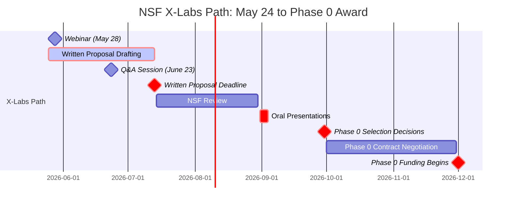
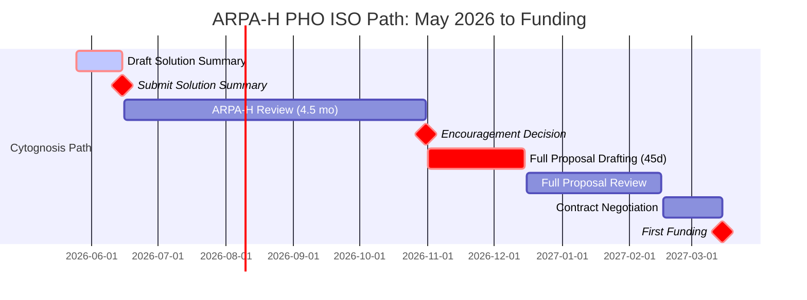

# Cytognosis Funding Strategy: v2 UPDATE & CORRECTIONS

**Date:** May 24, 2026 | **Supplements v1 report** | Shahin's feedback incorporated

---

## 🚨 WHAT I GOT WRONG / MISSED IN V1

| # | Issue | Correction |
|---|-------|------------|
| 1 | ARPA-H MO ISO timeline overstated | **~4.5 months** to encouragement decision (not 6-9), then 45 days for full proposal |
| 2 | **Missed NSF Tech Labs / X-Labs entirely** | Now called **NSF X-Labs**, Topic 2: Sensing & Imaging, **deadline July 13, 2026**, $50-150M lifetime — single best fit in the entire registry |
| 3 | Missed Convergent Research FRO submission | Rolling ideation, accepts FRO idea submissions at any time via form |
| 4 | Missed EU Horizon Europe Cluster 1 Health | 2026 single-stage calls close **Sept 15, 2026**; 2027 calls open Feb 10 |
| 5 | Missed major philanthropies | OpenAI Foundation (Life Sciences track), Patrick J. McGovern Foundation, Coefficient Giving (renamed from Open Philanthropy), Helmsley |

---

## 🔔 GAME-CHANGING ADDITION: NSF X-Labs Sensing & Imaging

> 🔔 **PRIORITY 1 ALERT:** NSF X-Labs Topic 2 (Sensing & Imaging) is the **single best-fit opportunity** for Cytognosis in the entire opportunity universe. **Deadline July 13, 2026, 5:00 PM Eastern** (50 days from today). Miss this and the next equivalent opportunity is years away.

### Why this is exact-fit for Cytognosis

The solicitation explicitly seeks teams developing breakthrough sensing/imaging platform technologies, particularly **"AI-enabled instrumentation approaches"** that "unlock new scientific fields." That is verbatim what Cytoscope is.

- **Mechanism:** Other Transaction Authority (OTA) — flexible, milestone-based, NOT a traditional grant
- **Phase 0:** 9 months, awarded to multiple teams (likely $5-15M each based on $1.5B program / 10-year horizon)
- **Phase 1:** 24-36 months, milestone-based scale-up
- **Phase 2:** Renewal possible
- **Total lifetime award:** $50-150M+ per team
- **Eligibility:** Nonprofits explicitly eligible; lead orgs can submit max 2 proposals; key personnel on only 1
- **Location:** Place of performance is Alexandria, VA (NSF HQ region) but execution can be elsewhere

### Timeline (fits 3-5 month window!)

### What Cytognosis needs to produce in 50 days

1. **Mission statement** (1-2 pages): How Cytoscope creates "new field of scientific measurement" via continuous, AI-driven, multimodal physiological sensing for disease interception
2. **5-7 year target outcomes** with technical/scientific performance benchmarks
3. **Team Capability Statement**: Strategic leadership + technical depth + entrepreneurship
4. **Governance & autonomy plan** for Phase 0 (and notional Phase 1)
5. **Networks, partnerships, capital resources** currently held
6. **Abridged 2-page CVs/biosketches** for Senior/Key Personnel
7. **Milestone framework** that fits OTA mechanism (NOT a standard NSF cooperative agreement)

### Probability assessment

- Topic 2 is one of 2 inaugural X-Labs topics (Sensing + Quantum)
- NSF expects "one or more" awards per topic
- Likely 200-400 written proposals; ~10-20 invited to orals; 3-8 Phase 0 awards
- **Estimated success rate: 1-3%** (low absolute, but high payoff)
- **Strategic value even if rejected:** Forces Cytognosis to crystallize its FRO-style narrative; positions for ARPA-H, Convergent FRO, NSF Convergence Accelerator

### Critical risk

Granted AI's coverage notes that teams retrofitting "standard NSF cooperative-agreement" mindset into the proposal will lose. Teams that **organize around the OTA mechanism** (milestone-based, operationally autonomous, entrepreneurial governance) will win. Cytognosis already thinks this way; lean into it hard.

### Action this week (May 24-31)

1. **Register for the May 28 webinar** at NSF X-Labs page (today/tomorrow)
2. **Begin Mission Statement draft** by May 29
3. **Email NSF X-Labs team** at the published email for clarifying questions
4. **Identify 2-3 key partners** (e.g., academic sensing/imaging labs, clinical site for validation data)
5. **Register for June 23 Q&A session**

---

## 🔔 ADDITION 2: Convergent Research FRO Submission

> 🔔 **STRATEGIC ALERT:** Convergent Research accepts FRO idea submissions **at any time** via their submission form. They explicitly state: "We gladly accept FRO idea submissions at any time. Please use this form." Process: few-page proposal, internal evaluation, targeted outreach to domain experts, iterative refinement.

### What this is

Convergent Research stands up FROs (Focused Research Organizations) as standalone 501(c)(3) nonprofits with **$20-50M+ multi-year commitments** from a network including Schmidt Sciences, Astera, and other major philanthropies. They have launched ~10 FROs to date (E11 Bio, Cultivarium, FutureHouse, etc.).

### Fit for Cytognosis

- **9/10 fit.** Cytognosis is structurally a FRO already (mission-focused, time-bound, public-goods orientation, open science)
- The Cytoverse-Cytoscope-Cytonome architecture IS the kind of "scientific bottleneck breaker" Convergent looks for
- Their network of funders is exactly the philanthropic ecosystem Cytognosis needs to plug into

### Mechanism (different from grants)

This is not a grant application. Convergent does **systematic technical roadmapping** to identify bottlenecks, then designs FROs around them. Submission is the start of a **6-12 month dialogue** that, if successful, ends in:
- Co-designed FRO charter
- Multi-funder syndication of $20-50M+
- Independent 501(c)(3) launch (Cytognosis is already this)
- 3-7 year focused mission

### Probability assessment

- They launch ~2-4 FROs per year from many more submissions
- **Estimated success: 5-10%** for any single submission, but much higher in iterative follow-up if there's interest
- Even if not selected as a fully-funded FRO, dialogue often produces introductions to funders

### Action

Submit a 2-3 page FRO concept this month framing Cytognosis as a FRO candidate. Use the submission form on their site (linked from convergentresearch.org/get-involved). No deadline pressure; do it well, not fast.

---

## 🔔 ADDITION 3: EU Horizon Europe Cluster 1 Health

> 🔔 **ALERT:** 2026-2027 Health Work Programme published Dec 12, 2025. **Main 2026 call HORIZON-HLTH-2026-01 closed April 16** (missed). **However, single-stage calls with September 15, 2026 deadline are still open**, and 2027 calls open Feb 10, 2027 with April 13, 2027 deadline.

### Eligibility reality check

US-based 501(c)(3) is generally **not directly eligible as coordinator** of a Horizon Europe consortium. Options:
1. **Associated Country partner** (if US becomes Associated; currently not, but bilateral cooperation agreements exist)
2. **Third-country participant** (allowed in most calls but not funded by EU — would need own funding)
3. **Subcontractor** to an EU consortium (most realistic path)
4. **Co-applicant** in calls explicitly open to third-country entities (specific topics)

### Best-fit 2027 topics for Cytognosis

| Topic | Budget | Fit | Notes |
|-------|--------|-----|-------|
| **HORIZON-HLTH-2027-02-IND-02** Portable Point-of-Care Diagnostics | €8-10M per project | 9/10 | Two-stage; Cytoscope continuous-monitoring fits |
| HORIZON-HLTH-2027-01-DISEASE-08 Antibacterial/antifungal therapies | €8-10M | 4/10 | Weaker fit |
| HORIZON-HLTH-2027-01-TOOL-05 Regenerative medicine follow-on | varies | 5/10 | Tangential |

### 2026 Sept-15 calls (verify which remain open)

Need to check the European Commission Funding & Tenders Portal for specific topics with Sept 15 deadlines. **Most likely paths for Cytognosis**: join an EU-led consortium as a third-country partner contributing AI methodology or biosensor expertise.

### Strategy

- **Identify 2-3 EU coordinating institutions** that lead Cluster 1 Health proposals (Charité, Karolinska, Imperial College London if UK-associated, Fraunhofer)
- **Reach out before mid-July** to be added to consortia being assembled for Sept 15 deadline
- **For 2027:** position for two-stage Point-of-Care diagnostics call (HORIZON-HLTH-2027-02-IND-02)
- Realistic cash to Cytognosis if part of consortium: **€100-500k subcontract value**, funding 2027-2029
- **Probability:** 20-30% if can secure consortium membership; <5% if attempting solo

---

## 🔔 ADDITION 4: Major Philanthropies (Missed in v1)

### Patrick J. McGovern Foundation ⭐⭐
- **2025 spend:** $75.8M / 149 grants (avg ~$510k); $500M total over decade
- **Focus:** Public-purpose AI, explicitly including **health equity, digital health**
- **Active program:** Data Practice Accelerator, up to **$125k**, **rolling with July 1, 2026 next batch**
- **Fit:** 8/10 if framed as AI-for-public-good in preventive health
- **Action:** Apply to Data Practice Accelerator by July 1; pursue larger grants via relationship-building with program officers
- **Probability:** 25-35% for Data Practice grant; lower for larger awards without intro

### OpenAI Foundation (People-First AI Fund) ⭐
- **Wave 1:** $40.5M / 208 grantees / avg ~$195k (closed Oct 2025)
- **Wave 2:** $9.5M board-directed, no public app yet
- **Focus 2026:** "Life Sciences & Curing Diseases" — AI for Alzheimer's, public data for health, high-mortality diseases
- **Eligibility:** US 501(c)(3); annual budget $500k-$10M (Cytognosis may currently be below this floor; verify)
- **Foundation aims to disburse $1B+ next year**
- **Fit:** 9/10 if Wave 3 application opens
- **Action:** Monitor announcements monthly; build relationship via warm intro if possible

### Coefficient Giving (formerly Open Philanthropy) ⭐
- **Renamed Nov 2025**; same operator, expanded multi-donor fund model
- **$4B+ directed since founding**
- **Biosecurity RFP closed May 11, 2026** (missed); aim to apply to next round
- **Global Health R&D Fund:** Rolling, ~1-2% acceptance for unsolicited
- **AI Safety:** Active but tighter scope (Cytognosis is not safety-focused)
- **Fit:** 6-7/10 depending on framing
- **Action:** Submit 1-2 page concept to bio-rfp@coefficientgiving.org as inquiry; monitor for next RFP
- **Important note:** Coefficient Giving is already on the v1 registry under its old name; merge entries

### Helmsley Charitable Trust
- **~$8B endowment**, major medical research focus
- Strong in **Type 1 Diabetes, IBD, rural healthcare**
- **Primarily invitation-only** for new grantees
- **Fit:** 5-6/10 (preventive health is broadly aligned but they're disease-specific)
- **Action:** Defer; pursue via T1D research connection if Cytoscope can position for continuous glucose / metabolic monitoring

### Other notable adds (smaller priority)

- **Schmidt Sciences:** Active across AI for science (already in registry; verified relevant)
- **Templeton Foundation Big Questions in Science:** Spiritual/philosophical bent; weak fit
- **Doris Duke Charitable Foundation:** Strong medical research but PI-driven; weaker for org-building
- **Burroughs Wellcome Fund:** Career awards for individuals, not orgs
- **HHMI Investigator Program:** Individual PIs only

---

## ⏱️ ARPA-H TIMELINE CORRECTION

### What v1 got wrong

Original report said "6-9 months from Solution Summary to funding." **Per ARPA-H official guidance and user correction:**

- **Solution Summary to encouragement decision: ~4.5 months average** (range: few weeks to few months; Mission Office ISOs slower than Program-specific ISOs)
- **If encouraged → 45 days to submit full proposal**
- **Full proposal review + contract negotiation: 2-3 months typical**
- **First funds: ~8-9 months total from Solution Summary submission**

### Revised ARPA-H critical path

**Implication:** If Solution Summary submitted by June 15, 2026, **encouragement decision arrives by Oct-Nov 2026**, which DOES fit the user's "decision within 3-5 months" Track B criteria. Cash arrives Q1 2027.

### Both PHO and HSF are multi-million

User confirmed both Mission Office ISOs (PHO and HSF) are multi-million-dollar programs. Update v1 estimates of $2-5M to **$2-10M typical with no upper cap** for compelling proposals. Some ARPA-H ISO awards have exceeded $50M.

---

## 📊 REVISED TOP 5 LISTS

### List A: Money OR Decision Notice by Sep-Oct 2026

| Rank | Opportunity | Award Range | Key Deadline | Probability | EV |
|------|-------------|-------------|--------------|-------------|-----|
| **1** | **NSF X-Labs Sensing & Imaging Phase 0** | $5-15M | **July 13, 2026** | 2-3% | $200k |
| **2** | AWS Imagine Grant Pathfinder | $200k + $100k credits | Late app | 25% | $75k |
| **3** | EA Infrastructure Fund | $50-500k | Rolling | 35% | $80k |
| **4** | ARPA-H PHO ISO encouragement | Encouragement decision only | Rolling, target June 15 submit | 40% | (gating event) |
| **5** | Emergent Ventures + Manifund + Lambda stack | $30-100k combined | Rolling | 50% | $40k |

**Note on #1:** X-Labs probability is low (1-3%) but expected value ($200k) is high due to massive award size. Worth the effort regardless of outcome (forces proposal-quality narrative crystallization).

### List B: Strategic Awards (Decision by Oct, Cash 2027)

| Rank | Opportunity | Award Range | Decision Window | Probability | Cash Arrival |
|------|-------------|-------------|-----------------|-------------|--------------|
| **1** | NSF X-Labs Phase 0 contract (if won) | $5-15M | Sept-Oct 2026 | 1-3% | Dec 2026-Jan 2027 |
| **2** | ARPA-H PHO ISO full proposal | $2-10M+ | Q1 2027 | 30% conditional | Q1-Q2 2027 |
| **3** | Convergent Research FRO scoping | $20-50M total over years | Rolling 6-12 mo | 5-10% | 2027-2028 |
| **4** | SFF HSEE Theme | $50-500k | Nov 2026 | 35% | March 2027 |
| **5** | EU Horizon HLTH-2026 single-stage (consortium member) | €100-500k sub | Sept 15, 2026 | 20-30% if in consortium | 2027 |

---

## ✅ REVISED "WHAT TO DO THIS WEEK" (May 24-31)

### Critical (priority 1, all by Friday May 30)

1. **Register for NSF X-Labs May 28 webinar** at nsf.gov/funding/initiatives/nsf-x-labs
2. **Start NSF X-Labs Mission Statement draft** (2 pages: technical + organizational)
3. **Submit Convergent Research FRO idea** via their submission form
4. **Verify ARPA-H DELPHI late submission status** (email program officer)
5. **Confirm AWS Imagine Grant application** status (submit late if not yet)

### Important (priority 2, all by Friday June 7)

6. Begin **ARPA-H PHO ISO Solution Summary** (target submit June 15)
7. Apply to **EA Infrastructure Fund** online
8. Email **Emergent Ventures** 1-page pitch to Tyler Cowen
9. Begin **SFF HSEE application** (deadline July 8)
10. Apply to **Patrick J. McGovern Data Practice grant** (deadline July 1)

### Strategic (priority 3, all by June 21)

11. Identify **3 EU coordinating institutions** for Horizon Europe consortia building
12. **SAM.gov UEI registration** (required for ARPA-H, NSF X-Labs) — allow 2 weeks
13. **NIH eRA Commons account** for future NCATS ASCETTS (June 19) and Smart Health (October)
14. Schedule **outreach calls** to potential X-Labs partners (sensing/imaging academic labs)
15. Submit to **Manifund + Lambda Research Grant**

---

## 🎯 REVISED $1M MILESTONE FORECAST

### Scenario A: NSF X-Labs hits (probability ~2%)
- **By Dec 2026:** $5-15M Phase 0 funding active
- **$1M milestone:** **Achieved and 5-15x exceeded**

### Scenario B: ARPA-H PHO encouraged, NSF X-Labs misses (probability ~30%)
- **By Oct 2026:** $300-500k from EA + AWS + micro-grants
- **By Q1 2027:** $2-10M ARPA-H contract
- **$1M milestone:** Achieved Q1 2027

### Scenario C: All major opportunities miss, micro-grants only (probability ~30%)
- **By Oct 2026:** $50-150k from Emergent Ventures, Manifund, Lambda credits, McGovern Data Practice
- **$1M milestone:** Slips to mid-to-late 2027, requires individual donor pipeline

### Scenario D: Mixed outcomes — partial wins (probability ~38%)
- **By Oct 2026:** $200-500k (EA Fund + AWS or McGovern + micro-grants)
- **By Q1 2027:** Additional $500k-2M from SFF HSEE or PCORI
- **$1M milestone:** Achieved Q1-Q2 2027

**Overall probability of $1M by Q1 2027:** ~70%  
**Overall probability of $1M by Oct 2026:** ~5-10%

The single biggest swing variable is **NSF X-Labs**. Whether it wins or not, the application is high-leverage: a serious X-Labs proposal doubles as the foundational narrative for ARPA-H, Convergent FRO, SFF, and major philanthropies.

---

## 📌 META-LESSON

The opportunity registry on Monday is good but not comprehensive. The single most consequential miss (NSF X-Labs) was added to the registry as "NSF Tech Labs" but the program was renamed and the topic-specific solicitation was published May 14, 2026, well after the registry was populated. **Recommendation:** Add a monthly review cadence to the registry, with explicit checks on:
- SAM.gov for new federal solicitations
- Inside Philanthropy / Granted AI for new philanthropy announcements
- EU Funding & Tenders Portal for Horizon Europe topic updates
- Schmidt Sciences / Astera / Convergent Research for new FRO calls
- ARPA-H Vitals newsletter for new programs

A 30-minute monthly review prevents the next missed July-13 deadline.

---

**END OF V2 UPDATE**

*Combine with v1 report for complete picture. Where v1 and v2 conflict, v2 takes precedence (corrections incorporated).*
