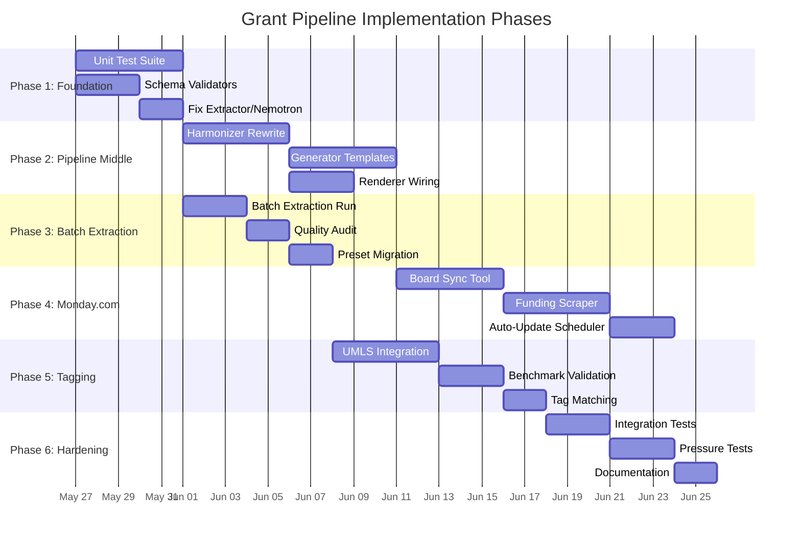

# Grant Pipeline — Implementation Plan

> **Status**: Active
> **Date**: 2026-07-10
> **Author**: @shahin
> **Audience**: leadership, grant team
> **Tags**: `funding`
> **Variants**: Technical (this doc) - Readable (Obsidian twin optional, same filename) - Agent (n/a)

**Status:** Proposed
**Last updated:** 2026-05-24

---

## Overview

This plan is organized into 6 phases, ordered by dependency and impact. Each phase can be executed as an independent sprint. Phases 1–3 are critical path; Phases 4–6 are production hardening.

---

## Phase 1: Foundation & Testing (Week 1–2)

**Goal:** Establish test coverage and fix known issues before building new features.

### 1.1 Unit Test Suite for Registry & Parser

Create `tests/scholarly/grants/` directory with:

- **`test_registry.py`**
  - `test_load_manifest()` — verify manifest loads, version is 1.2, counts are correct
  - `test_list_funders()` — verify all 16 funders returned with correct kinds
  - `test_get_funder_profile()` — load each funder, verify required_slots non-empty
  - `test_get_template()` — verify template sections exist for funders with `primary_artifacts`
  - `test_validate_submission_missing_slots()` — submit empty content, verify errors
  - `test_validate_submission_page_limit()` — submit oversized content, verify warning
  - `test_unknown_funder_raises()` — verify KeyError on unknown funder_id

- **`test_parser.py`**
  - `test_parse_pdf()` — parse a small test PDF, verify markdown output
  - `test_parse_docx()` — parse a test DOCX, verify markdown output
  - `test_criticmarkup_annotations()` — verify highlights appear as `{==text==}`
  - `test_table_extraction()` — verify `_tables.md` file generated
  - `test_metadata_extraction()` — verify `_metadata.json` generated with expected fields

- **`test_extractor.py`** (requires mocking)
  - `test_grant_info_schema()` — verify `GrantInfo` model validates correct JSON
  - `test_grant_info_schema_rejects_bad_input()` — verify validation errors on malformed JSON
  - `test_llm_config_defaults()` — verify default model, provider, timeout
  - `test_extractor_with_mock_llm()` — mock instructor client, verify extraction flow

### 1.2 Schema Consistency Validators

Create `src/cytos/scholarly/grants/schemas/validators.py`:

- `validate_manifest_funder_files()` — every funder in manifest has a corresponding YAML file
- `validate_slot_frontmatter_parity()` — every slot file's frontmatter matches manifest
- `validate_funder_required_slots()` — every required_slot in funder YAML exists in manifest
- `validate_group_resolution()` — every preset in groups.yaml resolves to valid slots
- `validate_opportunity_mapping()` — every opportunity's canonical_funder_ref points to existing funder

Add nox session: `nox -s validate_schemas`

### 1.3 Fix Extractor for Nemotron

- After system reboot, switch `LLMConfig.model` to `nemotron` (or make it configurable via env var `CYTOS_LLM_MODEL`)
- Add `CYTOS_LLM_MODEL` and `CYTOS_LLM_TIMEOUT` environment variable support
- Re-run `nox -s extract_grants` for all staged documents (ARPA-H, DOE, NSF Tech Labs)
- Validate JSON outputs

---

## Phase 2: Complete the Pipeline Middle (Week 3–4)

**Goal:** Replace placeholder logic in harmonizer and generator with real implementations.

### 2.1 Harmonizer — Semantic Slot Mapping

Replace placeholder logic with a two-pass approach:

**Pass 1: Rule-based heading matching**
- Parse document headings from markdown
- Match against funder's `primary_artifacts[].sections[].heading` patterns
- Map matched sections to their declared `slots`
- Set `confidence: 0.9` for exact heading matches, `0.7` for fuzzy matches

**Pass 2: LLM-assisted classification (for unmatched sections)**
- For sections not matched by rules, prompt the LLM with the section text + list of unmapped slots
- Ask for best slot assignment with confidence score
- Use instructor for structured output

### 2.2 Generator — Template-Aware Scaffold

- Create Jinja2 templates for priority funders:
  - `templates/arpah_solution_summary.md.j2` (3-page Solution Summary)
  - `templates/arpah_program_iso.md.j2` (full ISO)
  - `templates/nsf_tech_labs.md.j2`
  - `templates/doe_genesis.md.j2`
- Integrate with slot content from `schemas/slots/` directory
- Use `GrantInfo` extractions as context for LLM-assisted section drafting

### 2.3 Renderer — Pandoc/Quarto Wiring

- Wire `render.py` to call `pandoc` or `quarto render` as subprocess
- Support output formats: PDF (via LaTeX), DOCX, HTML
- Add `--engine` flag to `cytos compile` CLI command
- Create Quarto project configuration (`.qmd` templates with YAML frontmatter)
- Add nox session: `nox -s render_proposal -- <funder_id>`

---

## Phase 3: Extraction for All Funders (Week 5)

**Goal:** Run the extraction pipeline across all staged documents and validate outputs.

### 3.1 Batch Extraction

- Run `nox -s extract_grants` to process all 105 staged files
- Create per-funder extraction nox sessions:
  - `nox -s extract_arpah_delphi`
  - `nox -s extract_arpah_evident`
  - `nox -s extract_arpah_prospr`
  - `nox -s extract_nsf_tech_labs`
  - `nox -s extract_doe_genesis`

### 3.2 Extraction Quality Audit

- Create `scripts/audit_extractions.py` that:
  - Loads all generated JSONs
  - Checks for empty arrays (deadlines, contacts, requirements)
  - Validates against `GrantInfo` schema
  - Produces a quality report with per-field completeness percentages
  - Flags documents that need re-extraction with a better model

### 3.3 Preset Migration

- Migrate all 17 funder YAMLs from explicit slot lists to `preset:` shorthand
- Verify with schema validator that resolution produces identical slot sets

---

## Phase 4: Monday.com Integration (Week 6–7)

**Goal:** Two-way sync between the canonical schema and Monday.com boards.

### 4.1 Monday.com Board Sync Tool

Create `src/cytos/integrations/monday.py`:

- **Read operations:**
  - `fetch_funding_board()` — pull all items from board ID `18409744388`
  - `diff_with_mapping()` — compare Monday board state with `opportunity_mapping.yaml`
  - `find_stale_opportunities()` — flag opportunities with passed deadlines

- **Write operations:**
  - `update_item_fields()` — push F-field values to Monday columns
  - `add_canonical_slots_column()` — add slot mapping column to Strategic Planning boards
  - `batch_update_from_csv()` — import `opportunity_mapping.csv` to Monday

- **Sync operations:**
  - `full_sync()` — bidirectional sync (Monday → YAML for new items, YAML → Monday for enriched fields)

Add CLI: `cytos monday sync --board funding_opportunities --dry-run`
Add nox session: `nox -s monday_sync`

### 4.2 Funding Opportunity Scraper

Create `src/cytos/scholarly/grants/scraper.py`:

- **Federal sources:**
  - Grants.gov RSS feed parser (new FOAs matching keywords: biosensor, precision medicine, AI health, cellular, genomics)
  - SAM.gov API for contract opportunities
  - NSF active solicitations API
  - NIH Guide for Grants (RePORTER API)
  - ARPA-H public solicitations page scraper

- **Non-federal sources:**
  - Wellcome Trust open calls page
  - CZI program page
  - Google.org announcements
  - YC batch announcements

- **Pipeline:**
  1. Scraper discovers new opportunities
  2. Creates draft `opportunity_mapping.yaml` entry with F01–F11 from scraped data
  3. Runs LLM extraction to fill F12–F30
  4. Creates Monday.com item via API
  5. Notifies via Slack/email

Add CLI: `cytos grants discover --sources federal,philanthropy --since 7d`
Add nox session: `nox -s discover_funding`

### 4.3 Automatic Monday Table Updates

Create `src/cytos/integrations/monday_scheduler.py`:

- Cron-based scheduler (weekly) that:
  1. Runs the scraper to find new opportunities
  2. Runs `diff_with_mapping()` to detect changes
  3. Updates Monday board with new items and field changes
  4. Sends digest notification with changes summary

---

## Phase 5: UMLS/SnomedCT Semantic Tagging (Week 8)

**Goal:** Tag funding opportunities with standardized medical ontology terms.

### 5.1 Ontology Integration

Create `src/cytos/scholarly/grants/tagger.py`:

- Integrate `medspacy` or `scispacy` for named entity recognition
- Map extracted entities to UMLS CUI codes and SNOMED CT concepts
- Tag each opportunity with:
  - Disease/condition codes (SNOMED CT)
  - Procedure codes
  - Body site codes
  - Substance codes (drugs, biomarkers)

### 5.2 Testing with Key Programs

Validate tagging accuracy using the three benchmark programs:
- **EVIDENT** — expect tags: diagnostic testing, clinical evidence, biomarkers
- **PROSPR** — expect tags: screening, cancer detection, population health
- **Delphi** — expect tags: biosensors, continuous monitoring, wearable devices

### 5.3 Tag-Based Matching

- Add `umls_tags` field to `opportunity_mapping.yaml` schema
- Create matching function: given Cytognosis capability tags, rank opportunities by tag overlap
- Integrate with Monday board as a `Tag Match Score` column

---

## Phase 6: Production Hardening (Week 9–10)

### 6.1 Integration Tests

- End-to-end test: PDF → parse → extract → harmonize → generate → render → PDF
- Cross-funder test: same content through NSF X-Labs vs ARPA-H Solution Summary paths
- Performance test: full pipeline on all 105 staged documents

### 6.2 Pressure Tests

- Feed adversarial documents (corrupted PDFs, scanned images, huge tables)
- Test with 10x document volume
- Test LLM timeout/retry behavior with deliberate failures
- Validate schema consistency after bulk operations

### 6.3 Documentation

- Auto-generate API docs from docstrings
- Create user guide for each nox session
- Create troubleshooting guide for common failures (GROBID down, LLM timeout, Monday API rate limits)

---

## Dependency Graph

