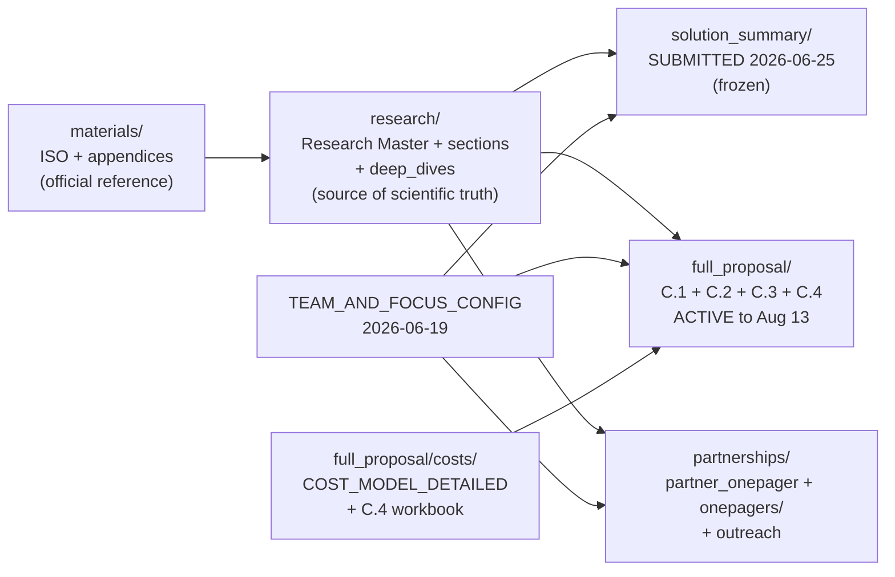

# ARPA-H IGoR (PsychIGoR) — Canonical Submission Index

**Program:** ARPA-H Intelligent Generator of Research (IGoR), solicitation **ARPA-H-SOL-26-155**, Proactive Health Office.
**Team:** PsychIGoR. **Prime:** Institute for Physical AI (IPAI), Purdue University. **PI:** Ananth Grama.
**ARPA-H PM:** Paul E. Sheehan, PhD. **EVIDENT / Proactive Health contact:** Glen Coppersmith.
**Last harmonized:** 2026-07-14 (per `~/Claude/Projects/Grants/IGoR-CONSOLIDATION-PLAN_2026-07-12.md`).
**Safety anchor:** git tag `pre-igor-harmonize-2026-07-12`.

> [!IMPORTANT]
> **Deadlines (Eastern Time):**
> - Solution Summary — **SUBMITTED 2026-06-25, 12:00 PM ET.**
> - Full proposal — **due 2026-08-13, 12:00 PM ET** (extended from 2026-08-06).

> [!NOTE]
> **Budget (locked bottom-up model, $42.9M):** Purdue/IPAI $12.5M (computational $6.5M + Tegtmeyer lab $6.0M), Cytognosis $9.5M, SIFT $7.0M, Cellanome $6.0M, shared program compute $2.5M, TA4 sequencing CRO $2.0M, McLean/HMS $0.7M, Valz legal/IP $0.2M, cross-team/reserve $2.5M. **Total $42.9M ARPA-H request** + ~$2.3M Performer in-kind (IPAI HPC, Purdue wet-lab, Cellanome credits) = ~$45.2M total project value. Full derivation: `full_proposal/costs/COST_MODEL_DETAILED_2026-06-16.md` (updated 2026-06-21). C.4 workbook is controlling: `full_proposal/costs/C4_Price_Workbook_PsychIGoR_v2026-06-21.xlsx`.

> [!NOTE]
> **Team (confirmed):** Ananth Grama (PI, IPAI/Purdue); Shahin Mohammadi (TA1/TA2 sub-lead, Cytognosis); Matthew Tegtmeyer (Purdue, TA4-academic lead + TA1 disease-modeling contributor); Anne Carpenter (Broad Institute, TA1 co-lead, computational morphology, no wet bench); W. Brad Ruzicka (McLean Hospital / HMS, clinical co-lead); Daniel Bryce (SIFT, TA2-TA3/TA3/TA3-TA4 lead) + Robert Goldman (SIFT, advisor); Patricia Purcell (Project Manager, Cytognosis hire); Elham Jebalbarezi Sarbijan (Software/Systems Architect, IPAI interim; Cytognosis hire recruiting); Duane Valz (legal/IP consultant, ~$750/hr). Full role map: `TEAM_AND_FOCUS_CONFIG_2026-06-19.md`.

---

## 1. Canonical artifact map

Every deliverable, its canonical file, status, and last-verified date. Superseded copies live under `_archive/2026-07-14_harmonize/` with dated filenames. **Nothing is deleted.**

### 1A. Solution Summary — SUBMITTED (frozen)

| Artifact | Canonical path | Status | Last-verified |
|---|---|---|---|
| Solution Summary body (markdown source) | `solution_summary/IGoR_Solution_Summary_SUBMISSION_2026-06-19.md` | submitted | 2026-06-25 |
| Solution Summary body (unbranded docx) | `solution_summary/IGoR_Solution_Summary_SUBMISSION_2026-06-19.docx` | submitted | 2026-06-25 |
| Solution Summary (branded formal submission docx) | `PsychIGoR_Solution_Summary_SUBMISSION_2026-06-19_branded.docx` | submitted | 2026-06-25 |
| Solution Summary sections (source of record for the compile) | `solution_summary/sections/` | frozen | 2026-06-19 |
| SS compile tooling and template | `solution_summary/build.py`, `solution_summary/apply_table_9pt.py`, `solution_summary/fix_table_cols.py`, `solution_summary/make_ref_docx*.py`, `solution_summary/_template/`, `solution_summary/brand_reference.docx` | frozen tooling | 2026-06-19 |

> The submitted body reflects the pre-restructure $50M planning envelope. **Do not edit.** All post-submission budget/team revisions live in `full_proposal/` for the Aug 13 full proposal.

### 1B. Full proposal — ACTIVE to Aug 13, 2026

| Artifact | Canonical path | Status | Last-verified |
|---|---|---|---|
| **C.1 Technical and Management Proposal** | `full_proposal/C1_Technical_and_Management_Proposal.md` | active draft | 2026-07-14 |
| **C.2 Task Description Document (TDD)** | `full_proposal/C2_Task_Description_Document.md` | active draft | 2026-07-14 |
| **C.3 Price Proposal (narrative)** | `full_proposal/C3_Price_Proposal.md` | active draft | 2026-07-14 |
| **C.4 Price Proposal Workbook** | `full_proposal/costs/C4_Price_Workbook_PsychIGoR_v2026-06-21.xlsx` | active (locked $42.9M) | 2026-06-21 |
| Cost model (bottom-up derivation) | `full_proposal/costs/COST_MODEL_DETAILED_2026-06-16.md` | active | 2026-06-21 |

### 1C. Research (individual parts and sections — KEEP ALL)

The compiled research master is the source of truth for scientific content; deliverables profile from it. Every section is retained.

| Artifact | Canonical path | Status | Last-verified |
|---|---|---|---|
| Research master (compiled, all sections) | `research/IGoR_Research_Master.md` | active | 2026-06-17 |
| Research master (shareable / partner-safe profile) | `research/IGoR_Research_Master_shareable.md` | active | 2026-06-17 |
| Research README (compile system) | `research/README.md` | active | 2026-06-17 |
| Research sections (21 files, atomic content) | `research/sections/` | active | 2026-06-17 |
| Research deep dives (TA1-TA4, interface briefs and fulls) | `research/deep_dives/` | active | 2026-06-19 |
| Research build system (section-to-master compiler) | `research/build.py`, `research/_template/` | active | 2026-06-17 |
| Fact check and capabilities audit | `research/FACT_CHECK_AND_CAPABILITIES_2026-06-16.md` | reference | 2026-06-16 |
| Significance and innovation (dual grounding) | `research/SIGNIFICANCE_AND_INNOVATION_dual_grounding_2026-06-15.md` | reference | 2026-06-15 |
| Participation rules memo (OCI, multi-proposal, eligibility) | `research/IGoR_Participation_Rules_Memo_2026-06-17.md` | reference | 2026-06-17 |
| TA4 model and teaming update | `research/UPDATE_2026-06-17_TA4_model_and_teaming.md` | reference | 2026-06-17 |
| Research prior-work sources (six historical inputs to the master) | `research/_sources/` | historical (kept) | 2026-06-17 |

### 1D. Partnerships — KEEP; dedupe against 01-Strategy noted below

| Artifact | Canonical path | Status | Last-verified |
|---|---|---|---|
| Partner one-pager (compiled from sections) | `partnerships/partner_onepager/IGoR_OnePager.md` (+ .docx) | active | 2026-06-19 |
| Partner one-pager sections / template / older versions | `partnerships/partner_onepager/sections/`, `_template/`, `_sources/` | active + archive | 2026-06-19 |
| Per-target partner one-pagers (Cellanome, SIFT, Illumina, Xaira, TripleRing, Medra, Phylo, program overview, Ananth science) | `partnerships/onepagers/*.md` + `*.docx` | active | 2026-06-19 |
| Parked partner one-pagers (not currently used) | `partnerships/onepagers/_parked/` | parked | 2026-06-19 |
| Partner outreach emails (Carpenter, Cellanome, Illumina, SIFT, SPOC, Transfyr, Xaira) | `partnerships/outreach/` | active | 2026-06-18 |
| Inbound partner interest (SPOC) | `partnerships/inbound/` | historical | 2026-06-18 |
| Candidate slate (Tier 1-3) and dossier | `partnerships/IGoR_Candidate_Slate_Tier1-3_2026-06-03.md`, `partnerships/CANDIDATE_DOSSIER.md` | reference | 2026-06-03 |
| Team tracker | `partnerships/TEAM_TRACKER.md` | active | 2026-06-19 |
| Partner outreach strategy | `partnerships/PARTNER_OUTREACH_STRATEGY.md` | reference | 2026-06-19 |
| SIFT capabilities analysis | `partnerships/SIFT_capabilities_analysis.md` | reference | 2026-06-19 |
| Teaming roster and enriched-teams TSVs | `partnerships/IGoR_teaming_roster.tsv`, `partnerships/IGoR_teams_enriched.tsv` | reference | 2026-06-19 |
| Cellanome NDA (Duane-revised) and redline | `partnerships/Cellanome-NDA_Duane-revised_2026-06-16.docx`, `partnerships/Cellanome-NDA_CriticMarkup-redline_2026-06-07.md` | active | 2026-06-16 |

### 1E. Materials — Official ISO + Appendices (reference only)

| Artifact | Canonical path | Status | Last-verified |
|---|---|---|---|
| Comprehensive program reference (all 11 sections + appendices A-D) | `materials/IGoR_Comprehensive_Reference.md` | reference | 2026-06-14 |
| Original ISO + appendices A/B/C.1/C.2/C.3/C.4/D/E (Amendment 01 where issued) | `materials/original/` | official (read-only) | 2026-06-14 |
| Extracted plain text | `materials/extracted-text/` | official (derived) | 2026-06-14 |
| Per-appendix briefs | `materials/markdown/` | reference | 2026-06-14 |

### 1F. Figures — TA loop and per-TA diagrams (mermaid canonical; PNG/SVG built)

| Artifact | Canonical path | Status | Last-verified |
|---|---|---|---|
| TA closed-loop diagram (mermaid + PNG + SVG) | `figures/IGoR_TA_loop_diagram.{mmd,png,svg}` | draft | 2026-06-19 |
| TA1 comprehensive disease models | `figures/TA1_comprehensive_disease_models.{png,svg}` | draft | 2026-06-19 |
| TA2 new science engine | `figures/TA2_new_science_engine.{png,svg}` | draft | 2026-06-19 |
| TA3 interoperable procedures | `figures/TA3_interoperable_procedures.{png,svg}` | draft | 2026-06-19 |
| TA4 experiment marketplace | `figures/TA4_experiment_marketplace.{png,svg}` | draft | 2026-06-19 |
| PsychIGoR team logo | `figures/PsychIGoR_team_logo.{png,svg}` | draft | 2026-06-19 |
| Figures README | `figures/README.md` | reference | 2026-06-19 |

### 1G. Top-level planning docs (retained, historical)

| Artifact | Canonical path | Status | Last-verified |
|---|---|---|---|
| Canonical team + focus configuration | `TEAM_AND_FOCUS_CONFIG_2026-06-19.md` | active (team source of truth) | 2026-06-19 |
| Stage-two build plan (compile 3 deliverables from research master) | `STAGE_TWO_PLAN.md` | historical (SS submitted; FP active) | 2026-06-14 |
| June 2026-06-19 consolidation notes (led to the $42.9M restructure) | `_consolidation_2026-06-19/` | historical | 2026-06-21 |

### 1H. Archive (all superseded copies, dated, never deleted)

| Bucket | Path |
|---|---|
| SS drafts (long working, working, DRAFT variants, DRAFT.docx, revised 06-02 and 06-05, materials draft, post-submission v2026-06-21 5-page and FULL docxs) | `_archive/2026-07-14_harmonize/solution_summary/` |
| C1/C2/C3 pandoc-build docxs + v2026-06-21 formatted docxs + full-proposal DRAFT 06-12 (md + docx) | `_archive/2026-07-14_harmonize/full_proposal/` |
| C4 workbook 06-12 and 06-16; COST_MODEL 06-12; Cost Breakdown 06-02 | `_archive/2026-07-14_harmonize/full_proposal_costs/` |

---

## 2. How the pieces relate

Research master = source of scientific truth. Team config = team source of truth. Cost model + C.4 workbook = price source of truth. The three deliverables (one-pager, SS, full proposal) are length-targeted profiles compiled from these sources.

---

## 3. Related IGoR content outside this folder (not folded in per scope; cross-linked)

Per the consolidation plan, the following historical strategy files remain in `01-Strategy/` (pre-submission framing; not folded in to avoid modifying `01-Strategy/`, which is outside this task's scope). Treat them as historical strategy context. Current source of truth for team, partnerships, and outreach lives in this folder.

| File | Relationship |
|---|---|
| `01-Strategy/tracks/FUNDING_IGOR_TRACK_2026-06-03.md` | Pre-submission funding-track framing; superseded by this INDEX and by `~/Claude/Projects/Grants/IGoR-CONSOLIDATION-PLAN_2026-07-12.md` |
| `01-Strategy/tracks/FUNDING_IGOR_TRACK_ADHD_2026-06-03.md` | ADHD-friendly twin of the above; same status |
| `01-Strategy/partnerships/igor-top3-partner-dossier.md` | Duplicates partial content in `partnerships/CANDIDATE_DOSSIER.md`; the submission dossier is canonical |
| `01-Strategy/partnerships/igor-ta3-ta4-teaming-landscape.md` | Duplicates partial content in `partnerships/IGoR_Candidate_Slate_Tier1-3_2026-06-03.md`; the submission slate is canonical |

Drive references (external, per plan section 2):
- Drive `Funding/ARPA-H/IGoR/` — official ISO + appendices A-E (PDF/docx); C.4 workbook xlsx. Source of record for the official materials mirrored into `materials/original/`.
- Google Docs — PsychIGoR SS FULL `1OyDOCq…`; SS Final `12bxWF0…`; review/update `1IrWibT…`; TA1 one-pager `1krR-yiO…`; C.1-C.4 finals + superseded. Reconcile latest edits back to this folder per plan section 5.

Sister program: `../HSF/ARPA-H_HSF_Solution_Summary.md`.
Cross-grant compliance (Human Subjects readiness): `../../_support/Human_Subjects_Readiness_FWA_IRB_SMART_2026-06-01.md` (verify path).

---

## 4. Conventions

- **Markdown source of truth.** C1/C2/C3 are authored in markdown, section-composed, and compiled to docx/PDF. The compiled docx is a build artifact; the .md is canonical.
- **C.4 is native xlsx** (no markdown equivalent); the current-dated xlsx is canonical.
- **Never delete.** Superseded artifacts move to `_archive/<date>_<reason>/` with dated filenames; the git history plus the `_archive/` tree preserves provenance.
- **No em dashes** anywhere; use commas or semicolons.
- **Restricted content** is marked in-place: the factorized-PRS method (proprietary IP), the SPEAR manuscript (under anonymous review), and the founder TBX1 personal-genomic anchor. Restricted sections are excluded from partner-facing profiles.

---

## 5. Wave 1 harmonization changes (2026-07-14)

- Picked one canonical per artifact for SS, C1, C2, C3, C4 (see §1). Moved all superseded copies into `_archive/2026-07-14_harmonize/` with dated names (23 files renamed, zero deleted).
- Drained `solution_summary/_sources/` and `full_proposal/_sources/` into `_archive/2026-07-14_harmonize/`.
- Reconciled ARPA-H PM (Sheehan) and full-proposal deadline (2026-08-13, extended from 2026-08-06) into C1/C2/C3.
- Added a SUBMITTED banner to the canonical Solution Summary markdown; body content unchanged.
- Rebuilt this INDEX.md as the single canonical artifact map.

Open items still outside harmonization scope (per plan sections 5-6): IGoR per-award ceiling confirmation; Purdue HPC match letter; Cellanome R3200 quote and cost model; DataTecnica risk-row status; whether to add Phylo to TA2; Google-Docs reconciliation into the local canonical (SS + C.1-C.4 latest edits).
