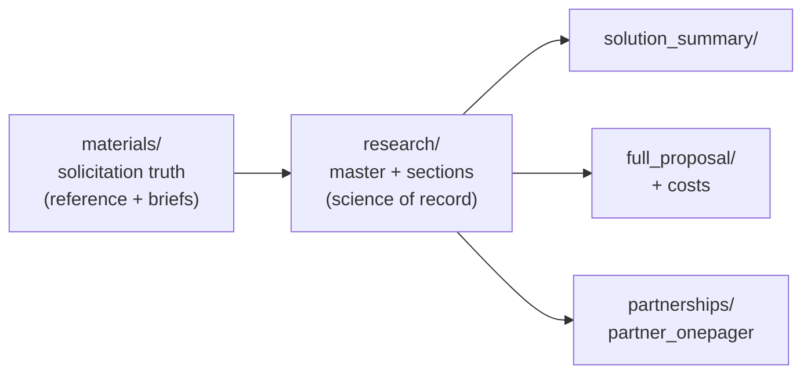

# ARPA-H IGoR: Submission Index

**Program:** IGoR (Intelligent Generator of Research), ARPA-H ISO OT solicitation **ARPA-H-SOL-26-155**, Proactive Health Office.
**Last updated:** 2026-06-18.

> [!IMPORTANT]
> **Deadlines (Eastern Time):** Solution Summary **2026-06-25, 12:00 PM**; full proposal **2026-08-06, 12:00 PM**. Proposers' Day was held **June 9, 2026** (recording on the ARPA-H IGoR page).

> [!NOTE]
> **Latest proposal state (2026-06-18):** Multi-performer consortium at **$50M**; **IPAI/Purdue prime** with Ananth Grama as PI; Cytognosis and IPAI co-lead TA1 and TA2; SIFT (Bryce/Goldman) confirmed as TA3 lead; Anne Carpenter confirmed at IPAI/Purdue (computational morphology and imaging models, no wet bench); Elham Jebalbarezi Sarbijan (tentative) as Software/Systems Architect; Patricia Purcell as PM; Transfyr and SPOC declined 2026-06-18. Disease scope framed **schizophrenia to bipolar** with 22q11DS as the Phase I cellular anchor.

> [!IMPORTANT]
> **Stage two** (revising the one-pager, Solution Summary, and full proposal jointly from the master) is planned in [`STAGE_TWO_PLAN.md`](STAGE_TWO_PLAN.md). Old deliverable variants are archived in each folder's `_sources/`.

## Folder map

| Folder | What lives here | Status |
|---|---|---|
| **`materials/`** | The solicitation and its truth. **`IGoR_Comprehensive_Reference.md`** is the single program reference (Sections 1 to 11 plus verbatim appendices). `original/` holds the 10 source files; `extracted-text/` the plain-text extractions; `markdown/` the 10 per-document briefs plus a README index. | Stable |
| **`research/`** | Our scientific and technical work. **`IGoR_Research_Master.md`** (compiled, 21 sections) is the source of record; content lives in `sections/`, structure in `_template/`, and `build.py` compiles internal and shareable profiles to markdown and PDF. The original notes and the two standards reviews are archived in `_sources/`. See `research/README.md`. | Built |
| **`solution_summary/`** | Old Solution Summary variants archived in `_sources/`; the revised version builds here from the master (see `STAGE_TWO_PLAN.md`). | Stage 2 |
| **`full_proposal/`** | Old full-proposal draft archived in `_sources/`; the revised proposal builds here from the master. **`costs/`** holds `COST_MODEL.md` (definitive $50M model), the 06-02 breakdown, and the price `.xlsx`. | Stage 2 |
| **`partnerships/`** | Teaming: `IGoR_Candidate_Slate_Tier1-3`, the roster and enriched-teams TSVs, and **`partner_onepager/`** (old versions archived in its `_sources/`; the revised one-pager builds there). | Stage 2 |
| **`figures/`** | Working figures (TA closed-loop diagram, four TA figures, PsychIGoR team mark) plus a README. **None are final.** | Draft |

## How the pieces relate

The research master is the source of truth for what we propose. The three deliverables (one-pager, Solution Summary, full proposal) are refined from it.

## Conventions

- **Templated markdown:** deliverables are authored as separate section files plus a structure template, then compiled to markdown and PDF (docx optional). PDF builds use pandoc with weasyprint.
- **Sensitive content** lives in clearly marked, restricted section files and never enters partner-facing materials: the factorized-PRS method (crown-jewel IP), the SPEAR manuscript (under anonymous review), and the founder TBX1 variant (personal genomic information).
- **No em dashes** in any document (commas or semicolons); bold for emphasis; tables for comparisons.

## Recent changes (2026-06-14)

- Re-extracted Amendment 01 of Appendix B and Appendix E; built per-document briefs under `materials/markdown/`.
- Fixed all post-reorg links.
- Merged `SOLICITATION_TRUTH.md` into `materials/IGoR_Comprehensive_Reference.md` (appendices A to D) and retired the source.
- Read and removed `_build/`; carried its open citation/QA items into the reference's appendix note.
- Consolidated `research/` into a templated, compiled master (`IGoR_Research_Master`, 20 sections, internal and shareable profiles, markdown and PDF); archived the six source notes in `research/_sources/`.
- Built the section-based compile system (`research/build.py`, `research/_template/`) to be reused for the three deliverables (one-pager, Solution Summary, full proposal).
- Integrated two standards-comparison reviews into the master as section 24 (disease-knowledge and cellular-model standards landscape) and section 35 (the standards stack we adopt); archived the sources.
- Ingested the schizophrenia/22q11/TBX1 disease-genetics research as section 42 (penetrant forms and the familial-disease rationale that justifies the cellular models); archived the source.
- Planned stage two in `STAGE_TWO_PLAN.md` and archived the old one-pager, Solution Summary, and full-proposal variants to `_sources/` in each deliverable folder.

## Sister program

- HSF (ARPA-H Mission Office): `../HSF/ARPA-H_HSF_Solution_Summary.md`.

## Cross-grant compliance

- Human subjects readiness (FWA, IRB): `../../_support/Human_Subjects_Readiness_FWA_IRB_SMART_2026-06-01.md` (verify path).
