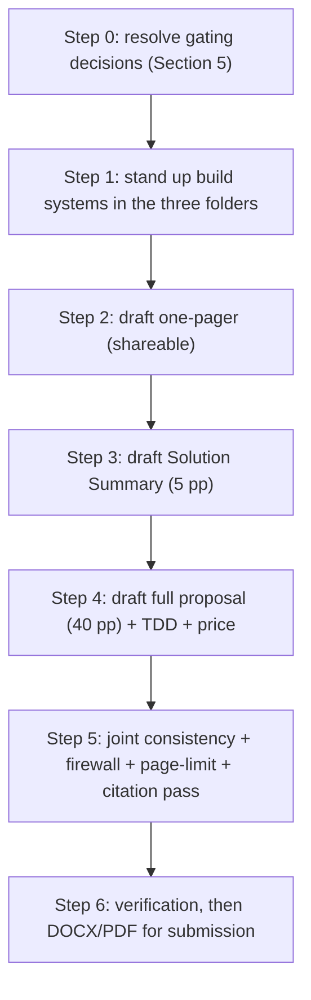

# IGoR Stage Two Plan: revise the three deliverables from the research master

**Created:** 2026-06-14. **Owner:** Shahin. **Source of record:** `research/IGoR_Research_Master.md` (21 sections).

> [!NOTE]
> Stage one consolidated all science into the research master. **Stage two produces the three submission-ready deliverables (one-pager, Solution Summary, full proposal) as downstream, length-targeted views of that single master,** built with the same templated section-plus-compile system and revised jointly so their shared facts always agree.

> [!TIP]
> **If you read one thing:** the master is the canonical content; each deliverable is a profile of it at a fixed length and audience. Draft smallest to largest (one-pager, then Solution Summary, then full proposal) so each larger document expands the one before it, and run a single joint consistency pass at the end.

---

## 1. Principles

- **Single source of truth.** Every scientific or factual claim traces to a master section. Deliverables do not invent content; they select, compress, and reframe master content for a length and audience.
- **Draft smallest to largest.** The one-pager forces the core message into one page; the Solution Summary expands it to five; the full proposal expands that to forty. Each reuses the tier below.
- **Same build system.** Reuse the `research/build.py` pattern: each deliverable folder gets `sections/` (content), `_template/manifest.json` (order, profiles, restricted flags), and compiles to markdown, PDF, and DOCX.
- **Firewall by profile.** The one-pager is partner-facing and excludes all restricted content. The Solution Summary and full proposal are ARPA-H submissions: proprietary material (the factorization, section 31) may appear but its pages are marked "Proprietary"; the personal-genomic anchor (section 41) is generalized to "a patient-derived 22q11.2-region validation line"; the perturbation model under review (section 32) is referenced only as a capability.

---

## 2. Deliverables, formats, and audience

| Deliverable | Audience | Format authority | Hard limits |
|---|---|---|---|
| **One-pager** | Prospective TA3/TA4 partners | None (internal design) | 1 to 2 pages; partner-safe only |
| **Solution Summary** | ARPA-H (first round, non-gated) | Appendix B | **5 pages for Sections 1 to 4**; cover, BOE, and references excluded; sans-serif >= 11 pt, 1-inch margins. Due **2026-06-25 12:00 ET** |
| **Full proposal** | ARPA-H (full round) | Appendix C.1 (plus C.2 TDD, C.3 price, D, E) | **40 pages for Sections 1 to 7**; Commercialization <= 3 pp, Capabilities/Management <= 2 pp; Gantt, bios, references exempt. Due **2026-08-06 12:00 ET** |

---

## 3. Master-to-deliverable crosswalk

This is the heart of the plan: which master sections feed each deliverable section. Restricted master sections are flagged.

### 3A. One-pager (partner recruitment, shareable only)

| One-pager block | Master sections | Notes |
|---|---|---|
| Hook and problem | 00, 10 | The disease-as-perturbation bet in two sentences |
| What we build (TA1/TA2) | 30, 33 (condensed) | No proprietary detail (31, 32 excluded) |
| Why it is credible | 40, 42 | Penetrant-form rationale; named datasets |
| What we seek in partners | 34, 60 | The TA3/TA4 capabilities we are recruiting |
| Team and contact | 60 | Current roster; the ask |

> [!WARNING]
> Update the partner ask to the **current roster** (SIFT as TA3 lead, Illumina as TA4). The archived one-pagers still read as "seeking TA3/TA4," which is stale (section 70).

### 3B. Solution Summary (Appendix B)

| Appendix B section | Master sections | Page budget |
|---|---|---|
| 1. Concept Summary | 00, 10; ISO interest areas (reference Section 2) | within 5 pp |
| 2. Innovation and Impact (with quantitative comparison table) | 10, 20 to 24 (gap), 30 to 35 (edge), 50 (metrics) | within 5 pp |
| 3. Proposed Work | 30, 33, 34, 35, 40, 42, 50; anchor from 41 (generalized) | within 5 pp |
| 4. Team Organization and Capabilities | 60 | within 5 pp |
| 5. Basis of Estimate (no limit) | `full_proposal/costs/COST_MODEL.md` | outside 5 pp |
| 6. References Cited (no limit) | 99 | outside 5 pp |

### 3C. Full proposal (Appendix C.1 plus C.2, C.3)

| C.1 section | Master sections | Notes |
|---|---|---|
| 1. Proposal Summary (9-question overview + Innovative Claims Table) | 00, 10, 30 to 35; claims map = reference Appendix D | The 50-row cross-walk in the comprehensive reference feeds the claims table |
| 2. Goals and Impact | 10, 40, 42, 50 | National-health impact plus the penetrant-form rationale |
| 3. Gantt (exempt) | 50, reference Section 5 (phases) | 18/18/24 month structure |
| 4. Technical Plan | 30, 31 (mark Proprietary), 33, 34, 35, 40, 42, 50 | Task structure must match the C.2 TDD |
| 5. Risk and Contingency | 90 (gaps to risks), 20 to 24 (alternatives considered) | |
| 6. Commercialization (<= 3 pp) | 35, reference Section 8, openness policy | Open standards plus the progression-schema contribution |
| 7. Capabilities/Management (<= 2 pp) | 60 | Name PI, PM, and the software architect |
| Biographies (exempt) | 60 | NIH biosketch format acceptable |
| References (exempt) | 99 | DOI/PMID |
| **C.2 Task Description Document** | 50 (milestones), 30 to 35 (tasks), phases | Drives Section 4 and the milestone payment schedule |
| **C.3 Price Proposal + workbook** | `costs/COST_MODEL.md`, the price workbook | Cross-walk to TDD tasks |
| **Appendix E redline** | `materials/markdown/APPENDIX_E_Draft_Model_OT_Agreement.md` | Redline per the prior triage; silence equals acceptance |

---

## 4. Joint revision: single-source facts that must agree everywhere

These values are written once (here, traced to the master) and must read identically across the one-pager, Solution Summary, full proposal, TDD, price, and OT redline.

| Fact | Current value | Source / status |
|---|---|---|
| Budget | **$50M** total; $13.5M / $15.0M / $21.5M by phase | `costs/COST_MODEL.md`; confirm (section 90) |
| Phases | 18 + 18 + 24 months (60) | reference Section 5 |
| Prime / PI | **IPAI-Purdue prime; Ananth Grama, PI** | **Confirmed 2026-06-14** |
| Consortium | Confirmed core: Cytognosis, IPAI, McLean, Matt Tegtmeyer lab (TA4 academic experimental arm; fixed-cell high-plex readouts including RNA ~350-plex, protein ~50-plex, Cell-Painting-style morphology, and in-situ CRISPR-guide sequencing; all wet-lab experiments), Anne Carpenter (TA4 computational morphology/imaging-model lead; IPAI/Purdue; no bench), Purcell (PM). TA2 led by Cytognosis (Phylo/FutureHouse optional); TA3 = LabOP via SIFT (Dan Bryce, lead); TA4 two-arm model = Matt Tegtmeyer (academic) + Cellanome (industry) + Illumina (optional) | `partnerships/TEAM_TRACKER.md` |
| Disease framing | **Schizophrenia to bipolar**; penetrant genetic forms as isogenic cellular models | **Confirmed 2026-06-14** |
| Marquee metrics | cycle time >=4x (II), >=10x (III); concordance 85/90 | section 50; reference Section 6 |
| Software architect | Planned Cytognosis hire (recruiting); Elham Jebalbarezi Sarbijan (IPAI) interim | Recruiting; Anna Merkoulovitch is off market and no longer a candidate |
| Novelty sentence | the committed disease-as-perturbation sentence | section 10 |

---

## 5. Open decisions to resolve before or during drafting

> [!IMPORTANT]
> These gate the deliverables. The first group needs your input; the second I can resolve while drafting.

**Needs your decision (no drafting can finalize without these):**

- **Prime and PI:** RESOLVED 2026-06-14 (IPAI/Purdue, Grama).
- **Software architect:** planned Cytognosis hire (recruiting); Elham Jebalbarezi Sarbijan (IPAI) is interim placeholder; Anna Merkoulovitch is off market.
- **Partner confirmations:** Cellanome costs/docs pending (June 23 deadline); Illumina optional/TBD. Transfyr DECLINED 2026-06-18; SPOC DECLINED 2026-06-18.
- **Disease title:** lock the cover framing (schizophrenia-to-bipolar versus 22q11DS-led) and apply it everywhere.

**I can resolve while drafting (flag for your review):**

- Restore the dropped Spearman r >= 0.4 TA2 metric (recommended).
- Reinstate the B12 reversion falsifiability test in the Phase I anchor (recommended).
- Confirm the $50M figure and purge any residual $30M references.
- Resolve the open citation flags from section 99 (sVAE+, PKG25S4, STATE author list).

---

## 6. Build architecture for the deliverables

Each deliverable folder becomes self-building, mirroring `research/`:

```
solution_summary/
  sections/                 (one file per Appendix B section)
  _template/manifest.json   (order, profile, restricted flags, page targets)
  build.py                  (shared; copied/adapted from research/build.py)
  _sources/                 (archived variants; already moved)
full_proposal/
  sections/                 (C.1 Sections 1-7, plus TDD and price stubs)
  _template/  build.py  _sources/  costs/
partnerships/partner_onepager/
  sections/  _template/  build.py  _sources/
```

- **Outputs:** markdown plus PDF for review, and **DOCX for submission** (pandoc with a reference DOCX enforcing 8.5x11, 1-inch margins, sans-serif >= 11 pt). ARPA-H accepts .pdf and .docx.
- **Profiles:** the one-pager builds shareable only; the Solution Summary and full proposal build a submission profile that includes proprietary content on marked pages and a separate shareable profile for partner circulation.
- **Page-limit guard:** the build prints an approximate page count per profile so we catch overflow early (the 5-page and 40-page caps are hard).

---

## 7. Sequence of work



- **Step 2 to 4** can use subagents to draft sections in parallel against this crosswalk, then synthesis by the lead.
- **Step 5** enforces the single-source facts (Section 4), the proprietary firewall, and the page caps.
- **Step 6** verifies citations (resolve section 99 flags), checks numbers, generates submission DOCX, and confirms format compliance.

> [!CAUTION]
> This thread is already long. For drafting quality, **start stage-two execution in a fresh session**, opening with this plan and `research/IGoR_Research_Master.md`. The build systems and crosswalk here make that handoff clean.

---

## 8. Definition of done (acceptance checks per deliverable)

- **One-pager:** one to two pages; current roster and ask; zero restricted content; builds to PDF and DOCX.
- **Solution Summary:** Sections 1 to 4 within 5 pages; BOE and references present and excluded from the count; proprietary pages marked; all single-source facts match; format compliant; due 2026-06-25.
- **Full proposal:** Sections 1 to 7 within 40 pages; Commercialization <= 3 pp; Management <= 2 pp; Gantt, bios, references present and exempt; TDD task structure matches Section 4; price cross-walks to the TDD; OT redline attached; proprietary pages marked; due 2026-08-06.
- **All three:** no em dashes; citations carry DOI or PMID; the disease-as-perturbation thesis and the penetrant-form rationale are stated consistently.

---

## 11. TA4 model update (2026-06-17)

**TA4 has been restructured into two experimental arms (updated 2026-06-17):**

- **Academic arm:** Matt Tegtmeyer lab (Purdue) runs all wet-lab experiments using fixed-cell high-plex readouts (RNA ~350-plex, protein ~50-plex, Cell-Painting-style morphology, and in-situ CRISPR-guide sequencing; neuroscience panel; fixed-cell in-situ at massive scale). Element Biosciences AVITI24 is the instrument Matt's lab uses; it is not a teaming partner.
- **Industry arm:** Cellanome (R3200 + Perturb-LINK; live-cell temporal). Advancing as of 2026-06-17; operating model (R3200 in-lab vs. send-out) pending pricing decision.
- **Computational layer:** Anne Carpenter is the computational morphology/imaging-model lead (interpretable models, morphological profiling; no wet-lab bench). Budget line = personnel + compute, not wet-lab capex.
- **Element/Cellanome cross-arm concordance:** same variant lines on both platforms = built-in Phase I concordance check.

**Aug-6 action (dual-team, not a Jun-25 blocker):**

Both Matt Tegtmeyer and Anne Carpenter are also on an IU-prime IGoR team (~5 lead PIs; likely Purdue subaward). The solicitation allows subs on multiple proposals; the real constraints are committed effort, OCI disclosure, and post-award de-duplication. Confirm at the Jun 29 to Jul 3 Purdue visit: (1) IU is prime on the other team, not Purdue; (2) Matt and Anne are primary on PsychIGoR with non-overlapping hours; (3) Purdue subaward routing on the IU team; (4) if Anne is our lead PI, her IU-team role is minimal and disclosed. Resolve all of this before Aug 6 full proposal. Not a blocker for the Jun 25 Solution Summary.

**[FLAG 2026-06-17: cost-model dollar figures for Anne's budget line and Matt's equipment stand-up require re-derivation. Defer to Shahin/Ananth.]**

---

## 9. What changed in setup (2026-06-14)

- Archived the old deliverable variants to `_sources/` in `solution_summary/`, `full_proposal/`, and `partnerships/partner_onepager/`. The cost model stays live in `full_proposal/costs/`.
- This plan is the entry point for stage-two execution.


## 10. Team status convention and 2026-06-14 updates

- **Confirmed core (final):** Cytognosis (Shahin), IPAI/Purdue (Ananth Grama, prime and PI), McLean (Brad Ruzicka), and Anne Carpenter (about 90 percent). **All other roles are in discussion.**
- **Convention for all docs:** confirmed members appear **without a tag**; tentative entries carry a short professional parenthetical, **(in discussion)** for named candidates and **(recruiting)** for open roles. Never imply a candidate is committed; never signal an empty roster. The live roster, engagement intel, and open questions are in `partnerships/TEAM_TRACKER.md`; outreach approach is in `partnerships/PARTNER_OUTREACH_STRATEGY.md`.
- **Resolved 2026-06-14:** prime and PI (IPAI/Purdue, Grama); disease framing (schizophrenia to bipolar, with penetrant genetic forms as isogenic disease-in-a-dish models and a Phase I phenotypic-triage screen); PM (Patricia Purcell, confirmed). **Architect:** planned Cytognosis hire (recruiting); Anna Merkoulovitch is off market.
- **Still open:** Brad's exact role plus human-data limits; Anne Carpenter affiliation; IPAI student and postdoc resourcing; TA3/TA4 partner confirmations (Cellanome NDA, Illumina meeting 2026-06-16, Phylo/Kexin reply).


### Team-config refinements (2026-06-14, later)

- **TA2:** Cytognosis builds and leads TA2; **Phylo (Kexin Huang)** and **FutureHouse** are optional add-on collaborators, not blockers. Harvard's **ToolUniverse** is a tool, not a partner.
- **TA3:** the only genuine interoperability option is **LabOP**, led by **Dan Bryce (SIFT)** and **Tim Fallon (UCSD)**; decide the SIFT-versus-UCSD route.
- **TA4 (updated 2026-06-19):** Two experimental arms: **Matt Tegtmeyer lab (Purdue)** = academic arm (all wet-lab experiments; fixed-cell high-plex readouts: RNA ~350-plex, protein ~50-plex, Cell-Painting-style morphology, in-situ CRISPR-guide sequencing); **Cellanome** = industry arm (R3200 + Perturb-LINK; advancing; live-cell temporal readouts including single-cell calcium imaging). **Anne Carpenter** (IPAI/Purdue) = computational morphology/imaging-model lead (no bench; interpretable models consuming readouts from both arms; TA1/TA2 bridge). **Illumina** = optional Lab 3. **SPOC Biosciences = DECLINED 2026-06-18.** **Panome** = alternate Phase II extension.
- **PM:** Patricia Purcell **verbally agreed** (hours and salary to be polished).
- **Process:** route all NDAs and redlines through Duane Valz before sharing.
- **TA1 exclusivity:** TA1 is in-house (Cytognosis, IPAI, students); no external TA1 partners.
- **DataTecnica (Faraz Faghri):** optional TA2 add-on (CNS ML, biobank-scale); verify Faraz's NIH employment status, OCI, and salary cap with counsel.
- **Transfyr (Renee Wegrzyn): DECLINED 2026-06-18.** Not on the active candidate list. COI concern (former ARPA-H director) remains on record.
