# IGoR / PsychIGoR — Figure & Diagram Assets

**TL;DR.** Five visuals (four TA tiles + the **PsychIGoR** team mark) and one annotated Mermaid system diagram. The four TA tiles are now **method-faithful**: each central schematic is an original drawing of the actual cited method (not a generic icon). Every visual is editable **SVG** plus high-res **PNG**. Drop SVG/PNG into the one-pager, Solution Summary, and Full Proposal. **Word/PDF cannot render Mermaid, so embed `IGoR_TA_loop_diagram.svg`/`.png` there;** paste the Mermaid block into markdown or Obsidian.

If you only look at one thing: open `IGoR_TA_loop_diagram.png`.

## Asset inventory

| File (SVG + PNG) | Method-faithful content | Source basis | Org |
|---|---|---|---|
| `TA1_comprehensive_disease_models` | Genetic variant as soft intervention → latent pathway space with a sparse mask, basal state z₀, three additive **disease-axis** shifts to a disease state, faint causal DAG → readout; cellular↔clinical alignment | sparse-mechanism-shift / causal-perturbation lineage (SAMS-VAE; discrepancy-VAE) | Cytognosis · McLean/HMS |
| `TA2_new_science_engine` | Researcher (human in loop) → **plan → code → run → observe** agent loop, grounded in the TA1 model, with dissent/verify streams, VOI badge, and a tools/data/code environment (150 tools · 105 packages · 59 databases) | Biomni architecture (Huang et al., 2025) | Phylo (Biomni) · Cytognosis |
| `TA3_interoperable_procedures` | Four abstraction layers (intent → protocol → calibration → hardware) with a UML activity callout, dashed specialization to OT-2 / Echo / SiLA instruments, SBOL · PROV-O schema badge | LabOP (Bioprotocols / SIFT) | SIFT (LabOP) |
| `TA4_experiment_marketplace` | Order hub → two **parallel validated paths**: Cellanome R3200 (flow cell → CellCages → live-cell imaging → barcoded cDNA) and Illumina (PIP droplets → NovaSeq X → reads) → model-ready data → updates TA1; QC ≥90% | Cellanome R3200; Illumina Single Cell Prep + NovaSeq X (Billion Cell Atlas) | Carpenter Lab · Cellanome · Illumina |
| `PsychIGoR_team_logo` | IGoR hexagon + four-TA cycle arrows + a clear **brain** silhouette (gyri) built from a neural network, glowing causal nucleus, subtle Cytognosis "C" arc | IGoR + Cytognosis motifs | Whole team |
| `IGoR_TA_loop_diagram` (`.mmd`/`.svg`/`.png`) | Annotated closed loop: TA nodes (innovation + org) + interface edges + team banner | — | Whole team |

## Paste-in Mermaid source

```mermaid
%%{init: {"theme":"base","themeVariables":{"fontFamily":"Inter, Arial, sans-serif","fontSize":"15px","lineColor":"#34597a","primaryTextColor":"#14284A"},"flowchart":{"curve":"basis","nodeSpacing":55,"rankSpacing":92,"htmlLabels":true,"padding":12}}}%%
flowchart LR
  classDef ta1 fill:#F4ECFB,stroke:#8B3FC7,stroke-width:2.5px,color:#14284A;
  classDef ta2 fill:#E8F7FB,stroke:#2C9DB5,stroke-width:2.5px,color:#14284A;
  classDef ta3 fill:#EAF7FA,stroke:#1F7E91,stroke-width:2.5px,color:#14284A;
  classDef ta4 fill:#FDEAF4,stroke:#E0309E,stroke-width:2.5px,color:#14284A;
  classDef team fill:#F7F9FC,stroke:#16294A,stroke-width:1.5px,color:#16294A;

  subgraph TEAM["<b>PsychIGoR: one integrated performer (single PI, single prime)</b><br/>Prime, integration, software architecture: <b>Purdue IPAI</b> (PI A. Grama) &nbsp;·&nbsp; PM: P. Purcell &nbsp;·&nbsp; DDD workshop → bake-offs → connect-a-thon &nbsp;·&nbsp; open artifacts + IV&amp;V"]
    direction LR
    TA1["<b>TA1 · Comprehensive Disease Models</b><br/>Mechanistic, multiscale, <b>causal</b> model<br/>Disease-as-perturbation; sparse <b>disease axes</b><br/>Joint cellular + clinical pathway space<br/><i>Cytognosis (lead) · McLean / HMS</i>"]:::ta1
    TA2["<b>TA2 · New Science Engine</b><br/>Agentic orchestration <b>grounded in TA1</b><br/>Competing hypotheses; dissent + verification<br/><b>Value-of-information</b> experiment design<br/><i>Phylo (Biomni) · Cytognosis</i>"]:::ta2
    TA3["<b>TA3 · Interoperable Procedures</b><br/>Layered: intent → protocol → calibration → hardware<br/>Open standards (LabOP); RFC process<br/><i>SIFT</i>"]:::ta3
    TA4["<b>TA4 · Experiment Marketplace</b><br/>Validated multi-lab network; ≥90% concordance<br/>Optical / live-cell Perturb-seq / sequencing<br/><i>Carpenter Lab · Cellanome · Illumina</i>"]:::ta4

    TA1 -- "knowledge gaps, uncertainties,<br/>queryable causal model" --> TA2
    TA2 -- "experiment spec:<br/>cell type · perturbation ·<br/>timepoint · readout" --> TA3
    TA3 -- "instrument-agnostic<br/>layered protocol" --> TA4
    TA4 -- "gold-standard, model-ready<br/>data returns (≤ 4 h model update)" --> TA1
  end
  class TEAM team;
```



## Source figures & attribution

The four TA tiles are **original schematics** drawn in our house style, faithful to the signature visuals of the cited methods. No copyrighted partner figures are reproduced, so the tiles can ship in a federal proposal without permissions. If a partner grants rights, their actual figure can replace the schematic.

- **TA1** — based on the sparse-additive-mechanism-shift and causal soft-intervention lineage our Solution Summary builds on: SAMS-VAE (Bereket & Karaletsos, NeurIPS 2023) and discrepancy-VAE (Zhang et al., NeurIPS 2023); both PDFs are in `04-research/references/perturbation/`. **Caveat:** a distinct, publicly indexed "our NeurIPS paper" was not located in the workspace or online. If you have the specific preprint or a figure you want mirrored, point me to it and I will redraw TA1 to match it exactly.
- **TA2** — based on Biomni (Huang et al., "Biomni: A General-Purpose Biomedical AI Agent," bioRxiv 2025.05.30.656746; github.com/snap-stanford/Biomni): the three-tier user/agent/environment design and the generate-execute-observe loop, plus our additions (TA1 grounding, dissent/verification, value-of-information).
- **TA3** — based on LabOP (Bioprotocols/SIFT): UML activity model, layered specialization to instruments, and SBOL/PROV-O open schemas.
- **TA4** — based on the Cellanome R3200 (CellCages, live-cell imaging + Perturb-seq) and the Illumina single-cell stack used for the Billion Cell Atlas (Illumina Single Cell Prep / PIP, NovaSeq X Plus; launched Jan 2026), drawn as two parallel validated paths.

## Re-rendering

```bash
mmdc -i IGoR_TA_loop_diagram.mmd -o IGoR_TA_loop_diagram.svg -b white
rsvg-convert -a -w 1600 TA1_comprehensive_disease_models.svg -o TA1_comprehensive_disease_models.png
```

## Palette

IGoR program: teal `#1F7E91`, cyan `#45C3DD`, navy `#14284A`, magenta `#E0309E`. Cytognosis cues on TA1/TA2/logo: violet `#8B3FC7`, azure `#3B7DD6`. Illumina path accent: orange `#FF7800`. Title font targets Inter with DejaVu Sans / Arial fallback.

> `PsychIGoR` is the working wordmark (your suggestion). To swap it, edit the `<tspan>` in `PsychIGoR_team_logo.svg` and re-render.
