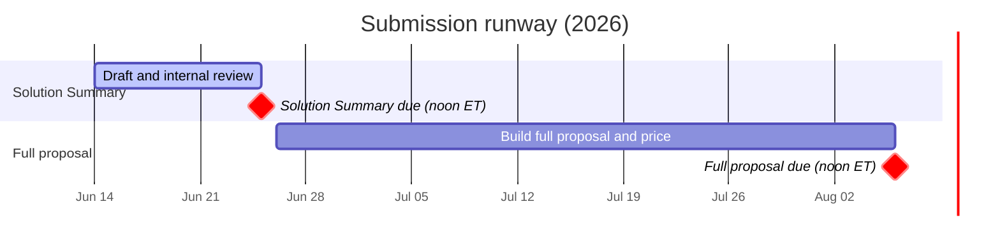
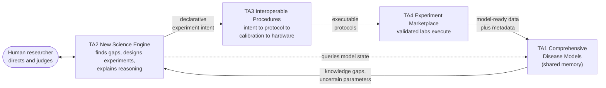
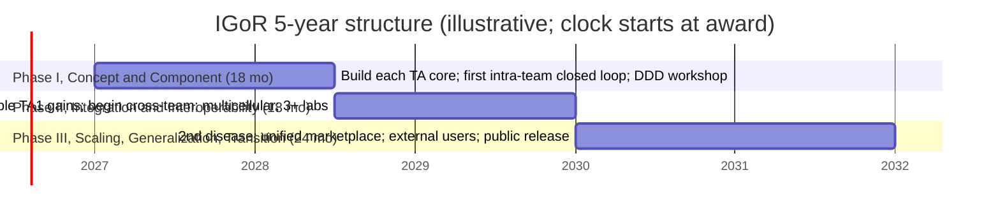
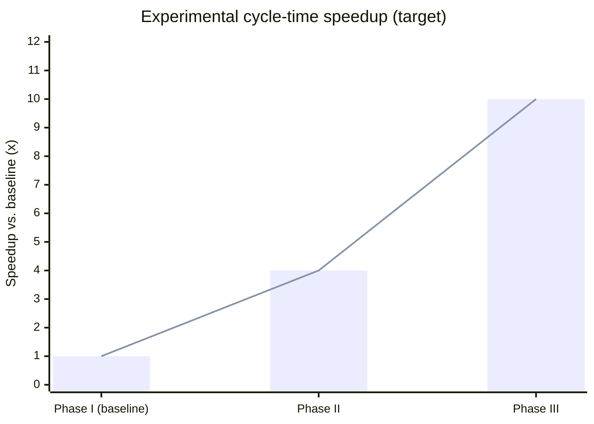
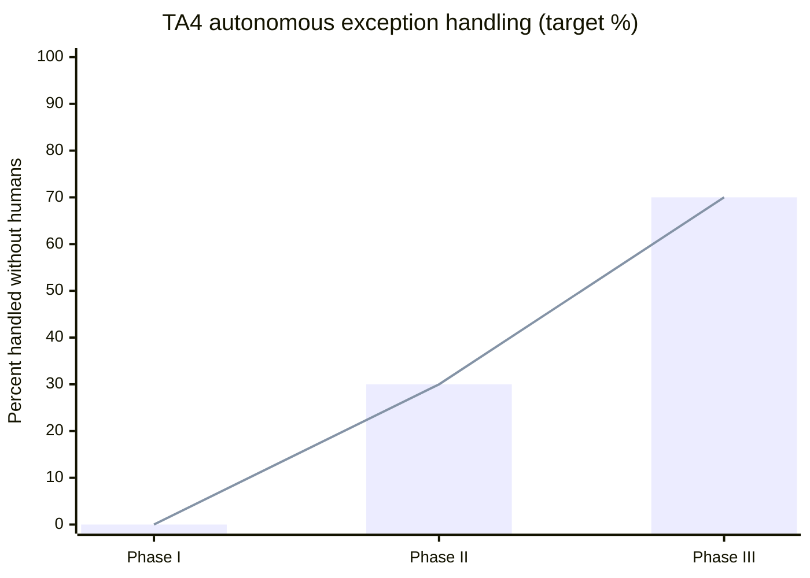
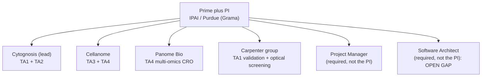

# ARPA-H IGoR: Comprehensive Program Reference

**ARPA-H-SOL-26-155, Proactive Health Office, ISO dated May 5, 2026.**
Compiled 2026-06-05 from the full solicitation set; **revised 2026-06-14** after re-extracting the Amendment 01 versions of Appendix B and Appendix E. Source files in `original/`; plain-text extractions in `extracted-text/`; per-document briefs in `markdown/`.

> [!NOTE]
> **How to use this document.** Sections 1 to 8 and 10 to 11 are shareable program facts. **Section 9 is internal Cytognosis strategy and is not for partner-facing distribution.** Reading time is about 12 minutes. Every per-document detail has a one-page brief in [`markdown/`](markdown/README.md).

> [!TIP]
> **If you only read one thing:** IGoR is **one machine made of four parts that form a loop** (Section 3). Cytognosis owns the two "brain" parts (**TA1** and **TA2**); the loop cannot close without **TA3** and **TA4** partners (the "hands"). The whole proposal is gated on closing that loop and on hitting the **10x experimental-cycle-time** marquee metric by Phase III.

---

## BLUF

**IGoR** funds **approximately 3 teams** to build a closed-loop, AI-driven discovery ecosystem over **5 years across 3 phases (18 + 18 + 24 months)** via **Other Transaction (OT)** awards. Every proposal must cover **all four Technical Areas** (TA1 disease models, TA2 orchestration engine, TA3 protocols, TA4 lab marketplace) or it is **not reviewed**.

> [!IMPORTANT]
> **Two hard deadlines (Eastern Time):**
> - **Solution Summary: 2026-06-25, 12:00 PM ET** (non-gated; feedback only).
> - **Full proposal: 2026-08-06, 12:00 PM ET** (Technical and Management 40 pages, plus TDD and Price).
>
> As of this revision (2026-06-14), the Solution Summary is due in **11 days**.

---

## 1. Quick facts

| Item | Detail |
|---|---|
| **Agency / Office** | ARPA-H, Proactive Health Office (PHO) |
| **Instrument** | Multiple **Other Transaction (OT)** agreements (draft OT is Appendix E) |
| **Awards anticipated** | **Approximately 3** multidisciplinary teams |
| **Period** | **5 years**, 3 phases: **Phase I 18 mo, Phase II 18 mo, Phase III 24 mo** |
| **Continuation** | Phase-gated; meeting all agreed metrics is the basis for continuation |
| **Budget ceiling** | **None stated** in any solicitation file; ARPA-H negotiates per OT |
| **Solution Summary** | **5 pages**, due **2026-06-25 12:00 ET**, **non-gated** (feedback only; you may proceed regardless) |
| **Full proposal** | Due **2026-08-06 12:00 ET**; **Technical and Management 40 pages**, plus TDD and Price |
| **Proposers' Day** | Held June 9, 2026 (Washington DC metro) per the ARPA-H IGoR page; voluntary, recording posted |
| **Team rules** | **Single prime plus one PI**; all 4 TAs required; **at least 2 TA4 labs**; named **Project Manager** and **software architect**, both distinct from the PI |
| **Eligibility** | For-profit, non-profit, and academia all eligible. **FFRDCs and government entities barred** (prime or sub). Foreign entities limited (CHIPS Act section 10638; no MFTRP; no covered-country entities) |
| **SAM.gov** | Active registration plus valid UEI required at proposal submission and award |
| **Submit at** | solutions.arpa-h.gov (register early; a new SAM registration takes 7 to 10 business days) |

---

## 2. Program objective and the problem

IGoR aims to **eliminate research inefficiencies and accelerate therapies for complex diseases** by building an **AI-enabled, interoperable research ecosystem** that produces **validated knowledge at least 10x faster** than conventional approaches.

The motivating problem, in ARPA-H's framing:

- **Irreproducibility:** more than **70%** of researchers have failed to reproduce others' experiments; up to **89%** of preclinical work cannot be fully reproduced.
- **Fragmentation:** mechanistic knowledge is siloed across subfields; integrative, multiscale, causal, time-dependent models are rare.
- **No transfer standard:** there is no widely adopted way to specify an experiment precisely enough to run it reliably in another lab. Cloud labs and autonomous labs each solve only part of this (cloud is proprietary and low-level; autonomous is fast but narrow and single-objective).

> [!IMPORTANT]
> **IGoR's stance:** "IGoR is not simply an LLM connected to a laboratory." Mechanistic models define **what** to learn; the orchestration layer decides **how** to learn it across modalities; the validated marketplace ensures the data are **trustworthy and interoperable**. The design ethos is to **augment human scientists, never replace them**.

**Disease-choice rules (the proposer picks the area):** the disease must be **tractable via mechanistic and quantitative modeling**, **multifactorial, time-dependent, and multi-scale**, and **progressable within the program**. **Well-bounded problems are explicitly rejected** (for example, "a better binder to a known target"). **A second, related disease area is required by Phase III.** In-scope experiments are **cell and tissue culture and lower invertebrates** (insects, nematodes). Limited vertebrate or higher-invertebrate work is allowed only to test strong predictions and only when human-directed. **Human clinical trials are out of scope.**

---

## 3. The closed loop (how the four TAs interact)

A central design principle is **high cohesion, low coupling**: each TA has one clear responsibility, and the **interfaces between TAs are as important as the TAs themselves**. ARPA-H expects proposers to define and maintain those interfaces (refined program-wide via a Domain-Driven Design workshop at kickoff).

**The cycle:** a researcher interrogates TA1 models and lab capabilities through TA2, then TA2 identifies the most valuable knowledge gap and designs the discriminating experiment, then TA3 translates intent into an interoperable protocol, then TA4 routes it to qualified labs that execute and return gold-standard data, then TA1 auto-updates.

> [!TIP]
> **Bottom line:** cycle time should be limited mainly by the **physical time to run the experiment**, because hypothesis generation, protocol design, and lab selection all collapse toward zero.

---

## 4. The four Technical Areas

> [!IMPORTANT]
> **All four TAs are mandatory.** A single organization may cover several TAs, but a **multi-organization team is "more likely"** to be funded. Proposers may move a capability to a different TA if they justify it and the loop stays coherent. The **TA1-to-TA2 boundary for knowledge-gap identification is explicitly an open question** to be refined during the program.

### TA1: Comprehensive Disease Models (the shared memory)

Build **digital twins that encode causal biological relationships across time and length scales**, integrating literature, experimental data, and expert knowledge; **auto-updated** when TA4 returns data.

| Required model property | Meaning |
|---|---|
| **Modular** | interoperable sub-models; leverage and extend existing standards |
| **Mechanistic** | known theory or mechanism per sub-model (PPIs, signaling cascades, metabolic pathways) |
| **Multiscale** | predict tissue and organ effects from molecular-level changes |
| **Verifiable** | each sub-model's mechanism is experimentally testable; predictions are checkable |

- **Objective 1, Disease Model Architecture:** a representational framework (languages, schemas, ontologies); automated ingestion of TA4 data; handle omics, imaging, functional assays, and literature; handle uncertainty, conflicting evidence, and heterogeneous sources; leverage existing databases, ontologies, and model repositories.
- **Objective 2, Knowledge-Gap Identification:** represent **what is not known** (missing causal edges, poorly constrained parameters, conflicting sub-models). This sits at the **TA1-to-TA2 interface**; the proposer chooses and justifies placement.
- **Out of scope:** training new foundation models or LLMs from scratch (fine-tuning and new specialized models are fine); purely correlational models; non-human disease models, except to inform human biology.

### TA2: New Science Engine (the reasoning core plus researcher interface)

An **orchestration layer that plans, verifies, and explains** scientific workflows: it synthesizes TA1 models and literature to find gaps, surfaces adjacent knowledge, and proposes optimal experiments unconstrained by any one researcher's knowledge or local equipment.

- **Design requirements:** **flexible and evolvable** (swap in newer AI models without re-engineering); **multiple parallel, competing streams of deliberation** with designed roles for **dissent, verification, and reconciliation** (drawn from team-science and organizational design, not single-thread chain-of-thought); **explains itself via narratives and visualizations**.
- **Objective 1, Hypothesis Generation and Experiment Design:** identify gaps (with TA1), generate testable hypotheses, and design the most efficient discriminating experiments; specify cell type, time frame, stimuli, response, and phenotype in enough detail for TA3.
- **Objective 2, Explainability and Human Interface:** human plus AI as a **collaborative unit**; clear narratives on why a gap matters and why an experiment resolves it; let researchers inject domain expertise; **augmentation, not automation**.

> [!WARNING]
> **TA2 is not a wrapper around a frontier LLM.** It must demonstrate mechanistic grounding (TA1), multi-modal design (TA3), and distributed execution (TA4). Anchoring LLM outputs to TA1 to reduce hallucination is expected. Out of scope: pre-training new frontier models; systems that make **irreversible resource commitments without human approval**; designs whose primary effect is to **replace** researchers.

### TA3: Interoperable Experimental Procedures (the translator)

Make transferring an experiment between labs **as easy as sending a data file**. Define a **layered protocol stack** that separates scientific intent from instrument implementation.

| Layer | Role |
|---|---|
| **Intent** | declarative what: question, variables, expected outputs, quality requirements |
| **Protocols** | standard processes (dispense, heat, mix, measure) with error handling, retries, fault tolerance |
| **Calibration** | standardize parameters and sensitivity across devices; record context, source, uncertainty; conformance via IV&V calibration artifacts |
| **Hardware** | machine-specific settings; isolate equipment differences via adaptive control and common capability interfaces |

- Must **lock procedurally arbitrary parameters** to consensus defaults (to kill batch effects); changes go through an **RFC process** backed by evidence. Rich metadata is required: cell lines, reagents, calibration status, QC, power analyses, and uncertainty.
- **Must support at least 3 distinct modalities** (for example, imaging, biochemical assays, omics, mechanical, functional).
- **Objective 2, Standards and Interoperability:** developed with the **IV&V partner** via **bake-offs**, an **RFC process**, and **open standards** (open schemas, ontologies, reference implementations; extensible namespaces for proprietary use). Engage community, equipment makers, and standards bodies for adoption beyond the program.
- **Out of scope:** closed or proprietary protocol systems; vertebrate-animal or clinical-trial protocols (TA3 is cell and tissue culture plus lower invertebrates).

### TA4: Experiment Marketplace (the hands)

Make ordering a validated experiment **as routine as querying a database**: a network of **validated labs** (cloud labs, core facilities, CROs, independent labs) that execute TA3 protocols and return model-ready data plus metadata for **automatic ingestion into TA1**.

- **Objective 1, Validated and Reproducible Experimentation:** define and validate cell lines, reference materials, and standard samples; QC throughout; demonstrate **cross-lab reproducibility** to predefined concordance thresholds; track **exceptions per experiment** (human-intervention events) and automate handling. Phase I is cultured cells; Phase II adds multicellular systems (organoids, microbiomes, invertebrates) plus more cell lines and modalities.
- **Objective 2, Marketplace Operations:** simple request and result interfaces; live information on capabilities, precision, speed, cost, and availability; two-way communications; onboarding of new labs and capabilities validated against IV&V standards.

> [!IMPORTANT]
> **Team rule: at least 2 TA4 labs.** Phase I is intra-team concordance; Phase II begins **cross-team** execution (your labs run another team's experiments via the common TA3 standard); Phase III is a **unified marketplace across all teams**. Out of scope: vertebrate or higher-invertebrate animals; clinical trials; data not compatible with TA1 ingestion.

---

## 5. Phases and timeline

| Phase | Focus | Signature deliverables |
|---|---|---|
| **I (mo 1-18) Concept and Component** | Stand up each TA; integrate within the team | DDD workshop done plus shared interface spec published; **"walking skeleton"** closed loop (TA2 proposes, TA3 protocol, TA4 executes, TA1 updates); first TA4 data return ingested |
| **II (mo 19-36) Integration and Interoperability** | Robust in-team operation; **begin cross-team** | Measurable TA1 predictive improvement; at least 3 novel predictions (at least 1 experimentally confirmed); cross-team execution at high concordance; multicellular systems; 3+ labs |
| **III (mo 37-60) Scaling, Generalization, Transition** | At-scale; second disease; hand-off | **Second disease area**; **external (non-performer) researchers use IGoR end-to-end**; unified cross-team marketplace; connect-a-thon; all artifacts in a public repo; at least 1 sustained partnership or adoption path |

---

## 6. Milestones and metrics (the bar to clear)

> [!IMPORTANT]
> **The marquee metric is the 10x experimental cycle-time speedup.** Baseline is measured in Phase I using conventional approaches; later phases measure against it. "Cycle time" means hypothesis to validated experimental insight (gap, design, execute, model update).

**Marquee metrics (Table 2), the headline scorecard:**

| Marquee metric | Phase I | Phase II | Phase III |
|---|---|---|---|
| Disease / therapeutic areas | 1 | 1 | **2nd related** |
| **Experimental cycle time** | baseline | **at least 4x** | **at least 10x** |
| Labs generating data | 2+, 80%+ concordance (1+ expt) | 2+, 90%+ (3+ expts) | 3+, 90%+ (3+ expts, incl. cross-team) |

**Autonomous exception handling (TA4)** is another steep ramp and a good progress signal:

**Per-TA metric highlights:**

| Area | Phase I | Phase II | Phase III |
|---|---|---|---|
| **TA1** knowledge gaps | 3+ known gaps auto-detected | 3+ novel gaps (not in training lit.) | 3+ novel gaps, 2nd disease |
| **TA1** sub-models integrated | 3+ mechanistic | 10+ across 2+ scales | 15+ across 3+ scales |
| **TA1** data returns ingested | 1+ | 10+ | 25+ |
| **TA1** model-update latency | baseline | 24 h or less | 4 h or less |
| **TA1** prediction accuracy | baseline defined | sig. improvement over lit-only | 2x+ over Phase I |
| **TA1** explainability | 1 known pathway set | 75%+ of pathways | 90%+ of pathways |
| **TA2** hypothesis quality (expert panel) | 50%+ high-value | 75%+ high-value | 85%+ high-value |
| **TA2** procedures auto-generated | 3+ | 5+ | 8+ |
| **TA2** model-backend diversity | 1+ | 2+ (incl. 1 open-weight) | 3+ |
| **TA2** researcher usability | N/A | 10+ scientists, 70%+ useful | 20+ (incl. external), 80%+ useful |
| **TA3** labs on the protocol stack | 2+ | 3+ (incl. 1 cross-team) | 5+ (pooled) |
| **TA3** modalities supported | 2+ | 3+ | 4+ (incl. cross-team) |
| **TA3** RFCs issued/resolved | N/A | 2+ | 4+ cumulative |
| **TA4** cell lines/instruments validated | 1+ | 3+ | 8+ |
| **TA4** inter-lab reliability | 80% | 90% (incl. cross-team lab) | 90% (all marketplace) |
| **TA4** autonomous exception handling | 0% | 30%+ | 70%+ |
| **TA4** procedures run automatically | baseline | 30%+ | 50%+ |
| **IV&V** reproducibility | builds on IV&V env | reproduces on 2+ HW configs | 100% in public repo, open-access certified |

> [!CAUTION]
> **Two different concordance numbers exist.** In-team and marquee concordance ramps 80%, 90%, 90% across phases, while **cross-team execution concordance is targeted at 85%+ in Phase II and 90%+ in Phase III** per Appendix A Table 1. Do not conflate them; see [`markdown/APPENDIX_A_Program_and_Technical_Description.md`](markdown/APPENDIX_A_Program_and_Technical_Description.md).

---

## 7. Independent Verification and Validation (IV&V)

ARPA-H contracts **separate IV&V organizations**. Performers **do not** budget for IV&V partners but **must budget effort to collaborate** with them (containerizing software, documentation, material transfer, biannual reviews).

| IV&V area | Covers | Purpose |
|---|---|---|
| **Mechanistic Models** | TA1 | Verify models are internally consistent, compose correctly, and are comparable across teams (cross-team comparison in Phases II to III; composition verification; calibrated uncertainty) |
| **Experimental Infrastructure** | TA3, TA4 | Validate protocol standards, calibration artifacts, and inter-lab reproducibility; assess cross-team execution |

> [!NOTE]
> An ARPA-H **Expert Panel** (NDA-bound) judges the validity and impact of discovered targets and mechanisms; performers may recommend experts to include or exclude.

---

## 8. Management, integration, and cross-team collaboration

> [!IMPORTANT]
> **Three named roles are required and must be distinct people:** Principal Investigator, Project Manager, and Software Architect. The Project Manager and Software Architect cannot be the PI.

| Role | Mandate |
|---|---|
| **Principal Investigator** | Scientific lead; one PI for the single prime |
| **Project Manager** | Day-to-day PM, delivery tracking, dependency management, reporting; experience managing large multi-team efforts; stated annual hours |
| **Software Architect** | Interface design, cross-team interoperability, architectural consistency; **exercises architectural authority over implementation** (including AI-accelerated coding); track record building interoperable, open-source, API-first systems |

**Cross-team collaboration is mandatory and escalates by phase:**

- **Phase I:** a **Domain-Driven Design workshop** at kickoff (all teams substantially represented) publishes the shared interface spec all teams implement. This is a **program milestone**.
- **Phases I to II:** working groups for common **TA3 standards**; active **bake-offs** and **RFC** participation.
- **Phases II to III:** demonstrate **cross-team interoperability** (one team's labs run another team's TA2-designed, TA3-specified experiments).
- **Phase III:** a **connect-a-thon** combining TAs across teams for end-to-end evaluation.
- **Associate Performer Agreements (APAs):** govern what information, data, and materials are shared across teams; teams start self-contained, and APA language enters awards by Phase III to force open exchange.

> [!NOTE]
> **Commercial transition:** build for sustained adoption (public-private partnerships for the marketplace; new funding models where philanthropies, agencies, and patient groups fund defined disease-understanding milestones). The **open TA3 data and metadata layer plus TA4 interoperability** are the foundation for a self-sustaining ecosystem.

---

## 9. Cytognosis consortium mapping (our play)

> [!CAUTION]
> **Internal strategy. Do not distribute this section to partners.** It names target partners, an open architect gap, and a method flagged proprietary. Sections 1 to 8 and 10 to 11 are the shareable program facts.

> [!NOTE]
> **Award structure (latest strategy, 2026-06-03):** **IPAI/Purdue as prime plus one PI; Cytognosis as a funded sub-awardee on TA1 and TA2; Cellanome plus at least 2 labs on TA3 and TA4.** Rationale: real money still flows to Cytognosis while an established prime carries win odds. The PI is Ananth Grama (cleanest) or Shahin as co-PI (gated on the Purdue appointment). See `IGoR_Strategy_Master_2026-06-03.md`.

| TA | Cytognosis-consortium owner | What we bring and status |
|---|---|---|
| **TA1** Disease models | **Cytognosis (lead)** plus IPAI/Grama, Carpenter (computational morphology bridge) | Single-cell atlases (PsychENCODE, PsychAD, ROSMAP) plus causal and perturbation modeling plus the molecular-to-cell-to-circuit **micro-to-meso bridge**; the PI's insitro NGN2 virtual-cell modeling via genome-wide optical pooled screening (POSH) plus Perturb-seq. Anne Carpenter provides computational morphology/imaging models as an interpretability bridge into TA1. Anchored on **22q11DS** progressing to idiopathic schizophrenia (Phase III) |
| **TA2** New Science Engine | **Cytognosis (lead)** plus IPAI compute | Open, mechanistic-model-grounded orchestration (tournament generate, critique, rank, evolve, plus model-grounded RAP plus test-time validation); open scaffolding, AlphaGenome as a tool. **Explore** a TA2 agentic-science collaborator |
| **TA3** Interoperable protocols (3+ modalities) | **Cellanome** (R3200 live-cell imaging plus scRNA-seq plus Perturb-LINK CRISPR) plus **Matt Tegtmeyer / Element AVITI24** (fixed-cell multi-modal: RNA, protein, morphology) plus Cytognosis schemas; **Carpenter** contributes open image-data standards and computational protocol definitions, not wet-bench execution | **Transfyr** is a candidate observability and standards partner (COI check pending). Three modalities are cleanly covered: live-cell plus transcriptomics, fixed-cell multi-modal (Element), and morphological/imaging analysis |
| **TA4** Validated labs (2+) | **Academic arm: Matt Tegtmeyer lab (Purdue)** plus **Industry arm: Cellanome** plus **Computational layer: Anne Carpenter (IPAI/Purdue)** plus **Panome Bio** (multi-omics CRO) | Two arms satisfy the >=2-lab requirement. **Academic arm:** Matt Tegtmeyer's Purdue lab runs all wet-lab experiments (iPSC-neuron disease models + multi-modal same-cell readouts using **Element AVITI24 / Teton CytoProfiling**: RNA, protein, phospho-protein, and Cell-Painting-style morphology). **Industry arm:** Cellanome (live-cell imaging + same-cell scRNA-seq + Perturb-LINK CRISPR on the R3200); **advancing** (2026-06-17 call; eager; operating-model options: R3200 in-lab vs send-out; pricing pending). **Computational layer:** Anne Carpenter (interpretable models for morphology/cellular imaging; consumes readouts from both arms; runs no wet bench; not a TA4 wet lab). Element AVITI24 and Cellanome R3200 are orthogonal/complementary platforms enabling a built-in cross-arm concordance check. Panome Bio is CLIA-certified, an orthogonal metabolomic and proteomic readout. **[FLAG 2026-06-17: re-derive after Anne reattribution]** |
| **PM** (required, not the PI) | Patty Purcell (availability risk) | **Line up a backup PM now** |
| **Software architect** (required, not the PI) | **GAP** | **Must name a human** (not the PI, not an AI agent); about $240K fully loaded in the cost model |

**Anne Carpenter (Broad, moving to Purdue IPAI around Sep 2026 per Shahin; not yet public).** Senior Director of the Broad Imaging Platform and co-lead of the Carpenter-Singh Lab; inventor of **Cell Painting** and **CellProfiler**; leads the **JUMP Cell Painting Consortium** (more than 116K compounds plus genome-scale genetic perturbations) and open image-data standards (Cell Painting Gallery, OASIS, COBA). **Role clarification (2026-06-17):** Anne is **purely computational**: she builds **interpretable models for morphology and cellular imaging data** and runs no wet bench. The actual imaging experiments (NeuroPainting, high-content imaging) are run by **Matt Tegtmeyer's lab** (and Cellanome); Anne's computational models consume those readouts and bridge TA4 analysis to TA1. Her 2025 Nat Commun paper (Tegtmeyer and colleagues including Carpenter, Singh, and Nehme; "Combining phenomics with transcriptomics reveals cell-type-specific morphological and molecular signatures of the 22q11.2 deletion," 16:6332) used the **NeuroPainting** assay on iPSC-derived neurons, NPCs, and astrocytes from 22q11.2 carriers, finding astrocyte-dominant mitochondrial, ER, and cytoskeletal phenotypes plus reduced cell-adhesion gene expression. This **directly de-risks our 22q11DS validation path** and makes her a natural computational morphology/imaging-model lead and TA1/TA2 interpretability bridge. Her psychosis Cell Painting preprint (Haghighi and colleagues including Carpenter, bioRxiv 2025.10.08.676630) extends the approach to schizophrenia.

**Parallel and validation study (the TBX1 line).** A patient-derived validation line carrying an ultra-rare TBX1 exon 2 CNV with 22q11DS-superclass features anchors a paired-line design with Carpenter: a patient-derived iPSC "disease line" and a CRISPR-corrected "healthy line", differentiated to NGN2 neurons (14 days), used to define disease axes from the paired lines, then to test whether vitamin B12 (methylcobalamin) reverts the phenotype (B12 reversed Tbx1-mutant mouse phenotypes; Life Sci Alliance 8(2):e202403075), with optional targeted Perturb-seq of methylation-cycle genes. This is **likely a parallel or independent grant, or an IGoR Phase I validation anchor** (the Broad CDoT can run line generation fee-for-service; subclone the starting line first; use JUMP lookup for non-neuron-specific phenotypes). Decide whether to fold it into IGoR or keep it separate.

> [!WARNING]
> The full TA1/TA2 methods deep-dive contains the **proprietary factorized-PRS method**. Keep it off partner-facing materials and mark it proprietary in any submission. See the cross-references below.

**Related internal docs (same folder):** `IGoR_Strategy_Master_2026-06-03.md` (structure and decisions), `IGoR_TA1_TA2_Research_2026-06-02.md` (landscape and wedge), `IGoR_Cost_Breakdown_2026-06-02.md` (BOE model), `IGoR_Candidate_Slate_Tier1-3_2026-06-03.md` (partner outreach), `IGoR_Key_Info_and_Disease_Strategy_2026-06-02.md` (disease scope), and `IGoR_TA1-TA2_Methods_DeepDive_2026-06-05.md` (full TA1/TA2 method stack plus diagrams; contains the proprietary factorized-PRS).

---

## 10. Submission requirements

### Solution Summary (due 2026-06-25, 12:00 ET): Appendix B format

- **5 pages** for Sections 1 to 4. **Cover and company-profile pages, the BOE (Section 5), and References (Section 6) do not count** toward the limit.
- 8.5 by 11 inch, **1-inch margins**, **sans-serif font of at least 11 point**; 8 to 10 point allowed only in figures, tables, and charts. Do not use narrow or condensed fonts.
- Accepted formats: **.pdf, .odx, .doc, .docx**. English. **Delete all blue-font guidance text** before submitting.
- **Mark proprietary content** on the cover page and each affected page (do not use the word "Confidential").
- **Non-gated:** ARPA-H returns "encouraged" or "discouraged"; you may submit a full proposal either way, but weight the feedback heavily.

| # | Section | Notes |
|---|---|---|
| 1 | **Concept Summary** | minimal jargon; how it addresses the ISO interest areas |
| 2 | **Innovation and Impact** | outcomes and problems; disruptiveness versus SOTA; a **quantitative comparison table** (challenge progression, SOTA baseline, aggressive yearly metrics, outcomes) |
| 3 | **Proposed Work** | deliverables, interim milestones, technical approach, alternatives considered, supporting data and citations, adoption challenges, **technical risk versus transformative impact** |
| 4 | **Team Organization and Capabilities** | org roles and responsibilities; each key member's name, position, institution, and a 1 to 2 sentence skills statement |
| 5 | **Basis of Estimate** (no page limit) | all costs for the whole team (direct labor, hours, subs, materials, equipment, travel, indirect, profit, total all phases) plus resource sharing plus taxpayer value |
| 6 | **References Cited** (no page limit) | first author, title, source, year, volume and pages, DOI or PMID |

### Full proposal (due 2026-08-06)

- **Technical and Management Proposal (Appendix C.1): 40 pages, Sections 1 to 7.** Commercialization Strategy is at most 3 pages and the Capabilities/Management Plan is at most 2 pages, both inside the 40. **Gantt chart, biographical information, and references cited are exempt** from the cap.
- **Task Description Document (C.2), Price Proposal (C.3) plus Price Spreadsheet (C.4), administrative and national-policy terms (Appendix D), and the draft OT with redlines (Appendix E)** carry no page limit.

> [!IMPORTANT]
> **Evaluation order:** (1) scientific and technical merit, (2) team capability and experience, (3) mission relevance plus end-user orientation, (4) cost realism. Proposals are judged on their own merits, not ranked against each other.

---

## 11. Source map

> [!NOTE]
> **Amendment 01** applies to Appendix B and Appendix E only; both were re-extracted on **2026-06-14**. All other documents are the original release. Each document has a one-page templated brief in [`markdown/`](markdown/README.md).

| File (`original/`) | What it governs | Brief |
|---|---|---|
| `IGoR+ISO+OT_ARPA-H-SOL-26-155.pdf` | Eligibility, dates, submission process, proprietary marking | [ISO brief](markdown/ISO_ARPA-H-SOL-26-155.md) |
| `APPENDIX+A_Program+and+Technical+Description_IGoR.pdf` | **The substance:** objectives, 4 TAs, phases, milestone and metric tables, IV&V, management | [Appendix A brief](markdown/APPENDIX_A_Program_and_Technical_Description.md) |
| `APPENDIX+B_..._Admendment+01.docx` | Solution Summary cover template plus 6 sections plus format rules | [Appendix B brief](markdown/APPENDIX_B_Solution_Summary_Format_and_Instructions.md) |
| `APPENDIX+C_..._Format+and+Instructions.pdf` | Full-proposal format, volumes, 40-page cap | [Appendix C brief](markdown/APPENDIX_C_Proposal_Format_and_Instructions.md) |
| `APPENDIX+C.1_..._IGoR.docx` | Technical and Management Proposal template | [Appendix C.1 brief](markdown/APPENDIX_C1_Technical_and_Management_Proposal.md) |
| `APPENDIX+C.2_..._IGoR.docx` | Task Description Document template | [Appendix C.2 brief](markdown/APPENDIX_C2_Task_Description_Document.md) |
| `APPENDIX+C.3_..._IGoR.docx` | Price Proposal template | [Appendix C.3 brief](markdown/APPENDIX_C3_Price_Proposal.md) |
| `APPENDIX+C.4_..._IGoR.xlsx` | Price Proposal spreadsheet (pairs with C.3) | workbook, no brief |
| `APPENDIX+D_Admin+National+Policy.docx` | OT administrative and national-policy requirements | [Appendix D brief](markdown/APPENDIX_D_Admin_National_Policy.md) |
| `APPENDIX+E_Draft+Model+OT+Agreement_..._Amendment+01.docx` | Draft OT agreement: 22 Articles plus 4 Attachments | [Appendix E brief](markdown/APPENDIX_E_Draft_Model_OT_Agreement.md) |
| `extracted-text/` | Plain-text extractions of all of the above (for search and quoting) | n/a |

> [!CAUTION]
> **Do not plan against the OT cover-page phase numbers.** Appendix E shows Phase I 24 mo, Phase II 18 mo, Phase III 12 mo, which are unfilled model-template placeholders and sum to 54, not the 60-month term. The **binding phase structure is Appendix A: 18, 18, 24 months**.

---

## Appendices: verbatim solicitation detail

> [!NOTE]
> These appendices fold in the granular, verbatim solicitation content previously held in `SOLICITATION_TRUTH.md` (merged 2026-06-14, now retired). Sections 1 to 11 above are the navigable summary; the appendices below are the detailed source of record for milestones, eligibility, deliverables, and claim citations.

### Appendix A. Go/No-Go phase-gate milestones (Table 1)

> [!IMPORTANT]
> Achievement of all agreed metrics, plus these narrative milestones, is the **basis for continuation** to the next phase. Table 2 (Section 6) gives the numeric thresholds; this table gives the milestone language.

| Track | Phase I | Phase II | Phase III |
|---|---|---|---|
| **System** | DDD workshop done; shared interface spec published; initial walking-skeleton demo within each team | Cross-team interface spec updated; all teams confirm interoperability test plan; closed-loop operation with measurable TA1 predictive improvement for >=1 disease | Transition plan delivered; >=1 sustained partnership/adoption path; cross-team interoperability end-to-end; external (non-performer) researchers use IGoR |
| **TA1** | Architecture documented (languages, schemas, ontologies); databases/repos surveyed + integration plan; >=1 mechanistic model with algorithmic detection of >=3 quantitative gaps; ingests >=1 TA4 data return | Documentation accepted by Computational IV&V; model cards for all sub-models; automatic updates from TA4 demonstrated; >=3 novel predictions not in training lit, >=1 confirmed via TA4 | All models in public repo in certified executable form; open-access docs; extended to 2nd disease with algorithmic gap detection; validated novel hypotheses in both diseases |
| **TA2** | Orchestration architecture documented; TA1 and TA3 interfaces demonstrated; proposes candidate experiments from a TA1 model + literature; >=50% judged high-value by expert panel | >=2 model backends (>=1 open-weight); usability study with >=10 scientists, >=75% high-value; designs lead to measurable TA1 improvement | >=85% high-value; demonstrated on 2nd disease; design efficiency quantified vs conventional baseline |
| **TA3** | Initial protocol schema; calibration artifacts defined (with IV&V); same protocol run at 2 TA4 labs (same team), comparable outcomes across >=1 experiment | RFC process operational; >=2 RFCs issued and answered by all teams; schema updated; protocols reach >=3 labs (>=1 cross-team), each running >=3 core experiments meeting reproducibility thresholds | Open data/metadata layer delivered (schemas, reference implementations, benchmarks); >=1 external standards body or equipment maker engaged; protocols reach >=5 labs across teams; cross-team interoperability at connect-a-thon |
| **TA4** | Workflow summary table; >=1 cell line and instrument validated on IV&V artifacts at each of the team's two labs; two-way capability comms; intra-team reproducibility at >=85% concordance | >=2 added instruments per lab; marketplace request/return interface; exception-handling baseline; >=1 cross-team lab executes an experiment at >=85% concordance; exceptions per experiment cut >=50% vs Phase I | Onboarding docs published; capability manifests publicly queryable; unified marketplace across teams; >=90% concordance on standardized experiments; connect-a-thon complete |
| **Standards** | IV&V collaboration framework established; TA3 schema specified enough for cross-team onboarding; DDD workshop spec published | Bake-offs + RFC operational; cross-team standards convergence documented; >=1 cross-team interoperability test passed on common standards | Sustained partnership/adoption path (for example NIH center, cloud-lab provider, academic consortium); open layer adopted by all teams; connect-a-thon shows full interoperability |
| **Computational IV&V** | Standards workshop done; packaging conventions published; IV&V environment operational; 100% of TA1 models/software containerized; IV&V confirms build-and-execute for 100% of artifacts | All artifacts pass IV&V doc review; model cards complete; reproducibility on >=2 hardware configs; cross-team model comparison initiated | Public repo with long-term hosting/versioning; all artifacts certified executable; cross-team comparisons published; open-access certification issued |

### Appendix B. Eligibility, OCI, and compliance detail

| Topic | Rule (ISO / Appendix C) |
|---|---|
| **Who may propose** | Universities, non-profits, small businesses, and other commercial entities. Nonprofits are **explicitly eligible as prime** (ISO 3.1) |
| **FFRDCs / government** | **Not eligible** as prime or sub, including government employees (ISO 3.1.1). Narrow FFRDC exception only on a documented unique-capability showing |
| **Current ARPA-H support contractors** | Individuals and entities providing support services to ARPA-H are **ineligible** (ISO 3.1.2) |
| **Foreign entities** | Allowed with NDA, security, and export-control compliance. **No** CHIPS Act 10638(3) entities of concern; **no** MFTRP parties; **no** covered-country entities (50 U.S.C. 3059) |
| **SAM.gov** | Active registration + valid UEI required at submission. **Cytognosis UEI: HS4PRLL7AKY5** (verify active before submitting) |
| **OCI** | Disclose all potential OCI and submit a mitigation plan (Appendix C 3.5, 3.6). Cannot concurrently provide ARPA-H support services and perform as an R&D performer. Affirm whether any team member provided such services within the past calendar year |
| **Part-time federal / ARPA-H ties** | Any team member with current or recently ended ARPA-H service relationships must be disclosed with an OCI mitigation plan; consult counsel (Duane Valz) before inclusion |

> [!WARNING]
> **Non-conforming grounds (Appendix C 1.1) reject a proposal without review:** concept not applicable to the program; proposer ineligible; formatting non-compliant, specifically **not addressing all four TAs and all three Phases**; or the concept has already **received funding or been selected for award negotiations under another opportunity** (ARPA-H or other agency).

### Appendix C. Deliverables, payment, and IP

- **Payment:** milestone-based via the Payment Management Services (PMS) system at pms.psc.gov, with a justification (<= 1,000 characters) submitted through the Defend the Spend (DTS) system referencing accepted milestones and the PM acceptance date (Appendix C 3.8).
- **Intellectual property (Appendix C 3.2, 3.3):** ARPA-H **strongly encourages open-source-aligned IP**. Software, documentation, and data are desired as deliverables. **Commercial-friendly licenses (MIT, BSD, Apache 2.0) are preferred.** Performers must give a good-faith representation that they own or have appropriate licensing rights to all IP used.
- **Genomic Data Sharing (Appendix C 3.4):** if applicable, the award requires compliance with the **NIH GDS Policy (NOT-OD-14-124)**. This is directly relevant given the proposed secondary analysis of genomic data.
- **Human subjects (Appendix C 3.12):** requires a current FWA and IRB approval; **funds cannot be spent on HSR until all approvals are granted** (mirrors OT Article XXII.B in the Appendix E brief).
- **Reporting:** biannual IV&V reviews; milestone reports accepted by the PM; full cadence governed by the OT (Appendix E brief, Attachment 2: technical status every 90 days, final report within 60 days of completion).

### Appendix D. Innovative Claims Cross-Walk (claim to solicitation citation)

> [!TIP]
> Use this lookup to cite the exact solicitation location when asserting an innovative claim in the proposal's Innovative Claims Table.

| Topic | Document | Location |
|---|---|---|
| IGoR name, mission, 10x cycle-time goal | Appendix A | 1, p.1 |
| Background / reproducibility statistics | Appendix A | 2, pp.1-2 |
| "IGoR is not simply an LLM" statement | Appendix A | 2, p.2 |
| Four-component system description | Appendix A | 3, p.2 |
| Closed-loop cycle description | Appendix A | 3, p.3 |
| High cohesion / low coupling principle | Appendix A | 3, p.3 |
| Disease-area selection criteria | Appendix A | 3, p.4 |
| Phase III second-disease extension | Appendix A | 3, p.4 |
| Experimental scope (cell/tissue; vertebrate limits; clinical excluded) | Appendix A | 3, p.4 |
| TA definitions overview; boundaries not rigid | Appendix A | 4.1, p.4 |
| TA1 definition, properties, objectives, out-of-scope | Appendix A | 4.1.1, pp.5-6 |
| TA2 definition, flexibility requirement, objectives | Appendix A | 4.1.2, pp.6-8 |
| TA2 "not a wrapper" statement | Appendix A | 4.1.2, p.7 |
| TA3 definition, four-layer stack, RFC/bake-off | Appendix A | 4.1.3, pp.8-10 |
| TA3 "eliminate procedural variation" goal | Appendix A | 4.1.3, p.9 |
| TA4 definition, objectives, two-lab minimum | Appendix A | 4.1.4, pp.10-11 |
| Proposal scope: all four TAs required | Appendix A | 5.1, p.11 |
| Single PI / single prime requirement | Appendix A | 5.1, p.12 |
| Phase structure: 5-year, 3-phase | Appendix A | 5.2, p.12 |
| Milestone table (Table 1) | Appendix A | 5.3, pp.13-16 |
| Metrics table (Table 2) | Appendix A | 5.3, pp.16-18 |
| Cycle-time metric definition | Appendix A | 5.3, p.18 |
| IV&V: two areas, phased expectations | Appendix A | 5.4, pp.18-20 |
| PM + software architect requirements | Appendix A | 5.5, pp.20-21 |
| Cross-team collaboration (DDD, connect-a-thon) | Appendix A | 5.5, pp.21-22 |
| Associate Performer Agreements | Appendix A | 5.5, p.22 |
| Commercial transition | Appendix A | 5.6, pp.22-23 |
| ISO summary (dates, contacts, resource sharing) | ISO | Summary, p.2 |
| Introduction to IGoR (~3 awards) | ISO | 2, p.3 |
| Eligible proposers | ISO | 3.1, p.3 |
| FFRDC prohibition | ISO | 3.1.1, p.4 |
| Support-contractor prohibition | ISO | 3.1.2, p.4 |
| Foreign-entity rules | ISO | 3.1.3, p.4 |
| SAM.gov requirement | ISO | 3.2, p.5 |
| Non-gated solution-summary process | ISO | 4.1, p.5 |
| Solution-summary format (5 pages, 11pt, sans serif) | ISO | 4.2, p.5 |
| Solution-summary review (encouraged/discouraged) | ISO | 4.3, pp.5-6 |
| Proprietary information marking | ISO | 4.5, pp.6-7 |
| Conforming-submission requirements | Appendix C | 1.1, p.1 |
| Submission format matrix (40-page T&M) | Appendix C | 1.3, p.2 |
| Draft OTA redline requirement | Appendix C | 1.3(d), p.2 |
| Evaluation criteria (four, descending order) | Appendix C | 2.5, pp.4-5 |
| Cost / resource-sharing language | Appendix C | 2.5, pp.5-6 |
| Intellectual property policy | Appendix C | 3.2, p.6 |
| Software open-source preference | Appendix C | 3.3, pp.7-8 |
| Genomic data sharing policy | Appendix C | 3.4, p.7 |
| OCI disclosure and mitigation | Appendix C | 3.5-3.6, p.8 |
| Research security disclosures | Appendix C | 3.7, pp.9-10 |
| Electronic invoicing / PMS / DTS | Appendix C | 3.8, p.10 |
| Human subjects research requirements | Appendix C | 3.12, pp.10-11 |
| Vertebrate animal subjects research | Appendix C | 3.13, pp.11-12 |

> [!NOTE]
> **Open citation items carried over from QA (resolve before submission):** the sVAE+ reference (Lopez et al., arXiv:2211.03553) was flagged **unverified**; **PKG25S4** is not yet published (cite PKG 2.0 / version PKG24S4); use Tegtmeyer et al. 2025 only for the cellular/transcriptomic 22q11.2 phenotype, and cite a dedicated epidemiology source (for example Schneider et al.) for the psychosis-risk multiplier; finalize the **STATE** author list; and resolve or soften the Illumina "in discussion" partner language.

---

## Document control

| Field | Value |
|---|---|
| **Current revision** | 2026-06-14 |
| **Prior compile** | 2026-06-05 |
| **This revision changed** | Re-extracted Appendix B and Appendix E (Amendment 01); added per-document briefs in `markdown/`; added GitHub alerts, a submission-runway diagram, the cycle-time and exception-handling charts, and a consortium org diagram; flagged the OT phase-placeholder discrepancy; removed em dashes and italics; marked Section 9 internal-only and condensed the personal-health detail |
| **Authoritative sources** | Appendix A (technical), ISO (dates and eligibility), Appendix C (full-proposal format) |
