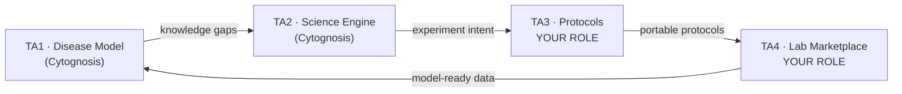
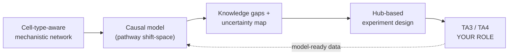

# CytoIGoR — TA1 + TA2 in Hand. Seeking TA3 + TA4 Partners.

**ARPA-H IGoR (ARPA-H-SOL-26-155) · ~3 awards · 5 years / 3 phases · OT instrument · no funding ceiling**
**Solution Summary due 2026-06-25 · Full proposal 2026-08-06 · Contact: Shahin Mohammadi, mohammadi@cytognosis.org**

> **The ask in one line:** We bring a working brain for IGoR — a mechanistic, multiscale, causal disease model (TA1) and an open orchestration engine that designs the highest-value experiments (TA2). We need partners who can run those experiments reproducibly across labs (TA3 protocols + TA4 marketplace) to close the loop. IGoR requires all four areas; a multi-organization team is explicitly more likely to win.

---

## What IGoR is (the 30-second version)

A self-improving discovery loop. A **disease model (TA1)** holds everything known about a disease and flags what is not known. An **orchestration engine (TA2)** turns those gaps into the single most informative next experiment. That experiment is written as a portable **protocol (TA3)** and run by a **network of validated labs (TA4)**; the results flow back and update the model. Each turn of the loop makes the next experiment smarter. ARPA-H's target: **validated knowledge ≥10x faster.**

**Disease anchor:** a neuropsychiatric area led by **22q11.2 deletion syndrome (22q11DS)** — the highest-penetrance genetic risk factor for psychosis — generalizing to **idiopathic schizophrenia** in Phase III. It gives a clean genotype → cell → circuit → phenotype causal chain, exactly the tractability IGoR rewards.

---

## What we bring (TA1 + TA2)

**TA1 — Comprehensive Disease Model.** A modular, mechanistic, multiscale, causal model spanning molecular → cell-type → circuit. It starts from a **cell-type-aware network**: we harmonize the major interaction databases (STRING, Reactome, SIGNOR, TFLink, IntAct, BioGRID, OmniPath) into one typed graph using the Molecular Interaction ontology, then layer in neuron-specific evidence (cell-type-resolved PPIs, single-cell multiome gene-regulatory networks, and noise-corrected co-expression). On top of that prior, **causal generative modeling** links genetic variation and perturbations to cell-state shifts, measured as a shift in pathway space relative to controls so cellular and clinical evidence enter the same model. It exposes a structured API: ingest new experimental data, update, and emit an **uncertainty map** of what to measure next. Most "virtual cell" models are correlational and do not update from experiments; ours is mechanistic, auto-updating, and built on the PI's published atlases (PsychENCODE, PsychAD, ROSMAP).

**TA2 — New Science Engine.** An open, mechanistic-model-grounded orchestration engine: a tournament of competing hypotheses (generate → critique → rank → evolve), planning that queries the **TA1 model state**, not just the literature, and test-time mechanistic validation before any experiment reaches the queue. Hypotheses take a fixed, ontology-aligned form ("perturbing process X shifts disease Y toward healthy via Z"), are grounded against literature with ontology-aware extraction, and are turned into experiments by selecting the **network hubs** whose perturbation moves the most disease-relevant biology. It explains its reasoning to the scientist and is **not a wrapper around a frontier LLM**, which is IGoR's explicit bar. Open scaffolding, open releases (Apache 2.0 code, CC BY docs).

**Track record.** PI Shahin Mohammadi, PhD — 20 years in computational biology and AI for biomedicine (MIT/Kellis, Broad, insitro, GenBio AI); co-led the *Science* 2024 schizophrenia single-cell atlas; creator of ACTIONet. At insitro he led multimodal virtual-cell modeling of **NGN2 disease models using genome-wide optical pooled screening (POSH) plus Perturb-seq** — the exact imaging-and-transcriptomics screens this loop runs at scale. Consortium support from **Purdue IPAI** (Ananth Grama; scalable/physical AI) and **Anne Carpenter** (inventor of Cell Painting and CellProfiler; her 2025 *Nature Communications* NeuroPainting study already resolved cell-type-specific 22q11.2 phenotypes in iPSC-derived neurons and astrocytes, directly de-risking our validation path).

---

## What we need from you (TA3 and/or TA4)

The loop is only as fast as the hands that run the experiments. We are looking for partners who can own or co-own:

| Area | What we need | Good fit if you have |
|---|---|---|
| **TA3 — Interoperable Procedures** | A **layered protocol stack** (intent → protocol → calibration → hardware) covering **≥3 modalities**, with rich metadata, locked-default parameters, and an RFC/open-standards process | Protocol-standards experience (e.g., protocols.io, LinkML, lab-automation schemas), a cloud-lab protocol language, or instrument-interoperability work |
| **TA4 — Experiment Marketplace** | **≥2 validated labs** that execute TA3 protocols and return model-ready data with QC metadata, demonstrating **cross-lab concordance (≥85-90%)** | A cloud lab, CRO, core facility, or automated lab; live-cell imaging, scRNA-seq, Perturb-seq, optical pooled screening, organoid/iPSC-neuron capability |

**The interface is clean by design.** TA2 emits a declarative, machine-readable experiment spec; TA3 translates it to your instruments; TA4 returns standardized data + metadata that TA1 ingests automatically. You own execution and standards; we own the model and the reasoning. IGoR's whole philosophy is **high cohesion, low coupling**, with clear boundaries between partners.

**First anchor use case:** automating hypothesis testing through **pooled CRISPR screens in neuron and glia co-cultures**, anchored in a tractable genetic disease model (22q11DS / TBX1). Live-cell imaging plus same-cell transcriptomics, optical/morphological screening, and orthogonal multi-omics give the ≥3 modalities IGoR requires.

**What partnership looks like.** Funded sub-award role on a ~3-award, 5-year ARPA-H OT program (no stated ceiling). Phase I = stand up your TA and demonstrate intra-team reproducibility; Phase II = cross-team interoperability; Phase III = a unified, open marketplace. The open data/metadata layer is the durable, fundable legacy.

---

## Why move now

The consortium is forming: our TA1/TA2 lead is set, Purdue IPAI is engaged, and a TA3/TA4 execution partner is advancing (structure agreed, teaming in progress). Solution Summary feedback ("encouraged"/"discouraged") returns before the **Aug 6** full proposal, so an early conversation costs little and de-risks the team. **We are finalizing the remaining TA3/TA4 partners now.** If your platform fits, a 30-minute call this month gets you into the consortium framing.

**Reach out:** Shahin Mohammadi · mohammadi@cytognosis.org · Cytognosis Foundation (501(c)(3))

---

*Cytognosis Foundation is a nonprofit biomedical-AI organization building open, mechanistic models of cellular biology. All IGoR code and models are slated for open release (Apache 2.0 / CC BY).*
