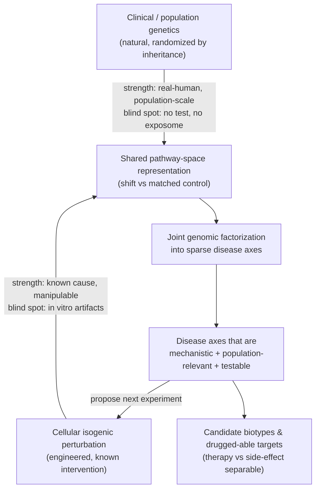

# Significance and Innovation: Dual-Grounded Causal Discovery for Psychiatric Disease

**Status:** Canonical narrative, drafted 2026-06-15 from the Grama strategy discussion. Source of truth for the Significance and Innovation framing across all IGoR proposal variants (Solution Summary section 2, Research Master section 40, Full Proposal TA1).
**Voice:** Authoritative, compassionate, optimistic. No "revolutionary," "breakthrough," or "cure."
**Proprietary guard:** The genomic-factorization method is described at the level of concept and intent only. The detailed construction (the factorized-PRS / transcription-factor-region scores) stays off the page; novelty is claimed precisely against the PRSet pathway-PRS precedent.

---

## TL;DR

Drug targets backed by human genetic evidence succeed in the clinic about two to three times more often than those without it, yet most genetic signal never becomes a mechanism you can act on. The field's standard repair, a statistical-genetics-plus-machine-learning discovery team followed by post-hoc validation in cellular models, confirms that a variant does *something* but rarely explains *how* it drives disease, whether that biology is the relevant one, or what else in the same pathway is easier to drug. **Our distinctive move is to ground one causal model in two complementary experiments at once: engineered cellular perturbations, where the intervention is known but the system is artificial, and natural population genetics, where the system is real but the intervention cannot be tested.** Joint genomic factorization forces both into a shared pathway space, so each covers the other's blind spot and the model surfaces disease axes that are mechanistic, population-relevant, and testable.

**If you only read one thing:** read the dual-grounding table and diagram in Section 3.2. That is the whole argument in one view.

---

## 1. Significance

### 1.1 Human genetics is the highest-yield place to start

The single most reliable predictor of whether a drug program survives clinical development is whether its target carries human genetic evidence for the disease. Nelson and colleagues first quantified this in 2015: genetically supported targets reached approval at roughly twice the rate of unsupported ones (Nelson et al. 2015). The 2024 refinement by Minikel and colleagues, using a decade more data and stricter causal-gene assignment, raised the estimate to **2.6x** and showed that the lift grows as confidence in the causal gene grows, and that it varies by therapeutic area (Minikel et al. 2024). This is now load-bearing logic across pharma portfolio strategy.

The implication is sharp and underexploited in psychiatry: **the more precisely you can name the causal gene and the process it perturbs, the larger the expected clinical payoff.** Precision about mechanism is not an academic luxury here; it is the variable that moves the success multiplier.

### 1.2 Genetics alone stalls at mechanism

The genetic-evidence advantage is real, but capturing it is hard, and psychiatry is the hardest case.

- **Most signal is noncoding.** The large majority of disease-associated variants fall outside protein-coding regions, so the target gene is ambiguous and variant-to-gene mapping is an inference, not a readout.
- **Even an unambiguous gene does not hand you a mechanism.** When the causal gene *is* known, the path from lesion to disease biology often remains contested. The *C9orf72* repeat expansion in ALS and frontotemporal dementia is the canonical example: the gene is certain, yet loss-of-function, toxic RNA, and dipeptide-repeat mechanisms still compete to explain how it causes neurodegeneration.
- **Effects are small and dispersed.** Common psychiatric variants carry tiny individual effect sizes and spread across hundreds of loci, so no single variant tells a clean story and the convergence across them goes uncredited.

The net result: a list of genetically implicated loci is not a list of mechanisms, and certainly not a list of drugged-able hypotheses.

### 1.3 The standard repair, and why it falls short

The mature industry response is a **dedicated statistical-genetics and machine-learning discovery function** (insitro's clinical-ML group is one well-known instance) that nominates genetically supported targets, increasingly using machine-learning-derived phenotypes, especially from imaging, to sharpen the associations. Nominated targets are then **validated post-hoc in cellular models**, typically iPSC-derived NGN2 neurons or, for neuropsychiatric work, brain organoids, read out through **proxy phenotypes** such as hyperexcitability, synaptic density, or protein aggregation (TDP-43 in ALS being the textbook readout).

This pipeline is valuable and we build on it. But it has a structural ceiling:

1. **It confirms association, not mechanism.** A model line that differs from control tells you the variant does something; it rarely tells you *how* that something drives the disease.
2. **It cannot certify disease-relevance.** Even in the lucky case where a perturbation pushes a "disease-in-a-dish" phenotype back toward healthy, you cannot tell whether that axis is the one that matters in patients or an artifact of the dish.
3. **It does not generalize within the pathway.** It leaves unanswered which *other* molecules in the same process exist, and which are weaker drivers but easier or safer to target.
4. **It discards convergence.** Each variant is validated in isolation, so the weaker variants that point at the same underlying biology are never aggregated into one stronger, coherent signal.

Closing this gap, turning genetic evidence into mechanistic, drugged-able, disease-relevant hypotheses, is the significance of this work.

---

## 2. Why psychiatry, and why now

Psychiatry is where this gap is widest and most consequential. Mechanism is poorly understood, target attrition is severe, and the field still defines disease by symptom checklists rather than biology. It is also, finally, tractable: large single-cell brain atlases, penetrant genetic forms that behave as natural model systems, validated iPSC neural assays, and causal-representation methods with identifiability guarantees now exist at the same time. A model that learns causally from each experiment and updates itself would convert that convergence into compounding returns. The penetrant forms we anchor on (the 22q11.2 deletion and TBX1, plus high-odds-ratio SCHEMA genes) give us the rare case where the causal gene is known with confidence, which is precisely the regime where the genetic-evidence multiplier is largest.

---

## 3. Innovation

### 3.1 Genomic factorization: from a variant list to interpretable processes

Rather than treating variants one at a time, we group functionally related genomic variation into a small set of sparse, interpretable **genomic factors**, conceptually in the lineage of pathway-based polygenic scores (the PRSet precedent) but learned and contextualized on a gene functional network. This does four things at once:

- **Adds power** by aggregating weak, convergent variants that point at the same biology.
- **Explains population variability** along a handful of axes rather than thousands of independent loci.
- **Links variation to process,** so a factor names a candidate mechanism, not just a location.
- **Seeds testable hypotheses,** because each factor is a concrete, perturbable claim the cellular arm can act on.

*(Method detail is proprietary and withheld here by design; novelty is claimed narrowly against PRSet.)*

### 3.2 Dual grounding: one model, two complementary experiments

This is the core idea. Cellular and clinical evidence are not two datasets to concatenate; they are **two experiments with opposite strengths and weaknesses**, and the value comes from making them constrain the same disease axes.

| Dimension | Cellular (engineered perturbation) | Clinical (natural population variation) |
|---|---|---|
| The intervention | **Known and deliberate** (CRISPR edit, compound) | Unknown to the experimenter, but **randomized by inheritance**, evolution as a population-scale trial |
| Where it acts | Often **directly on a gene or protein** | Mostly **noncoding**, ambiguous variant-to-gene, small effects |
| Causal leverage | Direct test: edit it, watch the phenotype move | Mendelian randomization and mediation on lifelong natural exposure |
| Can you test a hypothesis? | **Yes**, prospectively and repeatably | **No**, observational only |
| Blind spots | In vitro artifacts: differentiation variance; missing cell-cell, regional, spatial, and functional context (organoids match neither the proportions nor the organization of the human brain); no systemic exposome (microbiome, immune, organ crosstalk) | Cannot capture the full exposome (identical-twin discordance in schizophrenia is the standing proof); cannot intervene to confirm cause or test a fix |
| Unique contribution | **Mechanistic, manipulable ground truth** | **Real-human relevance and effect direction at population scale** |

The two columns are near-perfect complements: **each method's blind spot is the other's strength.** Cellular models give a known causal intervention that usually acts straight on a gene, but they live in an artificial system. Clinical genetics gives real, population-scale causal evidence through nature's own randomization, but it offers no way to test a protective or disease-causing hypothesis and cannot see the exposome that shapes whether risk ever manifests.

By representing **every signal, cellular or clinical, as a shift in pathway space relative to a matched control**, we let induced (engineered) and natural (inherited) evidence enter one model and constrain the same disease axes. Culture artifacts that have no population correlate fail to load on a shared axis; population associations that have no mechanistic counterpart get one proposed and then tested in the dish. The model is pushed to surface axes that are **consistent across scales and robust to model-system artifacts.**

The loop closes: factor-derived axes propose the next cellular experiment, the result updates the model, and the axes sharpen. That is the IGoR closed loop, grounded in biology rather than in a literature search.

### 3.3 The three model-level innovations this enables

The dual-grounded representation is what makes the following identifiable and useful, rather than aspirational:

1. **Disease as the causal perturbation operator.** We invert the virtual-cell paradigm (Bunne et al. 2024) so that disease-associated genetic variation acts as a soft intervention on a latent causal model of cellular processes, a setting with identifiability guarantees (Zhang et al. 2023).
2. **A three-latent structural causal model** separating a cell's **basal state**, the **disease effect** (causal on the cell state), and a **treatment effect** that acts either **directly** on the cell (a side-effect route) or by **modulating the disease** (the therapeutic route). This makes "does an intervention correct the disease or merely move the cell" an identifiable question, extending sparse-mechanism-shift and soft-intervention work (SAMS-VAE; Zhang et al. 2023) to disease and treatment as separate, composable operators.
3. **A self-updating, multiscale, mechanistic TA1** grounded in human genetics and clinical cohorts and paired with isogenic cellular models, rather than a static foundation model.

| Capability | Foundation cell models | Perturbation predictors | Agentic-science systems | IGoR (this proposal) |
|---|---|---|---|---|
| Mechanistic and causal | No | Partial | No | **Yes** |
| Multiscale (molecule to circuit) | No | No | No | **Yes** |
| Self-updating from new experiments | No | No | Partial | **Yes** |
| Disease genotype as the perturbation | No | No | No | **Yes** |
| Grounded in both cellular and clinical evidence | No | No | No | **Yes** |
| Separates therapy from side effect | No | No | No | **Yes** |
| Closed loop to validated laboratories | No | No | Partial | **Yes** |

---

## 4. Impact

Targets that emerge from a model carrying **human genetic support** are roughly two to three times more likely to succeed clinically (Nelson et al. 2015; Minikel et al. 2024), and that multiplier rises with confidence in the causal gene, which is exactly what dual grounding is built to deliver. Anchoring on penetrant forms calibrates disease axes that **generalize to idiopathic schizophrenia** and span **bipolar disorder** as transdiagnostic coordinates (bridged by the BDNF/TrkB plasticity axes shared with rapid-acting antidepressant response). Separating the therapeutic route from the side-effect route turns the model directly toward drug discovery by making efficacy-versus-liability an explicit, identifiable prediction. The marquee outcome is **at least 10x faster validated knowledge** by Phase III, with all computational artifacts released under permissive open-source licenses, save the one narrow proprietary carve-out noted above.

---

## 5. How this maps into the proposal variants

| Target file | Edit |
|---|---|
| `solution_summary/sections/2_innovation_and_impact.md` | Replace "What current approaches miss" lead-in with the genetics-evidence significance hook; add dual-grounding as innovation item; keep the comparison table (add the cellular+clinical row). |
| `research/sections/40_disease_strategy_and_evidence.md` | Add a significance preamble (Sections 1.1 to 1.3 here) ahead of the disease-anchor material. |
| `full_proposal/_sources/FULLPROPOSAL_DRAFT.md` | Expand TA1 Pillar 1 (paired clinical/cellular) and Pillar 2 (genomic factorization) using Section 3 here. |
| Carpenter outreach | The dual-grounding + NeuroPainting precedent is the scientific spine of the Anne email (her 22q11 cellular axes are one half of the pair). |

---

## References

1. Nelson MR, et al. The support of human genetic evidence for approved drug indications. *Nat Genet.* 2015;47(8):856-860. doi:10.1038/ng.3314.
2. Minikel EV, et al. Refining the impact of genetic evidence on clinical success. *Nature.* 2024;629:624-629. doi:10.1038/s41586-024-07316-0.
3. Bunne C, et al. How to build the virtual cell with artificial intelligence. *Cell.* 2024;187(25):7045-7063. doi:10.1016/j.cell.2024.11.015.
4. Zhang J, et al. Identifiability guarantees for causal disentanglement from soft interventions. NeurIPS 2023. arXiv:2307.06250.
5. Bereket M, Karaletsos T. Sparse additive mechanism shift modeling (SAMS-VAE). NeurIPS 2023. arXiv:2311.02794.
6. Tegtmeyer M, et al. Combining phenomics with transcriptomics reveals cell-type-specific morphological and molecular signatures of the 22q11.2 deletion (NeuroPainting). *Nat Commun.* 2025;16:6332. doi:10.1038/s41467-025-61547-x.
7. Singh T, et al. Rare coding variants in schizophrenia (SCHEMA). *Nature.* 2022;604:509-516. doi:10.1038/s41586-022-04556-w.
8. Ruzicka WB, Mohammadi S, et al. Single-cell multi-cohort atlas of schizophrenia. *Science.* 2024;384:eadg5136. doi:10.1126/science.adg5136.
