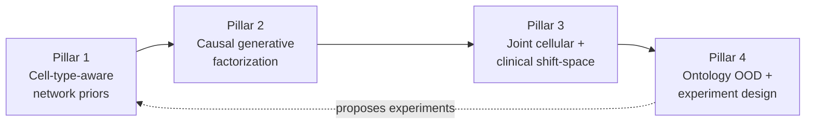
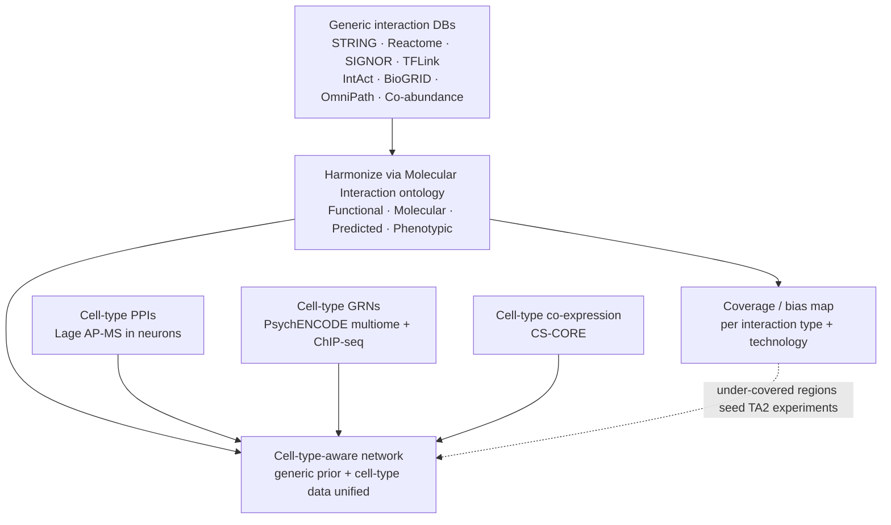
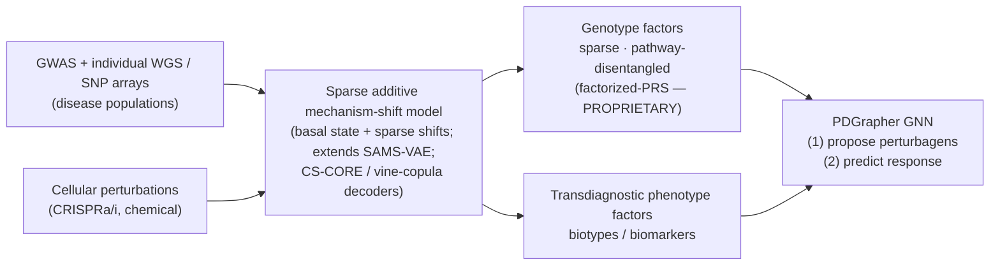
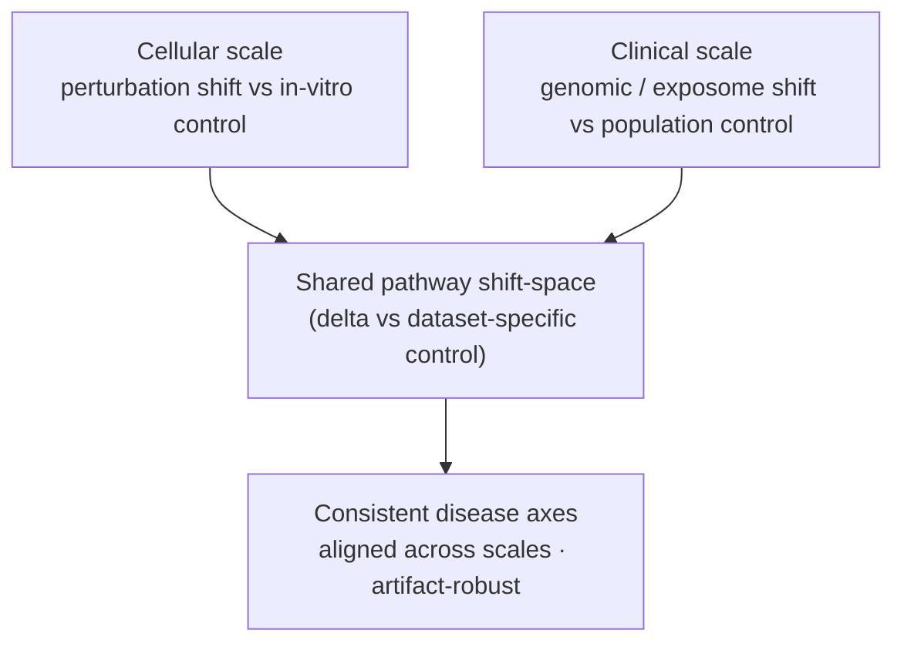
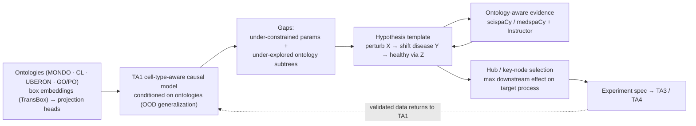

# Cytognosis TA1-TA2 Methods Deep-Dive (IGoR)

**Date 2026-06-05 · The technical backbone for TA1 (mechanistic, multiscale, causal disease model) and TA2 (New Science Engine). Feeds the Aug 6 full proposal. Reading time ~12 min.**

> **⚑ PROPRIETARY IP.** Pillar 2b (**factorized-PRS**) is crown-jewel platform IP. Keep it out of partner-facing materials; in any ARPA-H submission, mark the pages that describe it "Proprietary." Describe novelty precisely against the PRSet pathway-PRS precedent. See `project-bdnf-axes-and-factorized-prs`.

## BLUF

Our TA1/TA2 stack rests on **four pillars**: (1) **ontology-harmonized, cell-type-aware network priors**; (2) **causal generative modeling** that factorizes genotype and phenotype under a sparse mechanism-shift; (3) **joint cellular + clinical modeling** in a shared pathway shift-space; and (4) **ontology-conditioned generalization** that powers literature-grounded hypotheses and hub-based experiment design. **If you only read one thing:** everything is measured as a *shift (delta) in pathway space relative to a dataset-specific control*, which is what lets us aggregate cellular and clinical evidence into the same causal model and what makes TA2's experiment proposals mechanistically targeted rather than literature-mined.

---

## Pillar 1 — Network curation (the structured prior)

### 1a. Harmonize generic databases via the Molecular Interaction ontology

We reuse Cytognosis's prior work (`Harmonizing Interaction Networks` report) that harmonizes the major interaction resources into one typed graph using the **Molecular Interaction (MI) ontology** (term MI:0190) as the harmonization backbone:

| Layer (MI top type) | Subtyping basis | Examples |
|---|---|---|
| **Functional / causal** (MI:2245, MI:0414) | mechanism class | signaling, regulatory, metabolic, PTM, epigenetic |
| **Molecular / experimental** (MI:0045) | detection method on three axes | direct vs indirect × high vs low throughput × physical vs genetic |
| **Predicted** (MI:0063) | data source | co-expression, text-mining, homology (+ colocalization) |
| **Phenotypic** | genetic | genetic interactions |

Sources harmonized: **STRING, Reactome, Reactome FI, SIGNOR, TFLink, IntAct, BioGRID, OmniPath, Co-abundance Atlas** → millions of typed, deduplicated edges. **Why typed edges matter:** every interaction technology has known measurement biases, gaps, and holes. We build dedicated tools to map *which pathways, processes, and subnetworks each interaction type/technology covers well*, then use that coverage map two ways: (a) as a **confidence prior** during inference, and (b) as a **driver for TA2** to propose experiments that fill the under-covered regions.

### 1b. Neuro-specific layers on top of the generic prior

| Layer | Method / source | What it contributes |
|---|---|---|
| **Cell-type-specific PPIs** | Kasper Lage AP-MS interaction proteomics in iPSC-derived neurons (autism, *Cell Genomics* 2022; ASD risk genes converge on the IGF2BP1-3 complex) | experimentally validated, neuron-resolved physical edges and complex-level nodes |
| **Cell-type GRNs** | PsychENCODE brainSCOPE multiome GRNs (snRNA + snATAC, 24 brain cell types) + ChIP-seq | directed TF→target and enhancer-gene edges, cell-type-resolved |
| **Cell-type co-expression** | **CS-CORE** (depth/noise-corrected co-expression from scRNA-seq UMIs) | unbiased per-cell-type co-expression; used *inside our generative decoders* (below) |

### 1c. Unify into a cell-type-aware network

We fuse the **context-independent harmonized prior** with the **cell-type-specific datasets** to produce a single **cell-type-aware network** that carries both general mechanistic knowledge and neuronal specificity.

---

## Pillar 2 — Causal generative modeling

### 2a. From in-vitro perturbation to clinical disease modeling

Most "virtual cell" perturbation models target CRISPR or chemical perturbations in in-vitro cellular systems. We extend them toward **disease modeling in clinical settings**, carrying over two ideas and adding a third:

- **Sparse additive mechanism-shift.** Following **SAMS-VAE** (insitro; Shahin contributed to the published work, and to unpublished joint Perturb-seq + POSH morphological models in TSC and other monogenic epilepsy / neurodevelopmental NGN2 lines), a cell's latent state is a **basal/healthy state plus sparse additive shifts**. We model **extrinsic factors (treatment and/or disease)** as sparse mechanism-shifts acting on the **intrinsic basal cell state**.
- **Covariance-preserving decoders.** We replace the independent negative-binomial losses used in VAEs (scVI, and perturbation models built on it including SAMS-VAE) with **CS-CORE-informed, vine-copula decoders** (the dependence construction from **scDesign3**), so reconstructed cells preserve real **gene-gene covariance** rather than treating genes as conditionally independent.

### 2b. Factorized-PRS  *(PROPRIETARY — crown-jewel IP; mark proprietary, keep off partner docs)*

Where existing perturbation models learn latent factors that **group/disentangle cellular perturbations**, ours learns factors that **group/disentangle genetic variants** (GWAS of neuro-disorders, plus individual-level WGS / SNP arrays in disease populations). This extends the **polygenic risk score (PRS)** — which collapses all independent risk variants into *one* score — into **many biologically disentangled, pathway-focused PRS scores**. We factorize the **genotype × phenotype** matrix so that:

- **Genotype factors are sparse** (following the sparsity-of-shift mechanism), **biologically disentangled**, and **enriched in distinct processes** → interpretable, literature-alignable, and directly translatable into follow-up experiments;
- **Phenotype factors are transdiagnostic** → they capture variation **within and across** disease labels and serve as candidate **biotypes / biomarkers**.

*Novelty must be claimed precisely against **PRSet** (pathway-partitioned PRS) as the nearest precedent: our contribution is the joint, sparse, disentangled genotype-and-phenotype factorization tied to the mechanism-shift, not pathway partitioning alone.*

### 2c. GNN-based intervention design (PDGrapher)

We adopt **PDGrapher**'s two-phase graph neural network over our interaction network, and we need **both** phases: (1) **propose perturbagens** that shift a diseased state toward a target/healthy state (inverse design), and (2) **predict the response** to a candidate perturbation. Interventions are represented as **edge mutilations** on the causal graph.

---

## Pillar 3 — Joint cellular / clinical modeling

A defining feature of our approach is to **jointly model and factorize clinical data** (genomic variants, clinical-trial outcomes, exposome / lifestyle factors) **with cellular perturbation data** (genetic and chemical), rather than treating clinical data as post-hoc validation.

**The failure mode we avoid.** In-vitro-only programs (including prior insitro work, and current efforts at Xaira, Recursion) prioritize interventions that make **disease cells look like healthy cells**, then use clinical data only afterward to validate. These pipelines often **cannot distinguish clinically relevant disease axes**, because many cellular signatures are **artifacts of the model system**: iPSC differentiation artifacts, missing cellular composition and interactions (e.g., glial-neuronal), and missing systemic effects (microbiome, immune).

**Our contribution.** We measure **everything as a shift (delta) in pathway space relative to a dataset-specific control**, on both scales. That common representation lets us **aggregate and reconcile cellular and clinical evidence into the same causal model**, and surface **disease axes that are consistent across scales** (and therefore robust to model-system artifacts).

---

## Pillar 4 — Ontology-conditioned generalization and the TA2 loop

### 4a. Semantic ontology conditioning (out-of-distribution generalization)

We condition the model on **standard ontologies** so it can generalize beyond the data it has seen:

| Domain | Ontology |
|---|---|
| Disease | MONDO |
| Cell type | Cell Ontology (CL) |
| Tissue / brain region | UBERON |
| Process / pathway | Gene Ontology + Pathway Ontology (incl. GO-plus) |

Each ontology is **pre-embedded with box embeddings** (**TransBox**, EL++-closed; subsumption is encoded as **box containment**, so is-a transitivity is exact), then mapped into the model's latent space through **projection heads** as **conditioning variables**. This does two things:

1. **OOD generalization:** the model can reason about **unseen cell types or disorders** by interpolating with respect to the closest seen examples in ontology space.
2. **Gap finding:** **under-explored ontology subtrees** (whole regions with no close training examples) are exactly where interpolation is unreliable. Those gaps become **high-value experiment targets for TA2**.

### 4b. Hypothesis templating and literature grounding

Every model-derived hypothesis has a fixed, ontology-aligned shape:

> **"Perturbing pathway / process X will shift the disease phenotype in disease Y toward healthy by modulating Z."**

Because X, Y, Z are ontology terms, we ground each hypothesis with **ontology-aware NER** (spaCy, **scispaCy**, **medspaCy** for negation/context) and **templated, schema-validated extraction** (**Instructor** + Pydantic) to pull **harmonized, ontology-aligned evidence for and against** the hypothesis for the TA2 agents.

### 4c. Experiment design via hubs / key nodes

To turn a hypothesis into the *single most informative* experiment, we find the **hubs / key nodes** (transcription factors, key signaling biomolecules) whose perturbation is predicted to **modulate the largest number of downstream biomolecules** in the target process (the process enriched on our genotype factors). Perturbing those hubs is the highest-value way to shift disease cells toward a healthy state, and that is what TA2 hands to TA3/TA4.

---

## How this maps to the IGoR TAs

| IGoR requirement | Where we meet it |
|---|---|
| TA1 modular, mechanistic, multiscale, verifiable | Pillars 1+2+3: typed mechanistic edges, cell-type-aware layers, molecular→cell→circuit shifts, hub predictions are testable |
| TA1 knowledge-gap identification | Pillar 1a coverage map + Pillar 4a ontology-subtree gaps + under-constrained model parameters |
| TA2 mechanistic grounding (not an LLM wrapper) | Pillars 2-4: hypotheses are generated from the causal model and ontology, then literature only *grounds* them |
| TA2 explainability | Pillar 4b ontology-aligned hypothesis template + evidence-for/against traces |
| TA2 experiment design | Pillar 4c hub/key-node selection = value-of-information targeting for TA3/TA4 |

## References (methods)

1. Garrido-Rodriguez M, et al. (2022). Integrating knowledge and omics via large-scale models of signaling networks. *Mol Syst Biol* 18:e11036. (OmniPath; harmonization framing.)
2. Su Y, et al. (2023). Cell-type-specific co-expression inference from single-cell RNA-sequencing data (**CS-CORE**). *Nat Commun* 14:4846. DOI 10.1038/s41467-023-40503-7.
3. Song D, et al. (2024). scDesign3 generates realistic in silico single-cell and spatial omics data (**vine copula**). *Nat Biotechnol* 42:247-252. DOI 10.1038/s41587-023-01772-1.
4. Bereket M, Karaletsos T. (2023). Modelling cellular perturbations with the sparse additive mechanism shift VAE (**SAMS-VAE**). *NeurIPS*; arXiv:2311.02794.
5. Gonzalez G, et al. (2025). Combinatorial prediction of therapeutic perturbations using causally inspired neural networks (**PDGrapher**). *Nat Biomed Eng*. DOI 10.1038/s41551-025-01481-x.
6. Lage K, et al. (2022). A cell-type-resolved interactome of autism risk genes (IGF2BP convergence; AP-MS in iNs). *Cell Genomics* 2(9):100182.
7. Emani PS, et al. / PsychENCODE (2024). Single-cell genomics and regulatory networks for 388 human brains (**brainSCOPE GRNs**). *Science* 384:eadi5199.
8. Xiong B, et al. (2024). TransBox: EL++-closed ontology embedding with box embeddings. arXiv:2410.14571.
9. Neumann M, et al. (2019). ScispaCy: fast and robust biomedical NLP. arXiv:1902.07669. · medspaCy clinical NLP (*AMIA* 2021). · Instructor (structured LLM output): python.useinstructor.com.
10. Choi SW, et al. (2020). PRSet / PRSice-2 pathway-based polygenic scores (precedent for factorized-PRS). *GigaScience / PLoS Genet*.

> Verify author lists and volume/page details for refs 4-10 before the full proposal; they were assembled from method digests this session.
