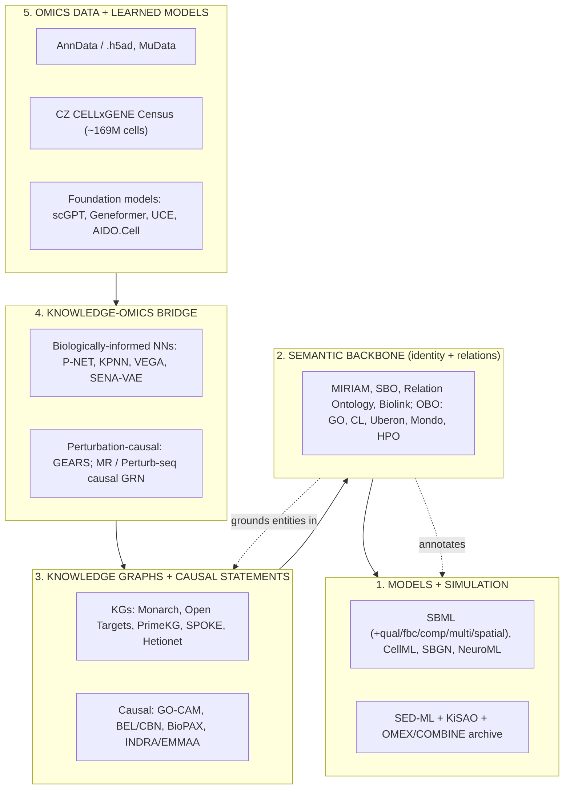
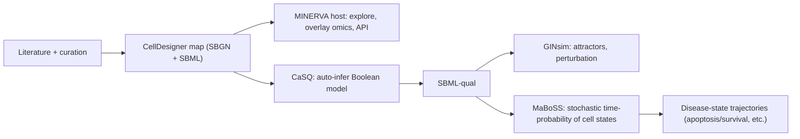
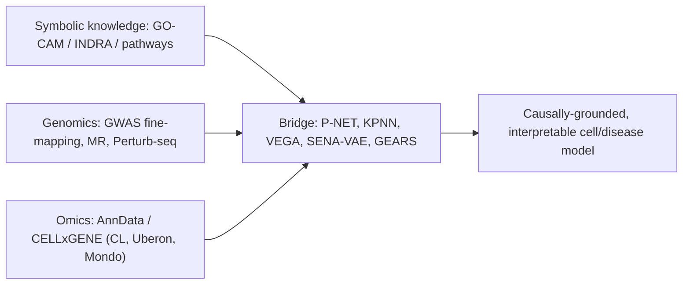

# Standards for Representing Disease Knowledge: Causal, Temporal, and Omics-Aware

**Scope:** Comparison of standards for cellular and disease models (SBML, CellML, SED-ML, SBGN, Disease Maps, and others), with emphasis on causal representation, time/disease-progression axes, knowledge-gap and hypothesis support, simulation, and integration with single-cell RNA-seq and genomics.
**Date:** 2026-06-10. **Reading time:** ~25 min. **Currency note:** version/release facts are as of the cited sources (mostly 2024-2026).

> **If you read only one thing:** No single standard does all four of {molecular causality, disease-progression time axis, cell-type-resolved omics context, hypothesis/gap tracking with provenance}. The practical answer is a **layered stack**: a quantitative/qualitative model layer (**SBML family**), a curated causal-knowledge layer (**Disease Maps + GO-CAM/INDRA**), a semantic backbone (**MIRIAM/SBO/RO/Biolink + OBO ontologies**), and an omics bridge (**AnnData/CELLxGENE + biologically-informed neural nets**). See Part 12 for the recommended Cytoverse stack.

---

## BLUF

**Three sentences.** Pathway-scale, simulatable disease mechanism is best served by the **SBML family** (SBML core for kinetics, SBML-qual for executable Boolean causality, fbc for metabolism) plus **SED-ML/OMEX** for reproducible simulation; "DisMech"-style **Disease Maps** (MINERVA/CellDesigner, SBGN, then CaSQ to SBML-qual to MaBoSS) are the standard way to turn curated disease knowledge into a runnable causal model. Deep, signed, mechanism-typed causality with literature provenance and automated hypothesis/gap tracking is the domain of **GO-CAM, BEL, and especially INDRA/EMMAA**, none of which natively encode a time/disease-progression axis. Integration with scRNA-seq and genomics is never native to these schemas; it happens through a **semantic backbone** (ontology-grounded identifiers) and a **bridge layer** (knowledge-primed neural networks such as VEGA, P-NET, KPNN, SENA-VAE; perturbation-causal models such as GEARS; and Mendelian-randomization or Perturb-seq causal anchors).

---

## Part 1. The landscape in one picture

The standards sort into five layers. Most real systems combine one item from several layers.

**How to read it.** Layer 1 is "models you can run." Layer 2 is "so everything points at the same gene/cell/disease." Layer 3 is "what is known to cause what, with evidence." Layer 4 is "how symbolic knowledge constrains or interprets single-cell data." Layer 5 is "the data and the big learned models."

---

## Part 2. Master comparison (the one-screen answer)

| Standard / framework | Layer | Core abstraction | Best scale/scope | Causal | Temporal / progression | scRNA-seq + genomics |
|---|---|---|---|---|---|---|
| **SBML core (L3V2)** | Model | Reaction network -> ODE/stochastic | Pathway to large network (10s-1000s species) | Weak (topology only) | Strong (physical time, events) | Annotation + parameter fitting |
| **SBML-qual** | Model | Boolean/multi-valued logical network | Signaling/GRN (20-300 nodes) | **Strong (explicit logic)** | Discrete steps; attractors = cell states | Via CellNOpt/CARNIVAL, activity scores |
| **SBML-fbc** | Model | Stoichiometry + constraints (FBA) | Genome-scale metabolism (1000s rxns) | Flux topology | Steady-state | Transcriptomic constraints (post-hoc) |
| **CellML 2.0** | Model | Component math (DAE/ODE), no bio semantics | Electrophysiology, multi-physics organ | None explicit | Strong (time-course) | Minimal |
| **SBGN (PD/ER/AF)** | Model/graphic | Visual network notation | Pathway maps | ER/AF encode stimulation/inhibition | Static (overlay data) | Overlay via MINERVA |
| **Disease Maps (MINERVA)** | Knowledge map | Curated SBGN+SBML disease mechanism map | Whole-disease mechanism | Via CaSQ to SBML-qual | Via MaBoSS simulation | MINERVA data overlay |
| **SED-ML + OMEX** | Simulation | Simulation experiment spec + bundle | Any model | n/a (encodes interventions) | **Time-course/perturbation tasks** | External data refs |
| **NeuroML/LEMS** | Model | Neuron/channel/circuit | Single channel to neural circuit | Electrical only | Strong | Minimal |
| **BioPAX L3** | Causal/KG | OWL pathway ontology | Pathway exchange | Moderate (activation/inhibition) | None | Gene sets |
| **BEL / CBN** | Causal | Subject-predicate-object causal triples | Curated causal networks | **High (typed, per-statement evidence)** | None | NPA/RCR on expression |
| **GO-CAM** | Causal | Molecular-activity causal graph (RO) | Gene-function mechanism | **Very high (signed, mechanism-typed)** | Implicit (process nesting) | Gene IDs + CL/Uberon context |
| **INDRA / EMMAA** | Causal/assembly | Mechanism-typed Statements + belief | Assembled causal models | **Very high + provenance** | None native (PySB for dynamics) | DepMap/LINCS/GWAS via CoGEx |
| **Biolink / Monarch** | Semantic/KG | Typed node-edge metagraph | Cross-domain KG | Low-moderate (`causes`) | None | CELLxGENE metadata schema |
| **Open Targets** | KG | Evidence-scored target-disease | Variant-to-gene-to-disease | Moderate (L2G GWAS) | None | GWAS + DepMap + expression |
| **SuStaIn / EBM** | Progression model | Biomarker event ordering + subtypes | Disease staging | n/a (statistical) | **Very high (explicit stages)** | Any biomarker/omics matrix |
| **AnnData / CELLxGENE** | Data | Cells x genes + ontology metadata | Atlas scale | None | Pseudotime (external) | **Native** |
| **GEARS** | Bridge | GO-prior GNN for perturbations | Perturb-seq | High (perturbation-causal) | None | **Native** |
| **VEGA / P-NET / KPNN / SENA-VAE** | Bridge | Knowledge as NN topology | scRNA-seq/genomics | Architectural (SENA: causal-identifiable) | None | **Native** |

---

## Part 3. Representation and simulation standards (the original question)

These are the COMBINE-community standards for models you can actually simulate. All are coordinated under **COMBINE** (co.mbine.org) and bundled via the **OMEX/COMBINE archive** with **MIRIAM/SBO** annotation.

### SBML (Systems Biology Markup Language)

**What it is.** XML encoding of biochemical reaction systems: species, reactions with MathML kinetic laws, compartments, parameters, rules, and events. The implied object is a system of ODEs (or a stochastic/constraint analog). Current stable core is **Level 3 Version 2 Core Release 2 (2019)**; the community extends L3 via packages rather than issuing a Level 4.

**Why it dominates.** It is the lingua franca of quantitative cell modeling. **BioModels** hosts ~1,100 curated models; essentially every simulator reads it (COPASI, Tellurium/libRoadRunner, VCell).

**The packages are the real power.** This is where SBML reaches beyond single kinetic pathways:

| Package | Purpose | Disease-modeling relevance |
|---|---|---|
| **qual** | Boolean/multi-valued logical models | Executable causal signaling/GRN models; the disease-map execution target |
| **fbc** | Flux balance constraints | Genome-scale metabolism (Recon3D, Human1, AGORA); constrain with transcriptomics |
| **comp** | Hierarchical composition of submodels | Assemble multi-module or multi-tissue models from validated parts |
| **multi** | Rule-based multistate species | Combinatorial complexes/receptor signaling (declarative BNGL equivalent) |
| **spatial** | Geometry-based reaction-diffusion (PDE) | Spatial signaling; couples to VCell-style solvers |
| **distrib** | Parameter distributions | Stochastic/uncertain parameters |
| **layout/render** | Diagram geometry + style | SBGN-compliant diagrams inside the SBML file |

**Causal?** Core SBML encodes process topology, not directed regulatory causality. For explicit, executable causality you use **SBML-qual** (logical update rules with signs) or rule-based formalisms. **Temporal?** Strong within the ODE/stochastic paradigm (physical time, threshold events), but it has no native notion of disease "stage" or "trajectory." **Omics?** Indirect: MIRIAM/SBO annotations let tools cross-reference entities; fbc models can be constrained by transcriptomic/proteomic data via COBRApy.

### CellML

**What it is.** A purely mathematical component-and-connection language (DAE/ODE), with **no built-in biochemical semantics** (no "species" or "reaction"). Current version **CellML 2.0 (2020)**; annotation has moved to OMEX Metadata. Tooling centers on **OpenCOR** and **libCellML**; the **Physiome Model Repository** hosts ~800+ models.

**Where it wins.** Electrophysiology and multi-physics physiology (cardiac, renal, neuromuscular). It is more general and math-agnostic than SBML, which is exactly why it is less convenient for molecular signaling/metabolism where SBML's biochemical vocabulary helps. **Causal:** implicit only. **Temporal:** strong for time-course. **Omics:** minimal by design.

### SED-ML (Simulation Experiment Description Markup Language)

**What it is.** The standard that makes a simulation reproducible by separating the **experiment** (which simulations, which algorithm via **KiSAO**, time span, parameter scans, model changes, outputs) from the **model** (SBML/CellML/NeuroML). Current version **Level 1 Version 5 (2024)**.

**Why it matters for causality and time.** SED-ML's `model change` elements formalize **in silico interventions** (knock out a variable, change a parameter), which is the closest the simulation-standards ecosystem comes to encoding a counterfactual/interventional experiment. It is also the natural home for the **time-course and perturbation** specification that a disease-progression simulation needs. Bundled with the model in an **OMEX archive** (`.omex`), it gives "one file reproduces everything," runnable on EMBL-EBI **BioSimulations**.

### SBGN (Systems Biology Graphical Notation)

**What it is.** The visual standard, with three languages: **Process Description (PD)** (mechanistic, SBML-equivalent reactions), **Entity Relationship (ER)** (influence relations), and **Activity Flow (AF)** (abstract signaling cascades). File format **SBGN-ML v0.3**; current language specs at **PD/ER Level 1 Version 2.1 (2026)**. ER and AF carry explicit causal arcs (stimulation, inhibition, necessary stimulation, absolute inhibition).

### NeuroML / LEMS

**What it is.** The computational-neuroscience analog: ion channels, synapses, multi-compartment neurons, and circuits, with **LEMS** as a self-describing math meta-language. Current schema **NeuroML v2.3**; major ecosystem review in eLife (2025). Scale runs from a single channel to a cortical-column-scale circuit. Relevant if Cytognosis modeling ever reaches neuronal electrophysiology rather than molecular signaling.

### Whole-cell vs pathway: the scope tradeoff

The tradeoff is **mechanistic completeness vs executability and interpretability**. There is no universally correct scale.

| Question you are asking | Use | Format | Engine |
|---|---|---|---|
| Quantitative kinetics, one pathway | SBML core | `.sbml` | COPASI, Tellurium |
| Genome-scale metabolism | SBML + fbc | `.sbml` | COBRApy, MICOM |
| Signaling/GRN logic, cell-fate states | SBML + qual | `.sbml` | GINsim, MaBoSS, CellNOpt |
| Curated disease mechanism, then run it | SBGN/MINERVA -> CaSQ | `.sbgn`/`.xml` | MaBoSS |
| Electrophysiology, organ multi-physics | CellML 2.0 | `.cellml` | OpenCOR, Chaste |
| Spatial single-cell biology | SBML spatial / VCell | `.vcml` | VCell |
| Multistate complexes | BNGL / SBML multi | `.bngl` | BioNetGen, NFsim |
| Whole-cell, multi-paradigm integration | **Vivarium** (Python) | code + JSON | custom composite |
| Reproducible exchange of any of the above | SED-ML + OMEX | `.sedml`/`.omex` | BioSimulators |

**Whole-cell reality check.** True whole-cell models (Karr et al. *M. genitalium*; the next-generation *E. coli* effort) integrate ~28 submodels in different formalisms and **resist single-format serialization**; they live as code (Python), with **Vivarium** as the leading composition framework. The cost is interoperability: Vivarium has no standard file format. So "whole-cell" today means **a software framework composing many small standardized models**, not one big SBML file.

---

## Part 4. "DisMech": Disease Maps as the disease-knowledge integration standard

This is almost certainly what your "DisMech" points at, and it is the most directly relevant pattern to your question.

**What a Disease Map is.** A curated, community-built, comprehensive map of the molecular mechanisms of a specific disease (Parkinson's, Alzheimer's, COVID-19, asthma, rheumatoid arthritis). It is drawn in **CellDesigner** using **SBGN** semantics, stored as **SBML + layout** or **SBGN-ML**, annotated to databases via **MIRIAM**, and hosted on the **MINERVA** platform (web exploration, data overlay, API, FAIR-assessed in 2024). Governance is the **Disease Maps Community** (originating at LCSB Luxembourg).

**Why it answers "integrate knowledge while staying simulatable."** A static, human-curated knowledge map becomes an **executable causal model** through one pipeline:

**CaSQ** (CellDesigner-as-SBML-qual) converts the curated map into **SBML-qual**, which **MaBoSS** then simulates into **time-dependent probability curves** over disease-relevant states. This is exactly how the COVID-19 Disease Map produced executable models (deposited on FAIRDOMHub). It is the canonical, standards-based route from "integrated disease knowledge" to "runnable causal model with a time axis."

**Adjacent knowledge-map standards.** **WikiPathways** (now on the **GPML2021** schema; the classic site retired May 2026) and **Reactome** (Release 90+, exports SBML, BioPAX L3, and revamped SBGN) are the other large curated pathway resources; both export to formats that feed enrichment and network analysis, but neither targets disease-specific mechanism maps the way Disease Maps do.

---

## Part 5. Causal-knowledge standards (signed, mechanistic, with provenance)

When the requirement is **explicit causality with evidence and gap tracking** rather than kinetic simulation, four frameworks lead. They differ mainly in mechanism depth, provenance granularity, and how well they flag what is unknown.

| Framework | Causal depth | Provenance | Gap / hypothesis support | Status |
|---|---|---|---|---|
| **BioPAX L3** | activation/inhibition via `Control`; no PTM type | `Evidence` + PMID; not per-statement-rich | graph traversal for missing links | stable since 2010; 20+ DBs |
| **BEL / CBN** | **typed** (`directlyIncreases/Decreases`), PTM functions | **per-statement quoted text + PMID** | NPA/RCR; nodes without predecessors = gaps | spec maintained; community small, partly folded into INDRA |
| **GO-CAM** | **very high**: RO causal hierarchy, signed, mechanism-typed, compartment-aware | ECO evidence code + PMID per annotation | **incomplete models explicitly flag gaps**; reasoner-inferred paths | active (GO Consortium, a Global Core Biodata Resource) |
| **INDRA + CoGEx + EMMAA** | **very high**: mechanism-typed Statement hierarchy, direct/indirect flags, belief scores | full evidence list per Statement, multi-source | **best in class**: EMMAA literature surveillance, `model_checker`, reverse causal reasoning | active (Gyori Lab); v1.21 |

**Key distinctions.**

- **GO-CAM** is the cleanest formal causal model: a graph of **molecular activities** linked by **Relation Ontology** causal relations (`directly_positively_regulates`, `causally_upstream_of`, etc.). Its hierarchy lets a curator assert "directly activates" when mechanism is known and fall back to "causally upstream" when it is not, which **structurally marks knowledge gaps**.
- **INDRA** is the assembly and reasoning engine: it ingests machine-reading output (REACH, Eidos), pathway databases (BioPAX/Pathway Commons, SIGNOR), and PTM databases into mechanism-typed **Statements** with belief scores, then exports to executable **PySB**, **SBGN**, Boolean networks, or Cytoscape. **EMMAA** runs this continuously over new PubMed/PMC literature, so models self-update and contradictions are flagged automatically. This is the closest thing to a standardized **hypothesis-and-gap engine**.
- **BEL** has the strongest per-statement literature provenance and a clean triple grammar; its main use today is **reverse causal reasoning / Network Perturbation Amplitude** scoring transcriptomics against curated causal networks (the CBN database).
- **None of the four encodes a native time/disease-progression axis.** INDRA reaches dynamics only by exporting to PySB and parameterizing.

---

## Part 6. The semantic backbone (why anything integrates at all)

Integration across all layers depends on shared identity and relation vocabularies. This is the unglamorous layer that makes the rest composable.

- **MIRIAM + identifiers.org / Bioregistry:** machine-resolvable cross-references (e.g., `uniprot:P04637`) so the same entity is provably the same across models and databases.
- **SBO (Systems Biology Ontology):** classifies model elements (reaction type, parameter role, modeling framework) for tool interoperability.
- **Relation Ontology (RO):** the shared causal and temporal relation vocabulary (`causally_upstream_of`, `directly_positively_regulates`, and the `precedes` temporal hierarchy) used by GO-CAM, Monarch, CL, Uberon, and Mondo. RO is the "semantic glue."
- **Biolink Model:** the high-level node/edge metagraph schema (LinkML) for knowledge graphs, with structured **knowledge-source provenance** on every edge; the standard for the NCATS Translator ecosystem and Monarch.
- **OBO Foundry ontologies:** GO (function), **CL (cell type)**, **Uberon (anatomy)**, **Mondo (disease)**, **HPO (phenotype)**, CHEBI, PR, SO, PATO. Orthogonal, open, OWL/OBO, reasoner-ready. These are what let single-cell metadata (CL/Uberon/Mondo) line up with mechanism knowledge (GO/RO).

**Practical implication:** any disease-knowledge schema you build should ground entities in OBO IDs and use RO/Biolink relations, or you forfeit interoperability with the rest of the ecosystem.

---

## Part 7. Biomedical knowledge graphs (breadth, but mostly associative)

KGs give scale and connectivity for traversal, embedding, and drug-repurposing, but most edges are **associative, not mechanistic-causal**, and provenance varies.

| KG | Scale | Causal edges | Provenance | scRNA-seq | Notes |
|---|---|---|---|---|---|
| **Monarch KG** | 1.12M nodes / 8.9M edges | minority (ClinVar/OMIM `causes`) | Biolink slots | Bgee expression, CL/Uberon labels | phenotype-gene-disease connectivity; Global Core Biodata Resource |
| **Open Targets** (Platform+Genetics, 25.03) | very large | **L2G GWAS causal gene scoring**, CRISPR | full per-evidence | GWAS + DepMap + GTEx; scRNA arriving | best variant-to-gene causal anchoring |
| **PrimeKG** | 4M edges, 17K diseases | mostly associative | weak per-edge | none | popular for GNN drug repurposing; static 2023 |
| **SPOKE** | 40+ DBs (Neo4j) | mixed | per source | none direct | LLM/RAG interface (VERSA); API only |
| **Hetionet** | 47K nodes / 2.25M edges | some directed | limited | none | frozen 2017; benchmark standard |
| **Clinical Knowledge Graph** | 20M+ nodes / 220M+ edges | signaling (via BioPAX) directed | per source | proteomics/clinical cohorts | distinguishing feature is clinical integration |

**Takeaway:** for **causal anchoring of variants**, Open Targets (L2G + GWAS fine-mapping) is the strongest. For **mechanism-level causality**, you still need GO-CAM/INDRA, not a general KG. KGs are the connectivity prior and the candidate generator, not the mechanism ground truth.

---

## Part 8. The time / disease-progression axis (the biggest standards gap)

**Blunt finding:** there is **no widely adopted OWL/RDF schema for disease progression** (stage ordering, stage-membership probabilities, biomarker thresholds, transition rates). Disease ontologies stop at qualifiers.

- **Mondo, HPO, EFO, DOID** encode disease/phenotype identity plus **age-of-onset, severity, and frequency qualifiers**, but not ordered stages or trajectories. RO offers `precedes`/`immediately_precedes`, which is a formal but thin temporal vocabulary that is not used for clinical staging.
- **Data-driven progression models** fill the gap as computation, not schema:
  - **Event-Based Model (EBM):** infers the most probable ordering of biomarker abnormalities from cross-sectional data.
  - **SuStaIn:** infers disease **subtypes (each a distinct progression sequence) and per-patient stage** jointly; widely used in neurodegeneration (e.g., a 2024 five-biomarker, five-stage Alzheimer's model).
  - **Single-cell pseudotime / latent time:** Monocle, Palantir, scVelo, **CellRank 2** infer cell-state trajectories and fate probabilities, encoding temporal ordering of cell states (developmental or disease-relevant), which clinical ontologies cannot.
- **Where time lives in the simulatable standards:** physical time in SBML/CellML ODEs; discrete update steps and **attractors** in SBML-qual; **MaBoSS** stochastic time-probability curves over states; and **SED-ML** time-course/perturbation tasks. So a disease-progression model today is typically "**Disease Map to SBML-qual to MaBoSS for short-timescale state dynamics**" plus "**SuStaIn/EBM as a separate, un-ontologized layer for long-timescale clinical staging**."

**This gap is an opportunity.** A schema that standardizes disease-stage ordering with provenance, grounded in Mondo/HPO/CL and RO temporal relations, and linkable to both SuStaIn-style outputs and SBML-qual state transitions, does not exist. It is a credible standardization contribution (and a natural fit for a "geometry of disease over time" platform thesis).

---

## Part 9. The knowledge-omics bridge (how symbolic knowledge meets scRNA-seq and genomics)

No mechanism standard ingests an expression matrix directly. Integration happens through four bridge patterns.

**1. Data standards to align to.**
- **AnnData (`.h5ad`)** and **MuData** are the universal single-cell containers (scverse: Scanpy, scVI, scArches). The **CZ CELLxGENE** schema mandates **CL, Uberon, NCBITaxon, EFO, PATO** terms on cell metadata, which is what makes the data ontology-joinable to knowledge.
- **CZ CELLxGENE Census** (~169M cells) is the atlas and the main foundation-model training corpus, queryable by cell type/tissue/disease.

**2. Knowledge-as-architecture (biologically-informed neural nets).** These hard-wire symbolic knowledge into the model topology, which is the most explicit bridge and the most interpretable:
- **P-NET:** Reactome pathway hierarchy as sequential DNN layers (used for prostate-cancer outcome; *Nature* 2021).
- **KPNN:** TF-target regulatory network as the DNN topology for scRNA-seq.
- **VEGA / pmVAE:** sparse VAE whose decoder wiring mirrors gene modules/pathways, so latent factors equal pathway activities.
- **SENA-discrepancy-VAE (2025):** causal representation learning with **causal identifiability** plus latent factors constrained to GO biological-process space; the current leading edge of "causal + interpretable + omics."

**3. Perturbation-causal models.**
- **GEARS:** a GO-prior graph neural net predicting transcriptional outcomes of (even unseen) multi-gene perturbations; an explicit symbolic-knowledge-plus-data causal bridge.
- **MR and Perturb-seq causal GRN inference:** Mendelian randomization gives population-level variant-to-trait causal anchors; Perturb-seq gives experimental interventions; 2025-2026 work integrates them (with adaptive instrumental-variable methods that correct CRISPRi-efficiency bias) into causally grounded gene-disease networks.

**4. Foundation models (implicit knowledge only).** scGPT, Geneformer, scFoundation, UCE, AIDO.Cell learn co-expression structure that partly reflects pathways, but **none can query a GO-CAM or BEL graph at inference**, and benchmarks (PerturBench; a 2025 BMC Genomics study) show they can **underperform simple baselines on perturbation prediction**, and that knowledge-informed models often beat them. The field's own critique (NeurIPS 2025) is that these models are **predictive, not causal**.

---

## Part 10. Which standard for which job (decision guide)

- **You want to simulate kinetics of a defined pathway.** SBML core + COPASI/Tellurium; describe the run in SED-ML.
- **You want executable causal logic and cell-fate attractors.** SBML-qual + GINsim/MaBoSS (feed from CellNOpt or a Disease Map).
- **You want to integrate all known mechanism of a disease and still run it.** Disease Map in MINERVA/CellDesigner, then CaSQ to SBML-qual to MaBoSS.
- **You want deep, signed, evidence-backed causality and gap/hypothesis tracking.** GO-CAM for curated ground truth; INDRA/EMMAA for assembled, self-updating, provenance-rich causal models.
- **You want genome-scale metabolism constrained by expression.** SBML + fbc + COBRApy.
- **You want variant-to-gene-to-disease causal anchors.** Open Targets (L2G, GWAS fine-mapping) + Mendelian randomization.
- **You want disease staging / progression.** SuStaIn or EBM on biomarker/omics data (no standard schema yet); pseudotime/CellRank for cell-state trajectories.
- **You want to fuse pathway/causal knowledge with scRNA-seq in one model.** VEGA or SENA-VAE (pathway-space latents), KPNN/P-NET (knowledge-as-topology), or GEARS (perturbation prediction).
- **You want whole-cell scope.** Vivarium composition framework (accept the loss of a standard file format).
- **You want reproducibility and exchange.** Wrap everything in an OMEX/COMBINE archive with SED-ML and MIRIAM/SBO annotation.

---

## Part 11. The central gap (state this plainly in any grant or design doc)

**No single machine-readable schema integrates all four of:**
1. molecular-mechanism **causality** (signed, mechanism-typed),
2. a **disease-progression / time** axis as a queryable dimension,
3. **cell-type-resolved** context from single-cell omics, and
4. automated **hypothesis generation and gap tracking** with provenance.

The best you can do today is a **federated stack**: GO-CAM/INDRA for causal mechanism, Disease Maps to SBML-qual to MaBoSS for executable short-timescale dynamics, SuStaIn/pseudotime for the time axis (un-ontologized), Open Targets/MR for genomic causal anchors, and CL/Uberon/Mondo plus AnnData/CELLxGENE for the omics bridge, all stitched by MIRIAM/RO/Biolink. A schema that **unifies 1-4** is an open, fundable problem and a defensible platform thesis.

---

## Part 12. Recommended stack for the Cytoverse (causal disease geometry + omics)

This maps the above onto a build that fits the Cytoverse goal of an open, causal, omics-grounded map of disease with continuous axes. **Decision: adopt a layered, standards-grounded stack rather than a single format; build the "missing" temporal-causal schema as the differentiating contribution.** Rationale follows each layer.

| Layer | Adopt | Why this and not alternatives |
|---|---|---|
| **Identity/semantic backbone** | MIRIAM + Bioregistry; OBO (GO, **CL**, Uberon, **Mondo**, HPO); RO relations; Biolink for the graph schema | Non-negotiable for interoperability and for joining mechanism to single-cell metadata; CL/Uberon/Mondo are exactly the CELLxGENE schema terms |
| **Causal mechanism** | **INDRA + CoGEx (+ EMMAA)** as the assembly/reasoning engine; **GO-CAM** as curated ground truth | INDRA gives mechanism-typed statements, belief scores, literature provenance, automated gap/hypothesis tracking, and exports to executable models; GO-CAM gives reasoner-grade curated causality with explicit gap marking |
| **Executable disease model** | Disease-Map pattern: SBGN/CellDesigner -> **CaSQ -> SBML-qual -> MaBoSS** | The only standards-based route from integrated knowledge to a runnable causal model with stochastic state-time dynamics; deposit as OMEX |
| **Genomic causal anchor** | **Open Targets** (L2G, GWAS fine-mapping) + **Mendelian randomization**; Perturb-seq causal GRN | Grounds the map in human-genetic causality, which is your factorized-PRS and bipolar-axes story |
| **Omics bridge** | **VEGA / SENA-discrepancy-VAE** (pathway-space, causal-identifiable latents); **GEARS** for perturbation prediction | Makes scRNA-seq constrain and interpret the causal map while staying interpretable; SENA-VAE is the current causal+interpretable frontier and aligns with continuous-axis thinking |
| **Data layer** | **AnnData/MuData**, **CZ CELLxGENE Census**; scverse | Standard containers, atlas-scale corpus, ontology-conformant metadata |
| **Temporal / progression** | **SuStaIn/EBM** (clinical staging) + pseudotime/CellRank (cell-state); **build a thin RO/Mondo-grounded progression schema** | This is the missing standard; owning a clean, FAIR schema for disease-progression axes that links SuStaIn output to SBML-qual transitions is a genuine, ownable contribution |
| **Reproducibility** | **OMEX/COMBINE + SED-ML + KiSAO**; FAIR/Bioregistry | Matches your openness policy; one archive reproduces a model + its interventional experiments |

**The single highest-leverage move:** treat the **disease-progression schema** (a queryable temporal axis that links genomic causal anchors, mechanism graphs, and cell-state trajectories, grounded in RO/Mondo/CL) as the novel layer to standardize, since every existing framework leaves it empty. Everything else above is adoption of mature standards; this is the part worth inventing.

---

## Sources

**Model and simulation standards**
- SBML L3 packages and L3V2 Core: https://sbml.org/documents/specifications/level-3/packages/ ; https://sbml.org/documents/specifications/level-3/version-2/
- Standards in systems/synthetic biology 2024: https://www.ncbi.nlm.nih.gov/pmc/articles/PMC11293897/
- SED-ML L1V5: https://pubmed.ncbi.nlm.nih.gov/38613325/ ; https://sed-ml.org/documents/sed-ml-L1V5.pdf
- SBGN PD L1V2.1: https://pubmed.ncbi.nlm.nih.gov/41569652/ ; SBGN-ML v0.3: https://pmc.ncbi.nlm.nih.gov/articles/PMC7756621/
- CellML 2.0 ecosystem (OpenCOR/libCellML): https://www.embopress.org/doi/10.15252/msb.20199110
- NeuroML ecosystem 2025: https://pmc.ncbi.nlm.nih.gov/articles/PMC11723582/
- OMEX/COMBINE archive: https://pmc.ncbi.nlm.nih.gov/articles/PMC4272562/ ; OMEX metadata v1.2: https://www.ncbi.nlm.nih.gov/pmc/articles/PMC8560343/
- Whole-cell modeling progress/challenges: https://pmc.ncbi.nlm.nih.gov/articles/PMC10661945/ ; Karr WholeCell: https://github.com/CovertLab/WholeCell ; Vivarium: https://pubmed.ncbi.nlm.nih.gov/35134830/

**Disease Maps / executable knowledge**
- Disease Maps guide: https://www.frontiersin.org/journals/bioinformatics/articles/10.3389/fbinf.2023.1197310/full ; systems-medicine disease maps: https://www.nature.com/articles/s41540-018-0059-y
- MINERVA FAIR: https://www.biorxiv.org/content/10.1101/2024.08.28.610042v1.full.pdf
- CaSQ: https://pmc.ncbi.nlm.nih.gov/articles/PMC7575051/ ; COVID-19 Disease Map SBML-qual: https://fairdomhub.org/models/714
- MaBoSS / CoLoMoTo: https://academic.oup.com/bioinformatics/article/33/14/2226/3059141 ; https://github.com/colomoto/colomoto-docker/releases
- WikiPathways 2024 (GPML2021): https://pmc.ncbi.nlm.nih.gov/articles/PMC10767877/ ; Reactome downloads: https://reactome.org/download-data

**Causal-knowledge standards**
- BioPAX in 2024: https://pmc.ncbi.nlm.nih.gov/articles/PMC11585474/ ; PyBioPAX: https://www.ncbi.nlm.nih.gov/pmc/articles/PMC9447860/
- BEL spec: https://biological-expression-language.github.io/ ; PyBEL: https://pmc.ncbi.nlm.nih.gov/articles/PMC5860616/ ; CBN database: https://ncbi.nlm.nih.gov/pmc/articles/PMC4401337
- GO-CAM overview: https://geneontology.org/docs/gocam-overview/ ; GO-CAM Nat Genet 2019: https://pmc.ncbi.nlm.nih.gov/articles/PMC7012280/
- INDRA: https://indra.readthedocs.io/en/stable/ ; CoGEx: https://github.com/gyorilab/indra_cogex ; EMMAA: https://emmaa.readthedocs.io/en/latest/ ; causal KG adverse-effects: https://pmc.ncbi.nlm.nih.gov/articles/PMC12790815/

**Semantic backbone and knowledge graphs**
- Biolink Model: https://arxiv.org/abs/2203.13906 ; https://biolink.github.io/biolink-model/
- Monarch 2024: https://academic.oup.com/nar/article/52/D1/D938/7449493
- Open Targets 25.03: https://blog.opentargets.org/open-targets-platform-25-03-release/ ; GWAS causal inference: https://blog.opentargets.org/gwas-causal-inference-in-open-targets/
- PrimeKG: https://www.nature.com/articles/s41597-023-01960-3 ; Bioteque: https://www.nature.com/articles/s41467-022-33026-0 ; SPOKE: https://academic.oup.com/bioinformatics/article/39/2/btad080/7033465
- SBO: http://obofoundry.org/ontology/sbo.html ; MIRIAM: https://www.ncbi.nlm.nih.gov/pmc/articles/PMC2259379/ ; Mondo 2025: https://academic.oup.com/genetics/article/232/4/iyaf215/8276117 ; Cell Ontology 2025: https://pmc.ncbi.nlm.nih.gov/articles/PMC12306828/

**Temporal / progression and omics bridge**
- SuStaIn (ordinal): https://www.ncbi.nlm.nih.gov/pmc/articles/PMC8387598/ ; Bayesian EBM: https://arxiv.org/html/2512.03467
- CZ CELLxGENE Discover 2025: https://academic.oup.com/nar/article/53/D1/D886/7912032
- GEARS: https://www.ncbi.nlm.nih.gov/pmc/articles/PMC11180609/ ; P-NET: https://pmc.ncbi.nlm.nih.gov/articles/PMC8514339/ ; KPNN: https://genomebiology.biomedcentral.com/articles/10.1186/s13059-020-02100-5 ; VEGA: https://www.nature.com/articles/s41467-021-26017-0
- SENA-discrepancy-VAE: https://arxiv.org/abs/2506.12439 ; CausCell: https://pmc.ncbi.nlm.nih.gov/articles/PMC12287260/ ; causal ML for single-cell: https://arxiv.org/pdf/2310.14935
- MR for gene-gene interactions: https://www.ncbi.nlm.nih.gov/pmc/articles/PMC11094870/ ; genetics + Perturb-seq causal modeling: https://www.ncbi.nlm.nih.gov/pmc/articles/PMC11785173/
- "How to build the virtual cell with AI": https://arxiv.org/abs/2409.11654v1 ; benchmarking foundation cell models: https://link.springer.com/article/10.1186/s12864-025-11600-2 ; compositional foundation models (Cell Systems 2026): https://www.cell.com/cell-systems/abstract/S2405-4712(26)00016-5
