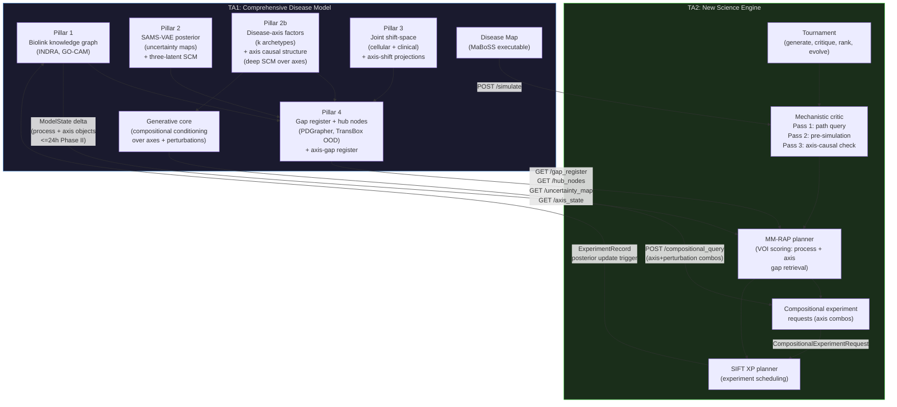
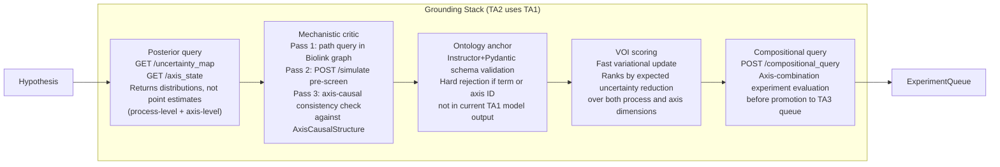

# TA1-to-TA2 Interface: ADHD-Friendly Companion

**Document type:** Internal brief; ADHD-friendly companion to `IFACE_TA1_TA2__full.md`
**Date:** 2026-06-14
**Profile:** Internal build only. SPEAR and factorized-PRS not discussed here; see firewall rules in Research Master sections 31-32.

---

> [!IMPORTANT]
> **BLUF (3 sentences):** The TA1-to-TA2 interface is a bidirectional, versioned, event-driven data contract: TA1 emits structured probabilistic outputs (uncertainty maps, gap registers, hub-node lists, disease-axis factors, and an axis-level causal structure) that TA2 queries as its primary retrieval corpus, and TA2 returns hypotheses, compositional experiment requests, and posterior update triggers that cause TA1 to update in near-real-time. Our recommended placement puts gap detection in TA1 Pillar 4 (extended to cover axis-causal gaps) and VOI-ranked prioritization plus compositional experiment design in TA2. This architecture, which we call MM-RAP (mechanistic-model-grounded retrieval-augmented planning), has no direct published precedent; the closest prior art is GRACE (arXiv:2602.15039, physics domain) and NIMMGen (arXiv:2602.18008), both of which lack calibrated uncertainty quantification, bidirectional update, and compositional query support.

---

## Section 1: The Problem in One Diagram

**Reading the diagram:** Data flows from TA1 to TA2 via five API calls, now including `GET /axis_state` (for disease-axis factor and axis-causal-structure posteriors) and `POST /compositional_query` (for multi-axis experiment evaluation). Data flows from TA2 to TA1 via the experiment record, the posterior update trigger, and the compositional experiment request that TA1 executes through its generative core. The loop closes when TA1 emits an updated ModelState delta including axis-level objects and TA2 revises its hypothesis queue.

---

## Section 2: What Flows Across the Boundary

### TA1 to TA2 (what the engine queries)

| Data object | What it is | Why TA2 needs it |
|---|---|---|
| `UncertaintyMap` | Posterior mean + credible interval per biological process (SAMS-VAE output) | Input to VOI calculation: which processes are most uncertain? |
| `DiseaseAxisSet` | k archetype factor vectors, each with posterior mean + variance | Input to axis-level VOI: which disease axes are most under-determined? |
| `AxisCausalStructure` | Deep SCM adjacency matrix over k axes; per-edge posterior probability + credible interval | Axis-causal consistency critic; axis-gap prioritization |
| `AxisGapRegister` | Ranked list of under-determined axes and axis-causal edges | Source of axis-targeting hypothesis generation |
| `KnowledgeGapRegister` | Coverage-weighted list of under-evidenced ontology subgraphs | Source of biological-process-level hypothesis generation targets |
| `InconsistencyRegister` | Pairs of contradictory mechanistic assertions (INDRA CoGEx) | High-value critic targets; experiments that resolve inconsistencies |
| `HubNodeList` | PDGrapher-ranked transcription factors and signaling nodes | Intervention targets for experiment design |
| `GhostEdgeList` | Hypothesized causal edges lacking experimental evidence | Experiments that confirm or refute specific edges |
| `POST /simulate` endpoint | MaBoSS pre-simulation API | Test-time hypothesis screening before committing to TA3 |
| `POST /compositional_query` endpoint | Generative core (compositional conditioning over axes + perturbations) | TA2 submits axis-combination experiments; TA1 returns predicted distributions |
| `ShiftSpaceSnapshot` | Pillar 3 cellular-to-clinical delta vectors | Context for disease-area targeting |
| `AxisShiftProjection` | Per-axis shift in cellular-clinical shift-space | Links genomic archetypes to observable phenotypes |

### TA2 to TA1 (what closes the loop)

| Data object | What it is | Why TA1 needs it |
|---|---|---|
| `HypothesisSet` | Ranked, ontology-aligned experiment proposals | Audit trail; drives TA3 protocol generation |
| `CompositionalExperimentRequest` | Axis-combination + perturbation-set request for the generative core | Enables axis-targeted experiments; TA1 evaluates compositionally |
| `ExperimentRecord` | Completed experiment data (from TA4) | Triggers Bayesian posterior update (process and axis levels) |
| Posterior update trigger | CloudEvents notification | Fires TA1 update pipeline; starts the latency clock |
| `VOIScoreTrace` | Per-hypothesis VOI calculation trace (process + axis terms) | Validates that TA2 used the TA1 model, not just literature |
| `CriticLog` | Mechanistic critic pass/fail record (all three passes) | IV&V evidence that critics are grounded in TA1 |

---

## Section 3: The Grounding Stack

**Five grounding mechanisms, in order of execution:**

1. **Posterior query.** Before generating hypotheses, the planner fetches the current `UncertaintyMap` and `AxisGapRegister`. The LLM is told which biological processes are most uncertain and which disease-axis factors or axis-causal edges are most under-determined; it proposes hypotheses from those distributions, not from its parametric memory.

2. **Mechanistic critic.** Each hypothesis gets three checks: (a) does a directed causal path exist in the Pillar 1 knowledge graph from the proposed perturbation to the proposed outcome? (b) does the MaBoSS pre-simulation produce an attractor shift in the expected direction? (c) for axis-targeting hypotheses, is the proposed discriminant consistent with the deep SCM's current posterior over axis-to-axis causal edges?

3. **Ontology anchor.** The Pydantic schema validator rejects any LLM output that references a GO term, MONDO identifier, CL cell type, hub node, or disease-axis identifier not present in the TA1 model's current output. Hard enforcement, not a soft prompt instruction. Extended to axis identifiers and compositional requests.

4. **VOI scoring.** Surviving hypotheses are scored by expected information gain, computed over both biological-process-level and axis-level posterior variance. Bottom-25% scorers go back to the tournament's evolve step.

5. **Compositional query.** Axis-targeting hypotheses are evaluated by `POST /compositional_query` before promotion to TA3. TA1's generative core returns predicted distributions over the combined axis-perturbation conditions; TA2 uses these to refine the VOI estimate and confirm the experiment is discriminating.

> [!NOTE]
> The ontology anchor (step 3) is the primary mechanism by which LLM hallucination is suppressed. If the model cannot name it, the agent cannot propose it. This now applies to disease-axis identifiers as well as biological ontology terms.

---

## Section 4: The Knowledge-Gap Boundary Question

> [!CAUTION]
> ARPA-H explicitly states this boundary "is an open question and expects that it will be refined during the program." Do not over-specify it in the proposal. State a position and justify it; do not claim it is final.

### Three options

| Option | Gap detection in | Gap prioritization in | Verdict |
|---|---|---|---|
| **A (our recommendation)** | TA1 Pillar 4 (algorithmic, from coverage map + OOD layer + axis-causal posteriors) | TA2 (VOI scoring over process + axis dimensions + experiment specification including compositional requests) | Clean division; mechanistic content stays in TA1 |
| B | TA2 (LLM-based abductive reasoning over raw parameters) | TA2 | Reintroduces LLM-wrapper problem for gap detection |
| C | Joint microservice (consumed by both TA1 and TA2) | TA2 | Added complexity; risky for Phase I walking skeleton |

### Our position (use verbatim in the proposal)

> "We place knowledge-gap identification in TA1 Pillar 4, which computes coverage-weighted gap registers from the mechanistic network, ontology-conditioned uncertainty layer, and the disease-axis causal structure. TA2 retrieves these registers and applies VOI prioritization and experiment specification, including compositional axis-targeting requests, maintaining a clean division: mechanistic reasoning in TA1, experimental planning in TA2. We expect this boundary to be refined in the Phase I Domain-Driven Design workshop."

---

## Section 5: How This Differs from GraphRAG and CausalRAG

| Property | GraphRAG | CausalRAG | **MM-RAP (ours)** |
|---|---|---|---|
| What is retrieved | Text-extracted entities and relations | Text-extracted causal triples | Posterior distributions over causal mechanism parameters, disease-axis factors, and axis causal structure |
| Edge source | LLM parsing of paper sentences | LLM parsing of paper sentences | Mechanistic model inference from multi-scale experimental + genomic data; axis-to-axis edges from deep SCM |
| Edge uncertainty | None; binary presence | None; binary presence | Posterior probability + credible interval (IWELBO); axis edges from deep SCM posterior |
| Updates from experiments | Batch re-index | Batch re-index | Event-driven Bayesian update, <=24h latency (Phase II); axis SCM updates on axis-targeted experiments |
| Constraint checking | None | None | Structural (path query) + quantitative (MaBoSS) + axis-causal (deep SCM check) |
| Compositional queries | None | None | Multi-axis + perturbation combos via `POST /compositional_query` |
| Hallucination suppression | None (soft prompting) | None (soft prompting) | Hard ontology anchor via Pydantic, extended to axis identifiers |

**One-line summary:** GraphRAG and CausalRAG retrieve from text. MM-RAP retrieves from a running mechanistic model with calibrated uncertainty, a disease-axis factorization, and an axis causal structure, and it can submit compositional multi-axis experiments back to the model for evaluation.

---

## Section 6: Phase-by-Phase Milestones for the Interface

| Phase | TA1 must deliver | TA2 must deliver | Gate |
|---|---|---|---|
| **Phase I (18 mo)** | `GET /gap_register`, `GET /hub_nodes`, `GET /axis_state` (k<=4 axes) APIs; Disease Map containerized; `POST /simulate` <60s; initial `DiseaseAxisSet` + `AxisCausalStructure` with uncertainty; `CompositionalExperimentRequest` schema defined | Tournament prototype; three-pass mechanistic critic; >=3 experiments proposed (at least 1 axis-targeting); initial compositional query schema | Walking skeleton: >=1 complete closed loop; axis-level interface objects documented; IV&V-accessible |
| **Phase II (18 mo)** | Full `GET /uncertainty_map`; ghost-edge list; `POST /compositional_query` operational (pairwise axes); axis-shift projections; update latency <=24h (process + axis) | Full VOI scoring over process + axis; compositional experiment requests; quantitative + axis-causal critics; 2+ model backends | >=4x cycle-time; >=70% expert high-value rate; compositional axis queries demonstrated |
| **Phase III (24 mo)** | Bipolar extension ModelState including bipolar-specific axis set; latency <=4h | Bipolar extension; axis-gap prioritization for bipolar; >=85% expert high-value rate; >=20 users | Full integration; all artifacts open-access |

---

## Section 7: Open Gaps and Recommended Actions

> [!WARNING]
> These are the interface gaps that must be addressed in Phase I. Failure to address Gap 1 before the DDD workshop will block the walking skeleton milestone.

| Gap | Severity | Recommended action |
|---|---|---|
| **Gap 1:** LinkML schema for `TA1ModelState`, `KnowledgeGapRegister`, `UncertaintyMap`, `DiseaseAxisSet`, `AxisCausalStructure`, `AxisGapRegister`, `CompositionalExperimentRequest` not yet formalized | High | Phase I DDD workshop primary deliverable; drive schema backward from SIFT XP input requirements; axis objects are new additions from the RM revision |
| **Gap 2:** `POST /simulate` latency unvalidated (target <60s for 22q11DS map) | High | Month 3 benchmark: run TBX1/COMT/DGCR8 subgraph through CaSQ + SBML-qual + MaBoSS with 1,000 trajectories; if slow, implement attractor cache |
| **Gap 3:** Partial-update protocol for delta-only ModelState changes not specified | Medium | Add `ChangedProcessSet` object to ModelState versioning; include axis-level delta objects; TA2 updates only hypotheses referencing changed processes or axes |
| **Gap 4:** Structural critic over-rejects hypotheses in sparse graph regions | Medium | Add coverage-level flag: "speculative but feasible" for paths traversing low-coverage subgraphs; route to human review queue |
| **Gap 5:** VOI score alone is not interpretable for researchers | Low | Add 2-sentence provenance statement per hypothesis: which process or axis gap it addresses, which model inconsistency or axis-causal edge it resolves, and what its rank is |
| **Gap 6:** `POST /compositional_query` latency and Phase I scope unvalidated | Medium | Month 6 benchmark: pairwise axis compositional queries over Phase I axis set (k=2-3); target <30s; if slow, cache pre-computed axis-combination predictions for Phase I |

---

## Section 8: Prior Art Landscape (One-Line Per System)

| System | Year | Status vs. MM-RAP |
|---|---|---|
| GraphRAG (Edge et al.) | 2024 | Text-graph only; no mechanistic model; no axis structure |
| CausalRAG (Wang et al., ACL 2025) | 2025 | Text-extracted causal triples; no uncertainty; no update; no compositional queries |
| Co-Scientist (Gottweis et al.) | 2026 | Tournament pattern we adopt; literature only, no mechanistic model or axis structure |
| NIMMGen (Guan et al., arXiv:2602.18008) | 2026 | Closest precedent; generates models de novo rather than querying a pre-built model; no VOI; no axis factorization |
| GRACE (arXiv:2602.15039) | 2026 | Simulation-grounded agent in physics; no uncertainty quantification; no axis structure; not biological |
| Stanford Virtual Lab (Swanson et al.) | 2025 | AlphaFold as a tool; partial precedent for calling a model, not querying its uncertainty or axis structure |
| BATCHIE (Nature Comm.) | 2025 | Bayesian active learning for drug combos; no LLM hypothesis engine; no axis factorization |
| Agentic Sci. Sim. (arXiv:2603.00214) | 2026 | Formalism for interpret-act-validate loop; model construction focus, not model-grounded planning or compositional queries |

**Positioning sentence for the proposal:** "GRACE (arXiv:2602.15039) is the closest precedent for simulation-grounded agentic design; our architecture extends its interpret-act-validate loop to a biological disease model with calibrated Bayesian uncertainty, a disease-axis factorization with an inferred axis causal structure, compositional multi-axis experiment requests, and a bidirectional Bayesian update channel, operating in a domain where both the biological causal law structure and the disease-axis causal structure must be inferred from data rather than specified from first principles."

---

## Section 9: Verification Checklist Before Submission

- [ ] Confirm ICML acceptance status of Guan et al. arXiv:2602.18008 (NIMMGen).
- [ ] Confirm GRACE arXiv:2602.15039 peer-review venue (currently preprint).
- [ ] Confirm Agentic Scientific Simulation arXiv:2603.00214 peer-review venue.
- [ ] Verify final DOI for Gottweis et al. (Co-Scientist) Nature 2026.
- [ ] Verify final DOI for Swanson et al. (Virtual Lab) Nature 2025.
- [ ] Verify final DOI for San et al. (digital twins) Nature Computational Science 2026.
- [ ] Verify Goldman, Trivedi, Bryce AAAI Fall Symposium year and proceedings citation.
- [ ] Verify Kuter, Goldman, Bryce, Beal XP 2018 full conference citation.
- [ ] Confirm MaBoSS runtime benchmark for 22q11DS subgraph (Month 3 Phase I task).
- [ ] Confirm compositional query latency benchmark for pairwise axis set (Month 6 Phase I task).
- [ ] Confirm LinkML schema formalization (including axis objects) is scoped as a Phase I DDD workshop output.
- [ ] Confirm `AxisCausalStructure` and `AxisGapRegister` schema types are added to the Phase I schema sprint.
