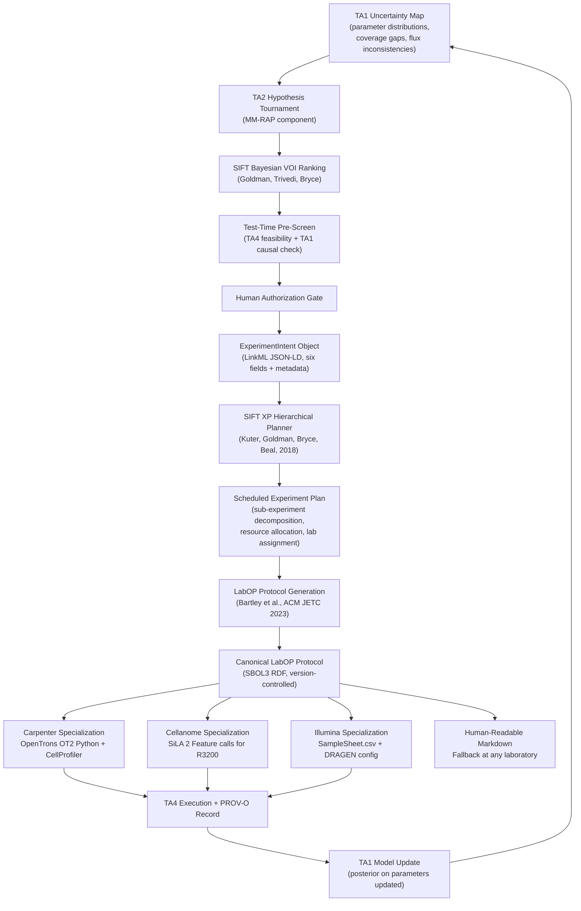
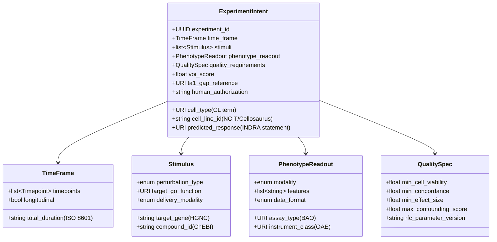

# TA2-to-TA3 Interface: ADHD-Friendly Companion

**Document class:** Internal. Companion to `IFACE_TA2_TA3__full.md`. Do not distribute.
**Prepared:** 2026-06-14
**Reading time:** approximately 8 minutes.
**If you read one thing:** the experiment-intent object (Section 2) and the pipeline diagram (Section 3).

---

## BLUF

The TA2-to-TA3 interface is the most critical seam in the IGoR program. TA2 must emit a structured **experiment-intent object** with six required fields. SIFT's planning stack converts that object into a scheduled experiment plan, then compiles it to a LabOP protocol. The recommended interface format is a **LinkML schema serialized as JSON-LD**, grounded to Cell Ontology, Gene Ontology, MONDO, and SBOL3. Key gaps: no LabOP primitives for iPSC and live-cell imaging workflows; no Cellanome R3200 SiLA interface documentation; VOI likelihood models not yet calibrated for mammalian modalities. All three gaps are fundable Phase I deliverables. Ratify the schema at the Phase I Domain-Driven Design workshop.

---

## 1. Why This Interface Is the Program's Critical Seam

- The Phase I **walking-skeleton milestone** requires a demonstrable closed loop: TA2 proposes, TA3 generates a protocol, TA4 executes, data return to TA1.
- Without a machine-readable interface contract, this loop cannot be automated.
- Without automation, the 10x cycle-time target is unreachable.
- The interface is also where **ARPA-H scores** the proposal: a precise TA2-to-TA3 handoff is explicitly rewarded by the solicitation.

> [!IMPORTANT]
> The Phase I Domain-Driven Design workshop (Month 3) is the ratification deadline. The interface schema must exist as a draft before the workshop, not after.

---

## 2. The Experiment-Intent Object: Six Required Fields

Appendix A, TA2 Objective 1, names five required fields; the team adds a sixth (quality requirements) to match the TA3 calibration layer.

| Field | Content | Ontology grounding |
|---|---|---|
| **Cell type** | Cell type or line; differentiation state if applicable | Cell Ontology (CL); CZ CELLxGENE conformant |
| **Time frame** | Total duration; timepoints for measurement and perturbation | ISO 8601; disease-progression schema (Section 35) |
| **Stimuli** | Perturbation type and target: CRISPR KO, compound, optogenetic | Gene Ontology Molecular Function; ChEBI for compounds |
| **Response** | Expected downstream biological response (directional causal statement) | INDRA statement format; linked to TA1 causal graph edge |
| **Phenotype** | Readout modality; specific measurable features | BioAssay Ontology (BAO); Human Phenotype Ontology (HPO) |
| **Quality requirements** | Cell viability threshold; concordance floor; signal-to-noise floor | OBI; TA3 RFC parameter version |

Additional metadata carried in every intent object:

- `experiment_id` -- UUID; links to TA2 tournament record
- `voi_score` -- Bayesian VOI estimate (Goldman, Trivedi, Bryce, AAAI Fall Symp.)
- `ta1_gap_reference` -- URI of the TA1 uncertainty map entry that motivated this design
- `human_authorization` -- timestamp and researcher identifier; **required before TA3 ingestion**

> [!CAUTION]
> Every field with an ontology binding must use a resolvable URI. Free-text descriptions are not accepted. This is an automated pipeline, not a form.

---

## 3. The Design-to-Plan-to-Protocol Pipeline

**Three stages, three owners:**

| Stage | Input | Owner | Output |
|---|---|---|---|
| 1. VOI ranking and selection | TA1 uncertainty map; TA4 capability manifests | Cytognosis (MM-RAP) + SIFT (VOI model) | Ranked ExperimentIntent objects |
| 2. Hierarchical experiment plan compilation | ExperimentIntent objects; lab schedules | SIFT XP planner | Scheduled plan: sub-experiments, resources, lab assignments |
| 3. LabOP protocol generation and specialization | SIFT XP plan | SIFT TA3 (LabOP) | Canonical LabOP Protocol + per-lab specializations |

---

## 4. The Experiment-Intent Schema

**Format recommendation:** LinkML schema, serialized as JSON-LD. Rationale:

- Bidirectional: generates Python dataclasses, validators, and JSON-LD contexts from one schema file.
- Ontology binding enforced at schema level (not just a link, a constraint).
- RDF-compatible: JSON-LD output is importable into SBOL3 protocol repository without conversion.
- NCATS-maintained, production-ready tooling (`linkml-runtime`, pip-installable).

---

## 5. What Is Automatable Now vs. Needs Work

### Automatable now (existing tooling)

- TA2 VOI ranking using SIFT Bayesian VOI model
- ExperimentIntent validation using `linkml-runtime` (once schema is defined)
- SBOL3 serialization of the intent object (`sbol3` Python library, stable)
- LabOP Protocol generation from a plan (`labop` Python library, pip-installable)
- Specialization to OpenTrons OT2 (existing `labop` OT2 specializer)
- Specialization to human-readable Markdown (existing `labop` Markdown specializer)
- PROV-O execution record generation (native `labop` output)

### Needs new development (Phase I deliverables, not research challenges)

| Gap | Who builds it | Phase I timing |
|---|---|---|
| LabOP primitives for iPSC differentiation | SIFT + Carpenter + Cellanome (SOP knowledge) | Month 12 |
| LabOP primitives for live-cell longitudinal imaging | SIFT + Cellanome | Month 12 |
| LabOP primitives for Perturb-LINK library preparation | SIFT + Cellanome | Month 12 |
| LabOP primitives for optical pooled CRISPR screening | SIFT + Carpenter | Month 12-18 |
| LabOP SiLA/R3200 specializer | SIFT (after Cellanome SiLA FD is documented) | Month 6-12 |
| SIFT XP plan format as a shared LinkML schema | SIFT + Cytognosis | DDD workshop, Month 3 |
| VOI likelihood models for mammalian modalities | SIFT + Cytognosis | Month 18 (validation) |
| TA4 capability manifest schema | SIFT + TA4 labs | Month 6 |
| Multi-lab parallel plan branching | SIFT | Month 12 |

### Unclear (requires investigation before Phase I Month 6)

| Uncertainty | What needs to happen |
|---|---|
| **Cellanome R3200 SiLA interface** (no public documentation) | NDA-gated technical exchange; named Phase I dependency with go/no-go |
| **TA1 Pillar 4 hub-selector API** (architecturally described but not implemented) | Phase I software deliverable with defined JSON-LD output schema |
| **VOI score calibration across modalities** | Phase I anchor experiment Spearman r test (target r >= 0.4) |
| **Exception-handling workflow** (forward path defined; backward path not) | Define at DDD workshop; links to TA4 exception-reduction milestones |

---

## 6. Interface Contracts: What Each Side Commits To

### TA2 guarantees (when emitting an ExperimentIntent object)

1. Every field traces to a specific TA1 uncertainty entry (`ta1_gap_reference` slot populated).
2. `voi_score` is populated; proposal has passed Bayesian VOI ranking.
3. TA4 feasibility has been pre-checked; at least one TA4 lab can execute the proposed experiment.
4. All term bindings are resolvable URIs (no free text in ontology-bound slots).
5. `human_authorization` timestamp is present; a named researcher has approved the submission.

### TA3 guarantees (when receiving a conformant ExperimentIntent object)

1. Plan generated within one business day (Phase I target).
2. LabOP Protocol generated within one business day of plan acceptance.
3. All parameter values drawn from the current RFC-governed parameter set.
4. PROV-O execution record returned with data, linked to canonical LabOP Protocol SBOL3 URI.
5. Same canonical Protocol object used for all laboratory specializations (one canonical source, multiple backends).

---

## 7. Phase Alignment

| Phase | Interface deliverable | Gate criterion |
|---|---|---|
| **Phase I** (18 mo) | Ratified LinkML ExperimentIntent schema v1.0; TA2 validator and TA3 parser generated from schema; pipeline demonstrated on Phase I anchor experiment | At least 1 intent object compiled to LabOP Protocol; executed at 2 TA4 labs from the same canonical source; intra-team concordance >=80% |
| **Phase II** (18 mo) | Schema extended to >=3 modalities; XP plan format formalized; VOI likelihood models validated (Spearman r >=0.4 on first 10 experiments) | At least 3 intent objects per cycle compiled and executed at >=3 labs; RFC-governed parameter changes in schema version log |
| **Phase III** (24 mo) | ExperimentIntent schema published as Bioprotocols Working Group proposal | Schema adopted by at least one external team; connect-a-thon uses the same intent format |

---

## 8. Key Gaps Summary (Priority Order)

> [!WARNING]
> Gaps 1 through 4 must be addressed in Phase I Months 1 through 6 or the walking-skeleton milestone is at risk.

| Priority | Gap | Owner | Target |
|---|---|---|---|
| 1 | ExperimentIntent schema not formalized | Cytognosis + SIFT | DDD workshop, Month 3 |
| 2 | SIFT XP plan format not a shared schema | SIFT | DDD workshop, Month 3 |
| 3 | Cellanome R3200 SiLA Feature Definition unavailable | SIFT + Cellanome | NDA exchange, Month 2 |
| 4 | TA1 Pillar 4 hub-selector API not implemented | Cytognosis | Software deliverable, Month 6 |
| 5 | No LabOP primitives for iPSC, imaging, Perturb-LINK | SIFT + Carpenter + Cellanome | New primitive libraries, Month 12 |
| 6 | VOI likelihood models for mammalian modalities | SIFT + Cytognosis | Validation experiment, Month 18 |
| 7 | TA4 capability manifest format undefined | SIFT + TA4 labs | Lightweight schema, Month 6 |
| 8 | Exception-handling workflow not specified | Cytognosis + SIFT | DDD workshop, Month 3 |

---

## References (abbreviated; full list in the full document)

- Bartley et al. *ACM JETC* 19(3), 2023. doi:10.1145/3604568. [LabOP canonical reference]
- Bryce et al. *ACS Synthetic Biology*, 2022. doi:10.1021/acssynbio.1c00305. [Round Trip pipeline]
- Goldman, Trivedi, Bryce et al. AAAI Fall Symposium. [Bayesian VOI model; year to verify]
- Kuter, Goldman, Bryce, Beal. 2018. [XP hierarchical planner; conference to verify]
- LinkML: https://linkml.io (NCATS/open community; Moxon et al., 2021)
- ARPA-H. IGoR Appendix A, ARPA-H-SOL-26-155. 2026.

**Internal cross-references:**
- `IFACE_TA2_TA3__full.md` -- full analysis, schema, and gap table
- `TA2_science_engine__full.md` -- TA2 engine architecture
- `TA3_protocols__full.md` -- LabOP architecture and four-layer stack
- `SIFT_capabilities_analysis.md` -- SIFT planning and VOI capabilities
