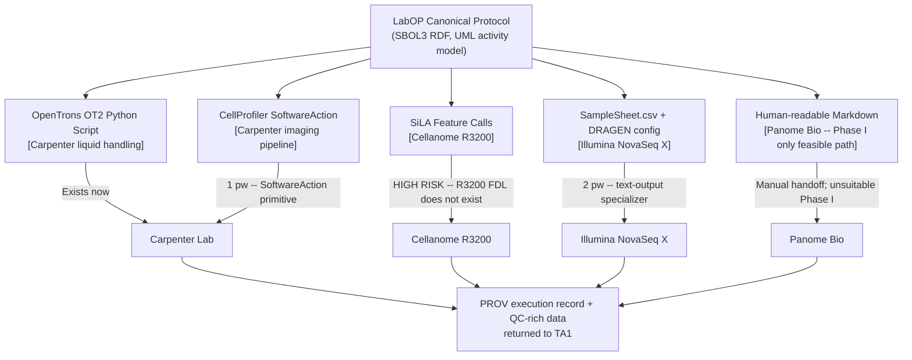

# TA3-to-TA4 Interface: ADHD-Friendly Brief

**Document type:** Internal companion brief, IGoR proposal series
**Compiled:** 2026-06-14
**Reading time:** ~8 minutes
**If you read one thing:** The R3200 SiLA Feature Definition is the single highest-risk item in the entire TA3-to-TA4 interface. Everything else is tractable.

> [!NOTE]
> **Internal only.** Paired with `IFACE_TA3_TA4__full.md`. Citations are inherited from the full document.

---

## BLUF

- LabOP can encode Carpenter today. Illumina needs 6 person-weeks of work. Cellanome needs ~11 person-weeks plus a Cellanome-disclosed SiLA Feature Definition that does not yet exist. Panome is unclear at the hardware layer and unsuitable for Phase I.
- The interface has two required deliverables not yet defined: a capability manifest schema and per-lab calibration artifact definitions. Both are Phase I obligations.
- The NDA with Cellanome must close in Phase I Month 1. The SiLA Feature Definition must be drafted by Phase I Month 6. Everything else follows.

---

## What the Interface Is

TA3 sends a hardware-specialized protocol to each TA4 lab. The lab executes it and sends back data plus a provenance record. Two things must exist before either direction works:

1. **Capability manifests** -- machine-readable declarations of what each lab can execute, which instruments are calibrated, and what their QC history looks like.
2. **Calibration artifacts** -- reference materials and measurement datasets that establish instrument equivalence across labs (required by Appendix A, Section 4.1.3 and Table 1, Phase I, TA4).

Neither of these exists as an open standard today. Both are Phase I deliverables.

---

## The Specialization Fan-Out

The diagram below shows how a single LabOP canonical protocol compiles to four hardware-specific targets. The dotted lines indicate paths that require new work.

---

## Onboarding and Calibration Flow

This diagram shows how a new TA4 laboratory enters the marketplace. The critical gating steps are the NDA (Cellanome) and the IV&V artifact validation.

```mermaid
flowchart LR
    START["New TA4 Lab\ninterest declared"]

    START --> NDA["NDA / teaming agreement\nfinalized"]
    NDA --> MANIFEST["Lab populates capability manifest\n(LinkML schema, Phase I deliverable)"]
    MANIFEST --> CALIB["Lab runs IV&V calibration artifacts\n(reference samples + measurement datasets)"]
    CALIB --> IVVREVIEW["IV&V partner reviews\ncalibration data"]
    IVVREVIEW -->|"Pass"| QUALIFIED["Lab qualified as TA4\nmarketplace participant"]
    IVVREVIEW -->|"Fail"| REMEDIATE["Lab remediates instrument\nor protocol issue; re-runs artifact"]
    REMEDIATE --> IVVREVIEW

    QUALIFIED --> LABOP_SPEC["SIFT generates LabOP-specialized\nprotocol for lab's hardware"]
    LABOP_SPEC --> EXECUTE["Lab executes protocol;\nreturns data + PROV record"]
    EXECUTE --> CONCORDANCE["Concordance check\nagainst second TA4 lab\n(>= 80% Phase I)"]
    CONCORDANCE -->|"Pass"| FULLOP["Full marketplace operation"]
    CONCORDANCE -->|"Fail"| RFC["RFC process: parameter\nreview and adjustment"]
    RFC --> EXECUTE
```

---

## Per-Candidate Encodability Matrix

**Legend:** Now = works with existing LabOP primitives. Work = new primitive or specializer required; tractable. Unclear = depends on undisclosed information or structural incompatibility.

| Layer | Carpenter / Broad | Cellanome R3200 | Illumina BioInsight | Panome Bio |
|---|---|---|---|---|
| Intent | **Now** | **Now** | **Now** | **Now** |
| Protocol: liquid handling | **Now** | **Now** | **Now** | Work (Centrifuge) |
| Protocol: modality-specific | Work (~2 pw ISS imaging) | Work (~11 pw total; CCE loading, time-lapse, RNA capture) | Work (~4 pw; droplet encapsulation, library indexing) | **Unclear** (LC/MS instrument platform unknown) |
| Calibration: open references | **Now** (JUMP-CP, LUDOX) | Work (no R3200 standard; define with Cellanome) | **Now** (PhiX, ERCC, GIAB) | **Now** (NIST SRM 1950) |
| Calibration: IV&V artifact | Work (~1 pw fluorescence bead) | **Unclear** (CCE efficiency, AI morphotyping concordance undefined) | **Now** (PhiX protocol directly usable) | **Unclear** (pipeline params proprietary) |
| Hardware specializer | Work (~1 pw CellProfiler; OT2 exists) | **Unclear / Risk** (R3200 SiLA FDL missing; highest-risk item) | Work (~2 pw SampleSheet specializer) | **Unclear / Risk** (no public API; CRO model incompatible) |

**pw = person-weeks.**

---

## Verdicts at a Glance

| Candidate | Verdict | Primary risk | Phase I status |
|---|---|---|---|
| Carpenter / Broad | Strong | Low | Ready; walking skeleton achievable Month 3 |
| Cellanome R3200 | Conditional | R3200 SiLA Feature Definition | Conditional; NDA + tech exchange must close Month 1-3 |
| Illumina BioInsight | Good | Low | Ready; walking skeleton achievable Month 4-6 |
| Panome Bio | Partial | CRO service model; no API | Not Phase I core; Phase II optional with manual handoff |

---

## Phase I Work Required

### New LabOP primitives needed

| Primitive | For | Effort | Priority |
|---|---|---|---|
| `CyclicImagingStep` | Carpenter ISS imaging cycles | 2 pw | P1 |
| `SoftwareAction` | Carpenter CellProfiler invocation | 1 pw | P1 |
| `LoadCellCage` | Cellanome R3200 CCE loading | 3 pw | P1 |
| `AcquireTimeLapseImage` | Cellanome R3200 time-lapse imaging | 3 pw | P1 |
| `CCEDelivery` | Cellanome R3200 reagent delivery | 2 pw | P1 |
| `FluorescenceCalibration` | Imaging channel calibration | 1 pw | P1 |
| `DropletEncapsulation` | Illumina single-cell GEM step | 2 pw | P2 |
| `LibraryIndexing` | Illumina library indexing | 2 pw | P2 |

**Phase I total (P1 only): 12 person-weeks. Phase I+II total: 16 person-weeks.** Assignable to SIFT as TA3 lead; Cellanome primitives require Cellanome technical input under NDA.

### R3200 SiLA Feature Definition

> [!IMPORTANT]
> This is the single highest-risk deliverable in the TA3-to-TA4 interface. Without it, Cellanome cannot be targeted by LabOP's hardware specializer, and the Phase I walking skeleton for the Cellanome lane cannot be demonstrated.

The Feature Definition must cover: `LoadCellCage`, `StartImagingSession`, `DeliverReagent`, `EndSessionAndCapture`, and `ExportData`. Co-authored by SIFT (SiLA expertise) and Cellanome (R3200 control interface). Submit to SiLA Consortium as a new multi-modal integrated platform Feature Definition.

**Gate:** Cellanome NDA finalized. Target: Phase I Month 1.
**Draft deadline:** Phase I Month 6.
**Submission to SiLA Consortium:** Phase I Month 9.

### Capability manifest schema

A LinkML schema defining what each TA4 lab declares about its instruments, modalities, QC history, and throughput. Phase I deliverable: schema defined and validated against Carpenter and Cellanome manifests. Estimated effort: 3 person-weeks (SIFT + Cytognosis).

### Calibration artifact definitions

| Lab | Artifact | Effort | Gate |
|---|---|---|---|
| Carpenter | JUMP-CP reference plate + fluorescence bead calibration | 2 pw | JUMP-CP dataset open |
| Cellanome | CCE loading efficiency reference + ERCC spike-in RNA capture reference | 3 pw | Requires Cellanome cooperation + NDA |
| Illumina | PhiX Control v3 run specification | 1 pw | Open; no gate |
| Panome (Phase II) | NIST SRM 1950 panel + LIPID MAPS standards | 1 pw | Open; Phase II timing |

---

## Milestone Alignment

| Phase | TA3-to-TA4 Milestone | Key deliverable |
|---|---|---|
| Phase I Month 1-3 | Cellanome NDA closed; R3200 SiLA FDL scoped | NDA; technical disclosure kickoff |
| Phase I Month 3-6 | Carpenter fully encoded; capability manifest schema v0.1 | OT2 + CellProfiler primitives; manifest schema |
| Phase I Month 6-12 | R3200 SiLA FDL v1.0; Cellanome primitives complete; IV&V artifacts defined | SiLA FDL; Cellanome primitive library; calibration artifact set |
| Phase I Month 12-18 | Walking skeleton: Carpenter + Cellanome executing same LabOP protocol; 80% concordance | Closed-loop demonstration on 22q11.2 variant lines |
| Phase II | Illumina specializer; RFC process operational; cross-team at 3 labs | SampleSheet specializer; Illumina primitives; >=2 RFCs |
| Phase III | Full marketplace; capability manifests public; connect-a-thon | All labs queryable; Panome optional |

---

## Risk Register (Top Items)

> [!WARNING]
> **Cellanome API undisclosed.** If Cellanome declines to share the R3200 control interface, the hardware specializer cannot be built in Phase I. Fallback: human-readable Markdown specialization for Phase I bake-off, automated path in Phase II. Frame SiLA FDL co-authorship as a standards-visibility benefit for Cellanome.

> [!WARNING]
> **Panome CRO model incompatibility.** Panome's service-CRO intake (email/portal submission, not machine-to-machine) is structurally incompatible with automated TA3 protocol delivery. Do not include Panome in Phase I concordance metrics. Scope Phase II engagement as manual specialist handoff.

> [!CAUTION]
> **Sub-performer overlap rule.** If a second IGoR team selects Carpenter or Illumina as a TA4 performer, ARPA-H may fund overlapping work only once. Name backup labs in the proposal: Purdue/IPAI imaging core (morphological backup); additional sequencing CRO (Illumina backup).

> [!CAUTION]
> **Phase II cross-team concordance threshold is 85%, not 80%.** The Appendix A Table 1 milestone reads "85% concordance" for cross-team Phase II execution (the markdown summary read 80% for Phase I intra-team). Design calibration artifact tolerance intervals to support both thresholds from the start.

---

## Key Findings Summary

1. **Carpenter is ready now.** OpenTrons OT2 specializer exists; only CellProfiler SoftwareAction primitive and fluorescence calibration primitive are missing (2 pw).

2. **Cellanome is high-risk at the hardware layer.** The R3200 SiLA Feature Definition does not exist publicly. This is the single most important Phase I dependency. NDA close in Month 1 is the gate.

3. **Illumina is low-risk, modest work.** SampleSheet specializer and two new library-prep primitives are the only gaps. No proprietary API dependency.

4. **Panome is structurally incompatible with automated Phase I protocol delivery.** Treat as Phase II optional with manual specialist handoff. Do not include in Phase I concordance metric.

5. **The capability manifest schema is a novel open-standards deliverable.** No existing format exists. LinkML is the right serialization. This satisfies TA3 Objective 2 (standards development).

6. **Calibration artifacts are best-defined for Illumina (all open references), weakest for Cellanome** (no published IV&V standard; requires co-development with Cellanome under NDA).

7. **Total Phase I primitive development effort: 12-16 person-weeks.** Assignable to SIFT as TA3 lead. Cellanome-specific primitives require Cellanome technical knowledge transfer.

8. **The walking skeleton deadline is Phase I Month 12-18.** The Cellanome SiLA FDL and primitive development must close by Month 12 for the closed-loop demonstration to be achievable within the Phase I gate.

---

*Paired with `IFACE_TA3_TA4__full.md`. Internal only. 2026-06-14.*
