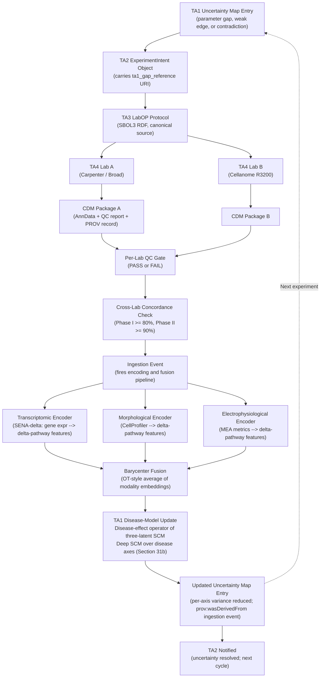
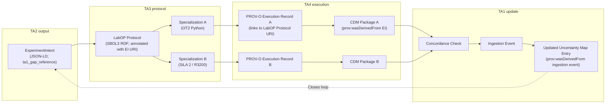

> [!WARNING]
> **Readout correction (2026-06-14):** the functional neuronal readout is **single-cell calcium imaging** (scalable, single-cell), not MEA. Calcium imaging is an optical/imaging modality covered by Cellanome's live-cell fluorescence imaging and high-content imaging, so **there is no electrophysiology-lab gap** and MEA is not required. Treat the 'MEA / electrophysiology gap' analysis below as superseded; the detailed MEA schema (formats, QC, encoders) is to be reworked to calcium imaging in the full-proposal build.

# TA4-to-TA1 Interface: Data Return and Model Update Loop (Brief)

**Document type:** ADHD-friendly companion to `IFACE_TA4_TA1__full.md`
**Compiled:** 2026-06-14
**Reading time:** 10 minutes
**If you read one section:** read the BLUF and Section 1 (data flow overview, including the encoding and fusion pipeline)

---

## BLUF

The TA4-to-TA1 interface is where validated experimental data closes the IGoR loop. Two experimental arms feed data into this interface: the **academic arm** (Matt Tegtmeyer lab, Purdue; Element AVITI24 / Teton CytoProfiling; fixed-cell in-situ RNA + protein/phospho + Cell-Painting-style morphology + CRISPR-guide DISS) and the **industry arm** (Cellanome R3200 + Perturb-LINK; live-cell temporal). **Anne Carpenter's computational morphology/imaging models** (no wet-lab bench) consume the morphological readouts from both arms and feed into TA1. Every data return from a TA4 laboratory must carry a provenance record linking it back to the TA1 uncertainty entry that motivated the experiment. Returned modalities (transcriptomic, morphological, electrophysiological) are each encoded by a **modality-specific encoder** into **delta-pathway features** (pathway activity shifts, not gene shifts), then fused via a **barycenter** (optimal-transport-style average) into a single multimodal representation that updates the **disease-effect operator** of the three-latent SCM and refines the **deep structural causal model over disease axes**. Seven Phase I engineering deliverables are required: a CDM schema, modality-specific QC modules, a concordance checker, a Bayesian update API, and three new components: the morphological pathway encoder, the electrophysiological pathway encoder, and the barycenter fusion module. The 24-hour Phase II latency target is comfortably achievable; the 4-hour Phase III target requires GPU-accelerated QC and precompiled posterior-update kernels. SIFT's Round Trip pipeline provides reusable architecture principles but its QC algorithms and biological model class are synthetic-biology-specific.

---

## 1. How the Loop Closes: Data Flow Overview

> [!IMPORTANT]
> The `ta1_gap_reference` URI is the critical closure element. Without it, automated routing of data to the correct model-update target is impossible.

> [!NOTE]
> **Delta-pathway featurization is the key uniformity step.** All modality-specific encoders output delta-pathway features (shifts in GO biological process pathway activity, not delta genes). This puts transcriptomic, morphological, and electrophysiological returns in the same coordinate system before barycenter fusion -- making heterogeneous TA4 returns directly comparable and jointly ingestible without a separate harmonization model.

---

## 2. The Data-Return Package: What TA4 Must Send

Every CDM package has four required components:

| Component | Format | Key content |
|---|---|---|
| **Data payload** | Modality-specific (see below) | Assay type, instrument ID, cell type (CL term), perturbation (HGNC or ChEMBL ID) |
| **QC report** | JSON-LD (LinkML schema) | Per-metric PASS/FAIL/WARNING flags, viability score, concordance pre-check |
| **Provenance record** | PROV-O RDF | Lab ID, timestamps, instrument serial, reagent lots, lineage link to LabOP Protocol SBOL3 URI |
| **Uncertainty reference** | URI | `ta1_gap_reference`: points to the TA1 uncertainty map entry that motivated the experiment |

**Modality-specific data formats (2026-06-17 updated):**

| Modality | Source / Arm | CDM target format |
|---|---|---|
| Transcriptomic + CRISPR-guide (in-situ) | Element AVITI24 / Teton (academic arm, Matt Tegtmeyer lab) | AnnData `.h5ad`; CZ CELLxGENE schema v5.0.0 conformant |
| Transcriptomic + CRISPR-guide (same-cell) | Cellanome R3200 / Perturb-LINK (industry arm) | AnnData `.h5ad`; CZ CELLxGENE schema v5.0.0 conformant |
| Transcriptomic (perturbation-scale) | Illumina DRAGEN (Lab 3) | AnnData `.h5ad` via scanpy `read_10x_h5` |
| Morphological (Cell-Painting-style in-situ) | Element AVITI24 (academic arm); analyzed by Anne Carpenter's computational models | Parquet feature matrix; feeds Anne's morphological pathway encoder |
| Morphological (Cell Painting; CellProfiler) | Carpenter CellProfiler CSV + TIFF stacks (computational) | Parquet feature matrix; TIFF stacks linked by URI (not embedded) |
| Live-cell imaging (AI morphotyping) | Cellanome AI morphotyping (industry arm) | Dense embedding matrix + Cellanome model schema version (provenance dependency) |
| Electrophysiological (MEA) | Axion Maestro HDF5 | Extracted spike-train statistics JSON; raw traces linked by URI |
| Calcium imaging proxy | Cellanome fluorescence timeseries (industry arm) | Calcium event statistics JSON; raw timeseries linked by URI |

> [!NOTE]
> **Streaming vs. final package distinction.** Multi-day Cellanome runs emit streaming QC updates during the run (update TA3 monitoring dashboard only) and one final CDM package at end of run (triggers TA1 model update). Only the final package fires the Bayesian update trigger.

---

## 3. The Provenance Chain: Closing the SBOL3-PROV-O Loop

**Required PROV-O triples per execution record:**

| Relation | Subject | Object |
|---|---|---|
| `prov:wasGeneratedBy` | CDM data package | Execution activity |
| `prov:used` | Execution activity | LabOP Protocol specialization |
| `prov:wasAssociatedWith` | Execution activity | TA4 laboratory (Agent) |
| `prov:hadMember` | Specialization | LabOP Protocol (SBOL3 URI) |
| `prov:wasDerivedFrom` | CDM data package | ExperimentIntent object |
| `prov:atLocation` | Execution activity | Instrument serial URI |

---

## 4. QC Gating: What Must Pass Before TA1 Ingestion

QC runs in two stages. A package must pass both before TA1 ingestion.

**Stage 1: Per-laboratory QC thresholds (Phase I defaults)**

| Modality | Metric | Threshold |
|---|---|---|
| Transcriptomic | Median genes per cell | >= 500 (neurons) |
| Transcriptomic | Percent mitochondrial reads | <= 20% |
| Transcriptomic | Doublet rate (Scrublet/Solo) | <= 5% |
| Transcriptomic | Guide assignment rate (Perturb-seq) | >= 80% of cells carry exactly 1 guide |
| Morphological | Cell viability per well | >= 70% |
| Morphological | Image focus score | >= 0.85 of images pass |
| Morphological | Cell count per well | >= 200 cells (384-well plate) |
| Electrophysiological | Active electrode fraction | >= 25% |
| Electrophysiological | Mean firing rate | >= 0.5 Hz across active electrodes |

**Stage 2: Cross-laboratory concordance (fires on both packages passing Stage 1)**

| Modality | Metric | Phase I | Phase II |
|---|---|---|---|
| Transcriptomic | Pearson r of log2FC (top 500 DEGs) | >= 0.80 | >= 0.90 |
| Morphological | Pearson r of delta-feature vectors | >= 0.80 | >= 0.90 |
| Electrophysiological | Mean Pearson r of activity metric deltas | >= 0.75 | >= 0.85 |

> [!WARNING]
> If either lab's package fails Stage 1, the concordance check cannot run. The failed package goes to the exception handler; the uncertainty map entry remains unresolved and is re-nominated in the next cycle.

---

## 5. The Bayesian Update Trigger and Latency Feasibility

**Pipeline steps and estimated durations:**

| Step | Phase II estimate | Phase III estimate (optimized) |
|---|---|---|
| CDM upload and event emission | < 5 min | < 2 min (multipart upload) |
| Per-lab QC, transcriptomic | 10-30 min | < 15 min (GPU-accelerated) |
| Per-lab QC, morphological | 15-45 min | < 20 min (precompiled GPU CellProfiler) |
| Cross-lab concordance check | < 10 min | < 5 min |
| SAMS-VAE online posterior update | 1-3 hr | < 45 min (precompiled CUDA kernels) |
| INDRA belief update + CoGEx propagation | 15-60 min | < 15 min (C backend, pruned subgraph) |
| Uncertainty map write and TA2 notification | < 5 min | < 2 min (in-memory graph DB) |
| **Total (worst case)** | **~5 hours** | **~100 minutes** |

> [!NOTE]
> The 24-hour Phase II target is **comfortably achievable**. The 4-hour Phase III target is **feasible but requires all listed optimizations**. The critical path is the SAMS-VAE online update step; empirical validation is required in Phase II.

> [!WARNING]
> Large imaging datasets (>1 TB TIFF stacks per plate) may push upload time to 30-60 minutes on a 1 Gbps link. Mitigation: transmit extracted CellProfiler feature matrices (CSV/Parquet) as the CDM payload; link raw image stacks by URI rather than embedding them in the package.

**How the update reduces uncertainty:**

All cell-state modalities (transcriptomic, morphological, electrophysiological) are first encoded into **delta-pathway features** by modality-specific encoders, then fused via the **barycenter** (when multiple modalities are co-returned). The fused representation updates the **disease-effect operator** of the three-latent SCM and reduces per-axis uncertainty in the **deep SCM over disease axes** (Research Master Section 31b).

| Modality returned | Encoder | Delta-pathway features | Update target in three-latent SCM | Mechanism |
|---|---|---|---|---|
| Transcriptomic (Perturb-seq) | SENA-delta encoder | GO biological process activity shifts | Disease effect `z^d` (mask `m_t`, effect vector `e_t`); disease-effect operator; deep SCM over axes | SAMS-VAE online ELBO update on mechanism-shift parameters for the tested perturbation |
| Morphological (Cell Painting) | Morphological pathway encoder | Cytoskeletal, cell-cycle, organelle-biogenesis pathway activity shifts | Basal state `z^b` and `z^d` (complementary to transcriptomic; enters barycenter when co-returned) | Morphological pathway embedding updates Pillar 2 posterior via CFGen/CellFlow decoder |
| Electrophysiological (MEA) | Electrophysiological pathway encoder | Glutamate signaling, GABA signaling, calcium signaling pathway activity shifts | Circuit-scale edges in Pillar 1; MaBoSS attractor mapping; disease-effect operator (indirectly) | MEA pathway embedding compared to Boolean model attractor predictions; INDRA belief update |
| Protein/PPI (SPOC SPR) | None (direct edge evidence; not delta-pathway featurized) | N/A (edge-level biochemical evidence) | Specific Pillar 1 causal edges (does not enter barycenter fusion) | High-weight biochemical evidence added to INDRA belief scoring for predicted edges |

> [!NOTE]
> When two or more cell-state modalities are co-returned from the same experiment, the barycenter of their delta-pathway embeddings (optimal-transport-style average) is the multimodal representation that enters the disease-model update. A modality returned alone skips the barycenter step and enters directly.

---

## 6. SIFT Round Trip: What Transfers, What Does Not

**Paper:** Bryce et al., ACS Synth Biol 2022, 11(2):608-622, doi:10.1021/acssynbio.1c00305
**Context:** DARPA SD2 program; yeast logic circuits; flow-cytometry QC; automated metadata curation

| Component | Reusable for our loop? | Notes |
|---|---|---|
| Metadata-first architecture (formal schema enables automated analysis) | **Yes, high reuse** | Domain-independent principle; directly motivates our CDM design |
| Event-driven pipeline (upload triggers computation, no polling) | **Yes, high reuse** | Domain-independent architecture; directly adopted for our ingestion listener |
| SBOL + PROV provenance architecture | **Yes, high reuse** | We use SBOL3 (upgraded from SBOL2 in Round Trip); backward-compatible |
| Streaming monitoring vs. authoritative final-package distinction | **Yes, medium reuse** | Concept reused; metrics replaced (flow cytometry scan vs. live-cell imaging) |
| AutoGater flow-cytometry gating (Eslami et al. Sci Reports 2024) | **No, domain-specific** | Trained on yeast live/dead discrimination via scatter; not applicable to iPSC-neuron QC |
| Design-Build phases (genetic-construct assembly) | **No, domain-specific** | No analog in iPSC culture and CRISPR delivery workflows |
| Learn phase (genetic-part parameter inference) | **No, domain-specific** | Replaced by SAMS-VAE Bayesian posterior update on disease-mechanism shift parameters |
| SD2-specific data formats | **No, domain-specific** | Replaced by CZ CELLxGENE / AnnData / CellProfiler community standards |

> [!IMPORTANT]
> Round Trip proves that SIFT can build a working automated provenance-linked lab loop. It does not prove the components generalize to mammalian iPSC contexts. The generalization is a Phase I validation task, not an assumption.

---

## 7. Phase-by-Phase Interface Deliverables

| Phase | Key deliverable | Success criterion |
|---|---|---|
| **Phase I** | CDM package schema (LinkML v1.0); per-lab QC modules; concordance checker; ingestion listener; SAMS-VAE online update module; morphological pathway encoder; electrophysiological pathway encoder; barycenter fusion module; deep SCM over axes coupling | At least 1 CDM package ingested and TA1 posterior updated within 24 hours; >= 20% per-axis variance reduction in first data return; barycenter fusion validated against single-modality baseline |
| **Phase II** | Update latency validated <= 24 hours; three-latent SCM updated by all three modalities via barycenter-fused multimodal representation; disease-effect operator and disease axes updated across >= 10 ingested experiments; exception classifier prototyped | P95 end-to-end latency <= 24 hours; all three modality encoders operational; barycenter fusion running in production |
| **Phase III** | Update latency <= 4 hours; >= 70% exceptions handled autonomously; CDM schema published open-access | Phase III latency target met with GPU-optimized pipeline; open data release at milestone |

---

## 8. Phase I Engineering Deliverables (Priority Order)

1. **CDM schema v1.0 (LinkML)** -- ratified at DDD workshop Month 3; draft in `IFACE_TA4_TA1__full.md` Section 2.1.
2. **PROV-O execution record template** -- generated by LabOP execution engine; verify SIFT emits correct triples (Section 3.3 of full doc).
3. **Ingestion listener service** -- subscribes to message queue; runs per-lab QC; fires concordance check on package-pair arrival.
4. **Modality QC modules** -- transcriptomic (Scrublet/Solo + DEG); morphological (CellProfiler built-in + focus score); electrophysiological (Axion Maestro built-in).
5. **Concordance computation module** -- Pearson r on log2FC vectors (transcriptomic), delta-feature vectors (morphological), activity-metric deltas (electrophysiological).
6. **SAMS-VAE online update module** -- targeted single-perturbation ELBO update; no full retraining; GPU-accelerated.
7. **Morphological pathway encoder** -- projects CellProfiler features into GO biological process delta-pathway space; trained on JUMP Cell Painting dataset; validated on Phase I 22q11DS NeuroPainting data. Month 9.
8. **Electrophysiological pathway encoder** -- maps MEA activity metrics into signaling-pathway delta-pathway space; validated on published iPSC-neuron MEA reference datasets. Month 9.
9. **Barycenter fusion module** -- optimal-transport-style average of per-modality delta-pathway embeddings; validated against single-modality update baselines on Phase I anchor dataset; implemented as a differentiable layer compatible with the SAMS-VAE update pipeline. Month 12.
10. **Deep SCM over axes coupling** -- implements the link from disease-axis conditioners (Research Master Section 31b step 5) to the three-latent SCM disease-effect operator; per-axis uncertainty tracking integrated into the uncertainty map. Month 12.

---

## References (Key)

- Bryce D et al. Round Trip. ACS Synth Biol. 2022. doi:10.1021/acssynbio.1c00305. PMID: 35099189.
- Eslami M et al. AutoGater. Sci Reports. 2024. doi:10.1038/s41598-024-66936-8.
- Bereket M, Karaletsos T. SAMS-VAE. NeurIPS 2023. arXiv:2311.02794.
- Lopez R et al. sVAE+. CLeaR 2023. arXiv:2301.12946.
- Gyori BM et al. INDRA. Mol Syst Biol. 2017. doi:10.15252/msb.20177651.
- McLaughlin JA et al. SBOL3. Front Bioeng Biotechnol. 2020. doi:10.3389/fbioe.2020.00486.
- W3C PROV-O. https://www.w3.org/TR/prov-o/
- Tegtmeyer M et al. NeuroPainting. Nat Commun. 2025. doi:10.1038/s41467-025-61547-x.
- de la Fuente J et al. SENA-discrepancy-VAE. ICLR 2025. arXiv:2506.12439.

**Internal cross-references:**
- `IFACE_TA4_TA1__full.md` -- publication-quality version of this document
- `TA4_labs__full.md` -- TA4 laboratory roster and raw data formats
- `TA1_disease_models__full.md` -- TA1 four-pillar architecture and three-latent SCM
- `IFACE_TA2_TA3__full.md` -- upstream provenance chain
