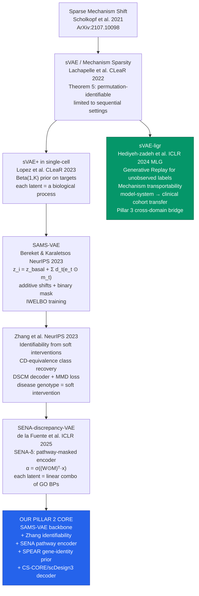
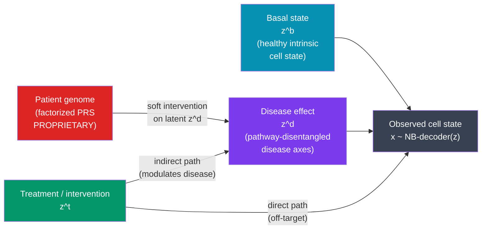
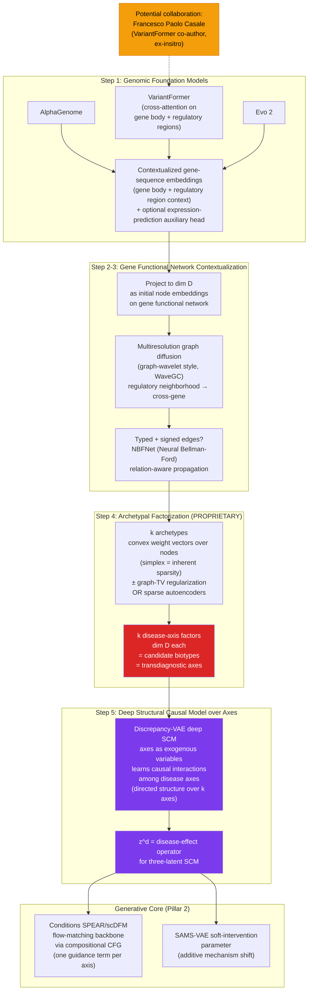
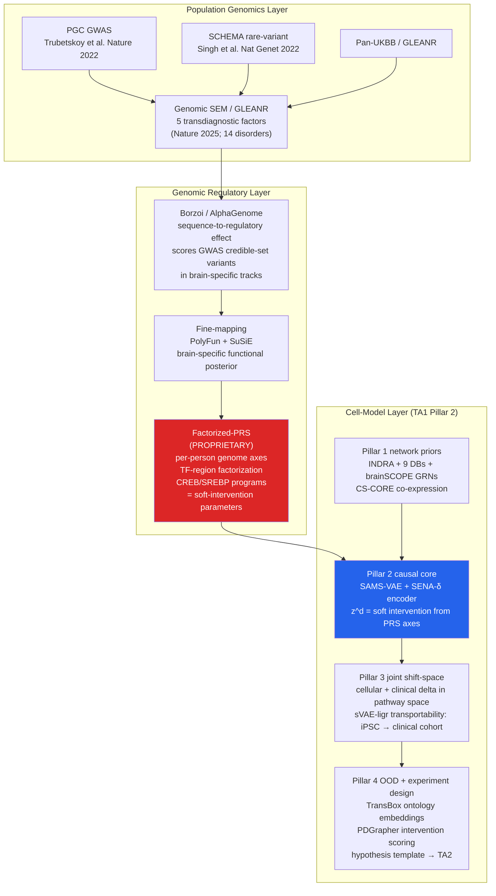

# TA1 Comprehensive Disease Models: ADHD-Friendly Companion

**Document type:** Internal companion brief (distilled from `TA1_disease_models__full.md`)  
**Date:** 2026-06-14  
**Reading time:** 8 minutes  
**Internal only.** Contains references to SPEAR (confidential) and factorized-PRS (proprietary). Do not include in the shareable build.

---

## BLUF

**Disease-associated genetic variation is mathematically equivalent to a soft intervention on a latent causal model of cellular biology.** This reframing converts the genotype-phenotype problem into a solved causal disentanglement problem with identifiability guarantees (Zhang et al. NeurIPS 2023). Our TA1 architecture assembles: (1) a four-pillar causal generative engine, (2) flow-matching synthesis models with proprietary SPEAR extensions, (3) an intervention-design GNN, and (4) a proprietary genomic front-end that converts patient genomes into sparse, causally structured disease-axis factors via pretrained genomic foundation models, multiresolution graph diffusion, and archetypal factorization. All components are composable, containerizable, and aligned to IGoR's three-phase metric targets.

> [!TIP]
> **If you read one thing:** the three-latent SCM diagram in Section 4 and the component-fit table in Section 6. Together they answer "what do we build and why does each piece belong?"

---

## 1. The Core Thesis (Why This Works)

**Hard interventions** (CRISPR knockouts) sever a gene's parental dependencies entirely. **Soft interventions** (disease-associated variants) shift a conditional distribution without severing it. Disease genotype = a soft intervention. This distinction matters because:

- Identifiability from soft interventions is **proven** (Zhang et al. 2023, Theorems 1-3)
- Disease genetic effects are **graded, probabilistic, and polygenic** -- exactly the soft-intervention setting
- The CD-equivalence class (permutation, scaling, shift) of the true causal model is recoverable from multi-cohort genetic + single-cell data

**The sVAE lineage in one sentence:** the sparse mechanism shift hypothesis (Scholkopf 2021) says only a few mechanisms change per intervention; that sparsity is what makes disentanglement identifiable.

---

## 2. The sVAE-to-SPEAR Lineage (Causal Identifiability Track)

> [!IMPORTANT]
> The key gap SAMS-VAE fills vs. prior sVAE: additive composition of mechanism shifts, enabling combinatorial generalization to unseen disease + treatment combinations without retraining.

---

## 3. Flow-Matching Generative Models (Distribution-Level Transition)

Flow-matching models learn a velocity field that transports unperturbed cells to perturbed cells. They are **not causally identifiable by themselves** -- they need the sVAE layer above. Their role: high-fidelity counterfactual synthesis and distribution-level validation.

| Model | Venue | Key innovation | TA1 role |
|---|---|---|---|
| **CellFlow** | bioRxiv Apr 2025 | OT coupling + ESM2/fingerprint condition encoding + DeepSet aggregation | Phenotype generation backbone; zero-shot to unseen perturbations |
| **CFGen** | ICLR 2025 | NB decoder (preserves count discreteness); Bernoulli decoder for ATAC; compositional CFG | Multi-modal counterfactual synthesis; RNA + ATAC from one latent |
| **scDFM** | ICLR 2026 | MMD regularizer for distributional fidelity; PAD-Transformer with co-expression attention mask + differential attention | Distribution-level perturbation fidelity; gene co-expression inductive bias |
| **SPEAR** (confidential) | NeurIPS 2026 (under review) | Spectral co-expression encoding (graph Laplacian eigenvectors as positional prior) + Adaptive Repositioning (dynamic position update from hidden state) | Gene-identity prior for Pillar 2 generative core; SOTA on all benchmarks tested |
| **SPEAR extensions** (confidential, planned) | Internal only | (1) Row-sparse differential-attention residual to encode mechanism sparsity; (2) compositional CFG generalized to conditional flow matching for multi-axis conditioning; (3) delta-pathway (not delta-gene) featurization for cross-modality uniformity; (4) barycenter of modality-specific encoders for multimodal fusion | Integrates disease-axis conditioning from genomic front-end; enables compositional multi-axis generation |

> [!CAUTION]
> **SPEAR and its extensions are confidential.** Do not name, describe mechanistically, or reference by name in any external document. External reference: "a co-expression-aware, perturbation-adaptive gene representation with planned disease-axis extensions (proprietary, under review)."

**Why scDFM outperforms the others on distributional metrics:** existing CFM perturbation models minimize cell-level MSE, missing population-level distributional shifts. The MMD regularizer forces the model to match the full distribution, not just the mean. This is critical for capturing rare-cell-type shifts in 22q11DS neurons.

**Our Pillar 2 synthesis:** scDFM/SPEAR velocity backbone + SAMS-VAE causal identifiability + SENA pathway encoder + CS-CORE-informed NB decoder + SPEAR extensions (row-sparse attention, compositional CFG, delta-pathway features, barycenter fusion). The velocity field is regularized to be sparse in the SAMS-VAE mask structure and conditioned on the disease-axis factors from the genomic front-end.

---

## 4. The Three-Latent Structural Causal Model

**What each latent captures:**

- **z^b (basal):** the healthy intrinsic cell state, common to all individuals of that cell type
- **z^d (disease):** the disease-specific shift driven by the patient's genetic variation (via factorized-PRS) -- this is the recoverable soft intervention
- **z^t (treatment):** the effect of an experimental or therapeutic perturbation; two paths distinguish therapeutic (z^t_indirect, corrects the disease mechanism) from off-target (z^t_direct, independently shifts cell state)

> [!NOTE]
> The two-path treatment decomposition is clinically critical: it separates efficacy from side-effect liability without additional experiments. The indirect path recovers from TA4 Perturb-seq data when paired with the isogenic control design.

> [!IMPORTANT]
> **Identifiability basis:** Zhang et al. 2023 extend to composable soft interventions (disease AND treatment as separate operators) when jointly constrained by TA4 Perturb-seq data and clinical cohort data.

---

## 4b. Genomic Front-End: Genome to Disease Axes (PROPRIETARY)

> [!CAUTION]
> **PROPRIETARY.** This pipeline is crown-jewel IP. Keep out of any partner-facing or shareable build. External reference only: "we factorize patient-level genetic variation into sparse, pathway-disentangled, transdiagnostic axes; the detailed method is proprietary."

**Five steps at a glance:**

| Step | Input | Output | Key method |
|---|---|---|---|
| 1. Embed | Genome sequence | Gene-body + regulatory-region embeddings | AlphaGenome / VariantFormer / Evo 2 |
| 2. Project | Embeddings | Node embeddings dim D on gene network | Linear projection head |
| 3. Diffuse | Node embeddings | Multi-resolution neighborhood-aware embeddings | WaveGC-style graph wavelets; NBFNet for typed edges |
| 4. Factorize | Diffused embeddings | k sparse disease-axis factors (PROPRIETARY) | Archetypal analysis (simplex + graph-TV) or sparse autoencoders |
| 5. Causal model | k factors as exogenous vars | Directed causal structure over axes | Discrepancy-VAE deep SCM |

> [!NOTE]
> **Casale collaboration.** A potential collaboration with Francesco Paolo Casale (VariantFormer co-author, ex-insitro) is tracked for Steps 1-2. If realized, his group contributes pretrained VariantFormer weights; Cytognosis contributes Steps 3-5 and the causal model integration.

---

## 5. Genome-to-Factors-to-Cell-Model Data Flow

> [!WARNING]
> **Factorized-PRS is proprietary crown-jewel IP.** Keep details out of partner-facing materials. External reference: "we factorize patient-level genetic variation into sparse, pathway-disentangled, transdiagnostic axes that double as candidate biotypes; the detailed factorization method is proprietary."

---

## 6. Component Fit to TA1 Pillars and IGoR Phases

| Component | Source | Pillar | Phase I | Phase II | Phase III |
|---|---|---|---|---|---|
| SAMS-VAE backbone | Bereket & Karaletsos NeurIPS 2023 | 2 (causal core) | Train on 22q11DS atlas | Extend to SCZ | Extend to BPD |
| SENA-delta encoder | de la Fuente et al. ICLR 2025 | 2 (pathway interpretability) | Integrate GO BP masks | Validate DA metrics | Cross-disease axes |
| Zhang DSCM decoder | Zhang et al. NeurIPS 2023 | 2 (identifiability) | Implement DSCM + MMD | Soft-intervention validation | CD-equivalence tests |
| SPEAR gene-identity prior | [Confidential] | 2 (gene representation) | Integrate spectral encoding | Benchmark vs. scDFM | Full evaluation |
| PDGrapher | Gonzalez et al. Nat Biomed Eng 2025 | 2 (intervention design) | Adapt to 22q11DS PPI | Cycle loss validation | Multi-cancer generalization |
| sVAE-ligr transportability | Hediyeh-zadeh et al. ICLR 2024 | 3 (cross-domain) | iPSC -> brainSCOPE | iPSC -> PGC cohort | iPSC -> clinical biotypes |
| INDRA + GO-CAM | Gyori et al. MSB 2017 | 1 (network assembly) | 9-DB integration | EMMAA-style update loop | <=4h latency |
| CellFlow | Klein et al. bioRxiv 2025 | 2 (generative backbone) | Train on 22q11DS data | Multi-condition generation | Cross-disease |
| CFGen | Palma et al. ICLR 2025 | 2 (multi-modal synthesis) | RNA + ATAC generation | Optional ATAC validation | Multi-modal expansion |
| scDFM backbone | Yu et al. ICLR 2026 | 2 (distributional fidelity) | Baseline perturbation fidelity | MMD regularization tuning | Full distributional eval |
| Factorized-PRS front-end (proprietary) | Internal (Sections 31, 31b; full doc 5.5) | 2b (genomic input) | 22q11DS/TBX1 axes via AlphaGenome/VariantFormer/Evo 2 + archetypal factorization | SCZ GWAS factorization; deep SCM over axes | Transdiagnostic validation; barycenter multimodal fusion |
| VariantFormer (cross-attention gene embeddings) | Casale, Widmer et al. [citation TBC] | 2b front-end Step 1 | Embed gene body + regulatory regions | Fine-tune on neuropsych variants | Expand to multi-ancestry |
| WaveGC-style graph diffusion + NBFNet | WaveGC / NBFNet (Zhu et al. NeurIPS 2021) | 2b front-end Steps 2-3 | Multiresolution neighborhood diffusion; typed-edge propagation | Expand to full STRING + brainSCOPE graph | All typed GRN edges |
| SPEAR extensions (confidential) | Internal (full doc 8.6) | 2 (generative specialization) | Row-sparse attention + delta-pathway featurizer | Compositional CFG for multi-axis CFM | Barycenter multimodal fusion |
| Disease Map + MaBoSS | CellDesigner + CaSQ pipeline | 4 (verifiable mechanistic) | 22q11DS map draft | Boolean attractor validation | IV&V containerization |
| TransBox ontology embeddings | Xiong et al. arXiv 2410.14571 | 4 (OOD + gap finding) | MONDO/CL/GO embed | OOD generalization tests | Second disease transfer |
| AlphaGenome | Avsec et al. Nature 2026 | 1 (regulatory annotation) | COMT/TBX1 scoring | Fine-mapping integration | Expanded variant scoring |
| VCWM framework | Xing & Song GenBio 2026 | All (system definition) | E/F/D specification | Operational VCWM loop | Full world-model benchmark |

---

## 7. IGoR Phase Alignment

### Phase I (18 months): Concept and Component

**What we build:**

- Pillar 1 network: 9-DB INDRA assembly, brainSCOPE GRNs, CS-CORE co-expression; Biolink metagraph schema
- Pillar 2 causal core: SAMS-VAE + SENA-delta encoder trained on 22q11DS iPSC atlas; DSCM decoder with MMD loss
- Pillar 3 initial: pathway-space delta representation; sVAE-ligr cross-domain framework
- Pillar 4 initial: TransBox OBO embeddings; Disease Map in CellDesigner; MaBoSS attractor simulation
- Walking skeleton: closed TA1 -> TA2 -> TA3 -> TA4 -> TA1 cycle demonstrated

**Hard Phase I milestone:** 100% TA1 computational artifacts containerized for IV&V independent execution.

**TA1 go/no-go gate:** model explains >=30% variance in 22q11DS-specific cell-type shifts; >=3 mechanistic sub-models; >=3 knowledge gaps algorithmically detected with supporting evidence.

### Phase II (18 months): Integration and Interoperability

**What we add:**

- Three-latent SCM integration: z^b + z^d + z^t jointly inferred from paired TA4 Perturb-seq data
- Prospective prediction confirmed in an independent dataset
- sVAE-ligr transportability from iPSC model to PGC schizophrenia cohort
- Model update latency target: <=24 hours from data receipt
- >=10 sub-models across >=2 scales; >=90% cross-team concordance

### Phase III (24 months): Scaling and Generalization

**What we add:**

- Second disease: idiopathic schizophrenia; SCHEMA rare-variant anchor; GWAS soft-intervention parameterization
- Third disease (cautious extension): bipolar disorder via factorized-PRS transdiagnostic axes
- >=15 sub-models across >=3 scales (molecular, cell-type, circuit via NeuroML)
- Model update latency: <=4 hours (fully automated pipeline)
- Open-access deposit: OMEX/COMBINE archive, all models and data

---

## 8. Gaps and How We Address Them

| Gap | Problem | Our approach |
|---|---|---|
| **Polygenic identifiability** | Zhang 2023 requires >=1 intervention per latent node; polygenic disease signal is diffuse | GLEANR/Genomic SEM factorization finds ~5 effective latent axes; SCHEMA rare-variant data provides near-hard anchor interventions |
| **Molecular-to-circuit scale** | Pillar 2 operates at molecular/cell-type scale; IGoR requires multiscale including circuit | MaBoSS Boolean attractors map to inhibitory/excitatory balance; NeuroML composes with SBML-comp for circuit layer |
| **Temporal disease-progression schema** | No existing schema integrates clinical staging + mechanistic transitions + cell trajectories | New thin FAIR schema: SuStaIn/EBM clinical staging -> SBML-qual attractor transitions -> CellRank pseudotime (TA3 deliverable) |
| **Covariance structure in synthesis** | sVAE+ / SAMS-VAE use conditionally independent NB decoders; counterfactuals lose co-expression structure | Replace with CS-CORE-informed vine-copula decoders from scDesign3 |
| **Flow-matching non-identifiability** | CellFlow/CFGen/scDFM are high-fidelity but not causally identifiable | Compose SAMS-VAE causal layer (identifiable) with flow-matching backbone (velocity fidelity); velocity field regularized by SAMS-VAE mask structure |

---

## 9. Key Citations for Verification Before Submission

> [!CAUTION]
> The following citations are from preprints or informal technical reports. Verify that published DOIs exist before including them in the external proposal. Confirmed citations need no action.

**Needs verification (DOI may not yet exist or be final):**

- AlphaCell (Chuai et al. bioRxiv 2026) -- bioRxiv DOI not confirmed
- STACK (Dong et al. bioRxiv 2026) -- bioRxiv DOI not confirmed
- X-Cell/X-Atlas (Wang et al. bioRxiv 2026) -- bioRxiv DOI not confirmed
- VCWM (Xing and Song GenBio AI 2026) -- technical report, no journal DOI
- sVAE-ligr (Hediyeh-zadeh et al. ICLR 2024 MLG) -- workshop paper, arXiv DOI to confirm
- Evo 2 (Nature 2026) -- arXiv:2502.18638 confirmed; Nature publication DOI pending
- GLEANR AJHG 2025 final DOI -- bioRxiv 2024.11.12.623313 confirmed; AJHG final DOI to verify
- VariantFormer (Casale, Widmer et al.) -- citation and DOI to confirm; check with Casale if collaboration proceeds
- WaveGC -- verify exact paper and DOI for the graph-wavelet convolution approach referenced
- NBFNet (Zhu et al.) -- arXiv:2106.06935; NeurIPS 2021 DOI to confirm

**Confirmed DOIs (no action needed):**

| Paper | DOI |
|---|---|
| Zhang et al. NeurIPS 2023 (soft interventions) | arXiv:2307.06250 |
| SAMS-VAE (Bereket & Karaletsos) | arXiv:2311.02794 |
| SENA-discrepancy-VAE | arXiv:2506.12439 |
| CellFlow (Klein et al.) | 10.1101/2025.04.11.648220 |
| CFGen (Palma et al.) | arXiv:2407.11734 |
| scDFM (Yu et al.) | arXiv:2602.07103 |
| PDGrapher (Gonzalez et al.) | 10.1038/s41551-025-01481-x |
| AlphaGenome (Avsec et al.) | 10.1038/s41586-025-10014-0 |
| Borzoi (Linder et al.) | 10.1038/s41588-024-02053-6 |
| LDGM (O'Connor lab) | 10.1038/s41588-023-01487-8 |
| Genomic SEM (Grotzinger 2019) | 10.1038/s41562-019-0566-x |
| 5-factor transdiagnostic (2025) | 10.1038/s41586-025-09820-3 |
| FactorGo (Zhang et al.) | 10.1016/j.ajhg.2023.09.003 |
| PsychENCODE brainSCOPE | 10.1126/science.adi5199 |
| PGC SCZ GWAS (Trubetskoy) | 10.1038/s41586-022-04434-5 |
| SCHEMA (Singh et al.) | 10.1038/s41586-022-04556-w |
| Ruzicka, Mohammadi et al. | 10.1126/science.adg5136 |
| CS-CORE (Su et al.) | 10.1038/s41467-023-40503-7 |
| scDesign3 (Song et al.) | 10.1038/s41587-023-01772-1 |
| Lachapelle et al. CLeaR 2022 | arXiv:2107.10098 |
| TransBox (Xiong et al.) | arXiv:2410.14571 |
| NeuroPainting (Tegtmeyer) | 10.1038/s41467-025-61547-x |

---

## Full Document

For the complete mathematical treatment, all architectural details, and the full reference list, see `TA1_disease_models__full.md` in this same directory.
