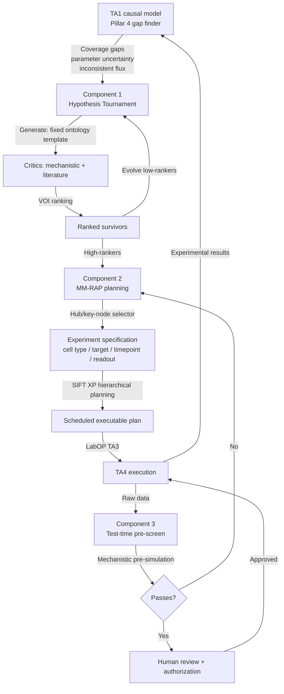

# TA2 New Science Engine: ADHD-Friendly Brief

**Reading time:** approximately 8 minutes.
**Internal; do not distribute.**
**Prepared:** 2026-06-14

> [!TIP]
> **If you read one thing:** No existing agentic-science system queries a living mechanistic disease model to generate hypotheses. Our TA2 does. That is the gap, and it is the precise gap IGoR names. The term for our architecture is mechanistic-model-grounded retrieval-augmented planning (MM-RAP). It is structurally distinct from GraphRAG, CausalRAG, Co-Scientist, and NIMMGen.

---

## BLUF

- **The field:** approximately 18 agentic-science systems exist; zero query a mechanistic or causal disease model to propose experiments.
- **Our wedge:** our TA2 retrieves from the TA1 causal model's uncertainty maps (parameter posteriors, edge confidence, coverage gaps), not from papers. We call this MM-RAP.
- **SIFT adds the planning layer:** their Bayesian value-of-information ranking and hierarchical planning (XP) convert our ranked hypothesis into a scheduled, resource-allocated plan that hands off to TA3 LabOP. That is the TA2-TA3 seam IGoR scores.
- **The not-an-LLM-wrapper bar is met on three independent grounds:** retrieval corpus (model output, not parametric LLM knowledge), mechanistic critics (TA1 constraint set, not literature), and test-time simulation (mechanistic pre-screen, not LLM recall).

---

## Section 1: The Field at a Glance

### Agentic-science systems (June 2026)

| System | Open? | Queries a mechanistic/causal model? | Key limitation |
|---|---|---|---|
| Co-Scientist (Google DeepMind, Nature 2026) | No (Gemini) | No; literature/database | Closed; no mechanistic grounding |
| AI-Scientist v2 (Sakana, 2025) | Yes | No; ML code benchmarks only | Domain: ML, not biology |
| Robin (FutureHouse, 2025) | Yes | No; literature | Literature synthesis only |
| Kosmos (FutureHouse/Edison, 2025) | No | No; text "world models" | Text coherence, not mechanistic simulation |
| Biomni/Stanford (2025) | Yes | No; database/tool retrieval | 150 tools, no simulation |
| Stanford Virtual Lab (2025) | Yes | Partial; AlphaFold as a tool | Structure prediction only, not disease causal model |
| SciAgents (MIT, 2024) | Yes | No; static knowledge graph | Graph edges from text, not from simulation |
| Microsoft Discovery | No (Azure) | Partial; simulator hooks | No published disease model in the loop |
| NIMMGen (arXiv:2602.18008, ICML 2026) | Early/open | Partial; generates mechanistic code de novo | Constructs models from scratch; does not query a pre-built causal disease object |
| Agentic digital twins (Nat Comp Sci 2026) | Research | Partial; conceptual framework | No deployed biological disease system |
| **Our TA2** | Open-core | **Yes; TA1 parameter posteriors, edge uncertainty, coverage gaps** | None at this level |

> [!NOTE]
> NIMMGen is the closest antecedent in the literature. Its gap: it generates mechanistic model code from data using an LLM. Our TA2 queries a pre-built, incrementally-updated causal disease model as a first-class object. These are structurally different architectures.

---

## Section 2: The GraphRAG White Space

### What GraphRAG is (and what it is not)

GraphRAG (Microsoft Research, widely cited 2024-2025) retrieves over a knowledge graph whose nodes and edges are extracted from text. The graph represents what was written in papers, not what a mechanistic simulation predicts.

### CausalRAG: closer but still text-derived

CausalRAG (Wang et al., ACL Findings 2025; arXiv:2503.19878) uses directed causal triples extracted from source text. Causal edges are claims made in papers, not predictions with quantified uncertainty from a simulation.

### The white space our TA2 occupies

```
Standard GraphRAG:    LLM query --> text knowledge graph (from papers) --> retrieved context
CausalRAG:            LLM query --> causal triples extracted from text --> retrieved context
MM-RAP (our TA2):     planning query --> TA1 mechanistic model (live, uncertainty-quantified) --> ranked experiment targets
```

Six properties define MM-RAP and are absent from every published system:

1. Pre-built, experimentally-updatable causal disease model as the retrieval object
2. VOI-guided selection from the model's posterior uncertainty (not paper frequency)
3. Mechanistic critics in the tournament that use TA1's constraint set
4. Test-time mechanistic pre-simulation to pre-screen infeasible designs
5. Bidirectional TA1 update loop: new data updates the model; next round uses the updated prior
6. Ontology-aligned hypothesis templates (MONDO, Cell Ontology, Gene Ontology, UBERON) for human verifiability

---

## Section 3: Engine Architecture



---

## Section 4: Model-Grounded Planning Loop

```mermaid
sequenceDiagram
    participant TA1 as TA1 Model<br/>(Causal Disease Model)
    participant RAP as MM-RAP Engine<br/>(TA2)
    participant VOI as SIFT VOI Planner
    participant TA3 as TA3 LabOP
    participant TA4 as TA4 Validated Lab

    TA1->>RAP: Emit: parameter posteriors,<br/>edge uncertainty, coverage gaps
    RAP->>RAP: Tournament: generate/critique/rank<br/>using TA1 constraint set
    RAP->>VOI: Ranked hypothesis + model uncertainty
    VOI->>VOI: Select argmax expected information gain
    VOI->>TA3: Experiment specification (ontology-aligned)
    TA3->>TA3: Compile to LabOP protocol
    TA3->>TA4: Execute protocol
    TA4->>TA1: Return data
    TA1->>TA1: Bayesian parameter update<br/>(<=24 h Phase II; <=4 h Phase III)
    TA1->>RAP: Updated uncertainty map
    Note over RAP,TA1: Loop repeats with updated prior
```

---

## Section 5: SIFT's Role

> [!IMPORTANT]
> Anchor SIFT as TA3 lead (LabOP). Add a scoped TA2 planning-and-scheduling role. Cytognosis remains TA2 lead.

| SIFT capability | Our use | IGoR alignment |
|---|---|---|
| Bayesian VOI model (Goldman, Trivedi, Bryce) | Formal VOI ranking in the tournament | TA2 experiment prioritization |
| Hierarchical experiment planning XP (Kuter, Goldman, Bryce, Beal 2018) | Convert ranked target to scheduled plan | TA2-to-TA3 interface |
| Formalizing sample transformation plans (Bryce, Goldman, Beal) | Experiment spec to protocol handoff | TA3 LabOP compilation |
| Round Trip pipeline (ACS Synth Biol 2022) | Track record: automation and reproducibility | Credibility; not a core dependency |
| LabOP (Bartley et al., ACM JETC 2023) | TA3 protocol standard | TA3 lead |

**Domain caveat to validate in Phase I:** SIFT's planning track record is in synthetic biology (yeast logic circuits). Confirm generalization to mammalian iPSC-neuron, scRNA-seq, and live-cell imaging workflows before scoping the TA2 planning contribution.

---

## Section 6: The Not-an-LLM-Wrapper Bar

The IGoR solicitation bars: "systems that merely prompt an LLM to suggest experiments and route them to an automated laboratory."

Our TA2 fails this disqualification on three independent grounds:

- **Retrieval corpus.** A frontier LLM without access to TA1 cannot retrieve unconstrained parameter sets, edge uncertainty, or flux inconsistencies from a mechanistic model.
- **Mechanistic critics.** A critic grounded only in literature will not reject a hypothesis that violates a mechanistic constraint absent from published papers.
- **Test-time simulation.** A frontier LLM cannot simulate the TA1 model's flux predictions by parametric recall.

---

## Section 7: Phase Alignment

| Phase | TA2 deliverable | Hard gate |
|---|---|---|
| Phase I (18 mo) | Tournament prototype querying TA1; >=3 experiments proposed and executed; architecture documented; TA1-TA3 interfaces demonstrated | Closed-loop walking skeleton |
| Phase II (18 mo) | Full tournament with SIFT VOI; open-weight backend; user study >=10 scientists; >=70% find useful; >=75% expert-panel high-value | >=4x cycle-time improvement |
| Phase III (24 mo) | Extended to bipolar disorder (second disease); >=85% high-value; >=20 users; efficiency vs. baseline documented | >=10x cycle-time improvement |

---

## Section 8: Gaps and Actions

> [!WARNING]
> **Phase I must-dos.** These gaps are high-severity if unresolved before submission.

| Gap | Action | Owner | Timing |
|---|---|---|---|
| No published MM-RAP precedent; reviewers may challenge | Cite NIMMGen as closest antecedent; differentiate on three structural properties in proposal text | Cytognosis | Before submission |
| SIFT planning stack unvalidated for mammalian workflows | Phase I explicit validation task: adapt SIFT XP to iPSC-neuron Perturb-seq and live-cell imaging | SIFT + Cytognosis | Phase I Q1-Q2 |
| TA1-TA2 interface schema not yet formalized | Phase I DDD workshop must produce JSON-LD or RDF schema for TA1 uncertainty output | Cytognosis + IPAI | Phase I kickoff |
| Open-weight model backend not yet selected | Phase I benchmark: Llama 3.x and Mistral-class vs. Claude baseline on hypothesis quality | Cytognosis | Phase I Q2 |
| Spearman r >=0.4 metric dropped from full-proposal milestone table | Restore as internal go/no-go; consider including in Appendix C.2 | Cytognosis | Before submission |
| SIFT TA2 planning contribution scope not yet in team agreement | Confirm with SIFT on call; include in subaward scope | Cytognosis (lead) | Before LOI |

---

## References (key only; full list in full.md)

- Gottweis et al. (Co-Scientist). Nature 2026. arXiv:2502.18864.
- Sakana AI (AI-Scientist v2). arXiv:2504.08066. github.com/sakanaai/ai-scientist-v2.
- FutureHouse (Robin; Kosmos). 2025. futurehouse.org.
- Guan et al. (NIMMGen). arXiv:2602.18008. 2026. ICML.
- San et al. (Agentic digital twins). Nature Computational Science, 2026.
- Wang et al. (CausalRAG). ACL Findings 2025. arXiv:2503.19878.
- Goldman, Trivedi, Bryce. Bayesian VOI for experiment choice. AAAI Fall Symp.
- Kuter, Goldman, Bryce, Beal. XP: Experiment Planning. 2018.
- Bryce et al. Round Trip. ACS Synthetic Biology 2022. doi:10.1021/acssynbio.1c00305.
- Bartley et al. LabOP. ACM JETC 19(3), 2023. doi:10.1145/3604568.
- Gonzalez et al. PDGrapher. Nature Biomedical Engineering 2025. doi:10.1038/s41551-025-01481-x.
