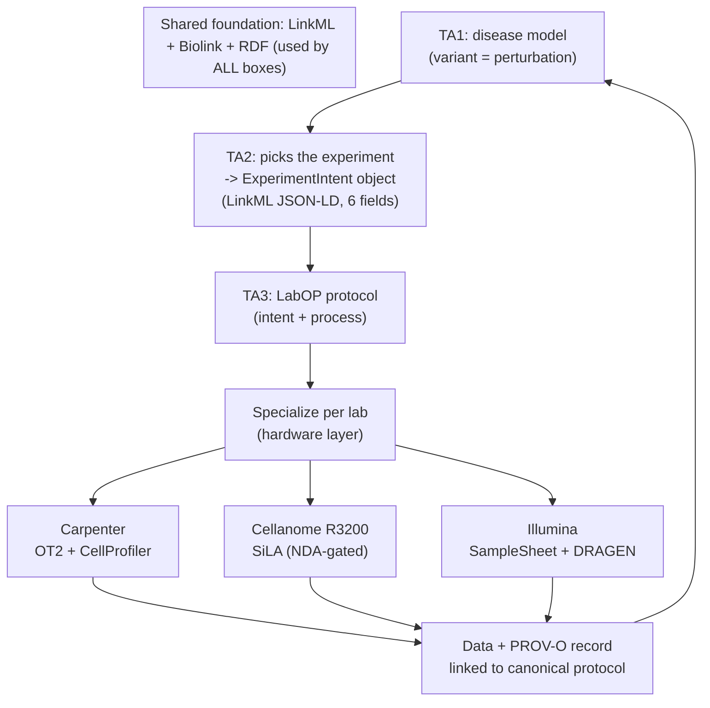

# TA3 Design and Standards: ADHD-Friendly Brief

**Internal only.** Companion to `TA3_Integrated_Design_and_Standards__full.md`.
**Compiled:** 2026-06-16. **Reading time:** ~8 minutes.

> **If you read one thing:** the 4-layer table in Section 2 and the one-foundation rule in Section 4. Everything else supports those two.

---

## BLUF (3 sentences)

The IGoR TA3 "layered protocol stack" is **borrowed, not new**: it is the Internet protocol-stack idea applied to labs, already built by the DARPA SD2 community as **LabOP**, which SIFT co-authored. Our plan is to **adopt LabOP** (plus SiLA 2 and an RFC governance overlay), make **one shared semantic foundation** (LinkML + Biolink + RDF) serve all technical areas so nothing is translated at the seams, and **extend LabOP** to perturbation biology in three phases (cellular model, perturbation, readout) with a quantitative QC gate at each phase. Net: we lead TA3 by extending a standard we helped create, not by starting over.

---

## Decided vs. Open (at a glance)

**Decided**

- ✅ LabOP is the backbone (intent + protocol layers); SiLA 2 is the hardware layer.
- ✅ One semantic foundation: LinkML schemas, Biolink + OBO grounding, RDF + Pydantic generated from one source.
- ✅ Three phases: cellular model, perturbation, readout. Functional readout = **calcium imaging** (not MEA).
- ✅ LLM extraction (Instructor + Pydantic; DSPy as backup) onboards labs and parses papers.
- ✅ SIFT is the standards partner; SIFT estimates 2-3 FTEs for TA3.

**Open**

- ⬜ Finalize SIFT TA3 staffing by **June 25** (Dan drafts 3 variants).
- ⬜ TA2 scope and ownership (decides the FTE count).
- ⬜ Cellanome R3200 SiLA interface (highest-risk item; needs NDA).
- ⬜ Phase I concordance figure: 80% vs 85% (check Appendix A).

---

## 1. What the slide says (parsed)

The slide ("Layered Protocol Stack Separates Intent from Execution," TA3, Proposers' Day) makes one analogy and four claims.

- **Analogy:** "Internet-inspired interoperability." Layers let any lab or device work with any other without knowing each other's internals.
- **Claim 1:** the right **abstractions** matter most, not any one tool.
- **Claim 2:** a **partner** will guide and verify the standards (that is SIFT + the Bioprotocols Working Group for us).
- **Claim 3:** performers run **bake-offs** (interoperability tests) and an **RFC** process (numbered, comment-driven specs). Both terms come from Internet-standards culture.

---

## 2. The 4 layers, and how we build each

| Slide layer | Plain meaning | We build it with |
|---|---|---|
| **Intent** | what the scientist wants (declarative) | LabOP protocol objects, written from the TA2 ExperimentIntent object |
| **Process** | the recipe with trusted parameters, no instrument detail | LabOP primitives + LinkML metadata |
| **Calibration** | shared standards so two machines mean the same thing | our **RFC governance** + IV&V reference artifacts (this is our novel part) |
| **Hardware** | machine-specific settings, hidden behind a common interface | LabOP specialization to SiLA 2, OpenTrons, Autoprotocol, Illumina |

**Key point:** no single standard covers all four. We combine open standards and add the one missing piece, evidence-based parameter governance.

---

## 3. "Borrowed, not invented": the 3 citations that matter

- **LabOP / PAML** (Bartley et al., *ACM JETC* 2023, doi:10.1145/3604568): the SD2-era standard that already defines these layers. **Strongest prior art.**
- **SiLA 2** (Juchli, 2022): the device-driver layer (hardware).
- **SBOL + IETF/BBF RFC governance**: the model for the slide's "RFC" and "bake-off" language.

Full list (17 references incl. BioCoder, Cello, Aquarium, Autoprotocol, Allotrope, GA4GH) is in Section 2 of the full doc.

---

## 4. The one rule that prevents most bugs

> **One semantic foundation across TA1-TA4. No translation at the seams.**

A gene is the **same identifier everywhere** (TA1 graph, TA2 design, TA3 protocol, TA4 LIMS). We author every schema in **LinkML**, ground every entity in **Biolink + OBO**, and generate **Pydantic** (Python) and **RDF** (for LabOP) from that one source. Dan called this the "universal language across TAs," and agreed LinkML beats raw OWL because it is programmer-friendly and generates everything from one file. Precedent: the NCATS Translator project.

For variants: natural variants use **GA4GH VRS** (+ HGVS); engineered CRISPRi/a perturbations carry the **same locus** plus a Sequence-Ontology modality tag. That shared coordinate system is what makes the "delta process" language work across TA1 and TA3.

---

## 5. The whole stack in one picture

---

## 6. The 3 phases (extend LabOP from synbio to perturbation biology)

| Phase | Makes | New LabOP primitives | QC gate (must pass to advance) |
|---|---|---|---|
| **(a) Cellular model** | the cells (e.g., iPSC neurons) | `InduceDifferentiation`, `MatureCulture` | maturity markers: MAP2+/TUJ1+ ≥ 0.85, NeuN ≥ 0.80 |
| **(b) Perturbation** | the change (CRISPRi/a or drug) | `DeliverGuideRNA`, `TreatCompound` | knockdown log2FC ≤ -1.5; activation ≥ 3x; viability ≥ 0.90 |
| **(c) Readout** | the measurement | `CalciumImagingAcquisition`, `ScRNAseqLibraryPrep`, `CellPaintingStain` | genes/cell ≥ 1000; doublets ≤ 5%; calcium baseline stable |

**Why QC at every step:** so a failure downstream can be **traced to its cause** (root-cause analysis). Banked, QC-passed cultures act as **checkpoints**; the PROV-O trace localizes failures automatically.

---

## 7. The two interfaces (short version)

**TA2 → TA3.** TA2 hands over an `ExperimentIntent` object: 6 URI-bound fields (cell type, time frame, stimuli, response, phenotype, quality) plus VOI score and human authorization. TA3 returns a LabOP protocol within one business day. **Ratify the schema by the Month 3 DDD workshop.**

**TA3 → TA4.** Not one-to-one: each lab does only a **subset** of cell models, perturbations, and readouts. Each lab declares a `LabCapabilityProfile`; TA3 matches the protocol's needs to the labs that can do them (SiLA Feature discovery auto-populates this). This capability-manifest schema is itself a new open-standard deliverable.

---

## 8. Top 3 risks

| Risk | Why it matters | Mitigation |
|---|---|---|
| **R3200 SiLA Feature Definition does not exist** | blocks the Cellanome lane | NDA in Month 1; draft FDL by Month 6; Markdown fallback for Phase I |
| **LabOP has no perturbation/neuronal primitives yet** | core of the build | author them (~12-16 person-weeks, SIFT + labs) |
| **Schemas not ratified before walking skeleton** | breaks the closed loop and 10x target | lock ExperimentIntent + LabCapabilityProfile at Month 3 workshop |

---

## 9. Next steps (do-now first)

**No outreach needed (start now):**

1. Stand up the **LinkML schema repo**: author the Biolink-extending TA3 classes, generate Pydantic + OWL.
2. **Rework stale MEA text** in the TA4 deep-dives to calcium imaging.
3. **Resolve the 80% vs 85%** Phase I concordance figure against Appendix A.

**Needs a conversation:**

4. **Finalize SIFT TA3 staffing by June 25** (Dan drafts 3 variants).
5. **TA2-alignment call with Dan** (decides FTE count and interface ownership).
6. **Close the Cellanome NDA** and scope the R3200 SiLA exchange.

---

## Glossary (no jargon left behind)

- **LabOP:** open language to write a lab protocol once and run it on many machines. Built in DARPA SD2.
- **SiLA 2:** the "device driver" standard; lets software talk to any compliant instrument.
- **LinkML:** a schema language; write the data model once, generate Python (Pydantic), JSON, and RDF.
- **Biolink Model:** a shared vocabulary of genes, proteins, diseases, etc., so everyone uses the same IDs.
- **RDF / SBOL3:** the graph format LabOP stores protocols in; gives every object a permanent URI.
- **VRS / HGVS:** standard ways to name a genetic variant (computable / human-readable).
- **PROV-O:** the standard record of what happened in a run (inputs, outputs, instruments, timestamps).
- **CRISPRi / CRISPRa:** turning a gene down (interference) or up (activation) without cutting DNA.
- **RFC / bake-off:** a comment-driven spec document / an interoperability test event. Borrowed from the Internet.
- **Delta process:** the set of cell processes a perturbation changes; the shared language linking TA1, TA3, and the literature.

---

*Internal only. Full detail and all references: `TA3_Integrated_Design_and_Standards__full.md`.*
