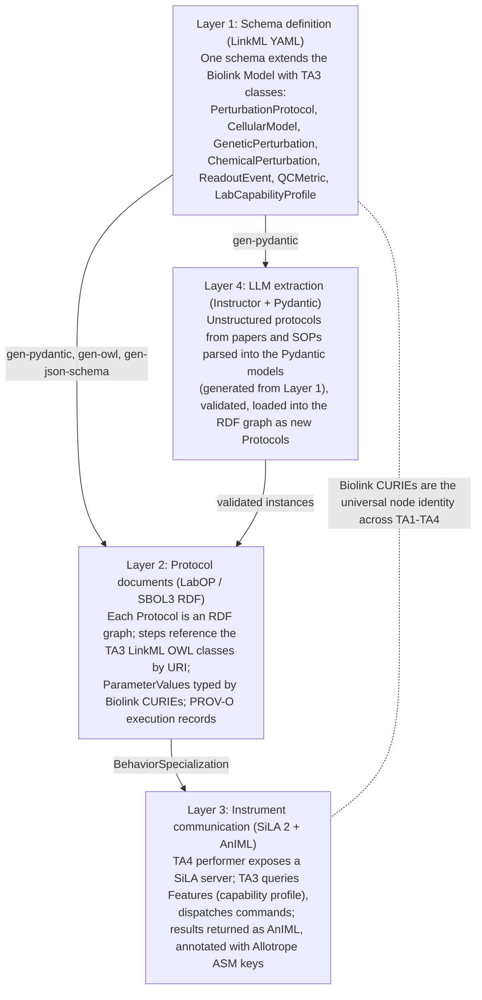

# TA3 Integrated Design and Standards Reference (PsychIGoR)

**Document type:** Internal consolidated design reference, IGoR proposal series
**Compiled:** 2026-06-16
**Supersedes-by-merge (does not delete):** consolidates `TA3_protocols__full.md`, `IFACE_TA2_TA3__full.md`/`__brief.md`, `IFACE_TA3_TA4__full.md`/`__brief.md`, `22_landscape_TA3_TA4_standards_labs.md`, `35_contrib_standards_stack.md`, plus two new 2026-06-16 research streams (layered-stack prior art; TA3 standards landscape) and the Daniel Bryce (SIFT) meeting notes of 2026-06-16.
**Reading time:** approximately 35 minutes. For the 8-minute version, read `TA3_Integrated_Design_and_Standards__brief.md`.

> [!NOTE]
> **Internal only.** This document informs proposal drafting and the SIFT teaming conversation. It is not for verbatim inclusion in any external build. Restricted sections (31, 32, 41) are referenced conceptually only and must never appear in a shareable build.

---

## BLUF

The IGoR TA3 "layered protocol stack" on the Proposers' Day slide is an adoption, not an invention. It restates the OSI / Internet protocol-stack idea (separate intent from execution through abstraction layers) for distributed wet labs, an idea the DARPA SD2 community already built and published as LabOP, with SiLA 2, Autoprotocol, SBOL, and the SBOL/IETF RFC governance model as the supporting prior art. Our position is strong: SIFT co-authored LabOP, so PsychIGoR can lead TA3 by extending a standard we helped create rather than starting from zero.

Our three commitments. First, adopt LabOP (intent and protocol layers), SiLA 2 (hardware layer), and an RFC parameter-governance overlay (calibration layer); the four-layer slide maps onto this stack one-to-one. Second, make one semantic foundation serve all technical areas: author every schema in LinkML, ground every gene, protein, cell type, chemical, and variant in the Biolink Model plus the OBO ontologies, generate Pydantic models and RDF from that single source, and thereby remove translation steps at the TA1/TA2/TA3/TA4 seams. Third, extend LabOP (built for synthetic biology) to perturbation biology through three phases, cellular model, perturbation, and readout, with quantitative quality-control gates at each phase so a downstream failure can be traced to its upstream cause.

**If you read one thing:** the four-layer mapping table in Section 1.4 and the one-semantic-foundation principle in Section 5.

---

## 1. The Proposers' Day Slide, Fully Parsed

### 1.1 What the slide is

Source: ARPA-H IGoR Proposers' Day, slide 12, TA3 track, marked "Approved for Public Release: Distribution Unlimited." Title: **"Layered Protocol Stack Separates Intent from Execution."** The slide presents the organizing team's intended architecture for TA3, the interoperability layer that lets heterogeneous, distributed laboratories run the same experiment and get comparable results.

### 1.2 The framing statements (left column)

The slide leads with a wireless-router icon and the green header **"Internet-inspired interoperability among devices and laboratories."** This is the load-bearing analogy. The Internet works because layered protocols (the OSI and TCP/IP stacks) let any device talk to any other device without either knowing the other's internal details. TA3 wants the same property for labs and instruments.

Three supporting claims follow:

1. **"The right abstractions will be critical for a dynamic ecosystem of distributed laboratories."** The emphasis is on abstraction as the enabling design choice, not on any single tool. A dynamic ecosystem means labs and instruments can join or leave without breaking the protocols already in flight.
2. **"A partner will guide and verify interoperability standards for life sciences research."** ARPA-H expects a dedicated standards partner (a role, not a vendor) to steward and validate the standard. This is the slot SIFT and the Bioprotocols Working Group fill for PsychIGoR.
3. **"Performers will participate in regular 'bake-offs' and request-for-comments (RFC) processes when setting standards."** Both terms are borrowed directly from Internet-standards culture (see Section 11). A "bake-off" is an interoperability test event; an "RFC" is a numbered, comment-driven specification document.

### 1.3 The four layers (right column)

The slide stacks four layers, top to bottom, each with an icon and a one-line definition:

| Layer (slide) | Slide definition (verbatim) | Slide icon |
|---|---|---|
| **Intent Layer** | "What the researcher wants to do, specified in declarative language" | document / form |
| **Process Layer** | "Robust protocols with trusted parameters; still no low-level specifics" | pipette into tube |
| **Calibration Layer** | "Standards enable interoperability across devices and labs" | overlaid emission-spectra curves |
| **Hardware Layer** | "Isolation of machine-specific settings and instructions" | benchtop instrument (thermocycler) |

Read the layers as a compiler stack. Intent is the declarative "what." Process is the parameterized recipe that still hides instrument detail. Calibration is the shared reference frame that makes two instruments' outputs mean the same thing. Hardware is the isolated, machine-specific bottom that everything above it never has to see.

### 1.4 Our one-to-one mapping onto an implementable stack

The central design claim of our TA3, established in `TA3_protocols__full.md` and reaffirmed here, is that **no single existing standard spans all four layers, but a small, open, well-supported set covers them cleanly together.**

| Slide layer | What it encodes | We implement with | Standard lineage |
|---|---|---|---|
| **Intent** | Declarative scientific goal, success criteria, quality requirements | LabOP `Protocol` objects (SBOL3 RDF), authored from the TA2 `ExperimentIntent` object | LabOP / PAML |
| **Process** | Reusable primitives, control flow, versioned trusted parameters, error handling | LabOP primitive libraries plus LinkML schemas for metadata | LabOP, Aquarium |
| **Calibration** | Cross-device parameter and uncertainty standards, IV&V reference artifacts, change governance | Our RFC overlay plus IV&V calibration artifacts; AnIML / Allotrope ASM for instrument-data semantics | SED-ML/KiSAO (computational precedent); no prior wet-lab equivalent, so this is a genuine contribution |
| **Hardware** | Machine-specific settings isolated behind a common interface | LabOP specialization to SiLA 2, Autoprotocol, OpenTrons OT2, CellProfiler, Illumina SampleSheet | SiLA 2, Autoprotocol, OpenTrons |

The strategic consequence: we do not invent a protocol language. We adopt LabOP as the upper-layer backbone, wire it to hardware standards through LabOP's existing specialization mechanism, and add the one thing no standard provides, an evidence-based parameter-governance process.

---

## 2. The Layered Stack Is Adopted, Not Invented: Prior Art and Citations

The slide's architecture synthesizes roughly a decade of published work. Naming that lineage matters for two reasons: it lets us write the TA3 significance section as "we extend a proven stack" rather than "we hope this works," and it positions SIFT (a LabOP co-author) as the credible standards partner the slide calls for.

### 2.1 The strongest prior-art candidates (span all four layers)

- **LabOP / PAML, Bartley et al.** The direct output of DARPA SD2's effort to share one protocol representation across 20-plus organizations. Built on UML activity semantics, Autoprotocol, and SBOL3 RDF; defines operation libraries (intent), protocols (process), and executions (hardware) as explicit layers, and exports to Autoprotocol or human-readable paper protocols. Preprint doi:10.1101/2022.07.05.498808; journal version *ACM JETC* 19(3), 2023, doi:10.1145/3604568. **This is the single strongest prior-art document for the IGoR stack.**
- **LabOP site and Bioprotocols Working Group.** The living open-source community standard and its governance body, the model for the slide's "partner" and "RFC process." <https://bioprotocols.github.io/labop/>.

### 2.2 Intent layer

- **BioCoder, Ananthanarayanan & Thies, 2010.** The first formal language for expressing protocols at a human-readable, instrument-agnostic level; pure intent. *J Biol Eng* 4:13, doi:10.1186/1754-1611-4-13.
- **Cello, Nielsen et al., 2016.** Users write desired behavior in Verilog (a hardware-description language); Cello compiles to DNA. A direct biological analog of separating technology-independent logic (intent) from device mapping (the User Constraints File, hardware). *Science* 352:aac7341, doi:10.1126/science.aac7341.
- **Antha, Synthace.** A high-level language where scientists state experimental intent and AnthaOS compiles to instrument code; marketed explicitly as separating intent from execution. Proprietary; useful as a comparator, not for our open stack.

### 2.3 Process layer

- **Autoprotocol, Transcriptic / Strateos.** A JSON machine-readable protocol language specifying actions without naming the robot model; LabOP exports to it, which confirms Autoprotocol sits one layer below LabOP intent. <http://autoprotocol.org/specification/>.
- **Aquarium, Klavins Lab / UW BIOFAB, 2021.** A LIMS that implements an explicit "abstraction barrier between design and execution"; 30,000-plus jobs run with humans in the loop. *Synthetic Biology* 6(1):ysab006, doi:10.1093/synbio/ysab006.
- **LAP Format, Anhel et al., 2023.** A modular, validated, script-based automation-protocol format with a public repository; mirrors the slide's "trusted parameters." *ACS Synth Biol*, doi:10.1021/acssynbio.3c00397.

### 2.4 Calibration layer

- **SBOL, Galdzicki et al., 2014.** The community data standard for synthetic-biology design, published iteratively as BBF RFC documents modeled on IETF RFCs; the shared semantic reference that enables interoperability. *Nat Biotechnol* 32:545, doi:10.1038/nbt.2891.
- **Allotrope Foundation (ADF data format, AFO ontology).** A pharma consortium making instrument data interoperable across devices; the Allotrope Simple Model (ASM) is its lightweight JSON entry point. <https://www.allotrope.org/asm>.
- **AnIML (ASTM E1947/E2963).** An XML standard for analytical-instrument data, formally partnered with SiLA as its data payload; the data envelope that makes results portable across platforms.

### 2.5 Hardware layer

- **SiLA 2, Juchli, 2022.** The dominant device-interface standard; gRPC over HTTP/2 (itself an IETF technology) with Feature Definitions describing each instrument's commands. The direct analog of a device driver, and LabOP already integrates with it. *Adv Biochem Eng Biotechnol* 182:147-174, doi:10.1007/10_2022_204; <https://sila-standard.com/standards/>.
- **BioScript, Ott et al., 2018.** A domain-specific language for microfluidic lab-on-chip that compiles high-level biochemistry to chip-specific spatial configurations; demonstrates the full intent-to-hardware compilation chain. *Proc. ACM Program. Lang.* (OOPSLA), doi:10.1145/3276498.

### 2.6 The governance model (RFC and bake-off) is borrowed from the Internet

- **IETF standards process and "bake-offs."** The canonical open, community-driven model; RFCs are numbered specification documents, and interoperability "bake-offs" (plugfests) are formal IETF practice. <https://www.ietf.org/standards/process/>. The slide's "internet-inspired," "RFC," and "bake-offs" language comes from here.
- **BBF RFC system and SBOL governance.** The first biology-community adoption of IETF-style RFC governance; every SBOL spec cites IETF RFC 2119 ("MUST/SHOULD/MAY"). The clearest precedent for applying RFC governance to biology. <https://sbolstandard.org/community-governance/>.
- **GA4GH public-comment process.** A public-comment and technical-alignment process mirroring IETF/W3C governance for genomic standards (VCF, DRS, VRS). *Cell Genomics* 1:100029, doi:10.1016/j.xgen.2021.100029.

### 2.7 The explicit "use CS abstractions for lab reproducibility" argument

- **Canty & Abolhasani, 2024.** A review translating computer-science abstraction principles into automated-lab practice, arguing that poor abstraction is "technical debt taken against reproducibility." A citable framing for the TA3 significance paragraph. *Nature Synthesis*, doi:10.1038/s44160-024-00649-8.

### 2.8 Bottom line for the proposal

IGoR TA3 operationalizes an architecture the SD2 community spent five years building. LabOP, Autoprotocol, Aquarium, and SiLA 2 already implement it end-to-end for synthetic biology. The defensible PsychIGoR framing: **we adopt this established stack and extend it to neuronal and psychiatric biology, where the domain-specific primitives (iPSC differentiation, CRISPRi/a perturbation, calcium imaging, same-cell scRNA-seq) are not yet represented as LabOP operation libraries or SiLA Features.**

---

## 3. LabOP as the Backbone, and What the 2026-06-16 SIFT Meeting Settled

### 3.1 Why LabOP

LabOP (Laboratory Open Protocol language, formerly PAML, the Protocol Activity Markup Language) is the most mature open standard for the upper two layers. It rests on three established formalisms, each contributing a capability TA3 needs:

- **UML activity model** gives formal control-and-data-flow semantics, so a protocol can be simulated and verified before any wet step runs, then compiled to hardware.
- **SBOL3 RDF** gives every protocol object a persistent URI identity, so protocols, primitives, samples, and measurements can be referenced and reused across labs.
- **W3C PROV-O** gives native execution records that link each action to its inputs, outputs, parameters, timestamps, and instrument, exactly the provenance TA1 must consume.

The strategically decisive property is **specialization**: one abstract LabOP protocol compiles to many hardware backends (Autoprotocol, OpenTrons OT2, SiLA devices, Echo, human-readable Markdown) without editing the canonical source. The canonical protocol is version-controlled; specializations are generated outputs. This is precisely the separation the slide's four layers demand.

### 3.2 What Daniel Bryce (SIFT) confirmed on 2026-06-16

The meeting with Dan Bryce (SIFT fellow, LabOP co-developer and Bioprotocols Working Group finance committee member) aligned the technical plan and surfaced the staffing question. The substantive points, with our reading of each:

- **LabOP is a platform-agnostic "virtual machine for experimentation."** Dan framed LabOP as an interoperable translation layer rather than a proprietary solution. This is the right framing for the slide's "internet-inspired interoperability."
- **Provenance from a DARPA lineage.** LabOP came out of DARPA SG2/SD2 (2016 to 2022), which harmonized experimental data across many labs using semantic-web technology and ontologies for processes, instruments, and liquid transfers; Schmidt Futures then funded an open-datasets initiative. This is the SD2 prior art in Section 2, confirmed first-hand.
- **"Container" means labware, not software.** In LabOP a container is a material item (96-well plate, flask), and roughly a dozen ontologies describe measurement units, strain types, and container types. We must not conflate this with compute containers anywhere in our drafts.
- **The three experimental phases are the native decomposition.** Dan and Shahin agreed on differentiation (creating the cellular context), perturbation (chemical or genetic), and readout (transcriptional, morphological, or functional). LabOP high-level primitives expand into sub-protocols, which keeps structure consistent across sites while accommodating local stock or timeline variations. This is the basis for Section 6.
- **Checkpointing and provenance for root-cause analysis.** Dan confirmed LabOP can define protocols that have not yet executed and link them to materialized executions, which enables comparing runs and doing root-cause analysis. Shahin's framing of banked cell cultures as "checkpoints" maps cleanly onto this. This is the basis for Section 7.
- **The execution engine bridges abstract to concrete.** LabOP's Python library and execution engine simulate protocols and emit Autoprotocol or Emerald Cloud Lab instructions, distinguishing low-level choices such as stamping versus cherrypicking liquid transfers.
- **LLM-based protocol translation is the path to onboard new labs.** Dan endorsed using language models to translate free-form protocols into structured form; Shahin raised Instructor and Pydantic, and Dan noted SIFT has used DSPy (Stanford) for the same task. This is the basis for Section 10.
- **LinkML over OWL.** Both agreed LinkML is preferred to the Web Ontology Language: it is programmer-friendly, abstracts away RDF complexity while staying compatible, and generates Pydantic models or JSON schemas from one description. Dan cited the NCATS Translator project as the precedent. This is the basis for Section 5.
- **Disease scope and the "delta process" common language.** The focus is schizophrenia and bipolar disorder, with joint modeling of clinical and cellular systems; "delta processes" (cellular processes changed by a perturbation) serve as the shared language that ties literature, hypotheses, and experimental results together. This connects TA3 directly to the TA1 disease-as-perturbation thesis.
- **Quantitative metrics are mandatory at each step.** Differentiation markers, CRISPR knockout or knockdown integration scores, and runtime variables such as optical density act as QC checks that let a run abort or adjust in real time. This is the basis for Section 7.
- **Standardization must survive lab-specific variation.** Neuronal cultures differ by lab-specific timelines, so standardized markers verify the intent and state of the cells regardless of site. This is the basis for the readout-maturity gates in Section 7.
- **Logistics.** Team configuration must be finalized by the 25th. SIFT estimates the TA3 effort at two to three FTEs, rising if SIFT also supports TA2 experiment planning. TA1 is essentially finalized; TA2 needs further alignment. Action items: Dan consults SIFT management on participation, scopes FTEs, and drafts three TA3 staffing variants (bare-minimum, ideal, overachieving); Dan and Shahin hold a TA2-alignment follow-up.

### 3.3 SIFT's standing

SIFT co-developed LabOP (Bartley, Goldman, and Bryce are authors), Dan Bryce sits on the Bioprotocols Working Group finance committee, and Tim Fallon (UCSD) chairs the group. This gives PsychIGoR direct standing to propose TA3-motivated extensions through the official standards body, which is exactly the "partner will guide and verify interoperability standards" role on the slide.

---

## 4. The TA3 Standards Landscape and Capability Matrix

We surveyed the protocol, data, ontology, and toolchain standards against three tests: does it fit TA3 protocol or data exchange; does it cover the cellular-model / perturbation / readout phases; and does it support TA3-to-TA4 capability subsets and per-step QC. The decision rule that falls out is **adopt the mature open standards, extend LabOP for the missing perturbation and neuronal primitives, and bind everything to one semantic foundation.**

### 4.1 Protocol and execution standards

| Standard | License | Maturity | Serialization | TA3 role | Verdict |
|---|---|---|---|---|---|
| **LabOP** | MIT | Beta, active | RDF/Turtle via SBOL3; Python API | Canonical protocol representation; `BehaviorSpecialization` maps directly to TA3-to-TA4 translation | **Adopt as backbone; extend** |
| **SBOL3** | CC0/Apache | Stable (v3.1) | RDF/Turtle, JSON-LD | RDF document container and URI identity that LabOP builds on | **Adopt as substrate** |
| **SiLA 2** | Open consortium | Stable (v1.1) | gRPC/Protocol Buffers; FDL | Instrument communication; runtime Feature discovery is the capability-subset query | **Adopt for hardware layer** |
| **Autoprotocol** | BSD | Stable, Strateos-centric | JSON | Specialization target for cloud-lab execution (LabOP converter exists) | **Adopt as a target** |
| **OpenTrons OT2 API** | Apache 2.0 | Stable | Python | Specialization target for Carpenter liquid handling | **Adopt as a target** |
| **Aquarium / Trident** | MIT | Stable | Ruby + Python | Reference architecture for human-in-the-loop QC checkpoints | Reference only |
| **ECL Symbolic Lab Language** | Open (2023) | Mature | Wolfram Language | Benchmark for assay breadth; portability outside ECL unclear | Benchmark only |
| **Antha** | Proprietary | Active (commercial) | Go DSL | Comparator; not open | Exclude |
| **protocols.io** | CC-BY | Stable | Web + DOI | Publish finalized protocols as citable DOIs; not executable | Adjunct |
| **CWL** | Apache 2.0 | Stable (v1.2) | YAML/JSON | Downstream data-processing pipelines (scRNA-seq, CellProfiler, calcium signal), not wet-lab execution | Adjunct, analysis tier |

### 4.2 Data and instrument standards (the calibration layer's data semantics)

| Standard | License | Serialization | TA3 role |
|---|---|---|---|
| **AnIML** | Open (ASTM) | XML | Data envelope for raw readout data carried over SiLA |
| **Allotrope ASM** | Consortium open | JSON (AFO-URI keys) | Lightweight, pragmatic annotation of readout metadata; pharma-LIMS interoperable |
| **Allotrope ADF + AFO** | Consortium open | HDF5 + OWL | Heavyweight archival; adopt only where regulated workflows require it |

### 4.3 Ontologies and the semantic layer

| Ontology | Covers | Phase | Biolink alignment |
|---|---|---|---|
| **OBI** (Ontology for Biomedical Investigations) | `planned process`, `assay`, materials, provenance | all 3 | maps via SSSOM; `assay`, `entity` |
| **Cell Ontology (CL)** | neuron and cell-type identity (for example CL:0000540 neuron) | (a) cellular model | `cell type` |
| **CLO + Cellosaurus** | cell-line and iPSC-line identity (CVCL IDs), passage, provenance | (a) | `cell line` |
| **Gene Ontology (GO)** | functional annotation of targets and readouts | (b),(c) | `gene ontology term` |
| **PRotein Ontology (PRO)** | protein-level and isoform-level targets | (b) | `protein` |
| **Sequence Ontology (SO)** | guide-RNA elements (SO:0001459 CRISPR_guide_RNA), regulatory regions | (b) | `genomic entity` |
| **ChEBI** | chemical perturbagens | (b) | `chemical entity` |
| **Biolink Model** | gene, protein, chemical, cell type, assay, disease, phenotype, with typed predicates | cross-cutting | **is the integration spine** |
| **GA4GH VRS 2.0** | computable variant / locus representation (Allele, SequenceLocation) | (b) target locus | VRS ID as a Biolink location |
| **HGVS** | human-readable variant notation; convertible to VRS | (b) | annotation carried in Biolink |

### 4.4 Schema and extraction toolchain

| Tool | License | Role in TA3 |
|---|---|---|
| **LinkML** | Apache 2.0 | Author every TA3 schema once; generate Pydantic, JSON Schema, OWL, SHACL, RDF, ProtoBuf, SPARQL from that source |
| **Pydantic v2** | MIT | Runtime validation and serialization of all TA3 objects, generated from LinkML |
| **Instructor** | MIT | LLM structured extraction into the Pydantic models (parse papers and unstructured SOPs); works with Claude via the Anthropic SDK |
| **DSPy** | MIT | Prompt-program optimization for higher extraction recall on hard corpora; complement to Instructor |
| **Biolink + NCATS Translator** | Apache 2.0 | Production-scale precedent for deploying LinkML + Biolink across many sources; our cross-TA spine |

### 4.5 Perturbation-specific metadata conventions

| Convention | Status | TA3 use |
|---|---|---|
| **scPerturb** `.obs` fields | de facto (44 datasets) | adopt the field names (`perturbation`, `perturbation_type` = CRISPRi/CRISPRa/drug/overexpression, `dose_value`, `dose_unit`, `cell_line`) for the transcriptional readout |
| **Pertpy** | active (Nature Methods 2025) | curate scPerturb-format metadata against CLO/ChEMBL, emit Biolink CURIEs |
| **MIACARM** | static checklist (2016) | source of required QC fields for iPSC-neuron differentiation |

---

## 5. The Shared Semantic Foundation: One Model, No Interface Translation

### 5.1 The principle

The most consequential architectural decision is not which protocol language to use; it is that **all four technical areas share one semantic foundation rather than translating at each seam.** A gene is the same identifier (`NCBIGene:4763` for NF1, for example) in the TA1 knowledge graph, the TA2 experiment design, the TA3 perturbation object, and the TA4 LIMS record. There is no gene-naming reconciliation at any interface because there is only one naming. The same holds for proteins, cell types, chemicals, and genetic alterations.

This is what Dan meant by a "universal language across TA1, TA2, and TA3," and it is why the consolidation removes whole classes of interface bugs before they exist. The cost of translating at interfaces compounds with every seam and every modality; the cost of one foundation is paid once.

### 5.2 The four-layer integration architecture

LinkML is the keystone. We author one YAML schema that extends Biolink with the TA3 classes, then generate: Pydantic v2 models for Python validation; OWL and SHACL for RDF graph validation (LabOP-compatible); JSON Schema for SiLA data validation; and ProtoBuf if SiLA gRPC serialization needs it. One source, many targets, which is the LinkML-over-OWL argument Dan made.

### 5.3 Modeling genes, proteins, and their alterations

The semantic foundation must describe not just entities but alterations to them, because TA1 treats disease-associated variation as a perturbation and TA3 must encode engineered perturbations in the same vocabulary.

- **Genes and gene products:** Biolink `GeneOrGeneProduct`, grounded in HGNC and NCBIGene CURIEs; proteins in PRO.
- **Natural variants (TA1):** GA4GH VRS 2.0 gives a computable, globally unique representation of an allele as a `SequenceLocation` on a `SequenceReference`; HGVS provides the human-readable form and translates to VRS. This covers the 22q11.2 and TBX1 lesions and the penetrant schizophrenia and bipolar variants.
- **Engineered perturbations (TA3):** a `GeneticPerturbation` class with fields `target_locus` (a VRS Allele or SequenceLocation), `perturbation_modality` (an SO term for CRISPRi or CRISPRa), `guide_rna_sequence`, `delivery_method`, `expected_target_gene` (a Biolink CURIE), and a link to a `PerturbationSuccessQC` metric. A `ChemicalPerturbation` class uses ChEBI identity, concentration, vehicle, and exposure.

The one gap to manage honestly: VRS represents a sequence locus, not a functional knockdown or activation, because CRISPRi/a does not alter the sequence. We therefore carry the modality (CRISPRi versus CRISPRa) as a separate SO-typed field that references the VRS locus. This is a modeling convention, not a limitation, and it keeps the engineered perturbation and the natural variant in the same coordinate system, which is what lets the "delta process" language work across TA1 and TA3.

### 5.4 Why this satisfies the slide and the program

The slide asks for "the right abstractions" for "a dynamic ecosystem." A single Biolink-grounded, LinkML-authored, RDF-serialized foundation is that abstraction: a new lab, instrument, or modality joins by mapping to existing CURIEs and Features, not by negotiating a bilateral translation with every other component. This is the biology analog of why a new device joins the Internet by speaking IP, not by integrating with every other device.

---

## 6. Extending LabOP to Perturbation Biology: The Three Phases

LabOP was built and validated for synthetic biology (genetic-circuit assembly, plate-reader calibration). Its primitive libraries cover liquid handling, cell culture, PCR, and flow cytometry, but not iPSC differentiation, CRISPRi/a perturbation, live-cell imaging, or same-cell scRNA-seq. Extending it to these modalities is the concrete, fundable TA3 deliverable, and the natural decomposition (confirmed with Dan) is the three phases.

### 6.1 The three phases as a LabOP protocol

Each phase is a subgraph of one LabOP `Protocol` RDF document, grounded in OBI `planned process` subclasses, with a QC gate that must pass before control flow advances.

| Phase | What it creates | OBI grounding | New LabOP primitives (illustrative) | Identity vocabulary |
|---|---|---|---|---|
| **(a) Cellular model** | the cellular context (for example iPSC-derived cortical neurons) | `CellCultureProcess` | `SeedCells`, `InduceDifferentiation`, `MatureCulture`, `LoadCellCage` | CL cell type, Cellosaurus CVCL line, ChEBI media and factors |
| **(b) Perturbation** | a defined chemical or genetic change | `GeneticPerturbationProcess`, `ChemicalPerturbationProcess` | `DeliverGuideRNA` (CRISPRi/a), `TransduceVector`, `TreatCompound` | VRS locus + SO modality; ChEBI compound; Biolink target gene |
| **(c) Readout** | a measurement of the perturbed state | `Assay` subclasses | `AcquireTimeLapseImage`, `CalciumImagingAcquisition`, `CellPaintingStain`, `ScRNAseqLibraryPrep`, `SoftwareAction` (CellProfiler) | BAO assay type; scPerturb `.obs` fields |

The three readout classes correspond to the three Phase I readout modalities already committed: **transcriptional** (Perturb-seq / same-cell scRNA-seq, Cellanome Perturb-LINK and Illumina), **morphological** (Cell Painting / optical pooled screening, Carpenter), and **functional** (single-cell calcium imaging with GCaMP indicators, Cellanome and Carpenter imaging stack).

> [!IMPORTANT]
> The functional readout is single-cell **calcium imaging**, not multi-electrode-array electrophysiology. Calcium imaging is an optical modality and folds into the live-cell imaging stack, so it adds no separate electrophysiology-lab dependency. Stale MEA schema text persists in `TA4_labs__*.md` and `IFACE_TA4_TA1__*.md` and must be reworked in the full-proposal build (tracked in `igor-functional-readout-calcium` memory).

### 6.2 The "delta process" as the cross-TA common language

Dan and Shahin agreed that a "delta process," the set of cellular processes changed by a perturbation, is the shared object that ties literature, hypotheses, and experimental results together. In our schema, a perturbation in Phase (b) declares an expected delta process (a directional statement over GO processes and pathway nodes), TA1 holds the same delta as a causal-graph edge, and the Phase (c) readout measures whether the observed delta matches the expected one. Because all three reference the same Biolink and GO identifiers, the comparison is a graph operation, not a text-matching exercise.

### 6.3 Protocol chaining and primitive expansion

High-level primitives expand into sub-protocols, so the same `InduceDifferentiation` step can carry site-specific stock or timeline variation underneath a stable interface. LabOP `ControlFlow` edges connect Phase (a) QC-pass to Phase (b), and Phase (b) QC-pass to Phase (c). A failed gate branches to a root-cause node (Section 7) rather than silently producing degraded data.

---

## 7. Quantitative QC Metrics and Checkpointing for Root-Cause Analysis

### 7.1 Why QC must be quantitative and in-protocol

Dan was explicit: every step needs quantitative metrics, and runtime variables (optical density, viability) should be able to abort or adjust a run in real time. Without numeric, in-protocol QC, a downstream failure (for example a flat calcium-imaging signal) cannot be attributed to its cause (immature neurons, failed knockdown, or a readout artifact). We therefore model QC as first-class protocol outputs, not as after-the-fact notes.

### 7.2 The QCMetric class and the phase gates

A `QCMetric` LinkML class carries `metric_name`, `measured_value` (with `sbol3:Measure` units), `threshold` (pass / warn / fail cutoffs), `disposition`, `assay_method` (an OBI term), `phase`, and a `root_cause_attribution` pointer to the upstream phase most likely responsible.

| Phase gate | Representative metrics and cutoffs | Source |
|---|---|---|
| **(a) Differentiation maturity** | MAP2+/TUJ1+ fraction (>= 0.85), NeuN positivity (>= 0.80), synaptophysin puncta density, normal karyotype | MIACARM checklist |
| **(b) Perturbation success** | CRISPRi knockdown (log2 fold change <= -1.5 vs non-targeting), CRISPRa activation (>= 3x), guide on-target:off-target (>= 10:1 by amplicon-seq), post-transduction viability (>= 0.90) | scPerturb conventions + experimental thresholds |
| **(c) Readout quality** | scRNA-seq median genes per cell (>= 1000), doublet rate (<= 0.05), cells per well (>= 500); imaging focus score; calcium baseline F0 stability (CV < 0.1 over 30 s) | community QC norms |

### 7.3 Checkpointing as banked state

Shahin's "checkpoint" framing maps onto LabOP's ability to define an unexecuted protocol and link it to materialized executions. A banked cell culture (for example a validated, QC-passed neuron batch) is a durable checkpoint: later experiments branch from it, and if a downstream result fails, the PROV-O trace plus the checkpoint QC record localizes the failure. This is the mechanism that turns "the experiment did not work" into "Phase (b) knockdown efficiency was below threshold on this batch, so Phase (c) is uninterpretable."

### 7.4 Root-cause attribution example

A Phase (c) scRNA-seq run with low cell count and a Phase (a) QC record showing borderline viability attributes the failure to survival at differentiation, not to library prep. Encoding `root_cause_attribution` at each gate makes this attribution automatic and auditable, which is the reproducibility payoff the program is funding.

---

## 8. The TA2-to-TA3 Interface: the ExperimentIntent Object

### 8.1 Why this seam is critical

The Phase I walking-skeleton milestone requires a closed loop: TA2 proposes, TA3 generates a protocol, TA4 executes, data return to TA1. That loop cannot be automated without a machine-readable contract, and the 10x cycle-time target depends on the automation. ARPA-H also scores a precise TA2-to-TA3 handoff directly.

### 8.2 The object

TA2 emits an `ExperimentIntent` object: a LinkML schema serialized as JSON-LD, with six required fields plus metadata, every ontology-bound field a resolvable URI (no free text).

| Field | Content | Grounding |
|---|---|---|
| Cell type | cell type or line, differentiation state | Cell Ontology; CZ CELLxGENE conformant |
| Time frame | total duration, measurement and perturbation timepoints | ISO 8601; disease-progression schema |
| Stimuli | perturbation type and target (CRISPRi/a KO/activation, compound, optogenetic) | GO molecular function; ChEBI |
| Response | expected directional biological response | INDRA statement; TA1 causal-graph edge |
| Phenotype | readout modality and measurable features | BioAssay Ontology; HPO |
| Quality requirements | viability threshold, concordance floor, signal-to-noise floor | OBI; TA3 RFC parameter version |

Metadata carried in every object: `experiment_id` (UUID, links to the TA2 tournament record), `voi_score` (Bayesian value-of-information estimate), `ta1_gap_reference` (URI of the TA1 uncertainty entry that motivated the design), and `human_authorization` (timestamp and researcher; required before TA3 ingestion).

### 8.3 The pipeline and the contract

TA1 uncertainty map to TA2 hypothesis tournament to SIFT Bayesian VOI ranking to a test-time feasibility pre-screen to a human-authorization gate to the `ExperimentIntent` object to SIFT's XP hierarchical planner to a scheduled plan to LabOP protocol generation to per-lab specializations to TA4 execution with a PROV-O record back to TA1. TA2 guarantees a VOI-ranked, TA4-feasible, fully URI-bound, human-authorized object; TA3 guarantees plan and protocol generation within one business day, parameters drawn from the current RFC set, and a PROV-O record linked to the canonical LabOP protocol's SBOL3 URI. The schema must exist in draft before the Phase I Domain-Driven Design workshop (Month 3), which is its ratification deadline.

---

## 9. The TA3-to-TA4 Interface: Specialization, Capability Subsets, and Calibration

### 9.1 The fan-out

TA3 compiles one canonical LabOP protocol to many hardware targets and receives back data plus a PROV-O record linked to the canonical protocol URI.

| TA4 lab | Specialization target | Status |
|---|---|---|
| Carpenter / Broad (later possibly Purdue/IPAI) | OpenTrons OT2 Python + CellProfiler `SoftwareAction` | encodable now; ~2 person-weeks for imaging primitives |
| Cellanome (R3200) | SiLA 2 Feature calls | conditional; R3200 SiLA Feature Definition does not yet exist (highest-risk item); ~11 person-weeks plus NDA |
| Illumina | SampleSheet.csv + DRAGEN config | low risk; ~4-6 person-weeks |
| Panome (optional, Phase II) | human-readable Markdown, manual handoff | structurally incompatible with automated delivery; not in Phase I metrics |

### 9.2 Subset compatibility is the core design problem

TA3-to-TA4 is deliberately not one-to-one: a given technology supports only a subset of readouts, cell models, and perturbation modalities. The mechanism is a `LabCapabilityProfile` LinkML class. Each TA4 performer declares which `CellularModelPrimitive`, `PerturbationPrimitive`, and `ReadoutPrimitive` types it supports (for example `CRISPRi: true`, `CRISPRa: false`, `calciumImaging: true`, `scRNAseq: false`), which cell lines it accepts (Cellosaurus CVCL IDs), and its throughput. At dispatch, TA3 intersects the requested protocol's required primitives with registered profiles and returns the performers that satisfy all of them. This is a capability-subset query, not a fixed mapping.

SiLA 2 Feature discovery automates the runtime side: when a TA4 instrument comes online it broadcasts its Features, and TA3 maps those Features into the `LabCapabilityProfile` fields. LabOP's existing `BehaviorSpecialization` pattern already encodes the protocol-versus-execution separation; `LabCapabilityProfile` formalizes it as a queryable object. The profile schema is itself a novel open-standards deliverable (no open lab-capability-manifest format exists today), which satisfies TA3 Objective 2.

### 9.3 Calibration artifacts and IV&V

Cross-lab equivalence needs reference materials and measurement datasets that an independent verification-and-validation partner reviews before a lab is qualified. Strongest for Illumina (PhiX, ERCC, GIAB are open), workable for Carpenter (JUMP-CP, LUDOX, fluorescence beads), weakest for Cellanome (no published R3200 standard; co-develop under NDA). Concordance gates: at least 80 percent intra-team in Phase I, at least 90 percent including a cross-team pair in Phase II. Resolve the 80-versus-85 percent Phase I discrepancy against Appendix A Table 1 before locking the full proposal.

---

## 10. LLM-Based Protocol Extraction for Onboarding and Literature

A standing bottleneck is converting unstructured protocols (paper methods sections, lab SOPs) into the structured TA3 representation. The agreed path uses the same Pydantic models the LinkML schema generates as the extraction target.

- **Parsing papers:** call Claude through Instructor with `response_model` set to a generated class (for example `PerturbationProtocol`), validate against the LinkML JSON Schema, and load the result into the RDF graph as a new `Protocol`. This turns the literature into a growing, executable protocol library and feeds the TA1 "delta process" knowledge base.
- **Onboarding labs:** the same extraction converts a new lab's SOPs into LabOP protocols, which is how Cellanome's documented Perturb-LINK SOPs seed the TA3 standard at program start (a TA4-to-TA3 knowledge transfer, not a TA3 contribution by Cellanome).
- **Recall optimization:** where schema-first extraction under-recalls on hard methods text, DSPy (which SIFT has used) optimizes the prompt program. Instructor is the default; DSPy is the complement.

This closes the loop the slide implies: declarative intent at the top, automated translation in the middle, and instrument-specific execution at the bottom, with the literature itself becoming an input rather than a manual transcription burden.

---

## 11. Governance: RFC, Bake-offs, and the Standards Partner

The calibration layer's defensible novelty is governance, because no existing protocol standard (LabOP included) defines an evidence-based parameter-change process. Our RFC overlay: parameters with weak scientific justification are locked by default; a change requires a versioned RFC with supporting evidence; an accepted RFC updates the parameter set and writes a durable audit entry; the RFC log is the calibration traceability record IV&V reviews. We implement it as a lightweight Git-based version-controlled layer over the LabOP parameter set.

The model is borrowed openly from the Internet: IETF RFCs and bake-offs, already adapted to biology by the SBOL BBF RFC system and the GA4GH public-comment process (Section 2.6). The standards partner the slide names is the Bioprotocols Working Group, where SIFT holds standing. Our bake-off strategy: Phase I, demonstrate one LabOP canonical protocol executing identically at Carpenter and Cellanome through different specializations; Phase II, demonstrate an RFC-governed parameter change with a before-and-after audit trail; Phase III, a connect-a-thon with cross-team execution and published LabOP extensions for neuronal-assay primitives.

---

## 12. Gaps, Risks, and Phase Alignment

### 12.1 Top gaps and resolution paths

| Gap | Severity | Resolution |
|---|---|---|
| No LabOP primitives for iPSC, live-cell imaging, CRISPRi/a, scRNA-seq | High | Phase I: author and contribute new primitive libraries (SIFT + Carpenter + Cellanome SOP knowledge); ~12-16 person-weeks |
| R3200 SiLA Feature Definition does not exist publicly | High | Phase I dependency: NDA-gated exchange with Cellanome; draft FDL by Month 6, submit Month 9 |
| No RFC parameter-governance precedent | Medium (opportunity) | Implement as a Git-based overlay; this is the novel TA3 contribution |
| LabOP tooling pre-1.0 | Medium | Budget Phase I hardening; SIFT is the natural maintainer |
| ExperimentIntent and XP plan formats not yet schemas | High | Ratify LinkML schemas at the Month 3 DDD workshop |
| TA4 capability-manifest format undefined | Medium | Define the `LabCapabilityProfile` LinkML schema (Month 6) |
| VRS does not model functional knockdown | Low | Carry CRISPRi/a modality as a separate SO-typed field referencing the VRS locus |

### 12.2 Phase milestones

| Phase | TA3 milestone | Key deliverables |
|---|---|---|
| **Phase I (18 mo)** | protocol schema and calibration artifacts defined; same protocol run at 2 team labs with comparable outcomes; >= 2 modalities | LabOP primitives for Cell Painting and Perturb-LINK; calibration artifact set; RFC process v1; ratified ExperimentIntent and LabCapabilityProfile schemas; SBOL3 protocol repository |
| **Phase II (18 mo)** | RFC process operational (>= 2 RFCs executed); protocols at >= 3 labs including >= 1 cross-team; >= 3 modalities | Perturb-seq and optical pooled screening primitives; Illumina specializer; cross-team execution |
| **Phase III (24 mo)** | open data and metadata layer; engagement with >= 1 external standards body; protocols at >= 5 labs; >= 4 modalities; connect-a-thon | Bioprotocols Working Group RFC proposals for neuronal primitives; published LabOP extensions; open data layer |

---

## 13. Open Decisions and Immediate Next Steps

1. **Finalize the SIFT TA3 configuration by June 25.** Dan is consulting SIFT management and will draft three staffing variants (bare-minimum, ideal, overachieving). Decision owner: Shahin with Dan. The two-to-three-FTE TA3 estimate rises if SIFT also supports TA2 planning, so settle the TA2 scope first (item 2).
2. **Hold the TA2-alignment follow-up with Dan.** TA1 is finalized; TA2 needs alignment on whether SIFT's VOI and XP planner sit inside TA2 or at the TA2-TA3 seam. This determines the FTE count and the interface ownership.
3. **Close the Cellanome NDA in Phase I Month 1** and scope the R3200 SiLA Feature Definition exchange; this is the single highest-risk path.
4. **Stand up the LinkML schema repository now.** Author the Biolink-extending TA3 schema (`PerturbationProtocol`, `CellularModel`, `GeneticPerturbation`, `ChemicalPerturbation`, `ReadoutEvent`, `QCMetric`, `LabCapabilityProfile`); generate Pydantic and OWL; this is the foundation for items 1, 2, and the walking skeleton.
5. **Rework the stale MEA text** in the TA4 deep-dives to calcium imaging before the full-proposal build.
6. **Resolve the 80-versus-85 percent Phase I concordance figure** against Appendix A Table 1.

---

## 14. Consolidated References

**LabOP / PAML and SIFT**
- Bartley B, Beal J, Rogers M, Bryce D, Goldman RP, et al. Building an Open Representation for Biological Protocols. *ACM JETC* 19(3), 2023. doi:10.1145/3604568. Preprint bioRxiv 2022.07.05.498808.
- LabOP site and Bioprotocols Working Group: <https://bioprotocols.github.io/labop/>. GitHub: <https://github.com/Bioprotocols/labop>.
- Bryce D, et al. Round Trip: Automated Pipeline for Experimental Design, Execution, and Analysis. *ACS Synth Biol*, 2022. doi:10.1021/acssynbio.1c00305.

**Protocol and lab-automation standards**
- SBOL3: McLaughlin JA, et al. *Front Bioeng Biotechnol*, 2020. doi:10.3389/fbioe.2020.01009. SBOL: Galdzicki M, et al. *Nat Biotechnol* 32:545, 2014. doi:10.1038/nbt.2891.
- SiLA 2: Juchli D. SiLA 2. *Adv Biochem Eng Biotechnol* 182:147-174, 2022. doi:10.1007/10_2022_204. <https://sila-standard.com/standards/>.
- Autoprotocol: <http://autoprotocol.org/specification/>. Aquarium: Vrana J, et al. *Synthetic Biology* 6(1):ysab006, 2021. doi:10.1093/synbio/ysab006.
- BioCoder: Ananthanarayanan V, Thies W. *J Biol Eng* 4:13, 2010. doi:10.1186/1754-1611-4-13. Cello: Nielsen AAK, et al. *Science* 352:aac7341, 2016. doi:10.1126/science.aac7341.
- BioScript: Ott J, et al. *Proc ACM Program Lang* (OOPSLA), 2018. doi:10.1145/3276498. LAP Format: Anhel A-M, et al. *ACS Synth Biol*, 2023. doi:10.1021/acssynbio.3c00397.
- Canty RB, Abolhasani M. Reproducibility via CS abstractions in automated chemistry. *Nature Synthesis*, 2024. doi:10.1038/s44160-024-00649-8.

**Data and instrument standards**
- AnIML: ASTM E1947/E2963. Allotrope ASM: <https://www.allotrope.org/asm>.

**Ontologies and variant representation**
- OBI: Bandrowski A, et al. *PLoS One*, 2016. PMC4851331. Biolink Model: Unni DR, et al. *Clin Transl Sci*, 2022. doi:10.1111/cts.13302. <https://biolink.github.io/biolink-model/>.
- GA4GH VRS 2.0: <https://vrs.ga4gh.org>. GA4GH overview: *Cell Genomics* 1:100029, 2021. doi:10.1016/j.xgen.2021.100029. Cell Ontology, CLO, Cellosaurus, GO, PRO, SO, ChEBI: OBO Foundry.

**Toolchain and perturbation conventions**
- LinkML: <https://linkml.io>; RDF export <https://linkml.io/linkml/data/rdf.html>. Instructor: <https://python.useinstructor.com>. DSPy: <https://github.com/stanfordnlp/dspy>.
- scPerturb: Peidli S, et al. *Nat Methods* 21, 2024. doi:10.1038/s41592-023-02144-y. Pertpy: *Nat Methods*, 2025. doi:10.1038/s41592-025-02909-7. MIACARM: First Proposal of Minimum Information About a Cellular Assay for Regenerative Medicine. *Stem Cells Transl Med* 5(10):1345, 2016. PMC5031183.

**Governance**
- IETF process: <https://www.ietf.org/standards/process/>. SBOL/BBF RFC governance: <https://sbolstandard.org/community-governance/>. GA4GH public comment: <https://www.ga4gh.org/how-we-work/public-comments/>.

**Program and primary sources**
- ARPA-H IGoR Program and Technical Description, Appendix A, ARPA-H-SOL-26-155, 2026.
- IGoR Proposers' Day, slide 12, TA3 track ("Layered Protocol Stack Separates Intent from Execution").
- Daniel Bryce (SIFT) / Shahin Mohammadi meeting notes, 2026-06-16.

**Internal cross-references (do not duplicate; this doc consolidates them)**
- `TA3_protocols__full.md`, `IFACE_TA2_TA3__full.md` / `__brief.md`, `IFACE_TA3_TA4__full.md` / `__brief.md`, `22_landscape_TA3_TA4_standards_labs.md`, `34_contrib_TA3_TA4_execution.md`, `35_contrib_standards_stack.md`, `30_contrib_TA1_architecture.md`, `10_thesis_disease_as_perturbation.md`.

---

*Internal only. Compiled 2026-06-16. Companion ADHD-friendly brief: `TA3_Integrated_Design_and_Standards__brief.md`.*
