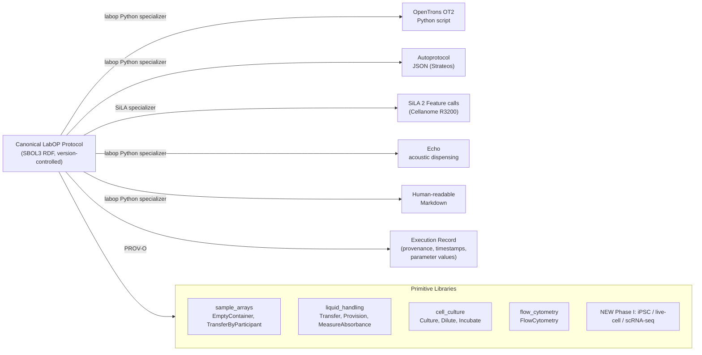

# TA3 Interoperable Experimental Procedures: Protocol Standards (Brief)

**Reading time:** ~8 min
**If you read one thing:** LabOP is the correct open foundation for our TA3 intent and protocol layers; SiLA 2 handles hardware; Cellanome is TA4 only. The RFC governance process and the mammalian primitive library extensions are the two genuinely novel TA3 deliverables we build.

---

> [!NOTE]
> Internal use only. Companion to `TA3_protocols__full.md`. For proposal language, draw from the full doc and cross-check against the IGoR Research Master sections 22, 34, and 35.

---

## Section 1: The TA3 Problem in One Diagram

```mermaid
graph TD
    TA2["TA2 Experiment Design\n(cell type, target, timepoint,\nreadout modality, success criteria)"]
    -->|TA2→TA3 interface\n(LinkML schema)| INTENT

    subgraph TA3 ["TA3: Four-Layer Protocol Stack"]
        INTENT["Intent Layer\nLabOP Protocol object\n(SBOL3 RDF)"]
        PROTOCOL["Protocol Layer\nLabOP Primitives\n(UML activity graph)"]
        CALIBRATION["Calibration Layer\nRFC-governed parameters\nIV&V calibration artifacts"]
        HARDWARE["Hardware Layer\nLabOP Specialization"]
        INTENT --> PROTOCOL --> CALIBRATION --> HARDWARE
    end

    HARDWARE -->|OpenTrons OT2 Python| MATT["TA4: Matt Tegtmeyer lab (Purdue)\nCell Painting / Element AVITI24\nacademic experimental arm"]
    HARDWARE -->|SiLA 2 Feature calls| CELLANOME["TA4: Cellanome R3200\nLive-cell imaging + scRNA-seq\nindustry experimental arm"]
    HARDWARE -->|Illumina run params| ILLUMINA["TA4: Illumina\nPerturb-seq / sequencing"]

    MATT -->|QC-rich data + PROV execution record| TA1
    CELLANOME -->|QC-rich data + PROV execution record| TA1
    ILLUMINA -->|QC-rich data + PROV execution record| TA1
    TA1["TA1 Model Update\n(≤24 h Phase II; ≤4 h Phase III)"]
```

---

## Section 2: The Four-Layer Stack: What Goes Where

| Layer | What it does | Our standard | Why this one |
|---|---|---|---|
| **Intent** | Declares scientific question, quality requirements, success criteria; modality-agnostic | LabOP Protocol object (SBOL3 RDF) | Only open standard with an explicit intent-abstraction layer |
| **Protocol** | Modality-specific step sequence; typed primitives; control/data flow | LabOP primitives (UML activity graph) | Formal semantics, composable, specializable to multiple backends |
| **Calibration** | Parameter governance, versioned change control, IV&V artifacts | RFC process (novel) + PROV-O | No existing standard covers this; it is a genuine IGoR TA3 deliverable |
| **Hardware** | Machine-specific execution; isolated from upper layers | SiLA 2 (devices) + LabOP specializers (OT2, Echo, human Markdown) | SiLA 2 is vendor-neutral at device level; LabOP specialization compiles from one source |

**Key rule:** The canonical LabOP protocol is version-controlled and is the source of truth. Hardware-specific outputs are generated artifacts, not the canonical form.

---

## Section 3: LabOP in Five Points

1. **What it is.** LabOP (Laboratory Open Protocol Language; formerly PAML) is an open, RDF-based specification for biological protocols. It represents protocols as UML activity graphs serialized in SBOL3 RDF and generates execution records in PROV-O format.

2. **Who built it.** Dan Bryce and Rob Goldman (SIFT), Bryan Bartley (Raytheon BBN), Tim Fallon (UCSD), and others. Published as Bartley et al. *ACM JETC* 19(3) 2023 (doi:10.1145/3604568; preprint bioRxiv 2022.07.05.498808).

3. **Key property.** One LabOP protocol specializes to multiple backends: OpenTrons OT2 Python, Autoprotocol (Strateos), SiLA-based instruments (Cellanome R3200), Echo acoustic dispensing, and human-readable Markdown, all from the same canonical RDF source.

4. **Tooling.** `pip install pylabop` gives the Python library (program, serialize, execute, specialize). The `laboped` web editor provides a low-code visual interface for non-programmers.

5. **Governance.** Maintained by the Bioprotocols Working Group (open, permissive license). Chair: Tim Fallon (UCSD). SIFT's Dan Bryce is a founding member and Finance Committee member, giving our team direct standing in Working Group standards processes.

---

## Section 4: LabOP Architecture: Specialization Flow



---

## Section 5: Standards Landscape: Quick Comparison

| Standard | Layers | Open? | Provenance | Cross-vendor | TA3 fit |
|---|---|---|---|---|---|
| **LabOP** | Intent, Protocol | Yes | PROV-O | Yes (specialization) | **Best fit for upper layers** |
| **SiLA 2** | Hardware | Yes | None | Yes (device-neutral) | **Best fit for hardware layer** |
| Autoprotocol | Protocol, Hardware | Partial | None | No (Strateos only) | Specialization target only |
| OpenTrons API | Hardware | Yes | None | No (OT2 only) | Specialization target only |
| Aquarium | Protocol | Yes | None | No (LIMS-specific) | Not applicable |
| ECL language | Protocol, Hardware | No | Internal | No | Not applicable |
| SED-ML | Computational only | Yes | Partial | Yes (simulators) | TA1 archiving, not TA3 |

---

## Section 6: Cellanome and TA3: Verdict

> [!IMPORTANT]
> **Cellanome is a TA4 provider, not a TA3 contributor.**

Cellanome has no publicly described protocol-representation capability and is not involved with LabOP, SiLA, Autoprotocol, or any comparable standard. Their contribution is:

- **TA4:** The R3200 platform (live-cell imaging + same-cell scRNA-seq via Perturb-LINK) is a high-value TA4 modality.
- **TA3 seed only (indirect):** Their human-readable Perturb-LINK SOPs are source material that SIFT converts into LabOP protocol definitions during Phase I. Cellanome validates the LabOP output against their own SOP baseline.

Do not describe Cellanome as a TA3 performer in any proposal section or teaming agreement.

**One outstanding TA3 dependency on Cellanome:** The R3200's SiLA Feature Definition (the machine-readable description of what commands the R3200 accepts) is not publicly documented. Resolving this is a Phase I technical dependency. It requires an NDA-gated technical exchange. Plan for this in the Phase I kickoff work plan.

---

## Section 7: Mapping to IGoR Phases

| Phase | TA3 milestone | LabOP deliverable | Novel contribution |
|---|---|---|---|
| **Phase I** (18 mo) | >=2 modalities; same protocol at two labs; calibration artifacts | LabOP primitives for Cell Painting + Perturb-LINK; RFC v1; SBOL3 protocol repo | RFC governance process; new primitive libraries |
| **Phase II** (18 mo) | >=2 RFCs executed; >=3 labs incl. cross-team; >=3 modalities | Perturb-seq + optical pooled primitives; cross-team protocol execution | Cross-team LabOP execution in mammalian disease context |
| **Phase III** (24 mo) | External standards body engagement; >=5 labs; >=4 modalities; connect-a-thon | LabOP Working Group RFC proposals; published primitive extensions; open data layer | LabOP standard extended for neuronal assay modalities |

**IGoR TA3 bake-off strategy:**
- Phase I: same LabOP protocol runs at Carpenter (OT2 specialization) and Cellanome R3200 (SiLA specialization); demonstrate output equivalence.
- Phase II: demonstrate RFC-governed parameter change with versioned audit trail.
- Phase III: connect-a-thon cross-team protocol exchange using the open data layer.

---

## Section 8: Gaps and Actions

> [!WARNING]
> **Gap 1 (High): LabOP primitive library does not cover our assays.**
> No primitives for iPSC differentiation, Perturb-LINK, scRNA-seq library prep, or Cell Painting exist in LabOP. Phase I deliverable: author these libraries. Knowledge sources: Carpenter SOPs, Cellanome SOPs.

> [!WARNING]
> **Gap 2 (High): R3200 SiLA Feature Definition not published.**
> LabOP specialization to the Cellanome R3200 requires knowledge of its SiLA interface. Resolve via NDA-gated technical exchange in Phase I.

> [!CAUTION]
> **Gap 3 (Medium): RFC governance process must be designed from scratch.**
> No existing protocol standard has a parameter-change governance process. This is novel work, and a defensible TA3 contribution.

> [!CAUTION]
> **Gap 4 (Medium): TA2-to-TA3 interface format not yet defined.**
> Define as a LinkML schema (cell type, perturbation target, timepoint, readout modality, success criteria). Formalize at the Phase I Domain-Driven Design workshop.

> [!CAUTION]
> **Gap 5 (Medium): TA4 capability manifest format does not exist.**
> Laboratories must publish machine-readable capability descriptions. Define as a LinkML schema; a lightweight Phase I deliverable.

> [!NOTE]
> **Gap 6 (Low-Medium): LabOP tooling is pre-1.0.**
> Budget Phase I engineering time for `labop` library hardening and modality-specific testing. Contribute upstream to the Bioprotocols Working Group.

---

## Section 9: Key Citations

| Reference | DOI / Identifier | Use |
|---|---|---|
| Bartley et al. 2023, ACM JETC 19(3) | doi:10.1145/3604568 | LabOP canonical publication |
| Bartley et al. 2022, bioRxiv | doi:10.1101/2022.07.05.498808 | LabOP (PAML) preprint |
| LabOP site | bioprotocols.github.io/labop | Tooling and governance reference |
| Ulrich et al. 2022, SLAS Technology | PubMed:35639108 | SiLA 2 standard paper |
| Bryce et al. 2022, ACS Synth Biol | doi:10.1021/acssynbio.1c00305 | SIFT Round Trip DBTL track record |
| ARPA-H Appendix A, ARPA-H-SOL-26-155 |, | TA3 objectives and milestones |
| Cellanome.com | cellanome.com | TA4 platform; no TA3 content |
