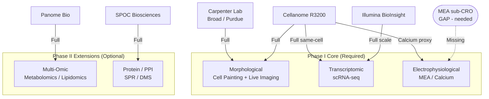
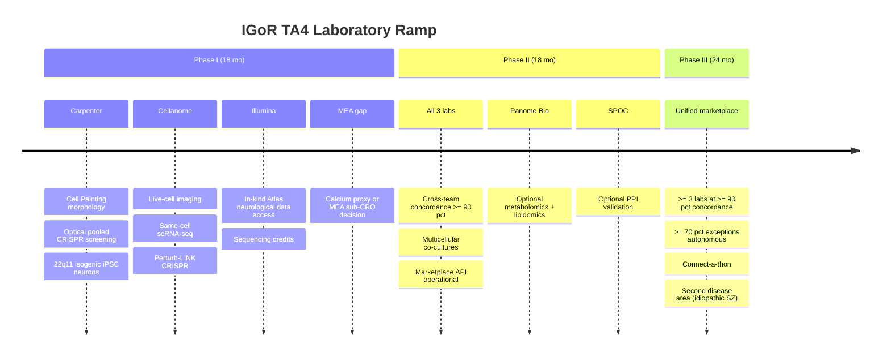

> [!WARNING]
> **Readout correction (2026-06-14):** the functional neuronal readout is **single-cell calcium imaging** (scalable, single-cell), not MEA. Calcium imaging is an optical/imaging modality covered by Cellanome's live-cell fluorescence imaging and high-content imaging, so **there is no electrophysiology-lab gap** and MEA is not required. Treat the 'MEA / electrophysiology gap' analysis below as superseded; the detailed MEA schema (formats, QC, encoders) is to be reworked to calcium imaging in the full-proposal build.

# TA4 Validated-Lab Marketplace: ADHD-Friendly Companion

**Paired with:** `TA4_labs__full.md` (full deep dive with all citations)  
**Compiled:** 2026-06-14 | **Internal only**

---

> [!TIP]
> **If you read one thing:** TA4 has two experimental arms: Matt Tegtmeyer lab (Purdue, academic; Element AVITI24 / Teton CytoProfiling) and Cellanome (industry; R3200 + Perturb-LINK). These are the two TA4 labs that satisfy the ">= 2 labs" requirement. Anne Carpenter is the computational morphology/imaging-model lead (no bench). Illumina is Lab 3. Running the same iPSC-neuron variant lines on both Element and Cellanome provides a built-in cross-arm concordance check aligned with the program's 85% gates.

**Reading time:** ~8 minutes for this brief; ~25 minutes for the full doc.

---

## What TA4 Must Do (3 bullets)

- Execute experiments on iPSC-derived neurons under TA3-defined protocols, return QC-gated, model-ready data to TA1.
- Demonstrate >= 80% intra-team concordance by end of Phase I (>= 90% cross-team by Phase II).
- Cover at least 3 of the 5 required modalities in Phase I. MEA electrophysiology is the gap.

---

## Phase I Required Modalities

| Modality | Why it matters | Who covers it |
|---|---|---|
| **Transcriptomic** (scRNA-seq) | Pathway shifts, cell-type markers, variant signatures fed to TA1 | Cellanome (same-cell), Illumina (scale) |
| **Morphological** (Cell Painting) | NeuroPainting precedent (Tegtmeyer 2025); morphological fingerprints per variant | Carpenter (primary), Cellanome (AI morphotyping) |
| **Electrophysiological** (MEA/calcium) | GRIN2A and GRIA3 variants need synaptic-function readout | **GAP** - calcium imaging proxy at Cellanome; MEA needed separately |
| Multi-omic (metabolomics, lipidomics) | Phase II extension; chromatin and ubiquitin variants have metabolic footprint | Panome Bio (optional, Phase II) |
| Protein / PPI | TA1 causal-edge validation; deep mutational scanning of variant panel | SPOC Biosciences (optional, targeted) |

---

## The Candidates at a Glance

### Matt Tegtmeyer Lab, Purdue (TA4 Academic Experimental Arm)

- **What:** All wet-lab experiments (iPSC-neuron disease models, multi-modal readouts) using **Element AVITI24 / Teton CytoProfiling**
- **Where:** Purdue University (confirmed faculty 2026-06-15)
- **Element AVITI24 / Teton CytoProfiling:**
  - RNA 350-plex subcellular in-situ; protein + phospho 50-plex; Cell-Painting-style organelle morphology; CRISPR-guide DISS
  - Neuroscience panel (neurodifferentiation, neurotransmission/synaptic, neurodegeneration, neuroinflammation)
  - Fixed-cell in-situ; hundreds of thousands to millions of cells; next-day results
- **NeuroPainting precedent:** Tegtmeyer et al. *Nat Commun* 2025, DOI: 10.1038/s41467-025-61547-x (Matt is first author, establishing 22q11.2 iPSC-neuron morphological + transcriptomic signatures)
- **Cross-arm concordance role:** same iPSC-neuron variant lines run on Element AVITI24 (this lab) and Cellanome R3200 (industry arm), with Anne Carpenter's computational models as the common analysis layer
- **Element teaming status:** platform Matt uses; no confirmed formal teaming agreement yet. **[FLAG 2026-06-17: confirm before proposal language.]**

### Anne Carpenter (Computational Morphology/Imaging-Model Lead -- no bench)

- **Role (corrected 2026-06-17):** Purely computational. Builds interpretable models for morphology and cellular imaging data; consumes readouts from both experimental arms; bridges into TA1/TA2. No wet-lab bench.
- **Where:** Broad Institute (transitioning to Purdue/IPAI ~Sep 2026)
- **Key open-source infrastructure:** CellProfiler, Cell Painting Gallery, JUMP (>116K compounds); seeds TA3 data standards
- **Key publications:**
  - NeuroPainting: Tegtmeyer et al. *Nat Commun* 2025, DOI: 10.1038/s41467-025-61547-x
  - Pooled Cell Painting CRISPR screen: *Nat Commun* 2025, DOI: 10.1038/s41467-025-66778-6

> [!NOTE]
> **Prior drafts listed Anne as "TA4 experimental phenomics."** The correct classification is computational morphology/imaging-model lead. She runs no bench. The experiments are run by Matt's lab (Element platform) and Cellanome. **[FLAG 2026-06-17: re-derive cost-model Anne budget line from wet-lab capex to personnel + compute; defer to Shahin/Ananth.]**

### Cellanome R3200 (TA4 Lab 2, Anchor)

- **What:** Live-cell imaging (brightfield + 4-channel fluorescence) + same-cell scRNA-seq + Perturb-LINK CRISPR screening
- **Key differentiator:** Cells never leave the CellCage enclosure. Morphological timeseries and transcriptome are linked in one data object, no dissociation, no lost cells.
- **Neurobiology demos (cellanome.com/neurobiology, accessed 2026-06-14):**
  - Neurospheres tracked for days; axon extension, calcium, end-point RNA all from same enclosure
  - Microglia phagocytosis linked to single-cell transcriptome at scale
- **Gap:** No MEA. Calcium imaging is the proxy for electrophysiology in Phase I.
- **Internal caveat:** Interpersonal friction in early discussions; all NDAs route through Duane Valz first.

### Illumina BioInsight (TA4 Lab 3)

- **What:** High-throughput perturbation-scale scRNA-seq; Billion Cell Atlas in-kind resource
- **Billion Cell Atlas (announced Jan 13, 2026):**
  - 1 billion cells, >200 disease-relevant cell lines (including neurological), all 20,000 genes CRISPR-perturbed
  - 20 petabytes/year; processed via DRAGEN; hosted on Illumina Connected Analytics
  - Pharma partners: AstraZeneca, Merck, Eli Lilly
- **IGoR contribution:** Atlas neurological cell lines as reference context for our 22q11 isogenic screen; in-kind sequencing credits (~$4M combined in-kind package)
- **Gap:** No imaging, no electrophysiology, no multi-omic. Pure transcriptomics.
- **Next step:** Call with Sebastian 2026-06-16; scope Atlas neurological line coverage and access model.

### Panome Bio (Optional, Phase II)

- **What:** CLIA-certified untargeted metabolomics, lipidomics, phosphoproteomics, targeted proteomics; integrated multi-omic analysis
- **Added April 2025:** Global phosphoproteomics platform (unbiased protein + phosphorylation abundance)
- **Neuroscience application:** Alzheimer multi-omic integration (listed on panomebio.com); IPsC-compatible sample inputs
- **IGoR role:** Phase II metabolic/lipidomic layer for variants with strong Phase I transcriptomic signals but mechanistically ambiguous metabolic phenotype (e.g., SETD1A chromatin, CUL1 ubiquitin-proteasome)
- **Status:** Not yet contacted. Hold until core team confirmed.

### SPOC Biosciences (Optional, Bounded Add-On)

- **What:** Cell-free protein expression up to 2,400 proteins on chip; SPR kinetics (on/off-rate, affinity); Cryo-EM; MALDI
- **IGoR role:** Protein-level validation of TA1-predicted PPIs; DMS of variant proteins (SETD1A, CUL1, GRIN2A)
- **Key papers:**
  - Platform: Commun Biol 2025, DOI: 10.1038/s42003-025-07844-z (2,400-plex SPR kinetics)
  - Fast-off SPR: Biomolecules 2025, DOI: 10.3390/biom15060882
  - DMS epitope mapping: bioRxiv 2026.04.30.722015
- **Not a cellular lab.** Cell-free only. Does not cover imaging, scRNA-seq, or electrophysiology.
- **Status:** Inbound teaming request 2026-06-14 (Lydia Gushgari). Scope call pending.

---

## Capability Map (Mermaid)

---

## Phase Ramp: Lab Coverage by Phase

---

## Recommended TA4 Composition

> [!IMPORTANT]
> **Two-arm experimental model (updated 2026-06-17):** Matt Tegtmeyer lab (Purdue, academic; Element AVITI24 / Teton CytoProfiling) + Cellanome (industry; R3200 + Perturb-LINK) are the two TA4 experimental arms satisfying the IGoR two-lab minimum. Anne Carpenter is the computational morphology/imaging-model lead across both arms (no bench). Running the same variant lines on both platforms provides the Phase I cross-arm concordance check.

**Lab 3: Illumina.** Adds perturbation-scale transcriptomic depth and in-kind Atlas data as a reference; does not duplicate either arm.

**Optional add-ons:**
- SPOC Biosciences for PPI validation (Phase II, bounded task)
- Panome Bio for multi-omic mechanistic depth (Phase II, driven by Phase I results)

---

## Gaps: What Needs to Be Decided Before Submission

> [!WARNING]
> **MEA electrophysiology is the critical Phase I gap.** None of the four primary candidates provides MEA. Decide before submission:
> - Option A: Cellanome calcium imaging as Phase I proxy; MEA CRO (AxoSim, Axion Biosystems) in Phase II.
> - Option B: Add a MEA sub-CRO in Phase I (fourth TA4 performer; more expensive, stronger proposal).

> [!WARNING]
> **Carpenter affiliation routing.** Broad Institute versus Purdue/IPAI versus both affects subaward structure, cost model, and IP. Confirm with Anne Carpenter and Duane Valz before the proposal is submitted.

> [!NOTE]
> **LabOP extensions needed.** SIFT must extend LabOP Hardware/Calibration layers to cover CellProfiler imaging pipelines and Cellanome R3200 run configurations. This is a Phase I standards-development deliverable; confirm scope with Dan Bryce (SIFT).

> [!NOTE]
> **Illumina Atlas neurological coverage.** Scope call (2026-06-16) must confirm which cell lines include 22q11.2 or SCHEMA-gene perturbations and what the data access model is for IGoR performers.

---

## Interface Summary

| Interface | Requirement | Current status |
|---|---|---|
| TA3 -> Carpenter | CellProfiler pipeline spec in LabOP Hardware layer | Not yet in LabOP; Phase I deliverable |
| TA3 -> Cellanome | R3200 run config in LabOP Hardware layer | Not yet in LabOP; Phase I deliverable |
| TA3 -> Illumina | Sequencing SOP in LabOP Calibration layer | Illumina SOPs exist; LabOP encoding pending |
| Carpenter -> TA1 | CellProfiler CSV features + ISS reads to IGoR common data model | ETL step needed; straightforward |
| Cellanome -> TA1 | Seurat `.rds` + morphological embeddings to IGoR CDM | Good alignment; serialization schema needed |
| Illumina -> TA1 | DRAGEN h5 matrices to IGoR CDM | Standard pipeline; well understood |
| TA4 -> TA1 latency | Phase II: <= 24 hrs; Phase III: <= 4 hrs | Feasible for end-of-run packages; streaming QC design needed for multi-day Cellanome runs |
