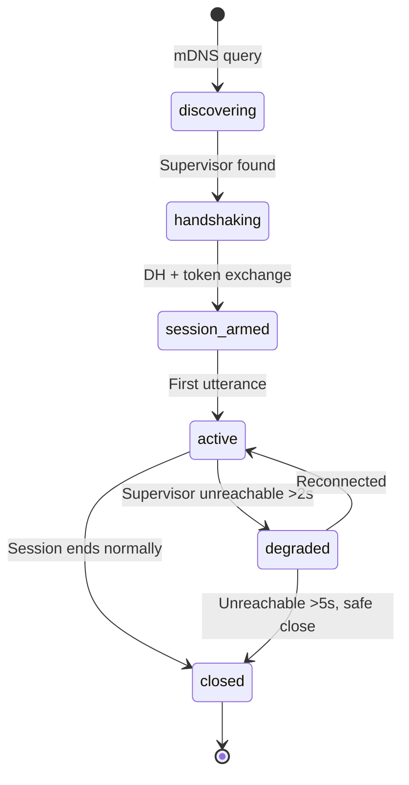

# CAP — Comprehensive Revision Plan & Deep-Dive

> **Status**: Draft
> **Date**: 2026-05-17
> **Scope**: Everything communication/coordination/layering that is or should be in CAP's scope
> **Goal**: Fully revise CAP, identify missing parts from research docs, plan for standalone repo

---

## 1. Current CAP Scope vs Full Coordination Requirements

### 1.1 What CAP v0.1 Covers

| Capability | Status | Quality |
|---|---|---|
| Directive lifecycle FSM | ✅ Complete | Production-ready |
| GuardDecision with 7 outcomes | ✅ Complete | Production-ready |
| RefusalMessage with 16 reason codes | ✅ Complete | Production-ready |
| ExecutionReport | ✅ Complete | Production-ready |
| DecisionRecord (audit) | ✅ Complete | Production-ready |
| Hash-chain audit store | ✅ Complete | Production-ready |
| Ed25519 mTLS + JWS + DSSE + in-toto | ✅ Complete | Production-ready |
| CAP-Lite profile (Yar) | ✅ Complete | Production-ready |
| CAP-Med profile (clinical) | ✅ Complete | Production-ready |
| HTTP/JSON transport binding | ✅ Complete | 28/28 conformance |
| gRPC/protobuf transport binding | ✅ Complete | 28/28 conformance |
| 89 conformance + hardening tests | ✅ Complete | All pass |

### 1.2 What CAP v0.1 Does NOT Cover (Gaps from Research Docs)

| # | Missing Capability | Source | Severity |
|---|---|---|---|
| 1 | **Privacy boundary schema** enforcement | Architecture doc §5.2 | CRITICAL |
| 2 | **Persona ↔ authority binding** | New requirement | HIGH |
| 3 | **A2A protocol integration** | Multi-Agent doc §3.7 | HIGH |
| 4 | **Distributed session lifecycle** | Multi-Agent doc §8 (TCP-like handshake) | HIGH |
| 5 | **Crisis escalation protocol** | Voice AI doc §6.3 | CRITICAL (therapy use) |
| 6 | **Edge-cloud routing policy** | Architecture doc §3.3, Cactus hybrid | MEDIUM |
| 7 | **Supervision injection protocol** | Voice AI doc §5.3 (soft/hard/override) | MEDIUM |
| 8 | **Evidence freshness for paralinguistic data** | Voice AI doc §6.2 | MEDIUM |
| 9 | **Multi-org CAP federation** | CAP spec §future | LOW |
| 10 | **Graph-write authorization** (Anytype) | Yar implementation | MEDIUM |
| 11 | **Consent management** | HIPAA/GDPR requirement | HIGH |
| 12 | **Audit chain for distributed sessions** | Multi-Agent doc (cross-device) | MEDIUM |

---

## 2. Critical Evaluation of Current Choices

### 2.1 Sub-Optimal Choices in v0.1

| Choice | Current | Problem | Proposed Fix |
|---|---|---|---|
| **Raw dict factories** in `cap_profile.py` | `dict()` returns | No type safety, no validation, easy to produce invalid primitives | Pydantic models with validators |
| **In-process guard** in `cap_lite_guard.py` | Keyword + metadata checks | Cannot prove transport independence; co-failure with app | Sidecar as primary, in-process as fallback |
| **No timeout semantics** on Directives | `expiry` field exists but no runtime enforcement | Expired directives could be accepted if clock skew exists | Add `max_clock_skew_seconds` to ConstraintSet |
| **No streaming Directive support** | One-shot request/response | Voice supervision needs continuous guidance injection | Add `StreamingDirective` primitive for real-time channels |
| **16 refusal reasons are flat** | No hierarchy | `safety_denied` and `policy_denied` overlap in practice | Add category grouping: authority, safety, policy, evidence, temporal |
| **Hash-chain is append-only in-memory** | Dict-based | No persistence across restarts; no distributed replication | Add pluggable backends (SQLite, Iroh, external) |
| **No rate limiting on Guard evaluation** | Unlimited | Supervisor could overwhelm guard with rapid directive bursts | Add token-bucket rate limiter per Controller identity |
| **Evidence freshness is caller-specified** | `freshness_window_seconds` trusts caller | Caller could set arbitrarily long window | Add server-side freshness enforcement |

### 2.2 Alternative Approaches Worth Evaluating

| Area | Current Approach | Alternative | Evaluation |
|---|---|---|---|
| Policy engine | Policy-as-data JSON | OPA/Rego with CAP adapter | **Evaluate for v0.2**: OPA gives formal policy language, Cedar for fine-grained authz |
| Identity | Runtime Ed25519 certs | DID/Verifiable Credentials | **Defer to v0.3**: DID ecosystem still maturing for agent use |
| Audit store | In-memory hash chain | Append-only log (SQLite WAL, Iroh) | **Implement in v0.2**: critical for production |
| Guard placement | HTTP sidecar | WASM sandbox in-process | **Monitor**: WASM agent sandboxes emerging but immature |
| Consent | Not modeled | Consent-as-Directive with user confirmation | **Implement in v0.2**: required for HIPAA/GDPR |

---

## 3. CAP v0.2 Proposed Scope

### 3.1 New Modules

#### Module 1: Session Protocol

Maps the TCP-like session lifecycle (from Multi-Agent doc §8) into CAP primitives.



**New primitives**:
- `SessionRequest`: handshake initiation with capability claims
- `SessionAck`: supervisor confirms capacity + issues session token
- `SessionState`: heartbeat + state summary for replication

**Integration with existing CAP**: A `SessionRequest` is a specialized `Directive` with `directive_type: "session"`. Guard evaluation still applies (deny-wins). Session tokens are signed with the existing Ed25519 infrastructure.

#### Module 2: Persona Authority Binding

Maps persona definitions to CAP authority constraints.

```python
class PersonaAuthorityBinding(BaseModel):
    """Binds a persona to its CAP-enforced capabilities."""
    persona_id: str
    cap_profile: Literal["cap-lite", "cap-med"]
    allowed_skills: list[str]
    forbidden_actions: list[str]
    authority_level: Literal["companion", "advisor", "specialist"]
    requires_human_review_for: list[str]
```

**Integration**: The persona's `authority_level` maps to a `ConstraintSet` that the Guard evaluates. A companion-level persona cannot issue Directives that require specialist authority.

#### Module 3: Privacy Boundary

Formal schema for what crosses the wire (from Architecture doc §5.2).

```python
class PrivacyBoundary(BaseModel):
    """Schema-enforced privacy boundary for cross-device communication."""
    allowed_event_types: list[str] = [
        "stress_signal", "topic_shift", "user_disengaged",
        "session_phase", "mood_arc", "structured_summary",
    ]
    forbidden_data_types: list[str] = [
        "raw_audio", "transcript", "raw_feature_vector",
        "free_text_user_input", "audio_fragment", "phi_identifier",
    ]
    enforcement: Literal["strict", "audit_only"] = "strict"
    signature_required: bool = True
```

**Integration**: Every Directive that crosses a device boundary must pass a `PrivacyBoundary` check in addition to standard Guard evaluation. The Guard rejects Directives carrying forbidden data types.

#### Module 4: A2A Bridge

Maps CAP metadata into A2A Task/Message/Part structures (from CAP spec §standards-composition).

```python
class CAPA2ABridge:
    """Embeds CAP authority metadata in A2A messages."""

    def directive_to_a2a_task(self, directive: Directive) -> A2ATask:
        """Wrap a CAP Directive as an A2A Task with authority metadata."""
        ...

    def a2a_task_to_directive(self, task: A2ATask) -> Directive:
        """Extract CAP Directive from an incoming A2A Task."""
        ...
```

### 3.2 Revised Primitive Set (v0.2)

| # | Primitive | v0.1 | v0.2 Change |
|---|---|---|---|
| 1 | Directive | ✅ | Add `session_id` field, streaming support |
| 2 | GuardDecision | ✅ | Add hierarchical reason categories |
| 3 | RefusalMessage | ✅ | Group 16 codes into 5 categories |
| 4 | ExecutionReport | ✅ | Add `paralinguistic_evidence` field |
| 5 | DecisionRecord | ✅ | Add distributed session context |
| 6 | EvidenceRef | ✅ | Add server-side freshness enforcement |
| 7 | AuthorityChain | ✅ | Add persona binding step |
| 8 | **SessionRequest** | ❌ NEW | Handshake initiation |
| 9 | **SessionAck** | ❌ NEW | Handshake confirmation |
| 10 | **PrivacyBoundaryCheck** | ❌ NEW | Cross-device data validation |
| 11 | **CrisisEscalation** | ❌ NEW | Safety escalation primitive |

### 3.3 Crisis Escalation (from Voice AI doc §6.3)

```python
class CrisisEscalation(BaseModel):
    """Specialized Directive for crisis events. Always priority=CRITICAL."""
    escalation_id: str
    directive_id: str  # Parent directive
    risk_level: Literal["elevated", "high", "critical"]
    trigger: str  # What triggered the escalation
    actions: list[CrisisAction]
    human_notified: bool = False
    human_response_deadline_seconds: int = 300

class CrisisAction(BaseModel):
    action_type: Literal[
        "inject_safety_script",
        "surface_crisis_resources",
        "page_clinician",
        "warm_handoff",
        "safe_session_close",
    ]
    payload: dict[str, Any]
```

**Integration**: CrisisEscalation bypasses normal Guard flow (it is pre-authorized by the safety subsystem). It generates a DecisionRecord with `decision_context: "crisis"` for audit.

---

## 4. Supervision Injection Protocol

From Voice AI doc §5.3, three injection mechanisms need CAP modeling:

| Mechanism | Frequency | CAP Mapping |
|---|---|---|
| **Soft guidance** | Every 3-5 turns | `Directive(type="observe", action="update_guidance")` |
| **Hard interruption** | Uncommon | `Directive(type="execute", action="inject_priority_message", constraints={interrupt: true})` |
| **Direct audio override** | Rare (crisis) | `CrisisEscalation(action="inject_safety_script")` |

Each injection is a CAP Directive. The interviewer agent (Executor) verifies the Directive, checks its authority chain, and decides whether to accept or refuse. This preserves CAP's core invariant: no external execution without a valid Directive.

---

## 5. Edge-Cloud Routing Policy

Cactus's hybrid routing concept maps to CAP as a routing policy evaluated by the Guard:

```python
class RoutingPolicy(BaseModel):
    """Determines whether a Directive executes on-device or escalates to cloud."""
    privacy_level: Literal["device_only", "lan_ok", "cloud_ok"]
    complexity_threshold: float  # 0-1, above which escalate to cloud
    latency_budget_ms: int
    fallback_on_cloud_unavailable: Literal["deny", "degrade", "queue"]
```

---

## 6. Phased CAP Development Plan

### Phase 0: v0.1.1 — Cleanup & Type Safety (1-2 weeks)

- [ ] Replace raw dict factories with Pydantic models
- [ ] Consolidate into `src/yar/cap/` subpackage
- [ ] Add pluggable audit store backend (SQLite default)
- [ ] Add server-side evidence freshness enforcement
- [ ] Add token-bucket rate limiting on Guard evaluation
- [ ] 100% type hint coverage
- [ ] Google-style docstrings on all public API

### Phase 1: v0.2.0 — Session + Privacy + Persona (2-4 weeks)

- [ ] Implement SessionRequest / SessionAck primitives
- [ ] Implement PrivacyBoundary schema + Guard check
- [ ] Implement PersonaAuthorityBinding
- [ ] Implement CrisisEscalation primitive
- [ ] Implement supervision injection protocol mapping
- [ ] Add streaming Directive support
- [ ] Add hierarchical refusal reason categories
- [ ] Extend conformance suite (target: 120+ tests)
- [ ] Draft formal privacy boundary schema document

### Phase 2: v0.2.1 — A2A + Routing (2-3 weeks)

- [ ] Implement A2A bridge (CAP ↔ A2A Task/Message)
- [ ] Implement RoutingPolicy for edge-cloud decisions
- [ ] Add consent management (consent-as-Directive)
- [ ] Add distributed audit chain (cross-device session tracking)
- [ ] OPA/Rego adapter evaluation (spike)

### Phase 3: v0.3.0 — Standalone Repo (2-3 weeks)

- [ ] Extract to `github.com/cytognosis/cap`
- [ ] Restructure as independent Python package (`cytognosis-cap`)
- [ ] Add TypeScript/Node.js binding (for web/extension agents)
- [ ] Add Rust binding (for Tauri sidecar)
- [ ] Production KMS/HSM integration guide
- [ ] Multi-org federation design document
- [ ] Third-party security audit preparation

---

## 7. CAP Standalone Package Structure (Target)

```
cap/
├── pyproject.toml                  # cytognosis-cap
├── src/cytognosis_cap/
│   ├── __init__.py
│   ├── primitives/
│   │   ├── __init__.py
│   │   ├── directive.py            # Directive + StreamingDirective
│   │   ├── guard_decision.py       # GuardDecision with hierarchical reasons
│   │   ├── refusal.py              # RefusalMessage with category groups
│   │   ├── execution_report.py
│   │   ├── decision_record.py
│   │   ├── evidence_ref.py
│   │   ├── authority_chain.py
│   │   ├── session.py              # SessionRequest, SessionAck
│   │   ├── crisis.py               # CrisisEscalation, CrisisAction
│   │   └── privacy.py              # PrivacyBoundary, PrivacyBoundaryCheck
│   ├── guard/
│   │   ├── __init__.py
│   │   ├── evaluator.py            # Core guard evaluation logic
│   │   ├── profiles/
│   │   │   ├── lite.py             # CAP-Lite
│   │   │   ├── med.py              # CAP-Med
│   │   │   └── custom.py           # Custom profile loader
│   │   └── adapters/
│   │       ├── opa.py              # OPA/Rego adapter
│   │       └── cedar.py            # Cedar adapter (future)
│   ├── transport/
│   │   ├── __init__.py
│   │   ├── http.py                 # HTTP/JSON binding
│   │   ├── grpc.py                 # gRPC/protobuf binding
│   │   └── a2a.py                  # A2A bridge
│   ├── crypto/
│   │   ├── __init__.py
│   │   ├── ed25519.py              # mTLS
│   │   ├── jws.py                  # Detached JWS
│   │   ├── dsse.py                 # DSSE envelopes
│   │   └── intoto.py               # in-toto attestation
│   ├── audit/
│   │   ├── __init__.py
│   │   ├── hash_chain.py           # Core hash chain
│   │   ├── backends/
│   │   │   ├── memory.py           # In-memory (testing)
│   │   │   ├── sqlite.py           # SQLite WAL
│   │   │   └── iroh.py             # Iroh CRDTs (future)
│   │   └── otel.py                 # OpenTelemetry integration
│   ├── persona/
│   │   ├── __init__.py
│   │   ├── binding.py              # PersonaAuthorityBinding
│   │   └── schema.py               # Persona schema definition
│   └── routing/
│       ├── __init__.py
│       └── policy.py               # RoutingPolicy for edge-cloud
├── tests/
│   ├── conformance/                # 120+ conformance tests
│   ├── hardening/                  # 40+ hardening tests
│   └── integration/
├── protos/                         # gRPC protobuf definitions
└── docs/
    ├── spec.md                     # Formal specification
    ├── privacy_boundary.md         # Privacy boundary schema
    └── migration.md                # v0.1 → v0.2 migration guide
```

---

## 8. Standards Composition Map (Updated)

```mermaid
flowchart TB
    CAP["CAP\n(Authority + Safety)"]

    subgraph Transport["Transport Layer"]
        MCP["MCP\n(Agent ↔ Tools)"]
        A2A["A2A\n(Agent ↔ Agent)"]
        gRPC["gRPC/HTTP"]
    end

    subgraph Policy["Policy Layer"]
        OPA["OPA/Rego"]
        Cedar["Cedar"]
        PolicyJSON["Policy-as-data JSON"]
    end

    subgraph Observability["Observability"]
        OTel["OpenTelemetry"]
        PROV["W3C PROV-O"]
    end

    subgraph Crypto["Crypto & Attestation"]
        DSSE["DSSE"]
        InToto["in-toto"]
        SLSA["SLSA"]
    end

    subgraph Identity["Identity (future)"]
        DID["W3C DID"]
        VC["Verifiable Credentials"]
    end

    subgraph Session["Session (v0.2)"]
        mDNS["mDNS/DNS-SD"]
        NATS["NATS JetStream"]
        LiveKit["LiveKit"]
    end

    subgraph Persona["Persona (v0.2)"]
        CCv3["Character Card V3"]
        Rive_P["Rive Animation"]
    end

    CAP --> MCP
    CAP --> A2A
    CAP --> gRPC
    CAP --> OPA
    CAP --> PolicyJSON
    CAP --> OTel
    CAP --> PROV
    CAP --> DSSE
    CAP --> InToto
    CAP -.-> DID
    CAP --> mDNS
    CAP --> NATS
    CAP --> CCv3
```


