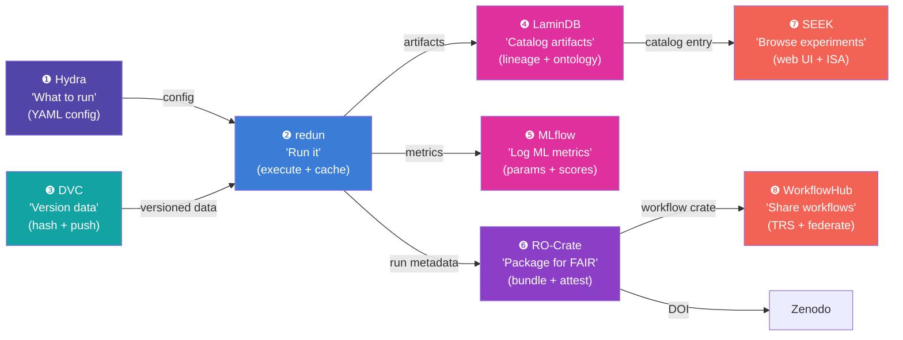

# What Each Tool Actually Does: The Definitive Guide

> **Purpose**: End the confusion. One document. Every tool mapped to exactly one job.

---

## The Problem

You keep asking this because the tools have overlapping *names* but non-overlapping *jobs*. The confusion comes from the fact that several tools touch "data" or "workflows" but at completely different levels. This document maps each tool to ONE primary job, explains what that job IS, and shows how they connect.

---

## The Restaurant Kitchen Analogy

Think of running an experiment like running a restaurant kitchen:

| Job | Tool | Kitchen Analogy |
|---|---|---|
| **Ingredients storage** | **DVC** | The walk-in fridge: stores raw ingredients (data), tracks what came in, version-stamps batches |
| **Recipe execution** | **redun** | The head chef: follows the recipe (workflow), knows which steps are done, skips re-cooking identical dishes |
| **Ingredient registry** | **LaminDB** | The inventory system: tracks every ingredient's origin, quality cert, allergen info, what dish it went into |
| **Cooking log** | **MLflow** | The cooking journal: records oven temp, timing, taste scores for each dish attempt |
| **Health inspection report** | **RO-Crate** | The formal documentation package: bundles recipe + ingredients used + cooking log + photos into one inspectable folder |
| **Restaurant portfolio website** | **FAIRDOM-SEEK** | The public-facing website: shows all your menus, recipes, ingredients, certifications in a browsable catalog |
| **Recipe sharing platform** | **WorkflowHub** | The recipe-sharing site: publishes your recipes so other chefs can find and reuse them |
| **Menu planning** | **Hydra** | The menu designer: defines "tonight we cook dishes A, B, C with these variations" |

**Kedro** was like a *kitchen management system* that tried to do recipe execution + ingredient tracking + cooking logs all in one — but not as well as the dedicated tools. So we rejected it.

---

## The Eight Jobs, Explained One by One

### Job 1: Data Versioning — "Where is the data? What version?"

**Tool: DVC** (Data Version Control)

**What it does, concretely**:
- You have a 50GB dataset in `~/datasets/umls/`. DVC creates a tiny `.dvc` file (a few bytes) containing the SHA256 hash of that 50GB.
- The `.dvc` file goes into Git. The 50GB goes to GCS (`gs://cytognosis-data-hub/dvc-cache/`).
- `dvc push` uploads data. `dvc pull` downloads data. `dvc checkout` restores a specific version.
- `dvc.yaml` can also define a pipeline (stages with deps/outs), but that's DVC's *secondary* function.

**What it does NOT do**:
- Does NOT know what's *inside* the data (columns, ontologies, cell types)
- Does NOT track which code processed it
- Does NOT have a UI
- Does NOT package anything for publication

**Analogy**: Git, but for large files. Nothing more, nothing less.

---

### Job 2: Workflow Execution — "Run this code on this data"

**Tool: redun** (from insitro)

**What it does, concretely**:
- You write Python functions decorated with `@task`. redun builds a DAG from them.
- When you call `redun run my_workflow.py main`, it executes the task graph.
- **The killer feature**: It hashes both the Python AST (source code) AND the data inputs. If neither changed → cache hit, skip execution. This is unique among all tools.
- Can run tasks inside Docker containers (important for reproducibility).
- Stores execution history in a SQLite/PostgreSQL database.

**What it does NOT do**:
- Does NOT version data (that's DVC)
- Does NOT track metrics/hyperparameters in a UI (that's MLflow)
- Does NOT catalog artifacts with ontology-grounded metadata (that's LaminDB)
- Does NOT package results for publication (that's RO-Crate)

**Analogy**: GNU Make for Python, but with content-addressed caching at the function level.

**Why not Kedro?** Kedro does this job *plus* tries to be a data catalog and project template. But its caching is session-based (not content-addressed), it has no container execution, and it's redundant with redun + LaminDB. Our prior evaluation rejected it: "Triple overlap with redun (pipeline) and LaminDB (catalog)."

---

### Job 3: Lineage Catalog — "What is this artifact? Where did it come from? What's in it?"

**Tool: LaminDB**

**What it does, concretely**:
- Every output artifact (a file, a table, a model) gets registered as `ln.Artifact` with:
  - A hash (for integrity)
  - A `cytognosis://` URI (for addressing)
  - Feature annotations grounded in ontologies (via `bionty`): "this h5ad has cell types from CL ontology, genes from Ensembl, tissues from UBERON"
  - A `ln.Run` record: "this artifact was produced by Transform X, using Inputs Y, at time Z"
- This creates a **lineage graph**: for any artifact, you can trace backward to every input and code version that produced it.
- Has a Python API for querying: `ln.Artifact.filter(cell_types__contains="T cell").df()`
- Has a web UI for browsing the catalog.

**What it does NOT do**:
- Does NOT store the actual data (that's GCS/local filesystem/DVC cache)
- Does NOT execute workflows (that's redun)
- Does NOT track ML metrics like loss curves (that's MLflow)
- Does NOT have the ISA experiment model (that's SEEK)

**Analogy**: A library catalog (like a card catalog) for every artifact you've ever produced. The catalog card tells you the title, author, subject, and which other books cite it. But the actual books are on the shelves (GCS/DVC).

**The key difference from DVC**: DVC knows "file X has hash Y and lives on GCS." LaminDB knows "file X contains single-cell data with 15,000 genes, 50,000 cells of type T-cell and B-cell from human blood, was produced by running script Z on input W on May 26 2026."

---

### Job 4: Experiment Tracking — "What happened during this ML training run?"

**Tool: MLflow**

**What it does, concretely**:
- During an ML training run, you log:
  - **Parameters**: learning_rate=0.001, batch_size=32, model=GNN
  - **Metrics**: val_loss=0.23, val_mrr=0.87, train_loss=0.15
  - **Artifacts**: model checkpoint, confusion matrix plot, predictions CSV
- MLflow stores all of this and provides a web UI to compare runs.
- **Model Registry**: promote a trained model through stages (None → Staging → Production).
- Already deployed on cytohost.

**What it does NOT do**:
- Does NOT version data (DVC)
- Does NOT execute pipelines (redun)
- Does NOT catalog all artifacts with ontology metadata (LaminDB)
- Does NOT package for FAIR publication (RO-Crate)

**Analogy**: A lab notebook specifically for ML experiments. Records settings and results, lets you compare experiments side by side.

---

### Job 5: FAIR Packaging — "Bundle everything into one citable, reproducible package"

**Tool: RO-Crate** (Research Object Crate)

**What it does, concretely**:
- Takes the outputs of a workflow run and wraps them into a standardized folder with a `ro-crate-metadata.json` file that describes:
  - What code ran (with SWHID)
  - What data went in (with hashes)
  - What came out (with hashes)
  - What container was used (with image digest)
  - Who ran it, when, with what parameters
- Three profiles, increasing detail:
  - **Process Run Crate**: "I ran this script" (lightweight)
  - **Workflow Run Crate (WRROC)**: "I ran this multi-step workflow" (standard)
  - **Provenance Run Crate**: "Here's every intermediate step" (full audit)
- The `cytoskeleton.crate` library emits these. The `redun_rocrate.py` bridge (124 LOC, already exists in cytos) connects redun execution to crate emission.

**What it does NOT do**:
- Does NOT execute anything (that's redun)
- Does NOT store data (that's DVC/GCS)
- Does NOT provide a UI (that's SEEK/WorkflowHub)
- Is NOT a database (it's a folder + JSON-LD)

**Analogy**: A shipping box with a packing slip. The box contains your results; the packing slip describes exactly what's inside, where it came from, and how it was made. Anyone who receives the box can verify and reproduce the contents.

---

### Job 6: Experiment Registry (UI + Metadata Hub) — "Browse all our experiments, data, protocols"

**Tool: FAIRDOM-SEEK** (deployed as `hub.cytognosis.org`)

**What it does, concretely**:
- A **web application** (Ruby on Rails) that provides a browsable, searchable catalog of:
  - **Programmes**: Cytoverse, Cytonome, Cytoscope (top-level organizational units)
  - **Projects**: "ABCD HRV models", "Cytoscope assay panel v1"
  - **Investigations**: one per major analysis (ISA Investigation)
  - **Studies**: one per cohort/hypothesis (ISA Study)
  - **Assays**: one per measurement/technique (ISA Assay)
  - **SOPs**: protocols
  - **DataFiles**: metadata records (the actual data lives in VFS/GCS; SEEK stores the metadata + URI)
  - **Models**: ML model artifacts
  - **Publications**: papers with DOIs
- Uses the ISA (Investigation-Study-Assay) framework — the international standard for structuring experiments.
- Exposes Schema.org/Bioschemas markup → discoverable by Google Dataset Search.
- REST API (JSON:API compliant) for programmatic access.
- Federation: can mirror to fairdomhub.org (the public FAIRDOM ecosystem).

**What it does NOT do**:
- Does NOT execute workflows (redun)
- Does NOT version data (DVC)
- Does NOT track ML metrics (MLflow)
- Does NOT store the actual bytes of data (GCS/VFS)

**Analogy**: A museum's catalog system. Every painting (artifact) is registered with its provenance, the artist (code), the gallery (project), the exhibition (investigation). The museum doesn't paint the paintings — it catalogs, displays, and makes them findable.

**How it relates to LaminDB**: LaminDB is the *programmatic* catalog (Python API, for daily use by developers). SEEK is the *human-facing* catalog (web UI, for collaborators, reviewers, funders). `cytoskeleton publish` pushes metadata from LaminDB → SEEK.

---

### Job 7: Workflow Registry — "Browse and reuse our published workflows"

**Tool: WorkflowHub** (deployed as `workflows.cytognosis.org`)

**What it does, concretely**:
- Same SEEK codebase, configured specifically for workflows.
- You upload a Workflow RO-Crate (the package from Job 5) and it becomes a browsable, citable, versioned workflow record.
- Exposes a **GA4GH TRS** (Tool Registry Service) API — the standard way for platforms like Terra/Galaxy to discover workflows.
- Connects to **LifeMonitor** to track workflow test health (nightly CI-like checks).
- Can federate with workflowhub.eu (the public EU workflow registry).

**What it does NOT do**:
- Does NOT execute workflows (that's redun/Nextflow/the compute engine)
- Does NOT track data (DVC)
- Does NOT track ML experiments (MLflow)

**Analogy**: GitHub, but specifically for workflow definitions (not code in general). People find your workflow, download it, run it on their own infrastructure.

**Relationship to SEEK**: WorkflowHub IS SEEK — literally the same software with a different config. SEEK is for *all* experiment metadata; WorkflowHub is specifically for *workflow definitions*. We run two instances: `hub.cytognosis.org` (general SEEK) and `workflows.cytognosis.org` (workflow-specific).

---

### Job 8: Experiment Description — "Define WHAT to run"

**Tool: Hydra + OmegaConf** (proposed, not yet implemented)

**What it does, concretely**:
- Structured YAML configs that compose together:
  - `experiments/neuro-pilot.yaml` (which models, which datasets, which HPO strategy)
  - `models/gnn.yaml` (model-specific hyperparameters and search spaces)
  - `datasets/nbb.yaml` (dataset-specific preprocessing steps)
- Override from command line: `cytos experiment run --model=gnn,transformer --dataset=nbb,pec`
- Hydra is the *config system*; the actual execution is still redun.

**What it does NOT do**:
- Does NOT execute anything (redun)
- Does NOT track results (MLflow)
- Does NOT have a UI

**Analogy**: A recipe card that says "tonight we're making pasta with these three sauces." It's the plan, not the cooking.

---

## How They All Connect: The Flow



### The concrete sequence for ONE experiment run:

```
1. You write:      experiments/neuro-pilot.yaml          ← Hydra (Job 8)
2. Data is at:     ~/datasets/nbb/ tracked by DVC        ← DVC (Job 1)
3. You execute:    cytos experiment run neuro-pilot.yaml  ← redun (Job 2)
4. During run:     
   - redun checks AST+data hashes, skips cached steps
   - Each output registered in LaminDB with ontology tags  ← LaminDB (Job 3)
   - ML metrics logged to MLflow                           ← MLflow (Job 4)
   - A Workflow Run Crate is emitted per run               ← RO-Crate (Job 5)
5. On publish:
   - cytoskeleton publish → pushes metadata to SEEK        ← SEEK (Job 6)
   - cytoskeleton publish → pushes workflow to WorkflowHub ← WorkflowHub (Job 7)
   - Zenodo mints a DOI for the crate
   - Software Heritage archives the code (SWHID)
```

---

## The Comparison You Keep Asking About

### LaminDB vs Kedro

| Dimension | LaminDB | Kedro |
|---|---|---|
| **Primary job** | Artifact catalog + lineage graph | Pipeline framework + project structure |
| **Data catalog** | Ontology-grounded features, hash-based, queryable | YAML-based DataCatalog, no ontologies |
| **Lineage** | Full graph: Transform → Run → Artifact | None (session-only) |
| **Versioning** | Hash-based deduplication | Timestamp-based copies |
| **Bio awareness** | `bionty` plugin (CL, UBERON, GO, MONDO) | None |
| **Caching** | Content-addressed | Session-based |
| **Why Kedro was rejected** | — | "Triple overlap with redun (pipeline) and LaminDB (catalog)" |

**The fundamental difference**: Kedro tries to be a pipeline runner AND a data catalog AND a project template. LaminDB is ONLY a catalog (but a much better one, with ontologies and lineage). redun is ONLY a pipeline runner (but a much better one, with AST hashing). Using the two dedicated tools beats using one jack-of-all-trades.

### LaminDB vs DVC

| Dimension | LaminDB | DVC |
|---|---|---|
| **Primary job** | "What IS this artifact? What's in it? Where did it come from?" | "Where IS this file? What version?" |
| **Knows contents** | Yes (features, cell types, genes, ontologies) | No (just a hash) |
| **Lineage** | Full graph (code → run → artifact) | Limited (dvc.yaml deps/outs) |
| **Stores data** | No (references VFS/GCS URIs) | Yes (content-addressed cache on GCS) |
| **Git integration** | Independent | Tightly coupled (.dvc files in Git) |

**They're complementary**: DVC versions the bytes. LaminDB catalogs the meaning.

### FAIRDOM-SEEK vs LaminDB

| Dimension | FAIRDOM-SEEK | LaminDB |
|---|---|---|
| **Primary job** | Web-browsable experiment registry | Programmatic artifact catalog |
| **Interface** | Web UI (Ruby on Rails) + REST API | Python API (`import lamindb as ln`) |
| **Users** | Collaborators, reviewers, funders, the public | Developers, data scientists (you) |
| **Data model** | ISA (Investigation-Study-Assay) | Artifact + Transform + Run + Feature |
| **Federation** | Mirrors to fairdomhub.org, Bioschemas | None (local instance) |
| **Daily use** | Browse, review, share | Query, annotate, track |

**They're complementary**: LaminDB is the developer-facing catalog (like a database). SEEK is the human-facing portal (like a website). `cytoskeleton publish` is the bridge: it reads from LaminDB and writes to SEEK.

### FAIRDOM-SEEK vs WorkflowHub

| Dimension | FAIRDOM-SEEK (`hub.cytognosis.org`) | WorkflowHub (`workflows.cytognosis.org`) |
|---|---|---|
| **Same code?** | YES — same Ruby on Rails codebase | YES — same codebase, different config |
| **Content** | Experiments, data, models, protocols, publications | Workflows only |
| **Standard** | ISA (Investigation-Study-Assay) | Workflow RO-Crate + GA4GH TRS |
| **Federation** | fairdomhub.org | workflowhub.eu |
| **Why two?** | Separation of concerns: experiments vs workflow definitions | — |

### WorkflowHub vs MLflow

| Dimension | WorkflowHub | MLflow |
|---|---|---|
| **Primary job** | Publish and share workflow *definitions* | Track ML experiment *runs* |
| **Content** | "Here's our KG build pipeline: steps, inputs, outputs" | "Run #47: lr=0.001, val_loss=0.23, model.pt" |
| **Audience** | External community, reproducibility | Internal team, ML iteration |
| **Federation** | Yes (TRS API) | No |

---

## Summary: One Tool Per Job

```
┌──────────────────────────────────────────────────────────────────┐
│                                                                  │
│  ❶ DVC ──────────── "Version the bytes"                         │
│  ❷ redun ─────────── "Execute the workflow"                     │
│  ❸ LaminDB ────────── "Catalog the artifacts (programmatic)"    │
│  ❹ MLflow ─────────── "Log the ML experiments"                  │
│  ❺ RO-Crate ──────── "Package for FAIR publication"             │
│  ❻ FAIRDOM-SEEK ──── "Browse experiments (web UI)"              │
│  ❼ WorkflowHub ───── "Share workflow definitions"               │
│  ❽ Hydra ──────────── "Describe what to run (config)"           │
│                                                                  │
│  ✗ Kedro ──────────── REJECTED (redundant with ❷+❸)            │
│                                                                  │
└──────────────────────────────────────────────────────────────────┘
```

No overlaps. Each tool does exactly one thing. They connect via metadata cross-references (hashes, URIs, IDs), not by duplicating each other's work.

---

## Where This Is Documented in Our Repos

| Document | What it covers |
|---|---|
| [tools-infrastructure-stack.md](file:///home/mohammadi/repos/cytognosis/infrastructure/docs/tools/tools-infrastructure-stack.md) | The 16-layer architecture with all tools mapped |
| [provenance-lineage.md](file:///home/mohammadi/repos/cytognosis/infrastructure/docs/reproducibility/provenance-lineage.md) | The DVC+redun+LaminDB+MLflow cooperation model, CytognosisExecutor code |
| [seek-workflowhub.md](file:///home/mohammadi/repos/cytognosis/infrastructure/docs/reproducibility/seek-workflowhub.md) | SEEK + WorkflowHub deployment, ISA model, publish flow |
| [master-metaplan.md](file:///home/mohammadi/repos/cytognosis/org/plans/master-metaplan.md) | Phase 2A tracks infrastructure implementation |
