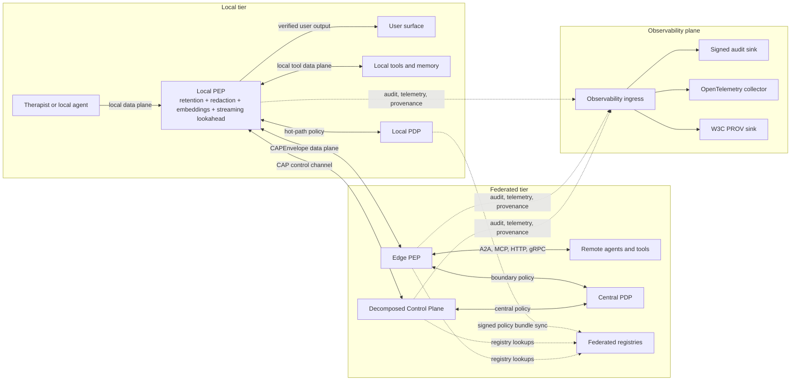

# CAP V1 Baseline: Status, Overview, and Claims

**Generated:** 2026-05-25T06:54:46+00:00
**Document set:** CAP V1 baseline consolidated Markdown set
**Repository status:** V1 architecture documented and V1 runtime scaffold present; current executable package remains `v0.1-production-candidate` and is not a complete stable V1 runtime.
**Purpose:** Public-facing overview, allowed claims, package status, and release positioning.

This file is part of `docs/v1_baseline/`, the capped baseline V1 documentation folder. It preserves and consolidates source documentation from the repository. Local links in preserved source sections are rewritten to resolve from this generated baseline file.

## Source Map

- `README.md`
- `CAP_v0.1_Production_Candidate_Supervisor_Report(1).md`
- `docs/CAP_00_README.md`
- `docs/CAP_FINAL_STATUS.md`
- `docs/CAP_CLAIMS.md`
## Source: `README.md`

## CAP — Control Authority Protocol

**A supervisory control plane for agentic systems.**

CAP is a runtime governance protocol and semantic enforcement layer that sits one layer above A2A, MCP, HTTP, gRPC, OPA/Cedar, SPIFFE, OpenTelemetry, W3C PROV, and workflow engines. It adds the semantics those layers do not own: explicit authority, evidence references, privacy boundaries, streaming interruption, typed refusal, execution reporting, audit, and provenance.

### What this release contains

| Area | Status |
|---|---|
| CAP v1 architecture | documented |
| CAP v1 schemas: 11 Core objects, 9-dimensional PrivacyBoundary, 7 InterruptDecision primitives | implemented |
| gRPC reference and HTTP/JSON bindings on v1 CAPEnvelope | implemented |
| Go third implementation interop adapter | local fixture validation |
| Lifecycle FSM and profile inheritance | deterministic scaffold checks |
| Conformance V1-C01..V1-C15 | release-blocking |
| 15-case Therapist/Supervisor scenario: deterministic + live-local Ollama | implemented |
| Federated registries: Capability, Policy, Evidence, Agent, Tool | reference service |
| Biscuit-v2 warrants, SPIFFE SVID, RFC 8785 JCS | scaffold + tests |
| Live model streaming, semantic slow path, local NER redaction, embedding-only egress, retention TTL deletion, CAP-Med/CAP-SWE profile evidence, abort/correction UX | reference local/optional Ollama + deterministic redaction/embeddings/retention/profile + CLI/WebSocket contracts |
| Mobile Local PEP, attested isolation | proxy + attested registration scaffolds; production device evidence open |
| Independent security review packet | prepared; external review gate open |
| KMS/HSM operations plan | prepared; deployment-owned production custody gate open |
| OPA/Cedar policy deployment guide | prepared; organization-owned policy gate open |
| Multi-organization MCP/A2A interop plan | prepared; external partner evidence gate open |
| Domain semantic-quality evaluation harness | prepared; external expert evidence gate open |
| Regulated-profile review packet | prepared; external regulated-profile review gate open |
| External security review and remaining external evidence | open: Phase 4 |
| Production deployment certification | not claimed |

### Architecture at a glance



### What this release is not

- Not a complete production runtime
- Not a clinical product
- Not externally security-reviewed
- Not a stable public standard

### Quickstart

```bash
## install
git clone <repo-url> && cd <repo>
python -m venv .venv && source .venv/bin/activate
pip install -e ".[dev]"

## validate schemas and run the release-blocking conformance gate
cap-check-v1-schema-drift
cap-check-v1-conformance

## regenerate local latency/mobile-resource benchmark artifacts
python -m cap_protocol.cli.run_benchmarks --iterations 100 --warmup 10

## run the local Go third-implementation CAPEnvelope/JCS fixture suite
(cd third_impl/go_cap_adapter && go run . --fixtures testdata/cap_v1_interop.json --json)

## run the 15-case Therapist/Supervisor scenario in deterministic mode
python -m cap_protocol.scenarios.therapist_supervisor.runner --case all

## verify the full release baseline
python VERIFY_RELEASE_BASELINE.py
```

Outputs land under `runs/cap_therapist_supervisor_demo/<run-id>/`, including CAPEnvelope traces, Supervisor decisions, capability evaluations, privacy-boundary evaluations, tool calls, final responses, and an ExecutionReport per case.

### Where to read next

* New to CAP: `docs/v1_baseline/00_INDEX.md`
* Implementing CAP: `docs/v1_baseline/03_architecture.md`, then `docs/v1_baseline/04_primitives.md`
* Security review packet: `docs/security_review/README.md`, then `docs/v1_baseline/05_security_trust_and_threat_model.md`
* Production key custody planning: `docs/kms_hsm/README.md`
* Organization policy deployment planning: `docs/policy_deployment/README.md`
* Multi-organization MCP/A2A interop planning: `docs/mcp_a2a_interop/README.md`
* Domain semantic-quality evaluation planning: `docs/domain_semantic_quality/README.md`
* Regulated-profile review planning: `docs/regulated_profile_review/README.md`
* Running the scenario: `docs/v1_baseline/examples/therapist_supervisor_psych_tool_scenario.md`
* Task prompt archive: `docs/task_prompts/cap_v1/`

### Safe public claim

> CAP v1 is architecture-documented, conformance-tested, and represented here as a deterministic runtime scaffold. The current evidence demonstrates local deterministic CAP controls and a live-local Ollama scenario, but it does not claim production runtime completeness, clinical certification, external security review, regulated-profile approval, or production deployment certification.

### Setup

```bash
cd cap_protocol
python -m venv venv
source venv/bin/activate
python -m pip install -e ".[dev]"
```

For runtime-only installs:

```bash
python -m pip install -r requirements.txt
```

Real-model mode is optional and intentionally not installed by default. Install model dependencies manually when needed:

```bash
python -m pip install --upgrade torch torchvision accelerate safetensors pillow librosa
python -m pip install --upgrade "git+https://github.com/huggingface/transformers.git"
export HF_TOKEN=your_huggingface_token
```

The deterministic local run does not require real-model dependencies. Real-model mode is requested explicitly with:

```bash
python run_final_cap.py --target both --use-real-separate-e2b
python run_final_cap.py --target both --use-real-separate-e2b --require-real-model
```

The reference gRPC binding also accepts `--center-model-id`, `--edge-device-policy`, and `--center-device-policy`. If `--require-real-model` is omitted, model-load failure falls back to deterministic mode.

The Local PEP slow-path classifier, local NER redactor, text/voice embedding encoders, retention TTL deletion checks, lifecycle/profile-inheritance checks, and CAP-SWE reference profile checks are deterministic by default and do not download model weights in CI. Deployments can opt into `OllamaSemanticClassifier` with a caller-supplied local Ollama service, and can provide caller-managed local NER or embedding models, accepting the added latency, availability, privacy, quality-evaluation, and retention-operations responsibilities. CAP-SWE is profile generality evidence, not production SWE-agent certification.

Local deterministic latency and mobile-resource benchmark artifacts are published under `docs/benchmarks/`. They report p50/p95 overhead, CPU-time, memory, streaming delay, and mobile proxy-path proxies for this checkout only; they are not production mobile telemetry or measured battery drain.

### Run

Run the complete deterministic package:

```bash
python run_final_cap.py --target both
```

Run one binding:

```bash
python run_final_cap.py --target reference
python run_final_cap.py --target http
```

Run hardening only:

```bash
python run_final_cap.py --hardening-only
python run_production_hardening.py
```

Run compatibility wrappers directly:

```bash
python reference_grpc/run_demo.py
python second_http/run_demo.py
```

Run the Temporal-style CAP workflow composition sample:

```bash
python -m cap_protocol.runtime.workflow_engine
```

Run the local Go third-implementation CAPEnvelope/JCS fixture suite:

```bash
cd third_impl/go_cap_adapter
go run . --fixtures testdata/cap_v1_interop.json --json
```

Package entry points after editable install:

```bash
cap-run-final --target both
cap-run-hardening
cap-verify-package
cap-verify-release-baseline
cap-check-v1-schema-drift
cap-run-therapist-supervisor-demo --case all
cap-run-v1-benchmarks --iterations 100 --warmup 10
```

Outputs are written under `final_output/` and per-binding `runtime_data/` folders. These are generated artifacts and are ignored by git.

A successful full local run produces:

- `final_output/CAP_FINAL_SUMMARY.json`
- `final_output/production_hardening/CAP_PRODUCTION_HARDENING_REPORT.json`

The latest generated artifacts in this workspace were regenerated by the deterministic local runner at `2026-05-22T12:53:22Z`. They are local runner outputs, not external verification or a security audit.

### Test

```bash
source venv/bin/activate
NO_PROXY=127.0.0.1,localhost no_proxy=127.0.0.1,localhost pytest
python -m cap_protocol.cli.run_benchmarks --iterations 100 --warmup 10
python VERIFY_RELEASE_BASELINE.py
python second_http/run_demo.py
python run_production_hardening.py
python run_final_cap.py --target both
```

The explicit `NO_PROXY` setting is a local environment caveat, not a CAP protocol requirement. It avoids local HTTP smoke-test traffic being routed through system proxy software on machines where that is configured; plain `pytest` can fail in those environments with localhost proxy errors such as Privoxy `HTTP Error 500`.

The gRPC binding uses checked-in generated protobuf modules. The protobuf service still carries generic JSON CAP payloads; the CAP payload on the active gRPC path is v1 `CAPEnvelope`. The HTTP/JSON binding posts v1 `EvidenceRef` and `Directive` envelopes and returns v1 `ExecutionReport` acknowledgment envelopes on its active path. Regenerate protobuf modules only when `cap.proto` changes:

```bash
python scripts/generate_proto.py
```

### Project Layout

```text
src/cap_protocol/
  cli/                         command entry points
  bindings/grpc_reference/     gRPC/protobuf reference binding
  bindings/http_json/          independent HTTP/JSON binding
  conformance/                 shared fixture-based conformance checks
  hardening/                   policy and audit hardening utilities
  security/                    signing, DSSE, key, and cert helpers
schemas/cap.yaml               CAP v1 umbrella LinkML authoring schema
schemas/core.yaml              shared LinkML types/enums/classes
schemas/domains/               CAP v1 LinkML domain schema modules
schemas/cap-core/              JSON Schema artifacts for v0.1 and v1
policies/                      policy-as-data files
docs/                          protocol and developer documentation
docs/mcp_a2a_interop/          multi-organization MCP/A2A interop plan and report template
docs/domain_semantic_quality/   domain semantic-quality evaluation harness and rubric
docs/regulated_profile_review/ regulated-profile review packet and checklist
tests/                         pytest coverage
reference_grpc/                legacy wrapper for the canonical gRPC binding
second_http/                   legacy wrapper for the canonical HTTP/JSON binding
third_impl/go_cap_adapter/     local Go CAP v1 interop fixture adapter
```

More detail:

- [Architecture](../architecture.md)
- [CAP v1 Task Backlog](../CAP_v1_TASKS.md)
- [Development](../development.md)
- [API](../api.md)
- [Testing](../testing.md)
- [Refactoring Notes](../../REFACTORING_NOTES.md)

### Current Release Status

This is a production-candidate research package for the current Control Authority Profile subset, not an externally audited stable public standard and not a production deployment certification. The CAP v1 architecture documents the intended Control Authority Protocol target, and the repository includes deterministic v1 runtime scaffold evidence plus a local Go third-implementation fixture adapter. Full v1 migration remains tracked in `docs/CAP_v1_TASKS.md`, with release status separated in `docs/CAP_RELEASE_GATES.md`. The current supported labels are `v0.1-production-candidate`, `v1-architecture-documented`, and `v1-runtime-scaffold`; `v1-implemented-runtime`, `v0.1-stable`, and `v1-stable` remain blocked by the gates listed there.


## Source: `CAP_v0.1_Production_Candidate_Supervisor_Report(1).md`

## CAP v0.1 Production-Candidate Supervisor Report

### Summary

CAP v0.1 is framed and implemented as a **Control Authority Profile** for agentic systems. It is not a standalone transport, tool-calling protocol, policy language, identity system, workflow runtime, clinical standard, or production security certification.

The canonical implementation lives under `src/cap_protocol/`. The top-level `reference_grpc/`, `second_http/`, `run_final_cap.py`, `run_production_hardening.py`, and `VERIFY_FINAL_PACKAGE.py` files are compatibility wrappers around package modules.

### Implemented Local Evidence

- Roles: Controller, Guard, Executor, and Observer.
- Core artifacts: `Directive`, `GuardDecision`, `RefusalMessage`, `ExecutionReport`, `DecisionRecord`, `EvidenceRef`, and `AuthorityChain`.
- CAP-Med v0.1 non-diagnostic profile constraints for clinical-output blocking and raw-transcript minimization.
- gRPC/protobuf reference binding at `src/cap_protocol/bindings/grpc_reference`.
- Independent HTTP/JSON binding at `src/cap_protocol/bindings/http_json`.
- Shared conformance runner and adversarial fixtures at `src/cap_protocol/conformance`.
- Local demos/adapters for MCP constrained invocation, A2A metadata carriage, OPA-style policy-as-data, OpenTelemetry attributes, and W3C PROV export.
- Deterministic v1 scaffolds for lifecycle FSM validation, profile inheritance/conflict resolution, CAP-SWE profile evidence, latency/mobile-resource benchmarking, and local Go CAPEnvelope/JCS fixture interop.
- Hardening checks for runtime-generated local mTLS certificates, Ed25519 detached-JWS verification, DSSE envelopes, in-toto-style statements, revoked-key refusal, tampered-payload rejection, JSON Schema validation, package-private-key scanning, and hash-chain audit validation.

### Latest Local Runner Outputs

A successful deterministic local run produces:

- `final_output/CAP_FINAL_SUMMARY.json`
- `final_output/production_hardening/CAP_PRODUCTION_HARDENING_REPORT.json`

The latest local run in this workspace was regenerated at `2026-05-22T12:53:22Z` and reported 28/28 implementation conformance checks per executable binding and 33/33 production-hardening/shared conformance checks. These are local deterministic structural results, not external verification or an independent security audit.

### Optional Real-Model Mode

Real-model execution is optional and not installed by default. It is requested with `--use-real-separate-e2b`, and `--require-real-model` makes model loading failure fatal. Without `--require-real-model`, failures fall back to deterministic local execution.

### Non-Claims

CAP v0.1 does not claim clinical validity, model truthfulness, stable-standard maturity, production deployment readiness, live multi-organization interoperability, or externally audited security completeness.

### Remaining Stable-Release Gates

- Independent third-party security review.
- Production KMS/HSM integration.
- Organization-specific OPA/Cedar policy deployment.
- Live multi-organization MCP/A2A interoperability tests.
- Domain semantic-quality evaluation.

### Research-Strengthening Gates

- Deployment-representative latency and overhead benchmark beyond the local deterministic artifact.
- Externally owned non-medical profile example beyond the local CAP-SWE scaffold.
- Third minimal implementation or external adapter beyond the local Go fixture adapter.
- External profile-owner review of lifecycle FSM and profile inheritance rules.
- Synthetic CAP-Med semantic-quality evaluation dataset.
- Broader empirical semantic-quality evaluation distinct from structural conformance.


## Source: `docs/CAP_00_README.md`

## CAP — Control Authority Protocol

**A supervisory control plane and authority protocol for agentic systems.**

**Architecture target:** v1.0 consolidated baseline
**Implementation status:** v0.1 production-candidate subset
**Status:** Candidate documentation and executable reference package
**Scope:** General-purpose interoperability profile; transport-independent; framework-independent.

**Baseline V1 document set:** `docs/v1_baseline/00_INDEX.md` is the consolidated capped V1 Markdown set generated from the current repository documents, schemas, examples, prompt archive, and artifact inventory.

### What CAP is

CAP v1 defines a **runtime supervisory control plane** for agentic systems: a runtime governance protocol and semantic enforcement layer above existing transports and frameworks. It sits one layer above A2A, MCP, HTTP, gRPC, WebSocket, local IPC, OPA/Cedar, SPIFFE/OIDC/mTLS, OpenTelemetry, W3C PROV, and workflow engines. CAP adds the semantics those layers do not own: explicit authority, evidence references, privacy boundaries, streaming interruption, typed refusal, execution reporting, audit, and provenance.

The checked-in implementation currently exercises the smaller v0.1 Control Authority Profile subset. That subset is still useful: it proves the Controller-to-Executor authority boundary and produces deterministic conformance evidence across two bindings. It should not be read as a complete CAP v1 runtime.

A CAP trace answers four questions that ordinary agent frameworks often leave implicit:

1. **Who authorized this action?**
2. **Under which constraints and policies was it authorized?**
3. **Which evidence justified or bounded the action?**
4. **Why did the Executor accept, refuse, or report the result?**

CAP does this through a small set of typed objects:

- `Directive`: a bounded authorization from a Controller to an Executor.
- `GuardDecision`: a policy/safety/privacy decision that allows, denies, narrows, or escalates a Directive.
- `InterruptDecision`: the v1 target command for allow, deny, transform, constrain, pause, escalate, or reroute behavior.
- `RefusalMessage`: a typed, machine-actionable rejection from an Executor.
- `ExecutionReport`: the bounded result of executing a Directive.
- `EvidenceRef`, `AuthorityChain`, `PolicyRef`, `PrivacyBoundary`, `Capability`, and `OperationalConstraints`: the v1 target support objects for verification, privacy, and profile portability.
- Optional `DecisionRecord`: a non-chain-of-thought provenance artifact explaining a decision at a safe level of abstraction.

CAP does **not** define the transport, tool call, workflow engine, policy language, audit store, or identity system. It defines the semantic layer that lets those systems compose safely.

### CAP v1 architecture target

The v1 architecture is a hybrid two-tier, three-plane system:

- The local tier contains Local PEPs near agents, tools, local memory, and user surfaces. They enforce local privacy, redaction, typed refusal, offline fallback, and streaming interruption before content reaches a user.
- The federated tier contains a decomposed central Control Plane: Controller, Supervisor Gateway, Session Router, logical Interrupt Manager, PDP adapters, and Human Review integration. Edge PEPs sit at network boundaries and inspect CAP envelopes crossing services, agents, or tools.
- The data plane carries A2A, MCP, HTTP, gRPC, WebSocket, and local IPC traffic under CAP enforcement. CAP governs this traffic but is not the data-plane transport.
- The control plane carries `CAPEnvelope`, `Directive`, `GuardDecision`, `InterruptDecision`, `RefusalMessage`, and `ExecutionReport` messages used for synchronous authority and enforcement decisions.
- The observability plane carries signed audit records, OpenTelemetry telemetry, and W3C PROV graphs independently of the control plane. It is not the hot-path policy decision loop.
- PDPs evaluate policy locally and centrally, while Agent, Tool, Capability, Policy, and Evidence registries are independently deployable and cacheable.

The motivating scenario is a profile example, not CAP Core: a mobile **Therapist** persona used as the local interviewer. The Therapist remains supportive, non-diagnostic, non-prescriptive, and privacy-preserving. The main/central **Supervisor** is an authority participant behind a Supervisor Gateway; CAP separates that authority role from the gateway endpoint and from the model, human, or rule engine behind it. Supervisor strategy and review are still subject to Local PEP vetoes for privacy, non-diagnostic, jurisdiction, and safety policy. Current Supervisor context preparation substitutes raw transcript/audio into local EvidenceRefs, applies local-only NER redaction, can project text/voice sources into local embeddings plus aggregate dimensions before gateway backend access, and can delete expired raw backing content according to `PrivacyBoundary.retention` while preserving content-minimized audit/provenance records.

For visual architecture context, see `architecture.md#architecture-diagrams`. Those diagrams are target-topology documentation and include captions that distinguish the v0.1 implemented subset from the v1 migration target.

### Minimal end-to-end flow

```text
Controller drafts Directive
        ↓
Guard evaluates policy and emits GuardDecision
        ↓
Controller dispatches approved/narrowed Directive
        ↓
Executor verifies authority, evidence, policy, freshness, constraints
        ↓
Executor either refuses or executes under bounds
        ↓
Executor emits ExecutionReport with evidence and side effects
        ↓
Observer maps the trace to OpenTelemetry and W3C PROV
```

### What CAP is not

CAP is **not** a standalone end-to-end wire protocol. It composes with existing standards and infrastructure.

| CAP is not | Use instead |
|---|---|
| Transport protocol | HTTP, gRPC, WebSocket, SSE, NATS, Kafka, MQTT, etc. |
| Tool-calling protocol | MCP |
| Peer-agent discovery / generic task lifecycle | A2A |
| Policy language or policy engine | OPA/Rego, Cedar, or equivalent |
| Identity / authentication system | SPIFFE/SPIRE, DID, OAuth/OIDC, X.509, mTLS |
| Audit log or trace store | OpenTelemetry, W3C PROV, event sourcing, transparency logs |
| Workflow engine | Temporal, LangGraph, Microsoft Agent Framework, etc. |
| Supply-chain attestation system | DSSE, in-toto, SLSA, Sigstore/Rekor, or equivalent |

### Strict scope test

A feature belongs in CAP Core only if it expresses a **supervisory control semantic** that cannot be cleanly represented by the surrounding ecosystem: authority, evidence, privacy boundary, interrupt, refusal, execution reporting, or lifecycle observation.

If a feature handles transport retries, agent directory lookup, generic task delegation, generic tool schemas, hash-chained audit storage, workflow checkpointing, key issuance, model routing, or arbitrary voting algorithms, it does **not** belong in CAP Core.

### Reading order

1. `CAP_01_foundations.md` — problem statement, scope, v1 thesis, and relationship to the ecosystem.
2. `CAP_02_core_model.md` — roles, envelope, lifecycle FSM, authority/evidence placement rules.
3. `CAP_03_primitives.md` — primitives and core data structures.
4. `CAP_04_security_trust_evidence.md` — threat model summary, trust assumptions, evidence security, replay semantics.
5. `CAP_05_integrations.md` — mappings to A2A, MCP, OPA/Cedar, OpenTelemetry, W3C PROV, DSSE/in-toto.
6. `CAP_06_conformance.md` — semantic and adversarial conformance tests.
7. `CAP_07_profiles_roadmap.md` — profile model, roadmap, release criteria, risk register.
8. `CAP_appendix_schemas.md` — v0.1 JSON Schema Draft 2020-12 skeletons plus pointers to v1 LinkML/JSON schema artifacts.
9. `CAP_examples.md` — JSON examples and realistic flows.
10. `CAP_threat_model.md` — detailed threat table.
11. `security_review/README.md` — independent security review starting packet; the external review gate remains open until review completion and critical-finding remediation.
12. `kms_hsm/README.md` — production KMS/HSM custody and operations plan; deployment-owned production key evidence remains required.
13. `policy_deployment/README.md` — organization-specific OPA/Cedar policy deployment guide; organization-owned policy evidence remains required.
14. `mcp_a2a_interop/README.md` — multi-organization MCP/A2A interop plan and report template; external partner evidence remains required.
15. `domain_semantic_quality/README.md` — domain semantic-quality evaluation harness, reviewer rubric, and synthetic fixture guidance; external expert evidence remains required.
16. `regulated_profile_review/README.md` — CAP-Med or other regulated-profile review packet; external profile review remains required.
17. `CAP_changelog_from_previous_draft.md` — what changed from the older protocol-shaped draft.
18. `CAP_supervisor_brief.md` — supervisor-ready executive brief, novelty claim, and research framing.
19. `CAP_paper_positioning.md` — paper thesis, contribution claims, evaluation plan, and limitations.
20. `CAP_references.md` — consolidated references and standards links.
21. `CAP_v1_TASKS.md` — gap analysis and implementation backlog for the v1 target architecture.

### Design status

This package is a **v0.1 production-candidate implementation with partial v1 runtime migration** plus **v1 architecture documentation and initial v1 scaffolding**, not a final externally audited standard. The gRPC/protobuf reference binding and independently structured HTTP/JSON binding now carry v1 `CAPEnvelope` objects on their active hot paths; a local Go third-implementation adapter validates shared CAPEnvelope/JCS/signature fixtures; shared fixture conformance and retained legacy helpers remain v0.1 compatibility evidence. Initial v1 schemas, examples, Local PEP, local NER redaction, embedding-only Supervisor egress, retention TTL deletion, machine-checkable lifecycle FSM/profile-inheritance rules, CAP-Med v1 runtime-profile evidence, CAP-SWE non-medical reference profile evidence, local latency/mobile-resource benchmark artifacts, Edge PEP, structured privacy PDP, a decomposed Controller reference service, Supervisor Gateway, service-mesh composition helpers, live local MCP/A2A substrate interop, Temporal-style workflow-engine composition sample, Sigstore/Rekor-style transparency-log scaffold, reference registry services, observability sink scaffolds, and smoke checks exist, including service-backed Agent/Tool discovery, signed policy-bundle distribution, content-addressed Evidence storage with backing-content TTL deletion, signed audit-operation scaffolding, W3C PROV-JSONLD store scaffolding, reference OpenTelemetry lifecycle attribute coverage, and local offline transparency-bundle verification. The Controller service owns intent formation/orchestration and delegates policy evaluation, routing, and observability to injected Guard/PDP, Session Router, and sink interfaces while the old combined Center remains a v0.1 legacy compatibility path. Full CAP v1 runtime migration remains open and is tracked in `CAP_v1_TASKS.md`.

Where the v1 source material calls the architecture an "implementation-ready architecture baseline," read that as a specification baseline ready to guide implementation. It is not a claim that this repository already contains a complete CAP v1 runtime.

See also:

- `CAP_FINAL_STATUS.md`
- `CAP_CLAIMS.md`
- `CAP_RELEASE_GATES.md`
- `CAP_IMPLEMENTATION_ALIGNMENT.md`

### Normative and Informative References

CAP is designed to compose with existing standards rather than replace them. The following references are informative unless a profile explicitly makes one normative:

- Model Context Protocol specification: https://modelcontextprotocol.io/specification/2025-06-18/basic/index
- MCP tools: https://modelcontextprotocol.io/specification/2025-06-18/server/tools
- MCP resources: https://modelcontextprotocol.io/specification/2025-06-18/server/resources
- A2A core specification: https://agent2agent.info/specification/core/
- A2A core concepts: https://agent2agent.info/docs/concepts/
- Open Policy Agent / Rego: https://www.openpolicyagent.org/docs/policy-language
- SPIFFE concepts and SVID: https://spiffe.io/docs/latest/spiffe-about/spiffe-concepts/
- SPIRE concepts: https://spiffe.io/docs/latest/spire-about/spire-concepts/
- OpenTelemetry semantic conventions: https://opentelemetry.io/docs/concepts/semantic-conventions/
- OpenTelemetry trace semantic conventions: https://opentelemetry.io/docs/specs/semconv/general/trace/
- W3C PROV-O Recommendation: https://www.w3.org/TR/prov-o/


### Supervisor-facing summary

For supervisor review, start with `CAP_supervisor_brief.md`. The core message is:

> CAP is not proposed as a new transport, tool-calling, or agent-discovery protocol. CAP is proposed as a supervisory Control Authority Protocol: a runtime control layer that makes agentic actions explicitly authorized, evidence-bound, privacy-bounded, interruptible, refusable, and auditable.

The most defensible near-term research contribution is not "a universal agent protocol." It is a structurally testable supervisory control architecture for non-diagnostic, privacy-preserving psychometric agent systems, with reusable general semantics and a Cytognosis/Neuroverse domain profile.


## Source: `docs/CAP_FINAL_STATUS.md`

## CAP v0.1 Production-Candidate Status

**Package:** `cap-protocol` / `cytognosis_cap_v01_production_candidate`
**Status:** production-candidate research package, not externally audited stable standard
**Core positioning:** CAP v1 is the **Control Authority Protocol**, a supervisory control plane and semantic enforcement layer. The current package preserves a v0.1 Control Authority Profile subset and includes partial v1 migration for the gRPC reference path and independent HTTP/JSON path; it is not a standalone transport, tool-calling, policy, identity, audit database, workflow engine, clinical-correctness system, or full v1 runtime.

### Implemented in this package

- Canonical implementation under `src/cap_protocol/`.
- Reference implementation at `src/cap_protocol/bindings/grpc_reference` over `grpc/protobuf-reference-binding/cap-envelope-v1`; `reference_grpc/` is a wrapper.
- Second independent implementation at `src/cap_protocol/bindings/http_json` over `http/json-independent-binding/cap-envelope-v1`; `second_http/` is a wrapper with retained v0.1 compatibility helpers.
- Local third implementation interop adapter at `third_impl/go_cap_adapter`, written in Go with standard-library dependencies, validates shared CAP v1 CAPEnvelope/JCS/signature fixtures and reports pass/fail by fixture ID.
- Shared compatibility CAP Core artifacts: v0.1 `Directive`, `GuardDecision`, `RefusalMessage`, `ExecutionReport`, `DecisionRecord`, `EvidenceRef`, and `AuthorityChain`.
- Active gRPC v1 artifacts: `CAPEnvelope`, `Directive`, `GuardDecision`, `InterruptDecision`, `RefusalMessage`, `ExecutionReport`, `EvidenceRef`, `AuthorityChain`, `PrivacyBoundary`, and `OperationalConstraints`.
- Active HTTP/JSON v1 artifacts: `CAPEnvelope`, `EvidenceRef`, `Directive`, `GuardDecision`, `InterruptDecision`, `RefusalMessage`, `ExecutionReport`, `AuthorityChain`, `PrivacyBoundary`, and `OperationalConstraints`.
- Decomposed Controller reference service: `ControllerService` forms signed Directive envelopes from intents, delegates policy to Guard/PDP evaluators, routes through `SessionRouter`, emits optional observability events, and documents the combined gRPC `CAPCenter` as v0.1 legacy compatibility.
- CAP-Med v0.1 profile constraints: non-diagnostic output boundary, clinical-output blocking, and raw-transcript-upload blocking remain compatibility evidence.
- CAP-Med v1 runtime-profile fixture: `cap_protocol.profiles.cap_med` uses signed `CAPEnvelope`, structured `PrivacyBoundary`, closed `OperationalConstraints`, unified `Capability`, `Directive`, `EvidenceRef`, and `InterruptDecision` objects while keeping CAP-Med constraints under `profile_constraints.cap-med/v1` and metadata under `profile_extensions.cap-med/v1`; tests and V1-C05 conformance cover Local PEP raw-transcript minimization and Supervisor Gateway overreach refusal.
- MCP constrained invocation demo and forbidden-tool refusal fixture.
- A2A metadata carriage demo.
- Live local MCP/A2A substrate interop scaffold: MCP `tools/call` and `resources/read` route through Edge PEP before handler execution, and A2A message delivery requires CAPEnvelope carriage plus AgentCard CAP extension advertisement.
- Reference live model-stream adapter: local scripted chunks, and optional Ollama chunks when supplied by a caller, route through the Local PEP sliding lookahead buffer with 250 ms/50 token defaults, deterministic semantic slow-path classification, pull-side backpressure, abort propagation, pre-display safe substitution, CLI/WebSocket-style safe abort replacement UX, CLI/WebSocket-style correction-frame replacement/annotation UX, Android/iOS native abort and correction contracts, and audit/provenance frame links.
- Local NER redaction pipeline: `LocalPEP.prepare_supervisor_context(...)` substitutes raw transcript/audio into local EvidenceRefs, then runs local-only redaction before Supervisor Gateway backend access. The deterministic fallback covers person, location, date, email, phone, SSN, medical, financial, credit-card, and IP-address categories, while `LocalModelNERRedactor` allows caller-supplied local model spans without remote egress.
- Embedding-only Supervisor egress: `LocalPEP.prepare_supervisor_context(...)` can encode text and voice sources locally and send only embeddings, aggregate dimensions, safety flags, evidence refs, provenance refs, recipient-binding metadata, and minimization metadata to the Supervisor Gateway. Raw transcript/audio remain local, and recipients are checked against the active PrivacyBoundary.
- Retention TTL deletion: `PrivacyBoundary.retention` drives raw local backing-content expiry for Local PEP evidence refs and Evidence Registry blobs. Expired backing content is deleted by deterministic GC, while deletion audit/provenance records retain hashes, refs, expiry/deletion timestamps, and `raw_content_logged=false` without retaining raw evidence.
- Mobile separately privileged proxy Local PEP scaffold: Android `CapLocalPepProxyService` and iOS `CapLocalPepProxyExtension` contracts, route-control metadata, manifest-shaped helpers, and smoke checks for direct user output, network, raw-data egress, local-tool, and missing OS-route bypass attempts. Native mobile project wiring and device evidence remain open.
- Attested isolated Local PEP registration scaffold: Control Plane challenge/response registration verifies deterministic detached-JWS test attestations, binds registration to SPIFFE workload identity and Local PEP version, rejects missing, expired, replayed, mismatched, untrusted, or debuggable attestations, and publishes Local PEP capability metadata only after verification. Real Play Integrity, App Attest, Secure Enclave, and TPM quote verifier integrations remain open.
- Machine-checkable lifecycle FSM and profile-inheritance scaffold: envelope, directive, interrupt, execution, evidence, audit, and provenance transitions are validated by `cap_protocol.runtime.lifecycle`; profile composition is deterministic, monotonic, and refuses Core lifecycle/interrupt overrides in `cap_protocol.profiles.inheritance`.
- Local latency/mobile-resource benchmark artifacts: `cap-run-v1-benchmarks` publishes p50/p95 latency, CPU-time, memory, streaming-delay, and mobile proxy-path measurements under `docs/benchmarks/`. These are local Python microbenchmarks, not native mobile telemetry or measured battery drain.
- OpenTelemetry `cap.*` semantic attributes and reference collector config.
- Signed audit-operation scaffold with external key-custody hooks, retention/access metadata, replication retry/backpressure, and audit-as-delivery-precondition gating.
- Sigstore/Rekor-style transparency scaffold for release and AuthorityChainStep DSSE/in-toto attestations, with local Rekor-compatible signed entry timestamps and Merkle inclusion-proof bundles that verify offline.
- W3C PROV-JSONLD local store scaffold with queryable session, evidence, authority, and interrupt lineage.
- W3C PROV mapping.
- Temporal-style workflow-engine composition sample showing signed CAP envelope receipt, Edge PEP verification, Session Router delivery, retry-triggered `InterruptDecision`, and final `ExecutionReport` emission with workflow/session/trace history links.
- JSON Schema artifacts for the CAP message primitives.
- Independent fixture-based conformance package.
- Deterministic adversarial fixtures.
- SPIFFE SVID workload identities on selected v1 envelope and AuthorityChain verification paths.
- Istio/Linkerd-style service-mesh composition scaffold where the mesh owns mTLS/SPIFFE identity and CAP Edge PEP remains an application sidecar for CAPEnvelope, policy, privacy, and authority validation.
- Runtime-generated local mTLS certificates under ignored runtime output, labeled as non-production localhost fallback transport; package verification checks that no source private key material is included.
- Ed25519 detached-JWS verification.
- DSSE signed envelopes.
- in-toto-style attestation statements.
- Hash-chain append-only audit store.
- One-command local, Colab, and Modal-compatible runner.

### Latest local runner output

The latest successful local deterministic run was regenerated at `2026-05-22T12:53:22Z` and produced:

- `overall_pass: true`
- reference implementation pass
- HTTP/JSON implementation pass
- production-hardening pass
- 28/28 implementation conformance checks per executable binding
- 33/33 production-hardening and independent conformance checks
- `final_output/CAP_FINAL_SUMMARY.json`
- `final_output/production_hardening/CAP_PRODUCTION_HARDENING_REPORT.json`
- `docs/benchmarks/cap_v1_latency_mobile_budget.json`
- `docs/benchmarks/cap_v1_latency_mobile_budget.md`

These are local structural/conformance results, not external verification or a stable security audit.

### Execution modes

- Deterministic structural/conformance mode is the default and uses local mock model behavior.
- Optional real-model mode is requested with `--use-real-separate-e2b`; dependencies and model access are installed manually.
- `--require-real-model` makes model-load failure fatal instead of falling back to deterministic mode.

### Remaining external gates before stable public release

The following are outside the scope of this self-contained runner and should not be claimed as complete:

1. Independent third-party security review.
2. Production key-management integration such as KMS/HSM. A custody and operations plan now exists at `docs/kms_hsm/README.md`, but deployment-owned KMS/HSM evidence remains required.
3. Organization-specific OPA/Cedar policy deployment. A deployment guide now exists at `docs/policy_deployment/README.md`, but organization-owned policies, runtimes, promotion evidence, and rollback evidence remain required.
4. External MCP server and live multi-organization MCP/A2A interoperability testing. A partner run plan and report template now exist at `docs/mcp_a2a_interop/README.md`, but external partner evidence beyond the local Go fixture adapter and local substrate scaffold remains required.
5. Empirical semantic-quality evaluation for the target application domain. A harness, rubric, report template, and synthetic onboarding fixtures now exist at `docs/domain_semantic_quality/README.md`, but qualified external expert review remains required.
6. CAP-Med or other regulated-profile review. A review packet now exists at `docs/regulated_profile_review/README.md`, but qualified external profile review and gate evidence remain required.
7. Deployment-representative latency/resource evaluation, including native mobile/device telemetry and measured battery drain.

### Release gate position

See `CAP_RELEASE_GATES.md` for the full gate taxonomy. The short form is:

- `v0.1-production-candidate` is the current executable package label.
- `v1-architecture-documented` is supported by the current docs and partial scaffolding.
- `v1-implemented-runtime`, `v0.1-stable`, and `v1-stable` are not supported labels yet.

The main blockers to `v1-implemented-runtime` are production Local PEP and Edge PEP deployment paths, native Android/iOS project wiring and device/instrumented bypass evidence, real platform attestation verifier integrations for Play Integrity, App Attest, Secure Enclave, and TPM quote paths, native/mobile performance telemetry and measured battery drain, production SPIRE/service-mesh SVID sourcing, deployed local/central PDP services, production Policy Registry hardening/deployment, production Controller rollout, production Supervisor Gateway rollout, production Session Router deployment, production Human Review portal/workflow rollout, deployed Temporal/LangGraph workflow integration, external MCP/A2A interoperability beyond local fixture validation, production model-provider rollout and shipping native UI wrappers around the reference live stream adapter, organization-selected semantic model-judge rollout, production local NER and embedding model rollout with redaction/privacy/quality evaluation, production offline signed policy bundle operations, production Capability/Evidence/Agent/Tool registry hardening/deployment, durable scheduled retention-job operations, production observability exporter/collector integration, production PROV graph/document store deployment, deployed KMS/HSM-backed warrant and audit key custody, external Sigstore/Rekor transparency publication, transparency/replication services, deployed revocation operations, and full v1 conformance certification.

### Correct claim

> CAP v1 architecture is documented and partially scaffolded as the Control Authority Protocol. This repository currently provides a v0.1 production-candidate Control Authority Profile subset with two executable local bindings, migrated gRPC and HTTP/JSON CAPEnvelope hot paths, a local Go third-implementation interop adapter, a decomposed Controller reference service, structured in-process privacy PDP, local NER redaction, embedding-only egress, retention TTL deletion checks on selected PEP/registry paths, machine-checkable lifecycle/profile-inheritance rules, CAP-Med v1 runtime-profile evidence, CAP-SWE non-medical profile evidence, local latency/mobile-resource benchmark artifacts, SPIFFE SVID identity-binding checks, deterministic service-mesh, live MCP/A2A substrate, workflow-engine, and transparency-log composition scaffolding, Biscuit-backed AuthorityChain warrant scaffolding, shared conformance fixtures, a release-blocking deterministic scaffold conformance gate for V1-C01 through V1-C15, production-hardening checks, signed authority artifacts, and optional real-model execution support. It is not a complete CAP v1 runtime and is not yet an externally audited stable public standard.


## Source: `docs/CAP_CLAIMS.md`

## CAP Claims and Non-Claims

This file defines what the current package supports and what it does not claim.

CAP v1 architecture is documented and partially scaffolded as the **Control Authority Protocol**: a supervisory control plane and semantic enforcement layer above existing transports, policy engines, identity systems, observability stacks, and workflow engines. The checked-in runtime preserves a **v0.1 production-candidate Control Authority Profile subset** as compatibility evidence and now includes migrated v1 `CAPEnvelope` hot paths for the gRPC reference binding and independent HTTP/JSON binding, a local Go third-implementation interop adapter for CAPEnvelope/JCS fixture validation, plus a decomposed Controller reference service, deterministic structured PrivacyBoundary PDP evaluation, local NER redaction and embedding-only projection before Supervisor egress, retention TTL deletion for local raw backing content and Evidence Registry blobs, machine-checkable lifecycle FSM and profile-inheritance checks, CAP-Med v1 runtime-profile fixture evidence, CAP-SWE non-medical reference profile evidence, local deterministic latency/mobile-resource benchmark artifacts, OPA/Cedar-shaped PDP adapter scaffolding, SPIFFE SVID identity-binding checks, Istio/Linkerd-style service-mesh composition scaffolding, live local MCP/A2A substrate interop scaffolding, Temporal-style workflow-engine composition scaffolding, Biscuit-backed AuthorityChain warrant scaffolding on selected PEP paths, signed audit-operation scaffolding, Sigstore/Rekor-style transparency-bundle scaffolding, W3C PROV-JSONLD store scaffolding, and reference OpenTelemetry `cap.*` lifecycle attribute coverage.

### Claims supported by the current v0.1 package

1. **The v0.1 Control Authority Profile subset remains available as compatibility evidence.** Shared fixtures, hardening checks, legacy gRPC builders, and retained HTTP/JSON v0.1 helpers continue to exercise the v0.1 shape.
2. **Controller/Guard/Executor separation is implemented as a reference scaffold.** The v0.1 flows still exist for compatibility, and the v1 `ControllerService` now separates intent formation/orchestration from Guard/PDP policy evaluation, Session Router delivery, and observability sinks.
3. **Guard semantics are enforced.** `deny` blocks execution, and `allow_with_constraints` narrows execution.
4. **Executors can refuse with typed reasons.** Expired, unauthorized, invalid-signature, missing-evidence, stale-evidence, forbidden-tool, and policy-denied cases are represented as structured refusals.
5. **Evidence is integrity- and freshness-bound.** Evidence references include hash, media type, producer identity, redaction reference, access policy, and expiry/freshness metadata.
6. **Raw transcript/audio minimization and retention TTL deletion are represented and tested.** Runtime reports mark raw evidence as excluded and expose redacted, embedding-only, evidence-reference, and expired-backing-content deletion semantics.
7. **CAP-Med and CAP-SWE have executable profile evidence, and profile inheritance is deterministic.** CAP-Med now has a v1 runtime-profile fixture that uses signed `CAPEnvelope`, structured `PrivacyBoundary`, `OperationalConstraints`, unified `Capability`, `Directive`, `EvidenceRef`, and `InterruptDecision` objects while keeping non-diagnostic, non-prescriptive, raw-transcript minimization, and Supervisor-overreach rules under `profile_constraints.cap-med/v1` and `profile_extensions.cap-med/v1`. CAP-SWE uses the same Core schemas while adding software-engineering-specific profile constraints for diff evidence, sandboxing, test results, file-write authority, rollback/commit compensation, tool risk, and human escalation. The profile inheritance scaffold applies parent profiles before children, only permits narrowing overrides, refuses Core lifecycle/interrupt redefinition, and composes sibling profiles deterministically.
8. **CAP composes with existing standards.** The package includes local examples or adapters for SPIFFE/SVID workload identity, service mesh sidecar composition, live local MCP `tools/call`/`resources/read` and A2A CAPEnvelope message delivery, Temporal-style workflow orchestration, OPA/Cedar-shaped policy evaluation, Biscuit-backed authority warrants, OpenTelemetry, W3C PROV, DSSE, in-toto-style attestations, and Sigstore/Rekor-style transparency bundles.
9. **Multiple local implementation shapes exist.** The HTTP/JSON implementation uses a different runtime shape from the gRPC/protobuf reference binding and now emits v1 `CAPEnvelope` objects across its active HTTP boundary while retaining v0.1 compatibility helpers. A standard-library Go adapter independently validates shared v1 CAPEnvelope/JCS/signature fixtures and reports failures by fixture ID.
10. **Hardening checks are present.** The package verifies detached signatures, DSSE envelopes, in-toto-style attestations, revoked-key refusal, tampered-payload rejection, adversarial fixtures, package-private-key absence, and hash-chain audit validation.
11. **Local benchmark artifacts exist.** The package can regenerate local p50/p95 latency, CPU-time, memory, streaming-delay, and mobile proxy-path benchmark artifacts under `docs/benchmarks/`.
12. **A domain semantic-quality evaluation harness exists.** The package includes a JSONL reviewer-score aggregation harness, reviewer rubric, report template, and synthetic onboarding fixtures for CAP-Med and CAP-SWE. These artifacts are workflow scaffolding and smoke evidence only.
13. **A regulated-profile review packet exists.** The package includes a CAP-Med-oriented review packet, reviewer checklist, open-question list, report template, and non-secret planning placeholder for external regulated-profile review. These artifacts prepare review; they are not review completion or approval evidence.

### Claims not made

1. CAP does not guarantee clinical validity.
2. CAP does not diagnose, treat, or replace medical/mental-health professionals.
3. CAP does not guarantee model truthfulness, hallucination prevention, or semantic quality.
4. CAP does not define a transport, tool-calling protocol, policy language, identity system, audit database, workflow engine, supply-chain attestation system, or clinical correctness guarantee.
5. CAP does not replace MCP, A2A, OPA/Rego, Cedar, SPIFFE, OpenTelemetry, W3C PROV, DSSE, in-toto, FHIR, ReproSchema, or workflow engines.
6. CAP v1 is not fully implemented by this repository yet.
7. CAP is not yet an externally audited stable public standard.
8. The self-contained runner does not prove production deployment security in a real organization.
9. The included policy backends are deterministic OPA/Cedar-shaped policy-as-data scaffolds with explicit optional external-runtime metadata, not organization-specific production policy deployments.
10. The included SPIFFE/SVID, service-mesh composition, Biscuit warrant, and Sigstore/Rekor-style transparency paths are reference integration evidence, not production SPIRE/Istio/Linkerd deployment, production key-custody, deployed revocation-service, external Rekor publication, or external interoperability certification.
11. The workflow-engine sample is a local Temporal-style runner and does not certify a deployed Temporal or LangGraph worker, durable external queue, workflow SLA, or production human-review workflow.
12. The MCP/A2A checks include deterministic live local substrate paths, but they are not external MCP server certification or live multi-organization A2A interoperability certification.
13. The Go third-implementation adapter is local fixture interoperability evidence, not a production Go runtime, external adapter certification, or multi-organization interop result.
14. The CAP-Med v1 runtime profile fixture is structural conformance evidence, not clinical validation, regulated-profile approval, production Supervisor Gateway rollout, or domain semantic-quality evidence.
15. The benchmark artifacts are local Python microbenchmarks; they are not native Android/iOS telemetry, measured battery drain, deployment-representative service-mesh or registry/PDP latency, or production performance certification.
16. The synthetic semantic-quality fixtures are not expert validation, clinical validation, or evidence of domain efficacy.
17. The regulated-profile review packet is not regulatory clearance, clinical approval, external profile review completion, or evidence that CAP-Med behavior is approved for a regulated deployment.

### Release-status claims

The current supported release labels are `v0.1-production-candidate`, `v1-architecture-documented`, and caveated `v1-runtime-scaffold`. For the v1 scaffold, `PrivacyBoundary` means the nine first-class dimensions of classification, movement, transformation, retention, logging, audit visibility, allowed recipients, raw-data egress, and minimization; current Controller service, privacy PDP, local NER redaction, embedding-only egress, retention TTL deletion, lifecycle/profile-inheritance checks, CAP-Med v1 runtime-profile evidence, CAP-SWE profile evidence, local benchmark evidence, Go interop adapter evidence, OPA/Cedar adapter, SPIFFE/SVID binding, Biscuit warrant behavior, workflow-engine composition behavior, and transparency-bundle behavior is deterministic and in-process or reference-service backed; the migrated gRPC and HTTP/JSON `CAPEnvelope` paths are partial runtime migration evidence, not full v1 runtime implementation. The labels `v1-implemented-runtime`, `v0.1-stable`, and `v1-stable` are not supported until the gates in `CAP_RELEASE_GATES.md` pass.

### Paper-safe wording

> We present CAP v1 as a Control Authority Protocol: a supervisory control plane for evidence-bound, privacy-bounded, interruptible, refusable, and auditable agentic actions. The current repository preserves v0.1 Control Authority Profile compatibility evidence and now runs both a gRPC/protobuf reference path and an independently structured HTTP/JSON path over v1 CAPEnvelope objects, with a local Go adapter validating shared CAPEnvelope/JCS fixtures, alongside shared compatibility conformance/adversarial fixtures, local benchmark artifacts, a CAP-Med v1 runtime-profile fixture, and a non-medical CAP-SWE reference profile. The work demonstrates structural control and provenance properties, not clinical efficacy or a fully implemented CAP v1 runtime.
