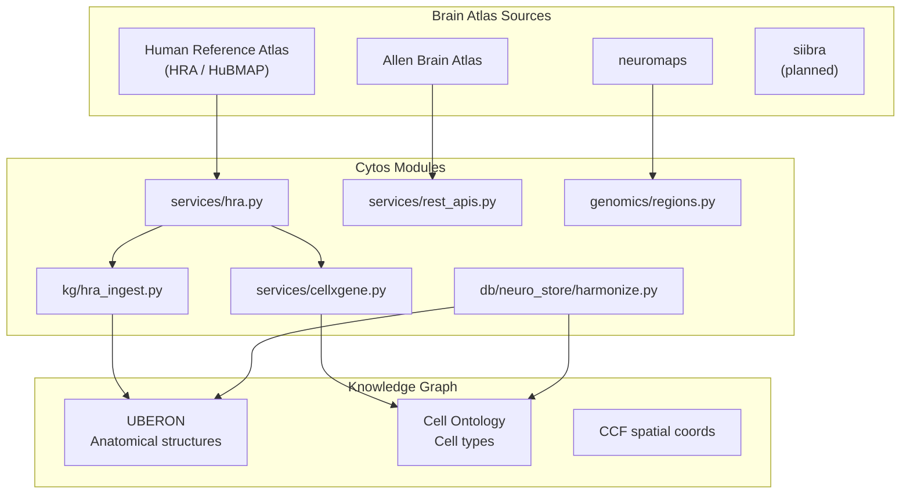

# Brain Atlas Infrastructure

> v1.0 | Last updated: 2026-05-26

Cytos integrates multiple brain atlas systems to provide unified access to anatomical structures, cell types, gene expression, and connectivity data. All brain region references map through the Knowledge Graph using standardized UBERON and Cell Ontology CURIEs.

## Atlas Stack



## 1. Human Reference Atlas (HRA)

The HRA provides a standardized anatomical reference for mapping cell types to body structures. Cytos ingests HRA data into the KG as UBERON-linked anatomical entities.

### HRA Service (`services/hra.py`)

```python
from cytos.services.hra import HRAService

hra = HRAService()

# Get anatomical structures for an organ
structures = hra.get_anatomical_structures(organ="brain")

# Get cell types in a structure
cell_types = hra.get_cell_types(structure_id="UBERON:0001870")

# Get tissue blocks with spatial coordinates
blocks = hra.get_tissue_blocks(organ="brain")
```

### HRA KG Ingest (`kg/hra_ingest.py`)

```python
from cytos.kg.hra_ingest import HRAIngestor

ingestor = HRAIngestor(kg_dir="data/kg")

# Ingest HRA anatomical structures as KG nodes
ingestor.ingest_structures()

# Ingest HRA → CellxGene cell type alignments
ingestor.ingest_cell_type_alignments()
```

### KG Nodes Created

| Node Type | Example | Source |
|-----------|---------|--------|
| AnatomicalEntity | `UBERON:0001870` (cerebral cortex) | HRA CCF |
| Cell | `CL:0000679` (L2/3 IT neuron) | HRA + CellxGene |
| SpatialEntity | CCF x,y,z coordinates | HRA tissue blocks |

## 2. Allen Brain Atlas

Allen Brain Atlas provides gene expression maps, connectivity data, and reference coordinates for mouse and human brains.

### API Access

```python
from cytos.services.rest_apis import AllenBrainAtlasClient

allen = AllenBrainAtlasClient()

# Query gene expression in a brain region
expression = allen.get_expression(
    gene="SNAP25",
    structure="hippocampus",
    species="human",
)

# Get connectivity data
connectivity = allen.get_connectivity(
    source_region="prefrontal cortex",
    target_region="hippocampus",
)
```

### Data Integration

Allen structures map to UBERON terms in the KG:

```
Allen:hippocampus → UBERON:0002421 → KG → CL:0000540 (neuron subtypes)
```

## 3. Coordinate Systems

Cytos supports multiple brain coordinate systems and parcellation schemes:

| System | Description | Module |
|--------|-------------|--------|
| **MNI152** | Standard human brain template | `genomics/regions.py` |
| **CCFv3** | Allen mouse brain common coordinates | `services/rest_apis.py` |
| **HRA CCF** | Human Reference Atlas spatial framework | `services/hra.py` |
| **Talairach** | Classic stereotaxic coordinates | `genomics/regions.py` |

### Regions Module

```python
from cytos.genomics.regions import GenomicRegion

# Create a brain region reference
region = GenomicRegion(
    name="primary visual cortex",
    ontology_id="UBERON:0002436",
    coordinate_system="MNI152",
)

# Import regions from parcellation files
regions = GenomicRegion.from_gff3("data/parcellations/desikan_killiany.gff3")
```

## 4. neuromaps

neuromaps provides brain maps (parcellations, annotations) and tools for comparing spatial distributions.

### Integration Points

- Brain parcellation schemes (Desikan-Killiany, Schaefer, Glasser)
- Cortical thickness, myelination, receptor density maps
- Spatial correlation testing between brain maps

## 5. CellxGene Integration

CellxGene Census provides single-cell transcriptomic data linked to anatomical structures via the HRA.

```python
from cytos.services.cellxgene import CellxGeneClient

cx = CellxGeneClient()

# Get datasets for a tissue
datasets = cx.get_datasets(tissue="brain")

# Align cell types to HRA structures
aligned = cx.align_cell_types_to_hra(
    dataset_id="283d65eb",
    hra_service=hra,
)
```

## Harmonization Flow

All brain region references normalize through the KG:

```
NWB electrode.location = "V1"
    → harmonize.py
    → UBERON:0002436 (primary visual cortex)
    → KG traversal
    → CL:0000749 (pyramidal cell)
    → Gene expression (SOMA)
    → Connectivity (NWB)
```

```python
from cytos.db.neuro_store.harmonize import map_brain_regions_to_kg

# Map free-text brain regions to ontology terms
mapped = map_brain_regions_to_kg(
    regions=["V1", "hippocampus", "dlPFC", "amygdala"],
    kg_store=store,
)
# Result:
# {
#     "V1": "UBERON:0002436",
#     "hippocampus": "UBERON:0002421",
#     "dlPFC": "UBERON:0009834",
#     "amygdala": "UBERON:0001876",
# }
```

## Query Examples

### Find cell types in a brain region

```python
# Get all cell types in cerebral cortex via KG
cortex_cells = store.get_descendants("UBERON:0001870", predicate="biolink:has_part")
cell_types = [
    store.get_node(c) for c in cortex_cells
    if store.get_node(c) and store.get_node(c).category == "biolink:Cell"
]
```

### Find genes expressed in a brain region

```python
# 1. Get UBERON ID for the region
region_id = map_brain_regions_to_kg(["hippocampus"], store)["hippocampus"]

# 2. Get cell types in that region from KG
cell_types = store.get_neighbors(region_id, predicate="biolink:has_part")

# 3. Query expression in SOMA
for ct in cell_types:
    expression = soma_query(cell_type=ct, top_genes=20)
```

### Cross-modal brain analysis

```python
# Find brain regions affected by schizophrenia-associated genes
scz_genes = store.get_edges(
    predicate="biolink:gene_associated_with_condition",
    object_="MONDO:0005090",
)

# Check expression of those genes across brain regions
for gene_edge in scz_genes:
    gene_id = gene_edge["subject"]
    expression = soma_query(gene=gene_id, group_by="brain_region")
```

## Related Documentation

- [Architecture Overview](architecture.md)
- [Data Stores Reference](data-stores.md)
- [Genomic Atlas Guide](genomic-atlas.md)
- [Tutorial: Brain Atlas Queries](tutorials/brain-atlas-queries.md)
